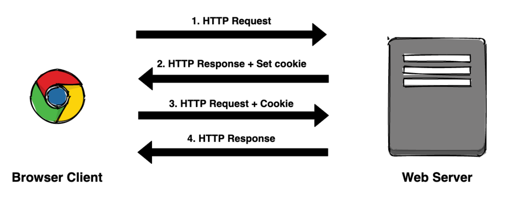
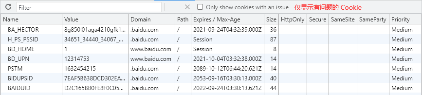
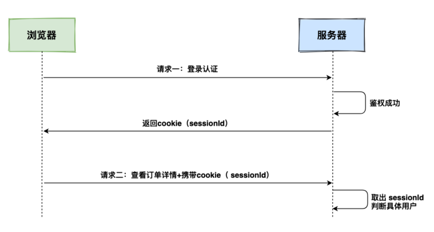
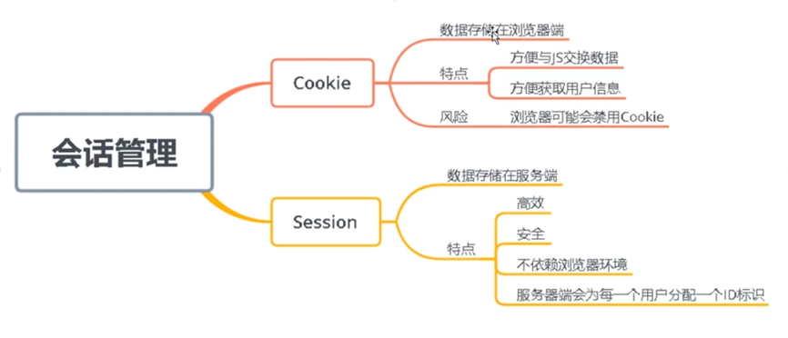

# Cookie 和 Session 的详解与区别

 2021-12-18 10:11 [小春](tencent://message/?uin=10000&Site=qq.com&Menu=yes)

**摘要：**Session 翻译过来就是会话，会话是指客户端与服务端进行通讯的过程，比如用户在浏览器中点击一个超链接访问 Web 资源，到关闭该标签页就是一个会话过程。

`HTTP` 是一种`无状态` (stateless) 协议，本身不会对发送过的请求和相应的通信状态进行持久化处理，即服务端不保留与客户端交易时的任何状态。

这样做的目的是为了保持 HTTP 协议的简单性，大大减轻了服务器记忆负担，从而能够快速处理大量的事务， 提高效率。

然而，在许多应用场景中，我们需要保持用户登录的状态或记录用户购物车中的商品。由于 HTTP 是无状态协议，所以必须引入一些技术来记录管理状态，例如 Cookie。

## 一、状态管理

学习 Cookie 和 Session 之前先了解一下状态管理。

`状态管理`是将客户端与服务端之间多次交互当做一个整体，并将多次交互之间涉及的数据保存下来，提供给后续的交互进行数据的管理。

状态是当前的数据，管理是在多次交互过程中对数据的存储、修改和删除。

举个栗子：

- 洗车卡
- 记录洗车的次数，车主每次携带卡片洗车后，由商家修改洗车次数，车主可以携带走记录次数的卡片。(商家并不保存任何数据，客户自己携带需要维护的数据)

- 理发店
- 商家给客户一个卡号，每次客户来理发需要报上卡号，商家就会从系统中找到与此卡号对应的数据，修改后由商家保存。(客户带走的仅是卡号标识)

上面两种模式就是数据的管理，各有利弊。程序中与上面两种模式对应的分别是 Cookie 和 Session。

## 二、Cookie

`Cookie` 最开始被设计出来是为了弥补 HTTP 在状态管理上的不足，它是服务器发送到用户浏览器并保存在本地的小型文本数据，会在浏览器下次向服务器发起请求时，被携带并发送到服务器上。

### 工作流程

- ① 请求：浏览器第一次发送请求到服务器；
- ② 响应：服务器对浏览器给出响应，创建并通过响应头 Set-Cookie 将 Cookie 发送给浏览器；
- ③ 存储：浏览器接收到响应后会将 Cookie 中的数据存储在文件或内存中；
- ④ 携带：当浏览器再次向服务器发送请求时，会通过请求头将 Cookie 传递给服务器；
- ⑤ 获取：服务器通过自身封住好的 API 获取这个请求头，然后给出响应。

### 常见属性

Cookie 是一段不超过 4KB 的小型文本数据，由一个名称（Name）、一个值（Value）和其它几个用于控制 Cookie 有效期、安全性、使用范围的可选属性组成。

关于 Cookie 常见属性的描述请浏览 [Cookie 的工作机制和属性介绍](http://www.dedenotes.com/html/Cookie.html) 这篇文章，这里不做赘述。

### 存储类型

Cookie 按存储类型可分为两类：Session Cookie（会话 Cookie）和 Permanent Cookie（持久化 Cookie）。

- Session Cookie：会话 Cookie 是存放在客户端浏览器的内存中，只在当前会话有效，在用户关闭会话页或浏览器时就销毁；
- Permanent Cookie：持久化 Cookie 是存放在客户端硬盘中，超过过期时间或用户直接在网页中单击“注销”等按钮才会失效。

### Cookie 的特点

- Cookie 数据存储在客户端，安全性低，一般用于存储少量的不敏感的信息。
- Cookie 只能存储字符串，想存储其它类型的数据，需将其转换成字符串。
- Cookie 方便与 JS 交换数据，方便获取用户信息。
- Cookie 遵循同源策略，不能跨域访问，除非特别部署。
- 浏览器对单个 Cookie 大小有限制（4KB），对同一个域名下的 Cookie 总数量也有限制（20 个）。
- 浏览器可能会禁用 Cookie。

由于 Cookie 存储在客户端，安全性低，我们希望登陆状态这些数据能存储在服务端，于是就有了 Session 的概念。

## 三、Session

`Session` 翻译过来就是会话，`会话`是指客户端与服务端进行通讯的过程，比如用户在浏览器中点击一个超链接访问 Web 资源，到关闭该标签页就是一个会话过程。

### 工作流程

- 客户端第一次请求，提交用户名密码等信息进行登录认证，服务器根据客户端提交的信息进行鉴权，鉴权成功后创建 Session 对象，用来保存相关数据，比如用户角色、登录时间等；
- 服务器响应时将此 Session 的唯一标识信息 SessionID 返回给客户端，客户端接收到后，会将此信息存入到 Cookie 中，同时 Cookie 记录此 SessionID 属于哪个域名；
- 客户端之后的每一次请求，浏览器都会自动将当前域名下的 Cookie 信息发送给服务器；
- 服务器解析 Cookie，获取到 SessionID，查找与之对应的 Session 对象，如果 Session 对象存在说明用户已经登录，返回请求数据；
- 如果 Session 对象不存在或已过期，展示错误信息，并返回登陆页面。
- 从上面的流程可知：

- Cookie 是存储在客户端（Client），而 Session 保存在服务端（Server）。
- SessionID 是 Cookie 和 Session 中间的一道桥梁，需要借助 Cookie 的传递才有意义。

需要注意：如果浏览器禁用了 Cookie，还可以将 SessionID 直接写在 url 中等方法进行传递，当然这种方法不常用。

### Session 的特点

- Session 是服务端保存数据的一种机制，用户的一些关键信息会保存在 Session 中。
- Session 可以保存在文件、数据库、或内存中。
- 每个用户对立一个独立的 Session，服务端会储存很多 Session。
- 每个Session 都有自己的唯一 ID 即 SessionID（客户端的唯一标识），它是维持一个会话的核心。
- Session 都有过期时间，如果一定时间没更新数据，就会消失。

如果说 Cookie 机制是通过检查客户身上的`通行证`来确定客户身份的话，那么 Session 机制就是通过检查服务器上的`客户明细表`来确认客户身份。

Session 相当于程序在服务器上建立的一份客户档案，客户来访的时候只需要查询客户档案表就可以了。

## 四、比较

|          |                            Cookie                            |                           Session                            |
| :------: | :----------------------------------------------------------: | :----------------------------------------------------------: |
| 存储方式 |   Cookie 存储在客户端，方便与 JS 交互，方便获取用户信息。    |     Session 存储在服务端，高效、安全，不依赖浏览器环境。     |
| 存储类型 |                   Cookie 只能存储字符串。                    |                Session 可以存储任意数据类型。                |
| 存储大小 | Cookie 大小有限制（4KB），同一域名下的数量也有限制（20 个）  |                   Session 没有类似的限制。                   |
| 生命周期 | Cookie 可设置为长时间保持，比如我们经常使用的默认登录功能。  | Session 一般失效时间较短，客户端关闭（默认情况下）或者 Session 超时都会失效。 |
|  安全性  | Cookie 是本地存储，不是很安全，别人可以分析存放在本地的 Cookie 并进行欺骗，存在 [CSRF](http://www.dedenotes.com/html/cross-site.html) 风险。 |                                                              |
|   特点   | Cookie 是客户端存储用户信息的一种机制，用来记录用户的一些信息，也是实现 Session 的一种方式。 | Session 是在服务端存储的一个数据结构，用来跟踪用户的状态，这个数据可以保存在内存、文件、数据库中。 |
|   总结   | 1. Cookie 遵循同源策略，不能跨域访问，除非特别部署。 2. SessionID 是客户端的唯一标识，存储在 Cookie 中，它是维持一个会话的核心。 3. Cookie 和 Session 都是为了在无状态的 HTTP 协议之上维护会话状态，使得服务端可以知道当前是和哪个客户在“打交道”。 |                                                              |

其实，Cookie 和 Session 无法放在一起对比，因为它们维度不同，放在一起比较，容易误导别人造成混乱。

- Cookie 是一个 HTTP 头部，而 Session 是一个虚拟概念。
- Cookie 可以用于实现 Session，也可以不。反过来说，Session 也未必需要用 Cookie 实现。
- Session 指的是客户端与服务端维持的一个有状态会话，和 Cookie 不是两种互斥的实现。
- Session 不能说这是纯服务端的事情，跟客户端也有关，也需要 Cookie 的帮助。
- 如果硬要进行比较，可把 Session 这一虚拟概念，分成两个实例，服务端 Session 和 客户端 Session，由服务端 Session 和 Cookie 进行比较（见上表）。

- 客户端 Session 即 SessionID，存储在 Cookie 中，所以也是 Cookie。
- Cookie 按存储类型可分为会话 Cookie 和 持久化 Cookie，前者即 SessionID。

所以，我们讨论 Session + Cookie 其实就是 Session 认证，也可称为“基于服务器（或 Session）认证”，是服务器认证的传统方式。

## 五、Session + Cookie

### 优点

- 一般的 Web 应用服务器都内置了对 Session 的处理，不需要后端及前端开发人员理解交互逻辑，只需要简单的调用一个 API 即可完成认证，方便使用。
- 服务端可以控制 Session 机制的有效会话时间。

### 缺点

- (1) 信息丢失

  传统 Session 认证一般都将认证信息存储在内存中，当服务器重启时就会丢失信息，导致所有用户都需要重新登录。

- (2) 内存开销大

  当用户同时在线量比较多时，Session 会占据较多的内存，增加了服务器的内存开销。

- (3) 存储压力大

  使用数据库（或文件）存储 Session 信息，会频繁的查询数据库，增加服务器性能开销和存储压力。

- (4) 扩展性不强

  用户认证之后，服务端做认证记录，如果认证的信息被保存在内存中的话，这意味着用户下次请求还必须要请求在这台服务器上，才能拿到授权的资源。

  这样在分布式的应用上，相应的限制了负载均衡器的能力，这也意味着限制了应用的扩展能力。

- (5) 部署困难

  由于认证信息存储在服务器，当网站采用 [集群](http://www.dedenotes.com/html/distributed-cluster.html) 部署，会遇到多台 Web 服务器之间如何做 Session 共享的问题。

  例如，集群使用 Nginx 等负载均衡服务器分发请求，用户在 A 服务器登录，认证信息存储在 A 服务器上，如果用户下一个请求（如购物请求）被分发到了 B 服务器上。

  由于 B 服务器没有用户的登录信息，导致用户会话失效又需要重新登录，造成不好的体验，此种方式虽然可以通过 `ip hash` 来解决，但是达到 [负载均衡](http://www.dedenotes.com/html/load-balance.html) 应有的效果会大打折扣。

- (6) 不能跨域

  当多个应用要共享 Session 时，还会遇到跨域问题，难以实现单点登陆，因为 Cookie 遵循同源策略，不能跨域访问，除非特别部署。

- (7) 不支持移动端

  移动端对 Cookie 的支持不是很友好，而 Session 需要基于 Cookie 实现。

- (8) CSRF 攻击

  攻击者可以伪造用户请求，欺骗用户点击，间接使用用户 Cookie 向服务器发送请求，从而实现 CSRF（[跨站请求伪造](http://www.dedenotes.com/html/cross-site.html)）攻击。

- (9) 禁用 Cookie

  浏览器端一旦禁止使用 Cookie，将会造成用户会话永久失效，因为发起的请求中没有 Cookie，服务端将无法识别用户。

因此，Session 更加适合用于单体 Web 服务，在 tomcat + jsp 或者其它这种前后端没有分离的项目中用的比较多。如果需要集群部署来应对业务需求，就需要使用负载均衡器来做 Session 共享。

## 分节内容

- [Cookie 的使用场景和属性介绍](http://www.dedenotes.com/html/Cookie.html)
- [Cookie 和 Session 的详解与区别](http://www.dedenotes.com/html/cookie-session.html)
- [ASP.NET Session 的三种存储模式](http://www.dedenotes.com/html/aspnet-session.html)
- [PHP Session 的三种存储模式](http://www.dedenotes.com/html/php-session.html)
- [保持 Session 一致性的三种方法](http://www.dedenotes.com/html/session-consistency.html)
- [什么是 Token ？](http://www.dedenotes.com/html/token.html)
- [JSON Web Token 入门教程](http://www.dedenotes.com/html/json-web-token.html)
- [oAuth2.0 的四种授权方式](http://www.dedenotes.com/html/oAuth.html)