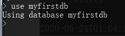

**InfluxDB安装以及使用**

一、简介

InfluxDB是一种时序数据库，用来存放监控数据。InfluxDB 是用Go语言编写的一个开源分布式时序、事件和指标数据库，无需外部依赖。

其主要特色功能

1）基于时间序列，支持与时间有关的相关函数（如最大，最小，求和等）
2）可度量性：你可以实时对大量数据进行计算
3）基于事件：它支持任意的事件数据

InfluxDB的主要特色

1）无结构（无模式）：可以是任意数量的列
2）可拓展的
3）支持min, max, sum, count, mean, median 等一系列函数，方便统计
4）原生的HTTP支持，内置HTTP API
5）强大的类SQL语法
6）自带管理界面，方便使用

二、下载安装

1、下载influxdb1.8.4，windows安装包如下：
[【influxDB】windows安装influxdb1.8.4+管理工具下载链接_旧梦如风F的博客-CSDN博客](https://blog.csdn.net/qq_31107521/article/details/121739270)
ps：官网下载2.0版本缺少配置文件，1.8启动就能用双击influxd.exe启动即可
2、解压到安装盘（不用安装），目录为：


三、修改配置文件

InfluxDB 的数据存储主要有三个目录。默认情况下是 meta, wal 以及 data 三个目录，服务器运行后会自动生成。

meta 用于存储数据库的一些元数据，meta 目录下有一个 meta.db 文件。

wal 目录存放预写日志文件，以 .wal 结尾。

data 目录存放实际存储的数据文件，以 .tsm 结尾。

如果不使用influxdb.conf配置的话，那么直接双击打开influxd.exe就可以使用influx，此时上面三个文件夹的目录则存放在Windows系统的C盘User目录下的.Influx目录下，

默认端口为8086，以下为修改文件夹地址，以及端口号方法。

1、修改以下部分路径


 2、如果需要更改端口号，则修改以下部分配置


3. 修改配置后启动方式

InfluxDB 使用时需要首先打开Influxd.exe，直接打开会使用默认配置，需要使用已配置的配置文件的话，需要指定conf文件进行启动，启动命令：influxd --config influxdb.conf


 如果出现下列情况，启动失败，还需要修改influxdb.conf


 在influxdb.conf中修改如下一行，修改地址并且打开注释，修改后保存


再次运行 influxd --config influxdb.conf 命令

出现如下信息启动成功


 ps：启动运行influxd命令的话，使用默认配置，打开默认8086端口号的服务


4、启动influxd后，窗口不要关闭。再启动一个cmd窗口，执行如下命令：influx

ps：InfluxDB自带一个客户端程序influx，可用来增删改查等操作数据库


ps：扩展

influxdb使用的端口如下：

8083：InfluxDB 的 Web 管理界面端口，web管理端  http://ip:8083 用户名和密码都是admin,
8086：HTTP API 监听端口
8088：集群端口(目前还不是很清楚, 配置在全局的bind-address，默认不配置就是开启的)

全局配置

```shell
reporting-disabled = false  # 该选项用于上报influxdb的使用信息给InfluxData公司，默认值为false

bind-address = ":8088"  # 备份恢复时使用，默认值为8088
```

1、meta相关配置

```shell
[meta]

dir = "/var/lib/influxdb/meta"  # meta数据存放目录

retention-autocreate = true  # 用于控制默认存储策略，数据库创建时，会自动生成autogen的存储策略，默认值：true

logging-enabled = true  # 是否开启meta日志，默认值：true
```

2、data相关配置

```shell
[data]

dir = "/var/lib/influxdb/data"  # 最终数据（TSM文件）存储目录

wal-dir = "/var/lib/influxdb/wal"  # 预写日志存储目录

query-log-enabled = true  # 是否开启tsm引擎查询日志，默认值： true

cache-max-memory-size = 1048576000  # 用于限定shard最大值，大于该值时会拒绝写入，默认值：1000MB，单位：byte

cache-snapshot-memory-size = 26214400  # 用于设置快照大小，大于该值时数据会刷新到tsm文件，默认值：25MB，单位：byte

cache-snapshot-write-cold-duration = "10m"  # tsm引擎 snapshot写盘延迟，默认值：10Minute

compact-full-write-cold-duration = "4h"  # tsm文件在压缩前可以存储的最大时间，默认值：4Hour

max-series-per-database = 1000000  # 限制数据库的级数，该值为0时取消限制，默认值：1000000

max-values-per-tag = 100000  # 一个tag最大的value数，0取消限制，默认值：100000
```

3、coordinator查询管理的配置选项

```shell
[coordinator]

write-timeout = "10s"  # 写操作超时时间，默认值： 10s

max-concurrent-queries = 0  # 最大并发查询数，0无限制，默认值： 0

query-timeout = "0s  # 查询操作超时时间，0无限制，默认值：0s

log-queries-after = "0s"  # 慢查询超时时间，0无限制，默认值：0s

max-select-point = 0  # SELECT语句可以处理的最大点数（points），0无限制，默认值：0

max-select-series = 0  # SELECT语句可以处理的最大级数（series），0无限制，默认值：0

max-select-buckets = 0  # SELECT语句可以处理的最大"GROUP BY time()"的时间周期，0无限制，默认值：0
```

4、retention旧数据的保留策略

```shell
[retention]

enabled = true  # 是否启用该模块，默认值 ： true

check-interval = "30m"  # 检查时间间隔，默认值 ："30m"
```

5、shard-precreation分区预创建

```shell
[shard-precreation]

enabled = true  # 是否启用该模块，默认值 ： true

check-interval = "10m"  # 检查时间间隔，默认值 ："10m"

advance-period = "30m"  # 预创建分区的最大提前时间，默认值 ："30m"
```

6、monitor 控制InfluxDB自有的监控系统。 默认情况下，InfluxDB把这些数据写入_internal 数据库，如果这个库不存在则自动创建。 _internal 库默认的retention策略是7天，如果你想使用一个自己的retention策略，需要自己创建。

```shell
[monitor]

store-enabled = true  # 是否启用该模块，默认值 ：true

store-database = "_internal"  # 默认数据库："_internal"

store-interval = "10s  # 统计间隔，默认值："10s"
```

7、admin web管理页面

```shell
[admin]

enabled = true  # 是否启用该模块，默认值 ： false

bind-address = ":8083"  # 绑定地址，默认值 ：":8083"

https-enabled = false  # 是否开启https ，默认值 ：false

https-certificate = "/etc/ssl/influxdb.pem"  # https证书路径，默认值："/etc/ssl/influxdb.pem"
```

8、http API

```shell
[http]

enabled = true  # 是否启用该模块，默认值 ：true

bind-address = ":8086"  # 绑定地址，默认值：":8086"

auth-enabled = false  # 是否开启认证，默认值：false

realm = "InfluxDB"  # 配置JWT realm，默认值: "InfluxDB"

log-enabled = true  # 是否开启日志，默认值：true

write-tracing = false  # 是否开启写操作日志，如果置成true，每一次写操作都会打日志，默认值：false

pprof-enabled = true  # 是否开启pprof，默认值：true

https-enabled = false  # 是否开启https，默认值：false

https-certificate = "/etc/ssl/influxdb.pem"  # 设置https证书路径，默认值："/etc/ssl/influxdb.pem"

https-private-key = ""  # 设置https私钥，无默认值

shared-secret = ""  # 用于JWT签名的共享密钥，无默认值

max-row-limit = 0  # 配置查询返回最大行数，0无限制，默认值：0

max-connection-limit = 0  # 配置最大连接数，0无限制，默认值：0

unix-socket-enabled = false  # 是否使用unix-socket，默认值：false

bind-socket = "/var/run/influxdb.sock"  # unix-socket路径，默认值："/var/run/influxdb.sock"
```

9、subscriber 控制Kapacitor接受数据的配置

```shell
[subscriber]

enabled = true  # 是否启用该模块，默认值 ：true

http-timeout = "30s"  # http超时时间，默认值："30s"

insecure-skip-verify = false  # 是否允许不安全的证书

ca-certs = ""  # 设置CA证书

write-concurrency = 40  # 设置并发数目，默认值：40

write-buffer-size = 1000  # 设置buffer大小，默认值：1000
```

10、graphite 相关配置

```shell
[[graphite]]

enabled = false  # 是否启用该模块，默认值 ：false

database = "graphite"  # 数据库名称，默认值："graphite"

retention-policy = ""  # 存储策略，无默认值

bind-address = ":2003"  # 绑定地址，默认值：":2003"

protocol = "tcp"  # 协议，默认值："tcp"

consistency-level = "one"  # 一致性级别，默认值："one

batch-size = 5000  # 批量size，默认值：5000

batch-pending = 10  # 配置在内存中等待的batch数，默认值：10

batch-timeout = "1s"  # 超时时间，默认值："1s"

udp-read-buffer = 0  # udp读取buffer的大小，0表示使用操作系统提供的值，如果超过操作系统的默认配置则会出错。 该配置的默认值：0

separator = "."  # 多个measurement间的连接符，默认值： "."
```

11、collectd

```shell
[[collectd]]

enabled = false  # 是否启用该模块，默认值 ：false

bind-address = ":25826"  # 绑定地址，默认值： ":25826"

database = "collectd"  # 数据库名称，默认值："collectd"

retention-policy = ""  # 存储策略，无默认值

typesdb = "/usr/local/share/collectd"  # 路径，默认值："/usr/share/collectd/types.db"

auth-file = "/etc/collectd/auth_file"

batch-size = 5000

batch-pending = 10

batch-timeout = "10s"

read-buffer = 0  # udp读取buffer的大小，0表示使用操作系统提供的值，如果超过操作系统的默认配置则会出错。默认值：0
```

12、opentsdb

```shell
[[opentsdb]]

enabled = false  # 是否启用该模块，默认值：false

bind-address = ":4242"  # 绑定地址，默认值：":4242"

database = "opentsdb"  # 默认数据库："opentsdb"

retention-policy = ""  # 存储策略，无默认值

consistency-level = "one"  # 一致性级别，默认值："one"

tls-enabled = false  # 是否开启tls，默认值：false

certificate= "/etc/ssl/influxdb.pem"  # 证书路径，默认值："/etc/ssl/influxdb.pem"

log-point-errors = true  # 出错时是否记录日志，默认值：true

batch-size = 1000

batch-pending = 5

batch-timeout = "1s"
```

13、udp

```shell
[[udp]]

enabled = false  # 是否启用该模块，默认值：false

bind-address = ":8089"  # 绑定地址，默认值：":8089"

database = "udp"  # 数据库名称，默认值："udp"

retention-policy = ""  # 存储策略，无默认值

batch-size = 5000

batch-pending = 10

batch-timeout = "1s"

read-buffer = 0  # udp读取buffer的大小，0表示使用操作系统提供的值，如果超过操作系统的默认配置则会出错。 该配置的默认值：0　
```

14、continuous_queries

```shell
[continuous_queries]

enabled = true  # enabled 是否开启CQs，默认值：true

log-enabled = true  # 是否开启日志，默认值：true

run-interval = "1s"  # 时间间隔，默认值："1s"
```

**五、**InfluxDB数据库常用命令

1、显示数据库：show databases


2、创建数据库：create database myfirstdb


3、使用数据库：use myfirstdb



4、显示所有表：show measurements


没有表则无返回。


5、新建表和插入数据

新建表没有具体的语法，只是增加第一条数据时，会自动建立表

insert 表名,列名1=值1 列名2=值2

insert results,hostname=index1 value=1


这里的时间看不懂，可以设置一下时间显示格式

precision rfc3339


6、 查询数据

表名有点号时，输入双引号

select * from "jmeter.all.a.avg"


和sql语法相同，区别：

measurement 数据库中的表

points 表里面的一行数据，Point由时间戳（time）、数据（field）、标签（tags）组成。

7、 用户显示

a. 显示所有用户：show users


b.新增用户

*--普通用户*

create user "user" with password 'user'

*--管理员用户*

create user "admin" with password 'admin' with all privileges


c.删除用户

drop user "user"


InfluxDB常用命令（这里暂不做操作，仅供学习）

```shell
# 查看数据库列表
show databases
 
# 查看表列表
show measurements
 
# 创建数据库
create database 数据库名
 
# 删除数据库
drop database 数据库名
 
# 删除表
drop measurements 表名
 
# 使用数据
use 数据库名
 
# sql语句和MySQL等关系型数据库很相似
select * from 表名 where 列名 = 值
```

ps：influxdb与传统数据库的比较

库、表等比较：

| **influxDB** | **传统数据库中的概念** |
| ------------ | ---------------------- |
| database     | 数据库                 |
| measurement  | 数据库中的表           |
| points       | 表里面的一行数据       |

influxdb数据的构成：

Point由时间戳（time）、数据（field）、标签（tags）组成。

| **Point属性** | **传统数据库中的概念**                                  |
| ------------- | ------------------------------------------------------- |
| time          | 每个数据记录时间，是数据库中的主索引(会自动生成)        |
| fields        | 各种记录值（没有索引的属性）也就是记录的值：温度， 湿度 |
| tags          | 各种有索引的属性：地区，海拔                            |

这里不得不提另一个名词：series：

​     所有在数据库中的数据，都需要通过图表来展示，而这个series表示这个表里面的数据，可以在图表上画成几条线：通过tags排列组合算出来。具体可以通过 SHOW SERIES FROM "表名"  进行查询。