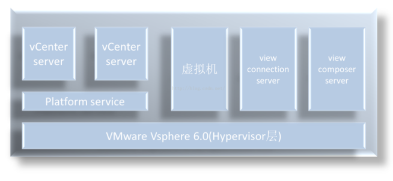

主要组件:

ESXi ： 底层虚拟化层，用于将物理服务器虚拟成资源池，提供管理接口，方便其他的管理组件进行管理，其实体形态是iso文件，刻成可启动光盘直接安装在服务器裸机上

vsphere client：是安装在windows系统上的客户端软件，登录后输入对应ESXi主机的ip可以进行管理，也可以输入vCenter服务器的ip通过其对整个数据中心进行管理

vCenter ：对ESXi主机进行集中管理的服务器端软件，安装在windows server 2008R2或以上的操作系统里，通过SQL 2008R2 或以上版本的数据库（其他数据库也有版本要求）维护数据中心里各功能组件的信息，也有安装在Linux环境里的版本。

vsphere web client：通过浏览器输入vcenter所在服务器的ip，可以进入对整个虚拟化数据中心的管理界面，在vsphere5.0以后，VMware在逐渐弱化vsphere client的作用，现在很多高级功能（如增强型vMotion）只能在web client里实现。