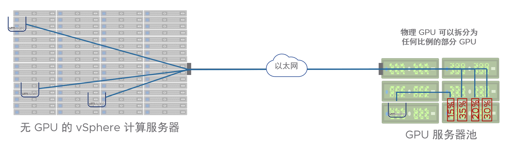

VMware vSphere BitFusion介绍

VMware在2019年8月收购了BitFusion，后者是硬件加速设备虚拟化领域的先驱，重点关注GPU技术。
BitFusion 提供了一个软件平台，可将特定的物理资源与环境中所连接的服务器分离，通过网络的方式让多个Client共享GPU计算能力。

VMware一直没有自己的GPU虚拟化技术，通过BitFusion终于补上了GPU虚拟化这块空白。

Bitfusion client运行AI / ML应用程序，该应用程序通过网络共享Bitfunsion Server上的直通GPU。
Bitfusion 可以将GPU内存划分为任意大小不同的切片，然后分配给不同的客户端以供同时使用。
Bitfusion 可以为VM和Container远程提供GPU计算能力。

Bitfusion 的 GPU 资源池有点类似于存储区域网络 SAN (Storage Attached Network)，所以也有人把它叫作 GPU Attached Network。

