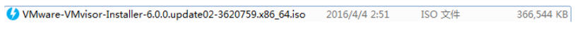
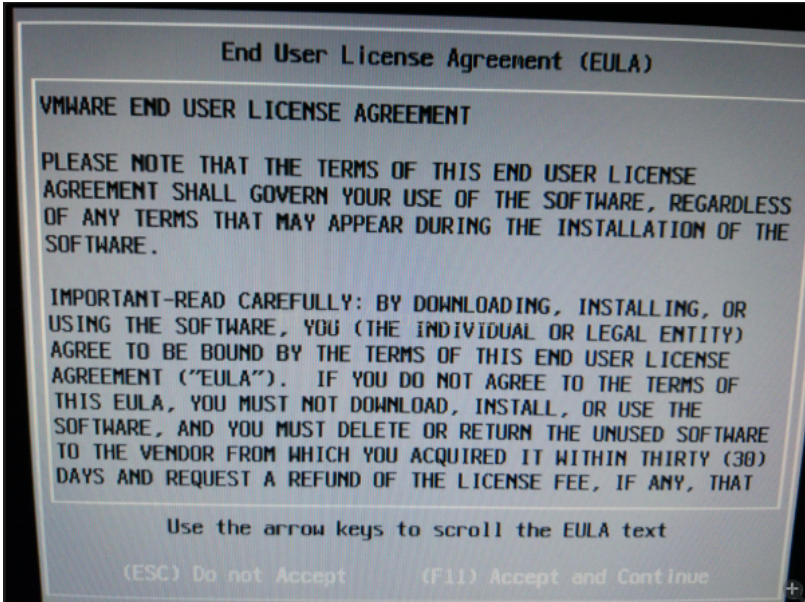
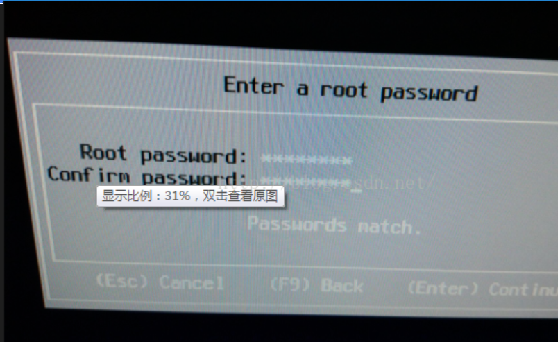
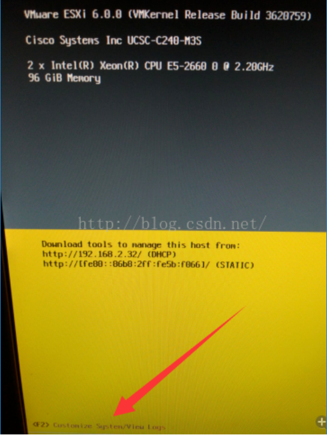
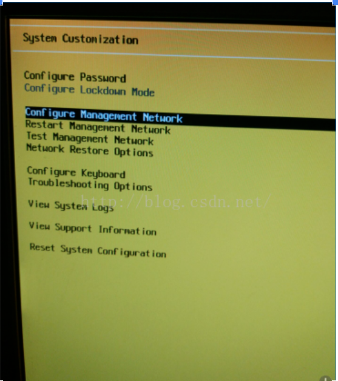
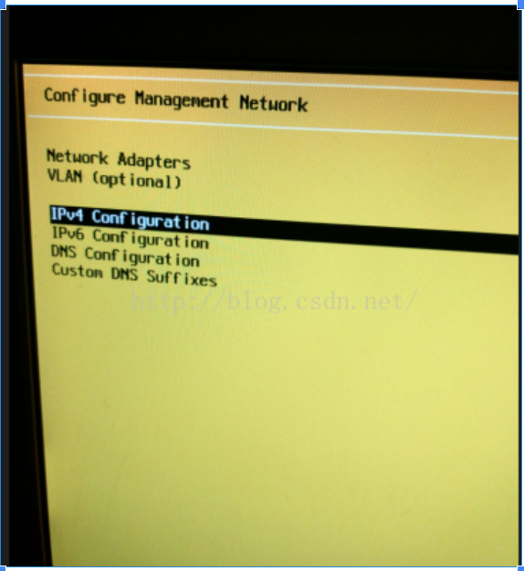
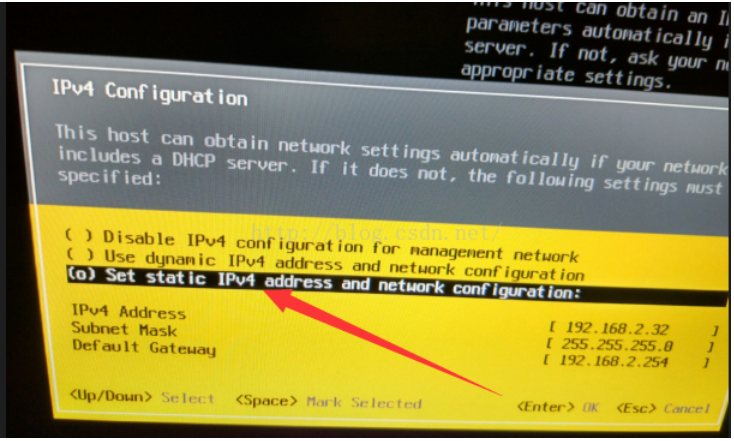
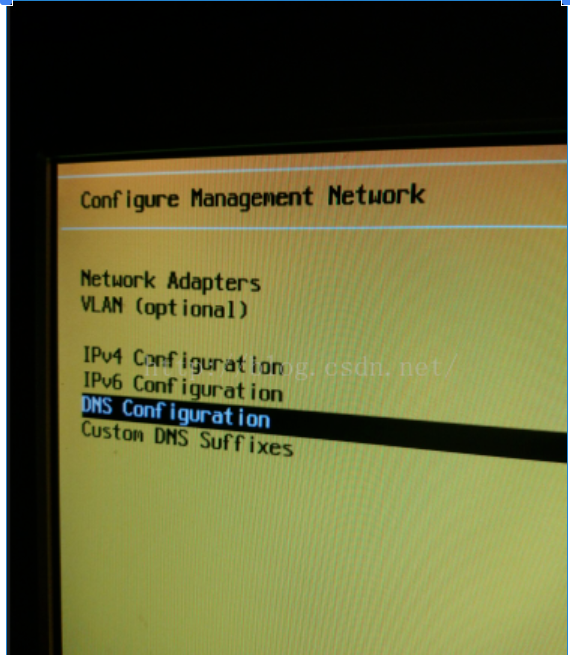
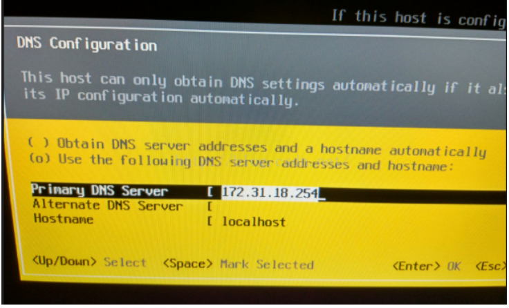

**（二） Vsphere ESXi安装**

ESXi作为虚拟化环境的Hypervisor层，负责将服务器虚拟成资源池，提供接口供管理组件调用，将下面的iso刻录成光盘或可启动U盘，安装在服务器裸机上：

下载地址请见上节

**安装过程**

开机做好阵列，选择从安装介质启动

按F11继续

输入密码：rootroot，密码最少要8位数字或字母，用vsphere client登录ESXi服务器时，账户名为root，密码为上面所设

按F2进入配置界面

这里只用配置管理网络

无论服务器连接了多少根网线，这里只用配置一个管理IP，至于服务器上跑的虚拟机流量，管理流量的分配，则要在vcenter里指定到对应物理网卡上

配置IPv4地址

这里选择配置静态IP地址

IP：192.168.2.32

子网掩码：255.255.255.0

网关：192.168.2.254

这里网关按现有网络环境的网关来配置，否则将无法远程连接管理

配置DNS

按现有环境DNS配置即可，至少要配置一个Primary DNS

配置完成后，退出保存，至此需要在服务器上的配置全部完成，后面可以全程远程操作
