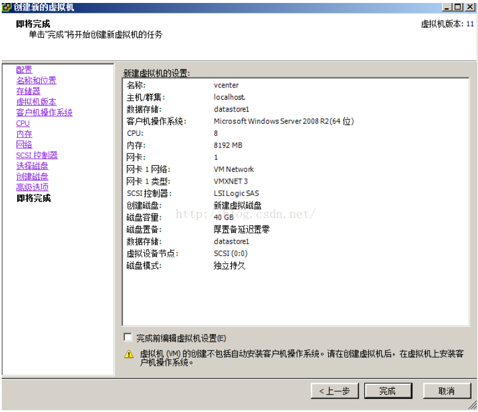
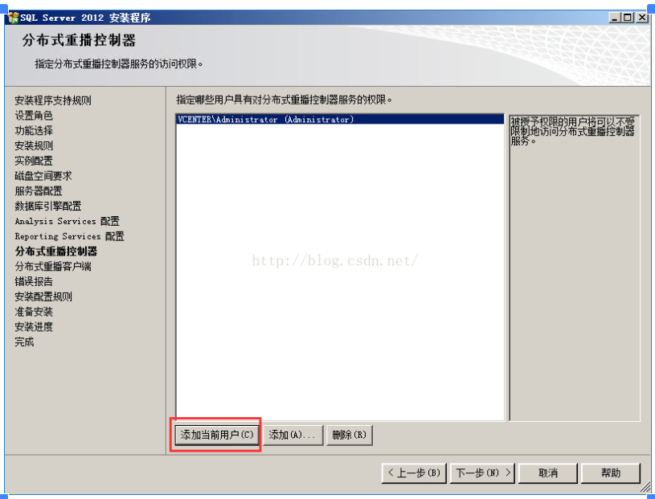
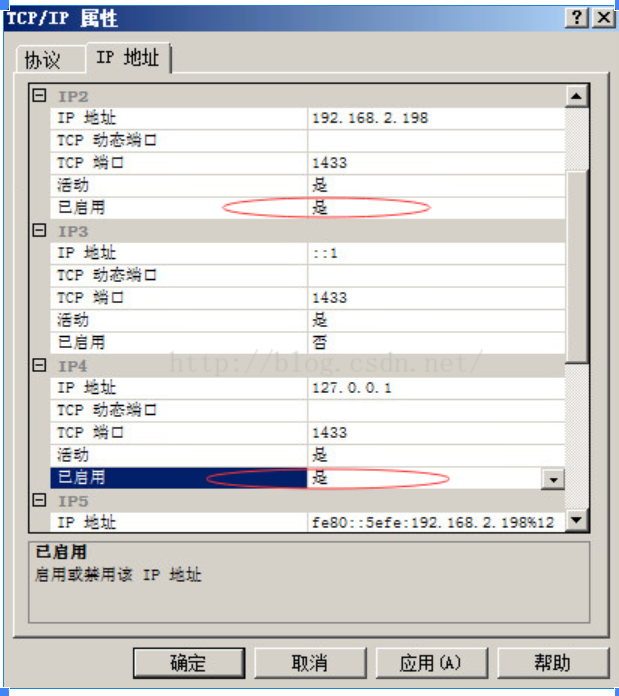
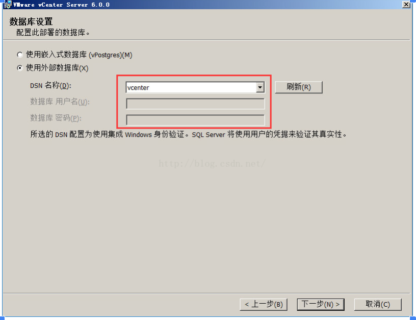

**几个不同的组件**

vCenter Server：对ESXi主机进行集中管理的服务器端软件，安装在windows server 2008R2或以上的操作系统里，通过SQL 2008R2 或以上版本的数据库（其他数据库也有版本要求）维护数据中心里各功能组件的信息。其实体形态是.iso文件，可在物理或虚拟Windows桌面上安装。

​    

链接：链接：https://pan.baidu.com/s/1zByW0hOYiMy0U8t1mI1qxw  密码：teab

vCenter Server Appliance：简称VCSA，是预配置的 Linux 虚拟机，针对在 Linux 上运行vCenter Server 及关联服务进行了优化，从6.0开始其实体形态是个.iso文件，需要在windows桌面上打开，通过配置过程将其安装到ESXi主机上。

​    

链接： [https://pan.baidu.com/s/1uch3h61UziIyyjObEf7X3Q  ](https://pan.baidu.com/s/1uch3h61UziIyyjObEf7X3Q)密码：6pv6

具体特点请参照：http://bbs.vmsky.com/thread-45061-1-1.html

​                http://www.searchvirtual.com.cn/showcontent_65305.htm

Platform Services Controller：从vsphere6.0开始出现的组件，集成在vCenter安装包里，顾名思义是平台服务的控制器，如果说vcenter是管理平台的话，那他就是控制vcenter的，现实环境里如果是大规模的服务器集群，往往需要多台vcenter进行管理，如何将这些vcenter协调起来，这就是Platform Services Controller的功能

所有与vsphere组件之间进行通信的服务都要通过这个平台来完成，包括SSO，VMware证书颁发，VMware Lookup Service和一些许可服务

Platform Services Controller具有嵌入式部署和外部部署两种模式，嵌入式部署是和每个vcenter安装在同一台windows服务器上，外部部署是单独拿一台windows服务器安装Platform Services Controller，然后所有vcenter都通过网络注册到其上

每个Platform Services Controller最多可管理8个vcenter实例，如果再多的话需要额外安装Platform Services Controller。

这里学习环境规模较小，采用嵌入式部署Platform Services Controller就好

**安装准备**

环境需求：

安装vcenter需要域环境，因此要先安装域控（有些功能比如horizon view需要用到域环境），学习环境可以用一台虚拟机做域控。

建议将域控和vcenter服务器分别装在不同的服务器上，生产环境应该尽量在物理服务器上安装vcenter服务器，这里学习环境我们就在虚拟机上安装vcenter管理程序。

安装vcenter需要最低2核CPU，8G内存

本例中采用一台08R2虚拟机作为域控，提供域账户 vcenter@vm.com 给vcenter服务器使用，vcenter服务器安装在一台4个vCPU，8G内存的虚拟机上，桌面环境是Windows Server 2008R2 SP2。

数据库兼容列表：

PostgreSQL  对于 vCenterServer 6.0，捆绑的 PostgreSQL 数据库适用于最多包含 20 个主机和 200 个虚拟机的环境。对于 vCenter Server Appliance，可在最多包含 1,000 个主机和 10,000 个虚拟机的环境中使用嵌入式PostgreSQL 数据库。

重要

如果使用的是嵌入式 PostgreSQL 数据库，在 Windows 上卸载 vCenter Server 会卸载该嵌入式数据库，并且会丢失所有数据。

Microsoft SQL Server 2008R2 SP2 或更高版本

确保计算机具有有效的 ODBC DSN 条目。（注：vCenter Server Appliance 不支持此数据库。）

Oracle 11g 和 Oracle 12c 确保计算机具有有效的 ODBC DSN 条目。

vCenter Server 安装完成后，请在 Oracle 客户端和服务器上应用最新的修补程序。

**安装步骤：**

**一 建立vcenter服务器**

登录vsphere client，输入ESXi主机的ip，用户名是root，密码是安装ESXi时设置的

​    

安装证书并忽略警告

​    

进入vsphere client后，在主页-清单-配置-存储器下右键“浏览数据存储”

​    

新建一个image文件夹用来存放虚拟机镜像文件（随个人习惯，用原有文件夹也行）

​    

上传server 2008R2的镜像用来建立vcenter虚拟机

​    

上传完成后新建虚拟机

​    

上传完成后开始新建虚拟机

  

**虚拟CPU概念**

科普一下操作系统原理：任何程序或应用都是由一个或多个进程组成，每个进程下面又有若干个线程，对于CPU的每个物理核心，只能一个线程一个线程的执行（不考虑流水线技术），而每个线程也只能同时跑在一个物理CPU核心上，而超线程技术是由CPU内部的机制对指令执行的顺序进行优化调度，通过时间错开执行，使其看起来像是同时在一个物理核心上同时跑两个线程，把一个核当两个核用，所以如果开启了超线程功能，CPU的逻辑核心=物理CPU数*每物理CPU核心数*2

对于所有的虚拟化方案，都是通过分时复用的方式进行CPU虚拟化，因此每个虚拟CPU实际上是一个线程，虚拟化层根据时间片配额轮流执行不同的vCPU线程，只要在可以接受的时间内vCPU线程返回运算结果，对虚拟机来说和跑在物理硬件上没有区别。由于vCPU是线程，而线程会占用一个CPU逻辑核心（没开超线程逻辑核心等于物理核心），所以虚拟机可以拥有的vCPU数量不能大于物理服务器的逻辑核心数，这也是上面的图里所说的“可以添加到虚拟机的虚拟CPU数量取决于主机上的CPU数量和客户操作系统支持的CPU数量”，本例中物理服务器拥有2颗E5-2660的CPU，每颗CPU8核16线程，总共32线程（也即32个逻辑CPU），故虚拟机能拥有的最大vCPU数量为32，也即虚拟插槽数 * 每虚拟插槽的内核数 不能大于32。

vCenter要求服务器（虚拟机）至少要有2个CPU核心，8G内存。

对于vsphere6.0环境，虚拟CPU的限制如下

​    

继续往下安装

​    

**虚拟网卡类型**

选择网卡类型，E1000是比较老比较经典的一款显卡，大部分操作系统里自带有它的驱动，这样装好系统后不用打网卡驱动了

VMXNET3是VMware自己的一种虚拟网卡型号，采用了半虚拟化的方案，性能较佳，它的驱动集成在VMware Tools里（装好虚拟机系统后安装的一种虚拟机性能增强工具），并且对虚拟机操作系统有一定要求，这里我们选择这个网卡类型。

直接下一步

新建虚拟磁盘

​    

**磁盘置备方式**

厚置备延迟置零：默认的创建格式，创建过程中为虚拟磁盘分配所需空间。创建时不会擦除物理设备上保留的任何数据，没有置零操作，当有IO操作时，需要等待清零操作完成后才能完成IO

即：分配好空间（其他人不能使用了），执行写操作时才会按需要将其置零。创建虚拟机时较快（因为不用对磁盘格式化），后续对虚拟机IO有一定影响。

厚置备置零：创建支持群集功能的厚磁盘。在创建时为虚拟磁盘分配所需的空间。并将物理设备上保留的数据置零。创建这种格式的磁盘所需的时间可能会比创建其他类型的磁盘长。

精简置备（thin）：精简配置就是无论磁盘分配多大，实际占用存储大小是现在使用的大小，即用多少算多少。当客户机有输入输出的时候，VMkernel首先分配需要的空间并进行清零操作，也就是说如果使用精简配置在有IO的时候需要：等待分配空间和清零，这两个步骤完成后才能进行操作，对于IO较频繁的应用这样性能会有所下降，虽然节省了存储空间。

这里默认下一步

​    

高级选项是选择快照对磁盘的影响

不勾选独立：快照可以将虚拟机磁盘还原

勾选独立有两个选项，持久：所有对磁盘的改动都将保存在磁盘上，不受快照还原的影响，性能最好

​                    非持久：相当于给磁盘加了个还原卡，所有对磁盘的改动都不直接保存在磁盘上，虚拟机重启后清零

关于磁盘模式的详细介绍请参见  http://book.2cto.com/201303/18182.html

这里我们选择独立-持久模式

​    

完成

​    

编辑虚拟机设置

​    

浏览到datastore1 - images里之前上传的08R2的系统镜像，上面的两个勾要勾上

​    

启动虚拟机，在控制台里安装好操作系统

​    

关闭防火墙

​    

安装VMware Tools

  

这里选完整安装

将vcenter服务器设置固定ip，DNS指向域控的ip，以 vcenter.vm.com的用户名加入域（域控制器那边要提前进行帐号配置），成功后重启

重启后关闭windows update

**二 安装vcenter数据库**

建立好vcenter虚拟机后，可以开始vcenter应用程序的安装了，vcenter所管理的数据中心对象的信息是通过数据库进行管理的，vcenter6.0版本支持三种数据库：

内置的PostgreSQL数据库：支持列表请见本文开头部分，对于学习环境足够使用，可在安装vcenter程序时选择安装，安装步骤很简单，本例不做演示

SQL Server数据库：安装在windows平台上，最低版本要求是SQL Server 2008 R2 SP2，本例中采用的是SQL Server 2012 SP1，安装步骤和SQL Server 2008基本一致

Oracle数据库：一般用在生产环境，成本比较高，如有需求请参考网上其他教程

先手动开启 .NET FRAMEWORK 3.5.1功能组件

​    

后面一直下一步

​    

一直下一步直到安装完成

将SQL数据库镜像文件上传至ESXi主机存储器，并加载至虚拟机光驱（方法和本文前部加载虚拟机系统镜像一样）

​    

检查配置没问题就开始安装

​    

这里有个默认密钥是试用版的许可，不用改直接下一步，稍后再统一激活许可证

功能全选，一直下一步（为了减少后面与vcenter占用80端口的冲突，建议将与“Reporting Services”有关的几个功能都不要勾选）

​    

本例中由于是在vcenter本机上安装数据库，所以使用当前用户的windows身份验证就可以了

如果

​    

​    

一直下一步最后安装

因为vcenter要用到80端口，会与数据库的Report Services服务冲突，应将该服务停止

​    

​    

把如下两项由“否”改为“是”

   

**新建vcenter数据库**

​    

**添加数据源**

​    

​    

选择SQL Native Client 11.0，单击“完成”

​    

这里第三行的服务器名应该是当前系统的计算机名，在“计算机”-右键“属性”里能看到

​    

​    

​    

一直下一步知道测试数据源成功

​    

**三 安装vcenter server程序**

还是将vcenter安装程序镜像加载到虚拟机的光驱里

  

​    

​    

这里域名是以后用来登录vsphere client的帐号里的后缀，这里可以不用改

密码要求8位以上，有大小写字母，数字和符号，本例设的是  Admin_123

下一步

​    

在准备设置vCenter Server服务帐户之前，需要为帐户分配“服务登陆”特权，打开“本地组策略”，依次展开“计算机配置”-“Windows配置”-“安全设置”-“本地策略”-“用户权限分配”，然后在右侧双击“作为服务登陆”，在弹出对话框单击“添加用户或组”将帐加入，确认无误后单击“确定”

  

添加的用户名是当前的系统用户名，可以在cmd里用whoami查看

​    

回到vcenter安装程序，选择“指定用户服务帐户”，然后输入具有服务登陆特权的帐户和密码，单击“下一步”

​    

这里用的是刚才添加的账户

  

这里是刚创建的数据源

​    

vcenter服务会用到80端口，如果之前不更改IIS服务的端口，这里就要更改vcenter服务的默认端口

​    

两种解决办法：

①关掉IIS服务：管理工具-服务-World Wide Web Publishing Service 先停止后禁用（建议用此方法）

然后cmd里netstat -ano看是否80端口还在，如没有则可以顺利继续安装

②或者这里把vcenter端口改成8080

​    

继续下一步安装直到最后

至此，vcenter服务器安装完成。