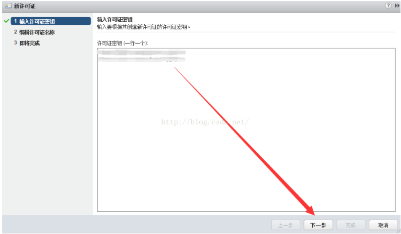

**vsphere client和vsphere web client的区别**

vsphere client是一个运行在windows桌面上的客户端，在linux环境下无法运行，在vsphere5.0以后，VMware在逐渐弱化vsphere client的作用，现在很多高级功能（如增强型vMotion）只能在web client里实现。

VMware的设计趋势是用web client取代vsphere client，故本例采用web client进行管理

详细区别请见

http://server.zol.com.cn/431/4312982_all.html

**vcenter管理对象**

​    

其逻辑结构如下图

​    

**登录vsphere web client**

**浏览器要求**

web client官方支持IE，Firefox，Chrome，版本要求如下

​    

本例使用Firefox浏览器

**登录**

​    

在浏览器地址栏输入https://vcenter服务器的ip地址:9443，注意此处前缀必须是https（加密的http链接），后面是安装vcenter时默认web client端口号9443，即可进入登录界面

​    

由于VMware采用的是自己的安全证书，不被浏览器识别，这里添加例外即可

下载浏览器插件进行安装，下载完成后是这个文件

​    

安装好后再次登录

​    

登录名是安装vcenter时设置的SSO帐号

administrator@vsphere.local

密码：Admin_123

然后就进入了web client界面

**添加主机到数据中心集群**

先将整个虚拟数据中心的架构建立起来

**建立数据中心**

​    

**向数据中心添加主机**

​    

输入安装ESXi主机时设置的帐号密码

这里先采用默认的60天测试许可证，稍后再统一注册激活

​    

默认禁用锁定模式，下一步直到完成

**新建群集**

​    

为群集输入名字，下面列出的高级功能（DRS，HA，EVC，vSAN）暂不创建，然后单击“确定”，即可完成群集的创建

高级功能将在后续一一进行介绍

DRS：收集群集内所有主机和虚拟机的资源使用情况信息，并根据特定的运行状况给出建议或迁移虚拟机

HA：如果一台主机出现故障，则该主机上运行的所有虚拟机都将立即在同一群集的其他主机上重新启动

EVC：增强型vMotion，可在异构CPU主机间进行迁移

vSAN：集中管理x86服务器的内部磁盘与闪存设备，实现虚拟机共享存储

**将主机移入群集**

​    

**为各功能组件分配许可证**

回到vCenter主页，在右侧栏单击“许可”图标

​    

VMware产品里的许可系统

​    

总的来说，这是一个模块化的许可证集中管理系统，不同的密钥对应不同的许可证，而许可证可附加到任意对应资产上，高级别的许可证具有更多的功能，一些额外的解决方案可作为插件加到vcenter管理平台中，但需要额外的许可证

这里，我们先激活ESXi主机和vcenter的许可证

​    

输入一个vsphere exsi主机的lisence，一个vcenter server的lisence

如果是生产环境，需要购买正版许可

如果是测试环境，VMware网站上可以申请60天的测试密钥

​    +

其中EXSi主机是按CPU个数来授权，也就是说看你的license支持多少个CPU可以被vcenter管理，而vcenter是按实例来授权，也就是说每个license最多支持多少个vcenter服务器

密钥导入完以后还要分配给各个组件

打开“资产”选项卡内的“vcenter server系统”选项卡，选择一个vcenter实例，单击“全部操作”，在下拉菜单单击“分配许可证

​    

将刚才导入的许可证分配下去，上面的Evaluation License是系统自带了60天测试许可证，具有所有高级功能

同理，再为EXSi主机分配许可证

​    

许可证分配完毕，可以在数据中心建立虚拟机了