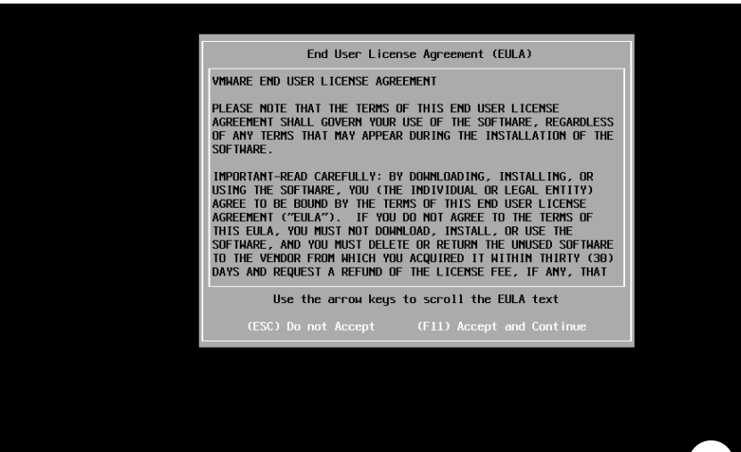

**VMware 作为虚拟化行业的老大，占据了80%的市场份额。而在服务器虚拟化就不得不说 VMware vSphere ，这个组合包括了VMware EXSI VMware vCenter Server等等，这次我们要说说VMware EXSI 6.0**

VMware EXSI基于Linux开发的虚拟机系统，是底层系统，所以性能很高，可以达到服务器硬件的95%。

**ESXI 安装**

把EXSI6.0的光盘（ VMware-VMvisor-Installer-6.0.0.update02-3620759.x86_64.iso）放在服务器光驱并用此来引导服务器，然后如下图开始安装：

  

回车

   

按F11同意协议

​    

扫瞄到的硬盘装置，没有问题直接按键盘『Enter』。如有多块硬盘，请依需求选择。

   

选择键盘布局，预设就是一般常用的US Default，按键盘『Enter』。

   

输入登陆ESXi 的root 密码，输入完毕请按键盘『Enter』。

再次提醒，该硬盘要被分区格式化了，确定请按键盘『F11』。

​    

系统安装中…

 

安装完成，按键盘『Enter』，重新启动。

**VMware ESXi 6 基本设定**

下图为安装完成的开机画面，要进行系统设定/ 登陆，请按键盘『F2』；关机/ 重启，请按键盘『F12』。按键盘『F2』进行设置。

​    

输入帐号root / 密码（在安装时所填的密码），输入完毕后按键盘『Enter』登陆。

 

进行网络的相关设定，选择『Configure Managerment Network』后，按键盘『Enter』。

设置 IP （因为之后需要使用VMware vSphere Client 来做连线），选择『IPv4 Configuration』后，按键盘『Enter』。

   

设置要使用『动态』或『静态（固定）』的IP 设定。如要指定固定IP，请选择「Set static IPv4 address and network configuration」，并且输入相对应的IP，确认没问题请按键盘『Enter』。

 

按键盘『Esc』，离开系统设置，离开设定时，会询问是否要改变设定并退出，是请按键盘『Y』；否请按键盘『N』。

   

本文转载自：http://www.linuxprobe.com/vmware-exsi-6-0.html