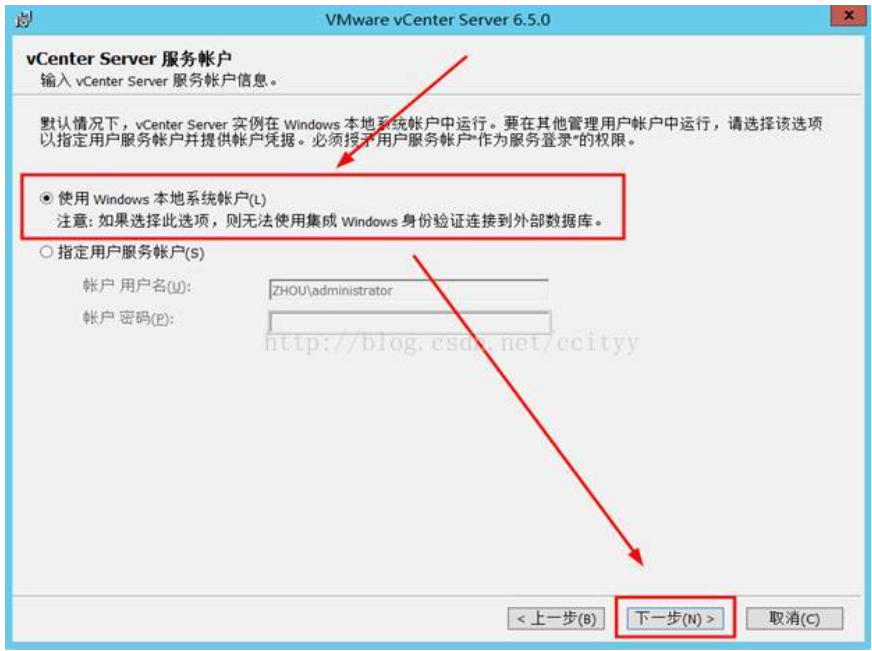
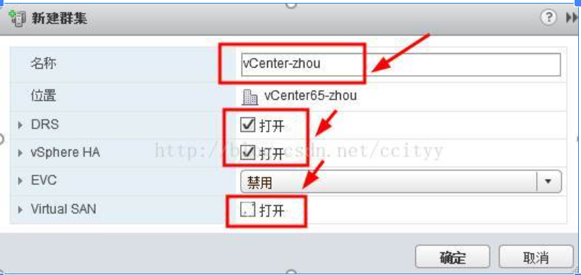

**【**摘要**】**

VMwarevCenterServer 提供了一个可伸缩、可扩展的平台，为虚拟化管理奠定了基础。可集中管理VMware vSphere环境，与其他管理平台相比，极大地提高了 IT 管理员对虚拟环境的控制。

VMware vCenterServer：提高在虚拟基础架构每个级别上的集中控制和可见性，通过主动管理发挥 vSphere潜能，是一个具有广泛合作伙伴体系支持的可伸缩、可扩展平台。

无论您拥有十几个虚拟机，还是几千个虚拟机，VMware vCenterServer都是管理 VMware vSphere最简单、最有效的方法。借助 VMware vCenterServer，可从单个控制台统一管理数据中心的所有主机和虚拟机，该控制台聚合了集群、主机和虚拟机的性能监控功能。 VMware vCenterServer 使管理员能够从一个位置深入了解虚拟基础架构的集群、主机、虚拟机、存储、客户操作系统和其他关键组件等所有信息。

借助VMware vCenter Server，虚拟化环境变得更易于管理，一个管理员就能管理 100个以上的工作负载，在管理物理基础架构方面的工作效率比通常情况提高了一倍。

准备环境和工具：

1、 两台ESXi6.5主机；

2、 准备一台Windows Server 2012 R2系统的虚拟机；

3、 VMware-VIM-all-6.5.0.iso

一、完成VMwarevCenterServer安装

二、完成VMware vCenterServer群集的配置

步骤及内容

内容1：新建数据中心，命名：vCenter-zhou，新建群集，命名：vCenter-zhou，并启动vSphere HA、

DRS的功能；添加两台ESXi6.5主机，主机分别为：172.18.10.20,172.18.10.21;

内容2：

A、配置两台ESXi6.5主机的VMkernel网络接口，设置IP:172.18.10.22;并启动vMotion，在主机之间移动虚拟机称为迁移。使用 vMotion，可以在不停机的情况下迁移已打开电源的虚拟机；

B、两台ESXi6.5主机网卡冗余配置。

**【**正文**】1**

**一**、完成VMwarevCenterServer安装

1、挂载VMware-VIM-all-6.5.0.iso文件到Windows Server 2012 R2系统上；（如下图）

  

2、双击运行” autorun” exe文件，选中”适用于WindowsvCenterServer”并单击安装；（如下图）

​    

3、按照默认单击”下一步”即可；（如下图）

​    

4、勾选”我接受许可协议条款”，并单击”下一步”；（如下图）

​    

5、默认嵌入式部署，单击”下一步”（如有购买外部数据库license，即可根据企业情况和需求安装）

​    

6、部署需注意”系统名称”的输入，部署后系统名称无法更改，系统名称确认后，单击”下一步”；(如下图)

​    

7、输入vCenterServer密码，并单击”下一步”；（如下图）

​    

8、按照默认使用windows本地系统账户单击 ”下一步”即可；（如下图）

​    

9、默认”使用嵌入式数据库”安装即可（如有购买外部数据库license，即可根据企业情况和需求安装）；

​    

10、列出了vCenter运行所需的所有端口号，保持默认即可，单击“下一步”；

​    

11、安装路径建议不要修改，保持默认路径即可，单击“下一步”；

​    

12、取消勾选”加入VMware客户体验发送计划”单击”下一步”；

​    

13、列出了以上设置的所有参数，确认无误后，单击“安装”即可开始安装vCenterServer；

​    

14、开始安装

​    

15、安装完成

​    

**【**正文**】2**

二、完成VMware vCenterServer群集的配置

内容1:新建数据中心，命名：vCenter-zhou，新建群集，命名：vCenter-zhou，并启动vSphere HA、

DRS的功能；添加两台ESXi6.5主机，主机分别为：172.18.10.20,172.18.10.21;

1、在地址栏中输入vCenter地址：https://172.18.10.31:9443或https://vcenter65.zhou.local:9443；并在打开的登录页面中输入vCenter的管理员账号及密码，单击”登陆”，登陆vCenter Server；（如下图）

​    

2、单击”主机和群集”；

​    

3、新建数据中心，（如下图）

​    

4、命名：vCenter65-zhou（可自定义）；（如下图）

​    

5、右击数据中心“vCenter65-zhou”，在弹出菜单单击“新建群集”；（如下图）

​    

6、命名vCenter群集：vCenter0-zhou（可自定义），打开”DRS和vSphere HA高级功能，并单击”确定”；

​    

高级功能简述

DRS：收集群集内所有主机和虚拟机的资源使用情况信息，并根据特定的运行状况给出建议或迁移虚拟机

HA：如果一台主机出现故障，则该主机上运行的所有虚拟机都将立即在同一群集的其他主机上重新启动

EVC：增强型vMotion

Virtual SAN：集中管理x86服务器的内部磁盘与闪存设备，实现虚拟机共享存储

7、左击群集，单击”添加主机”；如下图）

​    

8、”名称和位置”；添加一台ESXi6.5主机，可输入主机名或ip，输入完成后单击”确定”；（如下图）

​    

9、”连接设置”；请输入ESXi6.5主机的用户名和密码，单击”下一步”；（如下图）

​    

10、”主机摘要”；我们可以看到ip为：172.18.10.20 ESXi主机的基本信息，分别为：主机名称、供应商、型号、ESXi主机版本、虚拟机台数情况，继续单击’下一步’；（如下图）

​    !

11、”分配许可证”；该许可证 60天后过期,忽略并继续单击’下一步’；

注：如添加许可证可单击”绿色加号”（如下图）

​    

12、”锁定模式”；可按照默认，单击”下一步”即可；

​    

13、”资源池”；可保持默认继续单击 ”下一步”；

​    

14、”即将完成”配置后，此步骤显示了该主机的基本信息情况；单击”完成”即可。（如下图）

​    

15、另一台ip:172.18.10.21的ESXi6.5主机，可按照以上步骤 ”添加主机” 即可，添加完成后显示如下图。

​    

内容2：

A、配置两台ESXi6.5主机的VMkernel网络接口，设置IP:172.18.10.22;并启动vMotion，在主机之间移动虚拟机称为迁移。使用 vMotion，可以在不停机的情况下迁移已打开电源的虚拟机；

1、 配置172.18.10.20主机的VMkernel网络接口，设置IP:172.18.10.22，单击“172.18.10.20主机”—VMkernel适配器—添加主机网络；（可参考如下图）

VMkernel 网络接口为主机提供网络连接，并且处理 VMware vMotion、IP存储器和 Fault Tolerance。

​    

2、选择连接类型中选择 ” VMkernel网络适配器”；（如下图）

​    

  3、选择目标设备中选中 “新建标准交换机”并单击 ”下一步”；（如下图）

​    

4、创建标准交换机中单击”添加”

​    

5、添加两张网卡，分别：vmnic2、vmnic3，选中两张网卡单击 “确定” （如下图）

​    

6、将两张网卡添加到活动适配器中，单击 “下一步”；（如下图）

​    

7、启动vMotion，单击”下一步”（如下图）

​    

8、配置VMkernel网络接口IP，（如下图）

​    

9、列出了以上VMkernel网络接口的配置信息，确定后单击 ”完成”；（如下图）

​    

10、VMkernel网络接口配置完成。（如下图）

​    

注：另一台主机可按照如上步骤配置

B、两台ESXi6.5主机网卡冗余配置。

1、如下图可发现在172.18.10.20主机的vSwitch0虚拟交换机中，只有一个vmnic0网卡,这时选中172.18.10.20主机—虚拟交换机—添加物理网卡适配器；（如下图）

   

2、 在打开窗口中，再次单击”添加”，选择网卡vmnic1，单击 “确定” ；（如下图）

​    

3、此时你会发现，该网卡已经添加成功，但并未使到网卡冗余的作用（如下图显示），因此我们需要调

适网卡冗余功能。

​    

  4、选中vSwitch0，单击”编辑设置”（如下图）

​    

  5、绑定和故障切换中，显示vmnic1未在 ”活动适配器”属于”未用的适配器”，因此vmnic1不使作用；（如下图）

  6、选中网卡vmnic1，并单击”向上移动的图标”；（如下图）

​    

7、将网卡vmnic1移动到 ”活动适配器”中，单击”确定”即可；（如下图）

8、配置完成后，可发现该主机IP:172.18.10.20与 vmnic0、vmnic1正常连接，实现的网卡冗余的作用。

（如下图）

​    

注：其他主机即可按照以上步骤配置，实现网止冗余的功能。