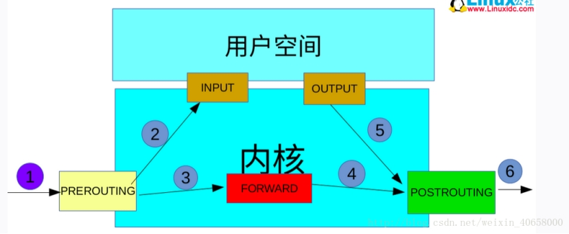

(1）理论基础：当主机收到一个数据包后，数据包先在内核空间中处理，若发现目的地址是自身，则传到用户空间中交给对应的应用程序处理，若发现目的不是自身，则会将包丢弃或进行转发。

 

(2）iptables实现防火墙功能的原理是：在数据包经过内核的过程中有五处关键地方，分别是PREROUTING、INPUT、OUTPUT、FORWARD、POSTROUTING，称为钩子函数，iptables这款用户空间的软件可以在这5处地方写规则，对经过的数据包进行处理，规则一般的定义为“如果数据包头符合这样的条件，就这样处理数据包”。

iptables中定义有表，分别表示提供的功能，有filter表（实现包过滤）、nat表（实现网络地址转换）、mangle表（实现包修改）、raw表（实现数据跟踪），这些表具有一定的优先级：raw–>mangle–>nat–>filter

下面是数据包流向图：

 

数据包先经过PREOUTING，由该链确定数据包的走向：

 

1 目的地址是本地，则发送到INPUT，让INPUT决定是否接收下来送到用户空间，流程为①--->②;

2 若满足PREROUTING的nat表上的转发规则，则发送给FORWARD，然后再经过POSTROUTING发送出去，流程为： ①--->③--->④--->⑥

3 主机发送数据包时，流程则是⑤--->⑥

 