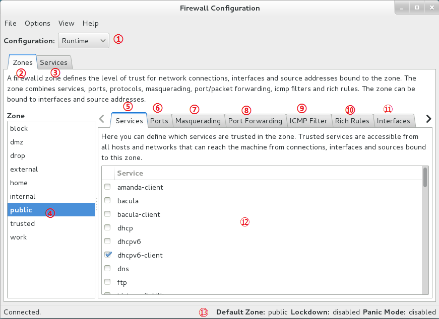
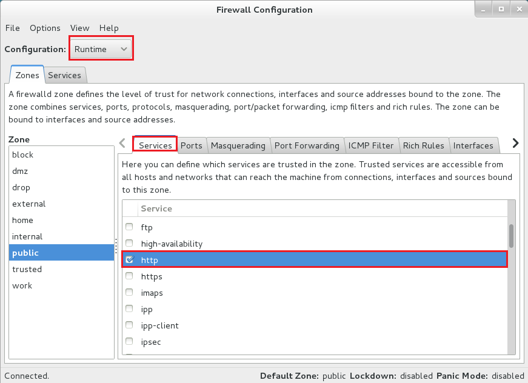
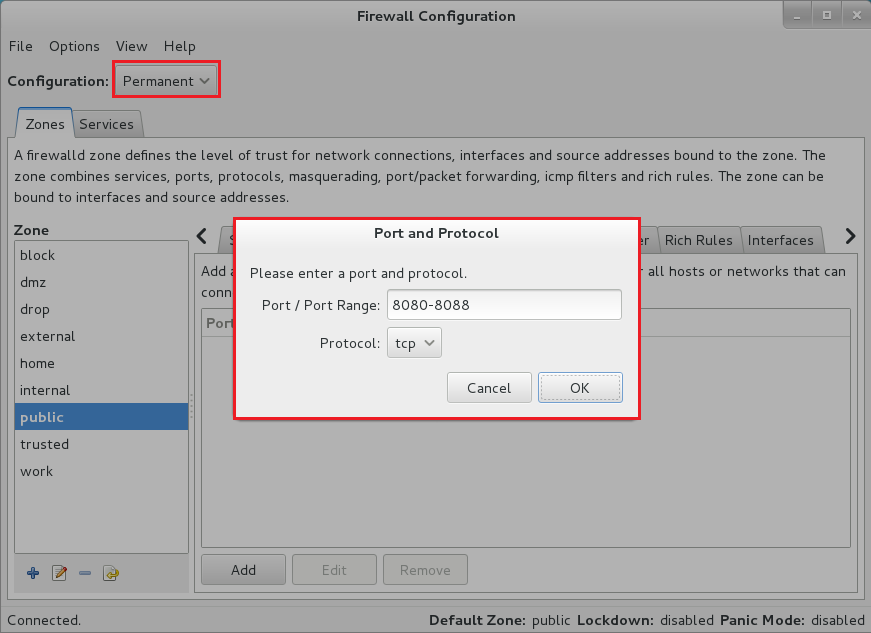
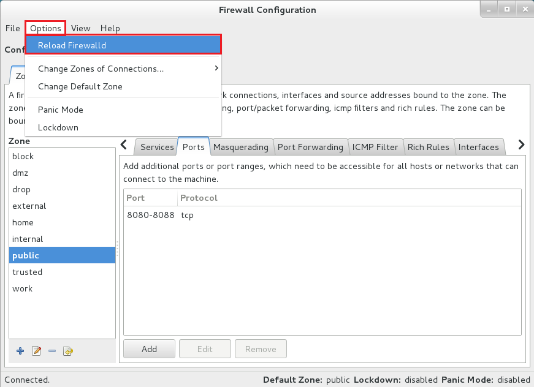
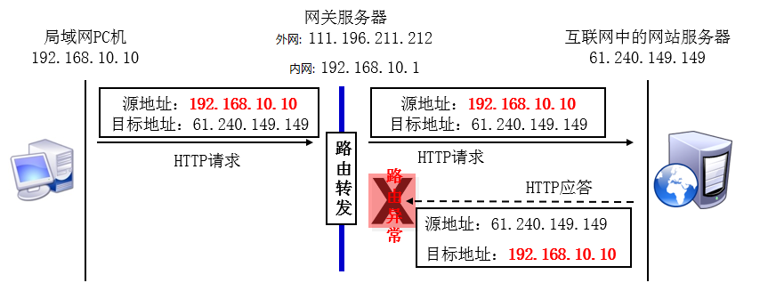
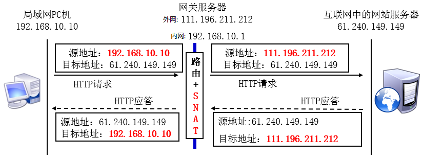
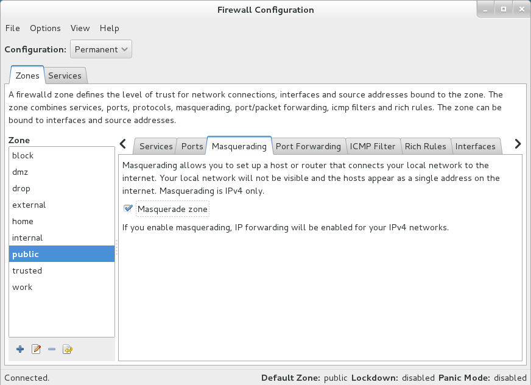
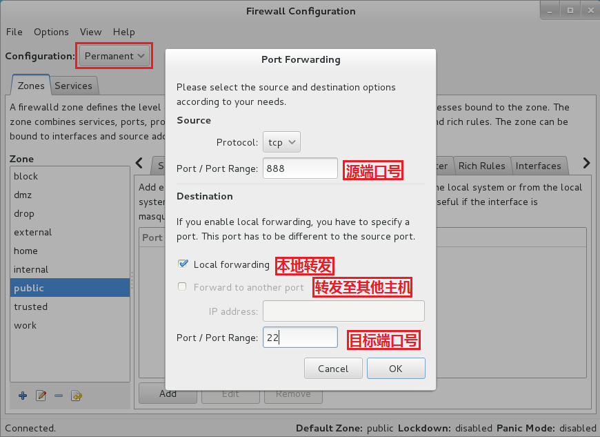
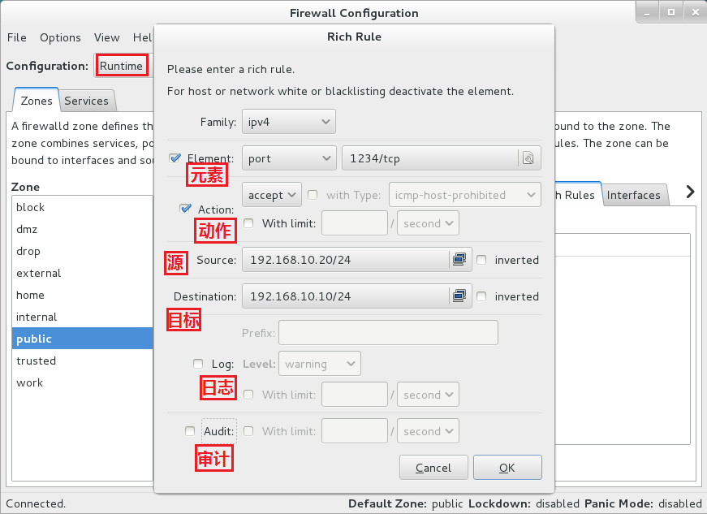
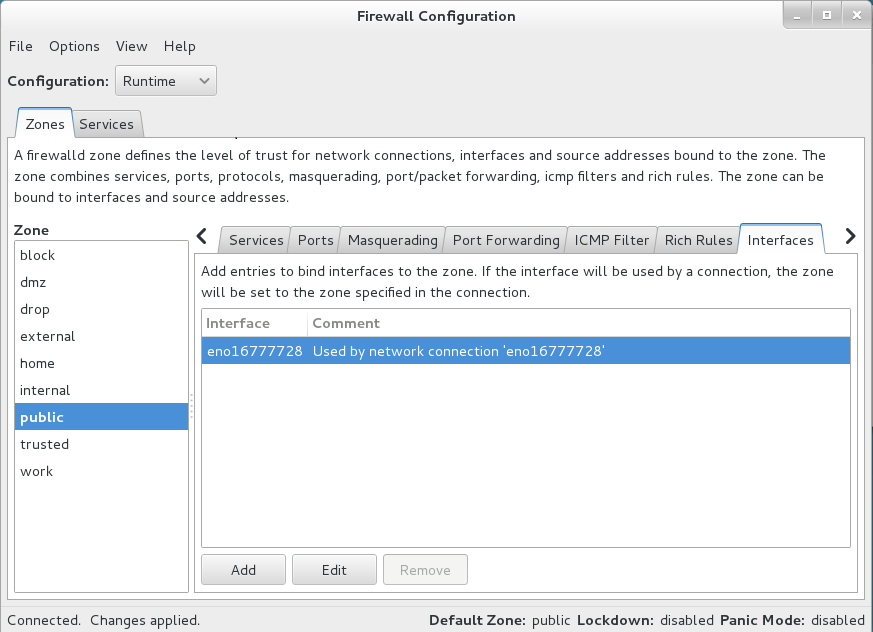

# [iptables和firewalld防火墙总结（史上最全）](https://www.cnblogs.com/wdp-home/p/11651855.html)

**防火墙管理工具**

 

保证数据的安全性是继可用性之后最为重要的一项工作，防火墙技术作为公网与内网之间的保护屏障，起着至关重要的作用。面对同学们普遍不了解在[红帽](http://www.linuxprobe.com/)RHEL7系统中新旧两款防火墙的差异，认识在[红帽](http://www.linuxprobe.com/)RHEL7系统中firewalld防火墙服务与iptables防火墙服务之间的关系，从理论和事实层面剖析真相。

本章节内将会分别使用iptables、firewall-cmd、firewall-config和Tcp_wrappers等防火墙策略配置服务来完成数十个根据真实工作需求而设计的防火墙策略配置实验，让同学们不仅能够熟练的对请求数据包流量进行过滤，还能够基于服务程序进行允许和关闭操作，做到保证[Linux系统](http://www.linuxprobe.com/)安全万无一失。

  保证数据安全性是继可用性之后最为重要的一项工作，众所周知外部公网相比企业内网更加的“罪恶丛生”，因此防火墙技术作为公网与内网之间的保护屏障，虽然有软件或硬件之分，但主要功能都是依据策略对外部请求进行过滤。防火墙技术能够做到监控每一个数据包并判断是否有相应的匹配策略规则，直到匹配到其中一条策略规则或执行默认策略为止，防火墙策略可以基于来源地址、请求动作或协议等信息来定制，最终仅让合法的用户请求流入到内网中，其余的均被丢弃。


图8-1 防火墙作为公网与内网之间的保护屏障

在红帽RHEL7系统中Firewalld服务取代了Iptables服务，对于接触[Linux](http://www.linuxprobe.com/)系统比较早或学习过红帽RHEL6系统的读者来讲，突然改用Firewalld服务后确实不免会有些抵触心理，或许会觉得Firewalld服务是一次不小的改变。但其实Iptables服务与Firewalld服务都不是真正的防火墙，它们都只是用来定义防火墙策略功能的“防火墙管理工具”而已，iptables服务会把配置好的防火墙策略交由内核层面的netfilter网络过滤器来处理，而firewalld服务则是把配置好的防火墙策略交由内核层面的nftables包过滤框架来处理。换句话说，当前在Linux系统中其实同时有多个防火墙管理工具共同存在，它们的作用都是为了方便运维人员管理Linux系统的防火墙策略，而咱们只要配置妥当其中一个就足够了。虽然各个工具之间各有优劣特色，但对于防火墙策略的配置思路上是保持一致的，同学们甚至可以不用完全掌握本章节内的知识，而是在这诸多个防火墙管理工具中任选一款来学透即可，完全能够满足日常的工作所需。

 Iptables

在较早期的Linux系统中想配置防火墙默认使用的都是iptables防火墙管理命令，而新型Firewalld防火墙管理服务已经被投入使用多年，但还记得刘遄老师在第0章0.6小节里谈到过企业不愿意及时升级的原因吧，于是不论出于什么样的原因，目前市场上还有大量的生产环境中在使用着iptables命令来管理着防火墙的规则策略。虽然明知iptables可能有着即将被“淘汰”的命运，但为了让同学们不必在面试时尴尬以及看完手中这本《Linux就该这么学》书籍后能“通吃”各个版本的Linux系统，刘遄老师觉得还是有必要把这一项技术好好卖力气讲一下，更何况各个工具的配置防火墙策略思路上大体一致，具有很高的相同性及借鉴意义。

策略与规则链

防火墙会从上至下来读取规则策略，一旦匹配到了合适的就会去执行并立即结束匹配工作，但也有转了一圈之后发现没有匹配到合适规则的时候，那么就会去执行默认的策略。因此对防火墙策略的设置无非有两种，一种是“通”，一种是“堵”——当防火墙的默认策略是拒绝的，就要设置允许规则，否则谁都进不来了，而如果防火墙的默认策略是允许的，就要设置拒绝规则，否则谁都能进来了，起不到防范的作用。

iptables命令把对数据进行过滤或处理数据包的策略叫做规则，把多条规则又存放到一个规则链中，规则链是依据处理数据包位置的不同而进行的分类，包括有：在进行路由选择前处理数据包（PREROUTING）、处理流入的数据包（INPUT）、处理流出的数据包（OUTPUT）、处理转发的数据包（FORWARD）、在进行路由选择后处理数据包（POSTROUTING）。从内网向外网发送的数据一般都是可控且良性的，因此显而易见咱们使用最多的就是INPUT数据链，这个链中定义的规则起到了保证私网设施不受外网骇客侵犯的作用。

比如您所居住的社区物业保安有两条规定——“禁止小商贩进入社区，各种车辆都需要登记”，这两条安保规定很明显应该是作用到了社区的正门（流量必须经过的地方），而不是每家每户的防盗门上。根据前面提到的防火墙策略的匹配顺序规则，咱们可以猜想有多种情况——比如来访人员是小商贩，则会被物业保安直接拒绝在大门外，也无需再对车辆进行登记，而如果来访人员是一辆汽车，那么因为第一条禁止小商贩策略就没有被匹配到，因而按顺序匹配到第二条策略，需要对车辆进行登记，再有如果来访的是社区居民，则既不满足小商贩策略，也不满足车辆登记策略，因此会执行默认的放行策略。

不过只有规则策略还不能保证社区的安全，物业保安还应该知道该怎么样处理这些被匹配到的流量，比如包括有“允许”、“登记”、“拒绝”、“不理他”，这些动作对应到iptables命令术语中是ACCEPT（允许流量通过）、LOG（记录日志信息）、REJECT（拒绝流量通过）、DROP（拒绝流量通过）。允许动作和记录日志工作都比较好理解，着重需要讲解的是这两条拒绝动作的不同点，其中REJECT和DROP的动作操作都是把数据包拒绝，DROP是直接把数据包抛弃不响应，而REJECT会拒绝后再回复一条“您的信息我已收到，但被扔掉了”，让对方清晰的看到数据被拒绝的响应。就好比说您有一天正在家里看电视，突然有人敲门，透过“猫眼”一看是推销商品的，咱们如果不需要的情况下就会直接拒绝他们（REJECT）。但如果透过“猫眼”看到的是债主带了几十个小弟来讨债，这种情况不光要拒绝开门，还要默不作声，伪装成自己不在家的样子（DROP），这就是两种拒绝动作的不同之处。

把Linux系统设置成REJECT拒绝动作策略后，对方会看到本机的端口不可达的响应：

```shell
[root@linuxprobe ~]# ping -c 4 192.168.10.10
PING 192.168.10.10 (192.168.10.10) 56(84) bytes of data.
From 192.168.10.10 icmp_seq=1 Destination Port Unreachable
From 192.168.10.10 icmp_seq=2 Destination Port Unreachable
From 192.168.10.10 icmp_seq=3 Destination Port Unreachable
From 192.168.10.10 icmp_seq=4 Destination Port Unreachable
--- 192.168.10.10 ping statistics ---
4 packets transmitted, 0 received, +4 errors, 100% packet loss, time 3002ms

```

把Linux系统设置成DROP拒绝动作策略后，对方会看到本机响应超时的提醒，无法判断流量是被拒绝，还是对方主机当前不在线：

```shell
[root@linuxprobe ~]# ping -c 4 192.168.10.10
PING 192.168.10.10 (192.168.10.10) 56(84) bytes of data.

--- 192.168.10.10 ping statistics ---
4 packets transmitted, 0 received, 100% packet loss, time 3000ms

```

基本的命令参数

iptables是一款基于命令行的防火墙策略管理工具，由于该命令是基于终端执行且存在有大量参数的，学习起来难度还是较大的，好在对于日常控制防火墙策略来讲，您无需深入的了解诸如“四表五链”的理论概念，只需要掌握常用的参数并做到灵活搭配即可，以便于能够更顺畅的胜任工作所需。iptables命令可以根据数据流量的源地址、目的地址、传输协议、服务类型等等信息项进行匹配，一旦数据包与策略匹配上后，iptables就会根据策略所预设的动作来处理这些数据包流量，另外再来提醒下同学们防火墙策略的匹配顺序规则是从上至下的，因此切记要把较为严格、优先级较高的策略放到靠前位置，否则有可能产生错误。下表中为读者们总结归纳了几乎所有常用的iptables命令参数，刘遄老师遵循《Linux就该这么学》书籍的编写初衷而设计了大量动手实验，让您无需生背硬记这些参数，可以结合下面的实例来逐个参阅即可。

| 参数        | 作用                                           |
| ----------- | ---------------------------------------------- |
| -P          | 设置默认策略:iptables -P INPUT (DROP\|ACCEPT)  |
| -F          | 清空规则链                                     |
| -L          | 查看规则链                                     |
| -A          | 在规则链的末尾加入新规则                       |
| -I num      | 在规则链的头部加入新规则                       |
| -D num      | 删除某一条规则                                 |
| -s          | 匹配来源地址IP/MASK，加叹号"!"表示除这个IP外。 |
| -d          | 匹配目标地址                                   |
| -i 网卡名称 | 匹配从这块网卡流入的数据                       |
| -o 网卡名称 | 匹配从这块网卡流出的数据                       |
| -p          | 匹配协议,如tcp,udp,icmp                        |
| --dport num | 匹配目标端口号                                 |
| --sport num | 匹配来源端口号                                 |

使用iptables命令-L参数查看已有的防火墙策略：

```shell
[root@linuxprobe ~]# iptables -L
Chain INPUT (policy ACCEPT)
target prot opt source destination 
ACCEPT all -- anywhere anywhere ctstate RELATED,ESTABLISHED
ACCEPT all -- anywhere anywhere 
INPUT_direct all -- anywhere anywhere 
INPUT_ZONES_SOURCE all -- anywhere anywhere 
INPUT_ZONES all -- anywhere anywhere 
ACCEPT icmp -- anywhere anywhere 
REJECT all -- anywhere anywhere reject-with icmp-host-prohibited
………………省略部分输出信息………………
```

使用iptables命令-F参数清空已有的防火墙策略：

```shell
[root@linuxprobe ~]# iptables -F
[root@linuxprobe ~]# iptables -L
Chain INPUT (policy ACCEPT)
target prot opt source destination 
………………省略部分输出信息………………
```

把INPUT链的默认策略设置为拒绝：

如前面所提到的防火墙策略设置无非有两种方式，一种是“通”，一种是“堵”，当把INPUT链设置为默认拒绝后，就要往里面写入允许策略了，否则所有流入的数据包都会被默认拒绝掉，同学们需要留意规则链的默认策略拒绝动作只能是DROP，而不能是REJECT。

```shell
[root@linuxprobe ~]# iptables -P INPUT DROP
[root@linuxprobe ~]# iptables -L
Chain INPUT (policy DROP)
target prot opt source destination 
…………省略部分输出信息………………
```

向INPUT链中添加允许icmp数据包流入的允许策略：

在日常运维工作中经常会使用到ping命令来检查对方主机是否在线，而向防火墙INPUT链中添加一条允许icmp协议数据包流入的策略就是默认允许了这种ping命令检测行为。

```shell
[root@linuxprobe ~]# ping -c 4 192.168.10.10
PING 192.168.10.10 (192.168.10.10) 56(84) bytes of data.

--- 192.168.10.10 ping statistics ---
4 packets transmitted, 0 received, 100% packet loss, time 3000ms
[root@linuxprobe ~]# iptables -I INPUT -p icmp -j ACCEPT
[root@linuxprobe ~]# ping -c 4 192.168.10.10
PING 192.168.10.10 (192.168.10.10) 56(84) bytes of data.
64 bytes from 192.168.10.10: icmp_seq=1 ttl=64 time=0.156 ms
64 bytes from 192.168.10.10: icmp_seq=2 ttl=64 time=0.117 ms
64 bytes from 192.168.10.10: icmp_seq=3 ttl=64 time=0.099 ms
64 bytes from 192.168.10.10: icmp_seq=4 ttl=64 time=0.090 ms
--- 192.168.10.10 ping statistics ---
4 packets transmitted, 4 received, 0% packet loss, time 2999ms
rtt min/avg/max/mdev = 0.090/0.115/0.156/0.027 ms
```

删除INPUT链中的那条策略，并把默认策略还原为允许：

```html
[root@linuxprobe ~]# iptables -D INPUT 1
[root@linuxprobe ~]# iptables -P INPUT ACCEPT
[root@linuxprobe ~]# iptables -L
Chain INPUT (policy ACCEPT)
target prot opt source destination
………………省略部分输出信息………………
```

设置INPUT链只允许指定网段访问本机的22端口，拒绝其他所有主机的数据请求流量：

防火墙策略是按照从上至下顺序匹配的，因此请一定要记得把允许动作放到拒绝动作上面，否则所有的流量就先被拒绝掉了，任何人都获取不到咱们的业务。文中提到的22端口是下面第9章节讲的ssh服务做占用的资源，刘遄老师在这里挖个小坑~等读者们稍后学完再回来验证这个实验效果吧~

```html
[root@linuxprobe ~]# iptables -I INPUT -s 192.168.10.0/24 -p tcp --dport 22 -j ACCEPT
[root@linuxprobe ~]# iptables -A INPUT -p tcp --dport 22 -j REJECT
[root@linuxprobe ~]# iptables -L
Chain INPUT (policy ACCEPT)
target prot opt source destination 
ACCEPT tcp -- 192.168.10.0/24 anywhere tcp dpt:ssh
REJECT tcp -- anywhere anywhere tcp dpt:ssh reject-with icmp-port-unreachable
………………省略部分输出信息………………
```

使用IP地址在192.168.10.0/24网段内的主机访问服务器的22端口：

```html
[root@Client A ~]# ssh 192.168.10.10
The authenticity of host '192.168.10.10 (192.168.10.10)' can't be established.
ECDSA key fingerprint is 70:3b:5d:37:96:7b:2e:a5:28:0d:7e:dc:47:6a:fe:5c.
Are you sure you want to continue connecting (yes/no)? yes
Warning: Permanently added '192.168.10.10' (ECDSA) to the list of known hosts.
root@192.168.10.10's password: 
Last login: Sun Feb 12 01:50:25 2017
[root@Client A ~]#
```

使用IP地址在192.168.20.0/24网段外的主机访问服务器的22端口：

```html
[root@Client B ~]# ssh 192.168.10.10
Connecting to 192.168.10.10:22...
Could not connect to '192.168.10.10' (port 22): Connection failed.
```

向INPUT链中添加拒绝所有人访问本机12345端口的防火墙策略：

```html
[root@linuxprobe ~]# iptables -I INPUT -p tcp --dport 12345 -j REJECT
[root@linuxprobe ~]# iptables -I INPUT -p udp --dport 12345 -j REJECT
[root@linuxprobe ~]# iptables -L
Chain INPUT (policy ACCEPT)
target prot opt source destination 
REJECT udp -- anywhere anywhere udp dpt:italk reject-with icmp-port-unreachable
REJECT tcp -- anywhere anywhere tcp dpt:italk reject-with icmp-port-unreachable
ACCEPT tcp -- 192.168.10.0/24 anywhere tcp dpt:ssh
REJECT tcp -- anywhere anywhere tcp dpt:ssh reject-with icmp-port-unreachable
………………省略部分输出信息………………
```

向INPUT链中添加拒绝来自于指定192.168.10.5主机访问本机80端口（web服务）的防火墙策略：

```html
[root@linuxprobe ~]# iptables -I INPUT -p tcp -s 192.168.10.5 --dport 80 -j REJECT
[root@linuxprobe ~]# iptables -L
Chain INPUT (policy ACCEPT)
target prot opt source destination 
REJECT tcp -- 192.168.10.5 anywhere tcp dpt:http reject-with icmp-port-unreachable
REJECT udp -- anywhere anywhere udp dpt:italk reject-with icmp-port-unreachable
REJECT tcp -- anywhere anywhere tcp dpt:italk reject-with icmp-port-unreachable
ACCEPT tcp -- 192.168.10.0/24 anywhere tcp dpt:ssh
REJECT tcp -- anywhere anywhere tcp dpt:ssh reject-with icmp-port-unreachable
………………省略部分输出信息………………
```

向INPUT链中添加拒绝所有主机不能访问本机1000至1024端口的防火墙策略：

```cnblogs_code
[root@linuxprobe ~]# iptables -A INPUT -p tcp --dport 1000:1024 -j REJECT
[root@linuxprobe ~]# iptables -A INPUT -p udp --dport 1000:1024 -j REJECT
[root@linuxprobe ~]# iptables -L
Chain INPUT (policy ACCEPT)
target prot opt source destination 
REJECT tcp -- 192.168.10.5 anywhere tcp dpt:http reject-with icmp-port-unreachable
REJECT udp -- anywhere anywhere udp dpt:italk reject-with icmp-port-unreachable
REJECT tcp -- anywhere anywhere tcp dpt:italk reject-with icmp-port-unreachable
ACCEPT tcp -- 192.168.10.0/24 anywhere tcp dpt:ssh
REJECT tcp -- anywhere anywhere tcp dpt:ssh reject-with icmp-port-unreachable
REJECT tcp -- anywhere anywhere tcp dpts:cadlock2:1024 reject-with icmp-port-unreachable
REJECT udp -- anywhere anywhere udp dpts:cadlock2:1024 reject-with icmp-port-unreachable
………………省略部分输出信息………………
```


是不是还意犹未尽？但对于iptables防火墙管理命令的学习到此就可以结束了，考虑到以后防火墙的发展趋势，同学们只要能把上面的实例看懂看熟就可以完全搞定日常的iptables防火墙配置工作了。但请特别留意下，iptables命令配置的防火墙规则默认会在下一次重启时失效，所以如果您想让配置的防火墙策略永久的生效下去，还要执行一下保存命令：

```html
[root@linuxprobe ~]# service iptables save
iptables: Saving firewall rules to /etc/sysconfig/iptables: [ OK ]
```

>  

Firewalld

RHEL7是一个集合多款防火墙管理工具并存的系统，Firewalld动态防火墙管理器服务（Dynamic Firewall Manager of Linux systems）是目前默认的防火墙管理工具，同时拥有命令行终端和图形化界面的配置工具，即使是对[Linux命令](http://www.linuxprobe.com/)并不熟悉的同学也能快速入门。相比于传统的防火墙管理工具还支持了动态更新技术并加入了“zone区域”的概念，简单来说就是为用户预先准备了几套防火墙策略集合（策略模板），然后可以根据生产场景的不同而选择合适的策略集合，实现了防火墙策略之间的快速切换。例如咱们有一台笔记本电脑每天都要在办公室、咖啡厅和家里使用，按常理推断最安全的应该是家里的内网，其次是公司办公室，最后是咖啡厅，如果需要在办公室内允许文件共享服务的请求流量、回到家中需要允许所有的服务，而在咖啡店则是除了上网外不允许任何其他请求，这样的需求应该是很常见的，在以前只能频繁的进行手动设置，而现在只需要预设好zone区域集合，然后轻轻点击一下就可以切换过去了上百条策略了，极大的提高了防火墙策略的应用效率，常见的zone区域名称及应用可见下表（默认为public）：

| 区域     | 默认规则策略                                                 |
| -------- | ------------------------------------------------------------ |
| trusted  | 允许所有的数据包。                                           |
| home     | 拒绝流入的数据包，除非与输出流量数据包相关或是ssh,mdns,ipp-client,samba-client与dhcpv6-client服务则允许。 |
| internal | 等同于home区域                                               |
| work     | 拒绝流入的数据包，除非与输出流量数据包相关或是ssh,ipp-client与dhcpv6-client服务则允许。 |
| public   | 拒绝流入的数据包，除非与输出流量数据包相关或是ssh,dhcpv6-client服务则允许。 |
| external | 拒绝流入的数据包，除非与输出流量数据包相关或是ssh服务则允许。 |
| dmz      | 拒绝流入的数据包，除非与输出流量数据包相关或是ssh服务则允许。 |
| block    | 拒绝流入的数据包，除非与输出流量数据包相关。                 |
| drop     | 拒绝流入的数据包，除非与输出流量数据包相关。                 |

###### 查看防火墙状态

```dockerfile
firewall-cmd --state
```

###### 停止firewall

```r
systemctl stop firewalld.service
```

###### 开启

```dos
systemctl start firewalld.service
```

###### 禁止firewall开机启动

```bash
systemctl disable firewalld.service 
```

 

终端管理工具

命令行终端是一种极富效率的工作方式，firewall-cmd命令是Firewalld动态防火墙管理器服务的命令行终端。它的参数一般都是以“长格式”来执行的，但同学们也不用太过于担心，因为红帽RHEL7系统非常酷的支持了部分命令的参数补齐，也正好包括了这条命令，也就是说现在除了能够用Tab键来补齐命令或文件名等等内容，还可以用Tab键来补齐下列长格式参数啦（这点特别的棒）。

| 参数                          | 作用                                                   |
| ----------------------------- | ------------------------------------------------------ |
| --get-default-zone            | 查询默认的区域名称。                                   |
| --set-default-zone=<区域名称> | 设置默认的区域，永久生效。                             |
| --get-zones                   | 显示可用的区域。                                       |
| --get-services                | 显示预先定义的服务。                                   |
| --get-active-zones            | 显示当前正在使用的区域与网卡名称。                     |
| --add-source=                 | 将来源于此IP或子网的流量导向指定的区域。               |
| --remove-source=              | 不再将此IP或子网的流量导向某个指定区域。               |
| --add-interface=<网卡名称>    | 将来自于该网卡的所有流量都导向某个指定区域。           |
| --change-interface=<网卡名称> | 将某个网卡与区域做关联。                               |
| --list-all                    | 显示当前区域的网卡配置参数，资源，端口以及服务等信息。 |
| --list-all-zones              | 显示所有区域的网卡配置参数，资源，端口以及服务等信息。 |
| --add-service=<服务名>        | 设置默认区域允许该服务的流量。                         |
| --add-port=<端口号/协议>      | 允许默认区域允许该端口的流量。                         |
| --remove-service=<服务名>     | 设置默认区域不再允许该服务的流量。                     |
| --remove-port=<端口号/协议>   | 允许默认区域不再允许该端口的流量。                     |
| --reload                      | 让“永久生效”的配置规则立即生效，覆盖当前的。           |

 

如同其他的防火墙策略配置工具一样，Firewalld服务对防火墙策略的配置默认是当前生效模式（RunTime），配置信息会随着计算机重启而失效，如果想要让配置的策略一直存在，那就要使用永久生效模式（Permanent）了，方法就是在正常的命令中加入--permanent参数就可以代表针对于永久生效模式的命令了。但这个永久生效模式也有一个“不近人情”的特点，就是对它设置的策略需要重启后才能自动生效，如果想让配置的策略立即生效的话需要手动执行一下--reload参数。接下来具体实验的操作步骤并不难，一定要细心看刘遄老师到底是对Runtime还是Permanent模式的操作，否则就算是策略配置100%正确也不能达到预想的效果。

查看Firewalld服务当前所使用的zone区域：

```html
[root@linuxprobe ~]# firewall-cmd --get-default-zone
public
```

查询eno16777728网卡在Firewalld服务中的zone区域：

```html
[root@linuxprobe ~]# firewall-cmd --get-zone-of-interface=eno16777728
public
```

把Firewalld防火墙服务中eno16777728网卡的默认区域修改为external，重启后再生效：

```html
[root@linuxprobe ~]# firewall-cmd --permanent --zone=external --change-interface=eno16777728
success
[root@linuxprobe ~]# firewall-cmd --get-zone-of-interface=eno16777728
public
[root@linuxprobe ~]# firewall-cmd --permanent --get-zone-of-interface=eno16777728
external
```

把Firewalld防火墙服务的当前默认zone区域设置为public：

```html
[root@linuxprobe ~]# firewall-cmd --set-default-zone=public
success
[root@linuxprobe ~]# firewall-cmd --get-default-zone 
public
```

启动/关闭Firewalld防火墙服务的应急状况模式，阻断一切网络连接（当远程控制服务器时请慎用。）：

```html
[root@linuxprobe ~]# firewall-cmd --panic-on
success
[root@linuxprobe ~]# firewall-cmd --panic-off
success
```

查询在public区域中的ssh与https服务请求流量是否被允许：

```html
[root@linuxprobe ~]# firewall-cmd --zone=public --query-service=ssh
yes
[root@linuxprobe ~]# firewall-cmd --zone=public --query-service=https
no
```

把Firewalld防火墙服务中https服务的请求流量设置为永久允许，并当前立即生效：

```html
[root@linuxprobe ~]# firewall-cmd --zone=public --add-service=https
success
[root@linuxprobe ~]# firewall-cmd --permanent --zone=public --add-service=https
success
[root@linuxprobe ~]# firewall-cmd --reload
success
```

把Firewalld防火墙服务中http服务的请求流量设置为永久拒绝，并当前立即生效：

```bash
[root@linuxprobe ~]# firewall-cmd --permanent --zone=public --remove-service=http 
success
[root@linuxprobe ~]# firewall-cmd --reload 
success
```


把Firewalld防火墙服务中8080和8081的请求流量允许放行，但仅限当前生效：

```html
[root@linuxprobe ~]# firewall-cmd --zone=public --add-port=8080-8081/tcp
success
[root@linuxprobe ~]# firewall-cmd --zone=public --list-ports 
8080-8081/tcp
```

把原本访问本机888端口号的请求流量转发到22端口号，要求当前和长期均有效：

> 流量转发命令格式：firewall-cmd --permanent --zone=<区域> --add-forward-port=port=<源端口号>:proto=<协议>:toport=<目标端口号>:toaddr=<目标IP地址>

```html
[root@linuxprobe ~]# firewall-cmd --permanent --zone=public --add-forward-port=port=888:proto=tcp:toport=22:toaddr=192.168.10.10
success
[root@linuxprobe ~]# firewall-cmd --reload
success
```

在客户机使用ssh命令尝试访问192.168.10.10主机的888端口：

```html
[root@client A ~]# ssh -p 888 192.168.10.10
The authenticity of host '[192.168.10.10]:888 ([192.168.10.10]:888)' can't be established.
ECDSA key fingerprint is b8:25:88:89:5c:05:b6:dd:ef:76:63:ff:1a:54:02:1a.
Are you sure you want to continue connecting (yes/no)? yes
Warning: Permanently added '[192.168.10.10]:888' (ECDSA) to the list of known hosts.
root@192.168.10.10's password:此处输入远程root用户的密码
Last login: Sun Jul 19 21:43:48 2017 from 192.168.10.10
```

在Firewalld防火墙服务中配置一条富规则，拒绝所有来自于192.168.10.0/24网段的用户访问本机ssh服务（22端口）：

```perl
[root@linuxprobe ~]# firewall-cmd --permanent --zone=public --add-rich-rule="rule family="ipv4" source address="192.168.10.0/24" service name="ssh" reject"
success
[root@linuxprobe ~]# firewall-cmd --reload
success
```


在客户机使用ssh命令尝试访问192.168.10.10主机的ssh服务（22端口）：

```perl
[root@client A ~]# ssh 192.168.10.10
Connecting to 192.168.10.10:22...
Could not connect to '192.168.10.10' (port 22): Connection failed.
```


图形管理工具

纵观Linux系统发展历程，实在少有能如此让刘遄老师欣慰并推荐的图形化工具，firewall-config命令是管理Firewalld防火墙策略的图形化工具，界面和操作都颇为出人意料，几乎可以实现所有命令行终端的操作，可以毫不夸张的说，即使初学者没有扎实的Linux命令基础，也一样可以通过这款图形化工具配置好RHEL7系统的防火墙策略。Firewalld防火墙图形化的界面如图8-2所示，功能分别为1:选择"当前立即生效（Runtime）"或"重启后长期生效(Permanent)"配置、2:可选策略集合区域列表、3:常用系统服务列表、4:当前正在使用的区域、5:管理当前被选中区域中的服务、6:管理当前被选中区域中的端口、7:开启或关闭SNAT（伪装）技术、8:设置端口转发策略、9:控制ICMP协议请求流量、10:管理防火墙的富规则、11:管理网卡设备、12:被选中区域的服务，前面有√的表示允许放行、13:Firewalld防火墙图形化工具的状态。



图8-2 Firewall-config图形化工具首界面

刘遄老师再啰嗦提醒一下，这款Firewall-config图形化管理工具在配置策略后，您不需要点击保存或完成按钮，只要有修改内容工具就会自动保存好。例如咱们先来动手试一试把当前区域中http服务的请求流量允许放行吧，但仅限当前生效，如图8-3所示：



图8-3 配置防火墙策略允许http服务的请求流量数据

咱们尝试添加一条允许放行8080-8088端口号（tcp协议）入站请求数据的策略，并且把配置模式提前设置为永久长期生效，以达到重启后依然生效的目的，配置过程如图8-4所示，并且可以如图8-5所示，在菜单中点击Reload Firewalld选项，来让配置文件立即生效，这与在命令行终端中执行了--reload参数的效果是一样的。



图8-4 配置防火墙策略允许8080-8088端口号的请求流量数据



图8-5 让防火墙永久生效策略配置信息立即生效

SNAT源地址转换协议是为了解决IP地址资源匮乏问题而设计的技术协议，SNAT技术能够使得多个内网用户通过一个外网IP地址上网。例如当您通过家中的网关设备（无线路由器等）访问了《Linux就该这么学》书籍网站的时候，实际上就已经经过SNAT技术处理了，这项技术的应用非常广泛，甚至可以说每个人每天都在使用中，但原先咱们仅仅是使用者，或许只是没有察觉到而已。如图8-6所示，在一个局域网中有多台主机，如果网关之上没有经过SNAT处理，那么请求过后的回复数据包就不能在互联网中找到这个私网IP地址，所以用户也就不能顺利取得想要的资源了，但是在如图8-7所示的拓扑中，因使用了SNAT源地址转换技术，服务器应答后先由网关服务器接收，再分发给内网的用户主机，从而使得用户顺利的拿到了所需资源。



图8-6 没有使用SNAT技术的网络



图8-7 使用SNAT技术处理过的网络

使用iptables命令做SNAT源地址转换是一件很麻烦的事情，但在Firewalld防火墙图形化工具中只需要按照如图8-8所示，点击开启伪装区域技术就自动开启了SNAT源地址转换技术，具体效果会在第16章节中来验证。



图8-8 开启防火墙的SNAT（伪装）技术

刘遄老师尽量做“刚刚讲过的实验”，这样以便于让同学们直观的看到不同工具实现相同功能时候的区别，例如图8-9和图8-10所示可以把所有向本机888端口请求的流量转发到22端口上，然后让防火墙配置策略当前及重启后都生效。另外firewall-config图形管理工具真的非常实用，很多原本复杂的长命令被用图形化按钮替代，设置规则也变得简单了，日常工作中真的非常实用。所以有必要再次跟读者们讲清配置防火墙策略的原则——只要能实现需求的功能，无论用文本管理工具还是图形管理工具都是可以的。



图8-9 配置本地的端口转发


图8-10 让防火墙永久生效策略配置信息立即生效

在Firewalld中的“富规则”代表着更细致、更详细的策略配置方法，咱们可以针对某个系统服务、端口号、来源地址、目的地址等诸多元素进行有针对性的策略配置，富规则策略的优先级是在策略中最高的。例如如图8-11所示可以让192.168.10.20的主机能够访问到本机的1234端口号。



图8-11 配置防火墙富规则策略

当然~如果生产环境中有多块网卡在同时提供着服务（这种情况很常见），自然对内网和对外网的网卡要选择的防火墙策略区域也不应是一样的，可以如图8-12所示把网卡与防火墙策略zone区域做绑定，这样对不同网卡来源的请求流量进行不同策略区域的有针对性监控，效果会更好哦~



图8-12 把网卡与防火墙zone区域做绑定

服务的访问控制列表

Tcp_wrappers是红帽RHEL7系统中默认已经启用的一款流量监控程序，它能够根据来访主机地址与本机目标服务程序做允许或拒绝操作。换句话说，Linux系统中其实有两个层面的防火墙，第一种是前面讲到的基于TCP/IP协议的流量过滤防护工具，而Tcp_wrappers服务则是能够对系统服务进行允许和禁止的防火墙，从而在更高层面保护了Linux系统的安全运行。控制列表文件修改后会立即生效，系统将会先检查允许策略规则文件（/etc/hosts.allow），如果匹配到相应的允许策略则直接放行请求，如果没有匹配则会去进一步匹配拒绝策略规则文件（/etc/hosts.deny）的内容，有匹配到相应的拒绝策略就会直接拒绝该请求流量，如果两个文件全都没有匹配到的话也会默认放行这次的请求流量。配置服务的参数并不复杂，如下表中就已经列出了几乎所有常见的情况：

| 客户端类型     | 示例                       | 满足示例的客户端列表                 |
| -------------- | -------------------------- | ------------------------------------ |
| 单一主机       | 192.168.10.10              | IP地址为192.168.10.10的主机。        |
| 指定网段       | 192.168.10.                | IP段为192.168.10.0/24的主机。        |
| 指定网段       | 192.168.10.0/255.255.255.0 | IP段为192.168.10.0/24的主机。        |
| 指定DNS后缀    | .linuxprobe.com            | 所有DNS后缀为.linuxprobe.com的主机   |
| 指定主机名称   | www.linuxprobe.com         | 主机名称为www.linuxprobe.com的主机。 |
| 指定所有客户端 | ALL                        | 所有主机全部包括在内。               |

 

在正式配置Tcp_wrappers服务前有两点原则必须要提前讲清楚，第一，在写禁止项目的时候一定要写上的是服务名称，而不是某种协议的名称，第二，推荐先来编写拒绝规则，这样可以比较直观的看到相应的效果。例如先来通过拒绝策略文件禁止下所有访问本机sshd服务的请求数据吧（无需修改原有的注释信息）：

```html
[root@linuxprobe ~]# vim /etc/hosts.deny
#
# hosts.deny This file contains access rules which are used to
# deny connections to network services that either use
# the tcp_wrappers library or that have been
# started through a tcp_wrappers-enabled xinetd.
#
# The rules in this file can also be set up in
# /etc/hosts.allow with a 'deny' option instead.
#
# See 'man 5 hosts_options' and 'man 5 hosts_access'
# for information on rule syntax.
# See 'man tcpd' for information on tcp_wrappers
sshd:*
[root@linuxprobe ~]# ssh 192.168.10.10
ssh_exchange_identification: read: Connection reset by peer
```

接下来在允许策略文件中添加放行所有来自于192.168.10.0/24这个网段访问本机sshd服务请求的策略，咱们的服务器马上就允许了访问sshd服务的请求，效果非常直观：

```html
[root@linuxprobe ~]# vim /etc/hosts.allow
#
# hosts.allow This file contains access rules which are used to
# allow or deny connections to network services that
# either use the tcp_wrappers library or that have been
# started through a tcp_wrappers-enabled xinetd.
#
# See 'man 5 hosts_options' and 'man 5 hosts_access'
# for information on rule syntax.
# See 'man tcpd' for information on tcp_wrappers
sshd:192.168.10.

[root@linuxprobe ~]# ssh 192.168.10.10
The authenticity of host '192.168.10.10 (192.168.10.10)' can't be established.
ECDSA key fingerprint is 70:3b:5d:37:96:7b:2e:a5:28:0d:7e:dc:47:6a:fe:5c.
Are you sure you want to continue connecting (yes/no)? yes
Warning: Permanently added '192.168.10.10' (ECDSA) to the list of known hosts.
root@192.168.10.10's password: 
Last login: Wed May 4 07:56:29 2017
[root@linuxprobe ~]# 
```