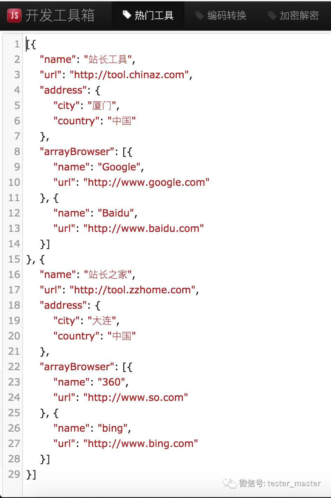

# jq简介

jq可以**对json数据进行分片、过滤、映射和转换**，和sed、awk、grep等命令一样，都可以让你轻松地把玩文本。它能轻松地把你拥有的数据转换成你期望的格式，而且需要写的程序通常也比你期望的更加简短。

jq是**用C编写，没有运行时依赖，所以几乎可以运行在任何系统上**。预编译的二进制文件可以直接在Linux、OS X和windows系统上运行，当然在linux和OS X系统你需要赋与其可执行权限；在linux系统中也可以直接用yum安装。
 下载页面：
 [https://stedolan.github.io/jq/download/](https://link.jianshu.com?t=https://stedolan.github.io/jq/download/)

在知道jq命令之前，我在linux系统中极少直接去命令去处理json数据，除非只是简单地从中过滤某个字符串，那就用grep结合正则表达式来解决。所以，掌握了jq命令，则**可以让linux命令和shell脚本在处理json数据时变得得心应手**。

# jq简明教程

## 例子文件

为了便于演示jq的功能，我们在文件json.txt中保存如下内容：

```css
# cat json.txt 
```

```json
[{"name":"站长工具","url":"http://tool.chinaz.com","address":{"city":"厦门","country":"中国"},"arrayBrowser":[{"name":"Google","url":"http://www.google.com"},{"name":"Baidu","url":"http://www.baidu.com"}]},{"name":"站长之家","url":"http://tool.zzhome.com","address":{"city":"大连","country":"中国"},"arrayBrowser":[{"name":"360","url":"http://www.so.com"},{"name":"bing","url":"http://www.bing.com"}]}]
```

为了让你理解文件中的内容，对比jq的效果，在json解析工具中显示为：



## "."

**最简单的jq程序是表达式"."**，它不改变输入，但可以将其优美地输出，便于阅读和理解。

```bash
cat json.txt | jq '.'
```

```json
[
  {
    "name": "站长工具",
    "url": "http://tool.chinaz.com",
    "address": {
      "city": "厦门",
      "country": "中国"
    },
    "arrayBrowser": [
      {
        "name": "Google",
        "url": "http://www.google.com"
      },
      {
        "name": "Baidu",
        "url": "http://www.baidu.com"
      }
    ]
  },
  {
    "name": "站长之家",
    "url": "http://tool.zzhome.com",
    "address": {
      "city": "大连",
      "country": "中国"
    },
    "arrayBrowser": [
      {
        "name": "360",
        "url": "http://www.so.com"
      },
      {
        "name": "bing",
        "url": "http://www.bing.com"
      }
    ]
  }
]
```

## [index]

输出列表中的第一个元素，可以使用[index]：

```bash
cat json.txt | jq '.[0]'
```

```json
{
  "name": "站长工具",
  "url": "http://tool.chinaz.com",
  "address": {
    "city": "厦门",
    "country": "中国"
  },
  "arrayBrowser": [
    {
      "name": "Google",
      "url": "http://www.google.com"
    },
    {
      "name": "Baidu",
      "url": "http://www.baidu.com"
    }
  ]
}
```

## 管道线|

jq支持管道线`|`，它如同linux命令中的管道线——把前面命令的输出当作是后面命令的输入。如下命令把`.[0]`作为`{...}`的输入，进而访问嵌套的属性，如`.name`和`.address.city`。

观察如下几个命令，通过改变`|`前后的输入和输出来达到不同的效果：

```bash
cat json.txt | jq '.[0] | {name:.name,city:.address.city}'
```

```json
{
  "name": "站长工具",
  "city": "厦门"
}
```


```bash
cat json.txt | jq '.[0] | {name:.arrayBrowser[1].name,city:.address.city}'
```

```json
{
  "name": "Baidu",
  "city": "厦门"
}
```


```bash
cat json.txt | jq ".[] | {name:.arrayBrowser[1].name,city:.address.city}"
```

```json
{
  "name": "Baidu",
  "city": "厦门"
}
{
  "name": "bing",
  "city": "大连"
}
```

## [ ]

如果希望把jq的输出当作一个数组，可以在前后加上`[]`：

```bash
cat json.txt | jq "[ .[] | {name:.arrayBrowser[1].name,city:.address.city} ]"
```

```json
[
  {
    "name": "Baidu",
    "city": "厦门"
  },
  {
    "name": "bing",
    "city": "大连"
  }
]
```

## 自定义key

在{}中，冒号前面的名字是映射的名称，你可以任意修改，如：

```bash
cat json.txt | jq "[.[] | {name_001:.arrayBrowser[1].name,city_002:.address.city}]"
```

```json
[
  {
    "name_001": "Baidu",
    "city_002": "厦门"
  },
  {
    "name_001": "bing",
    "city_002": "大连"
  }
]
```

