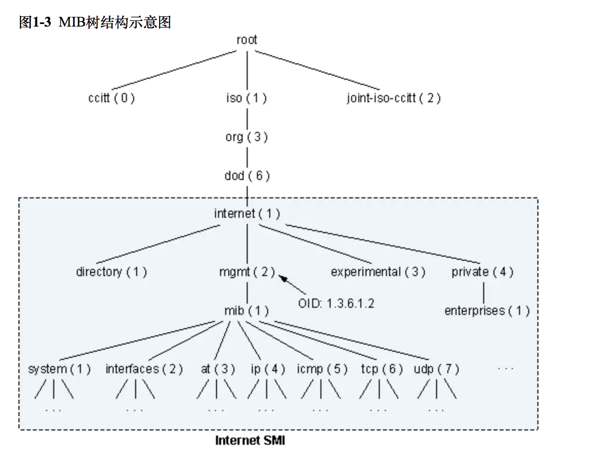
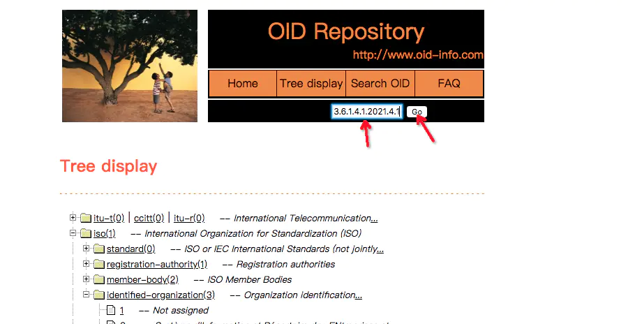
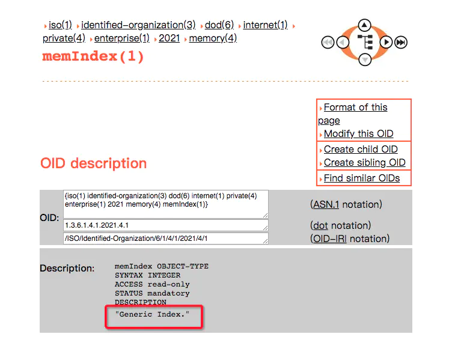
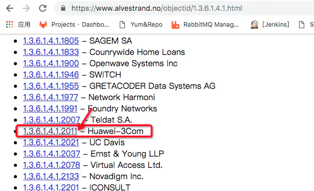
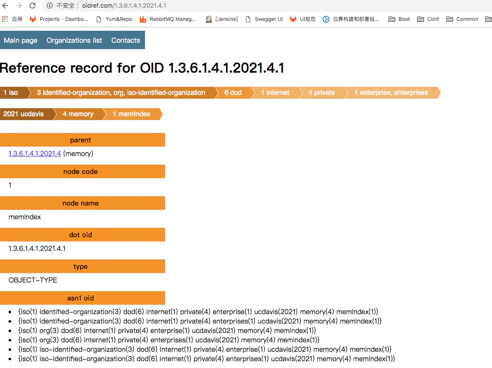
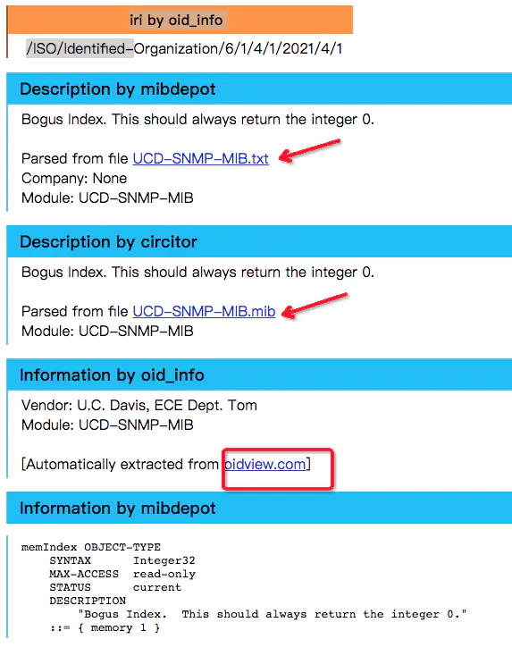
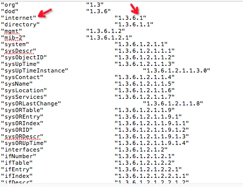
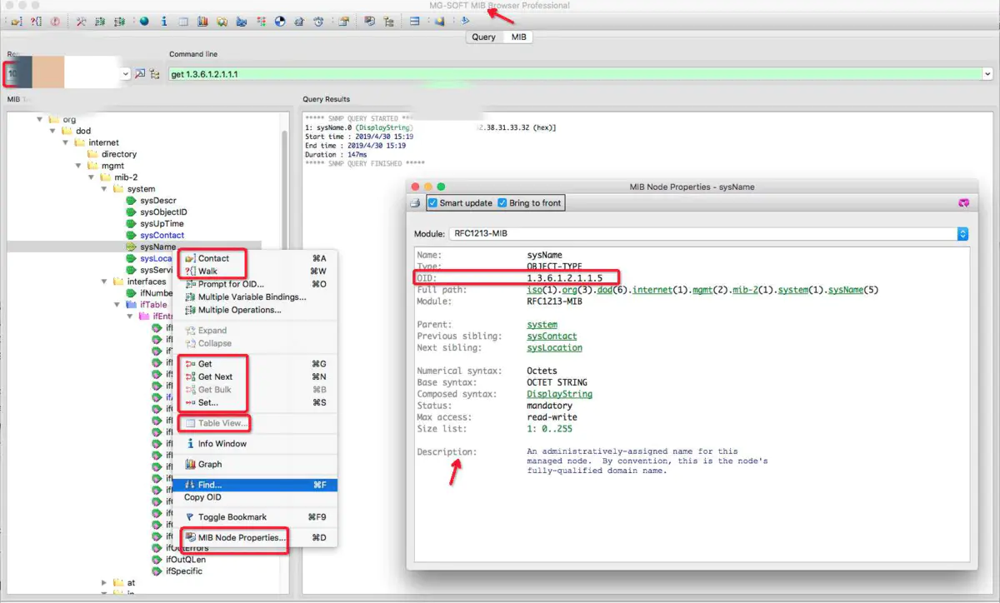

https://www.jianshu.com/p/9c7ca0807cd1

SNMP OID信息深入挖掘

前提：对SNMP有一定的基础了解，本文主要是深入挖掘OID的更多细节

目的：通过SNMP协议定义的OID获取不同厂商的设备信息，给程序定义使用，自动获取不同设备的信息

相关：（1）Ansible部分获取设备信息的模块底层就是通过SNMP协议来实现

  （2）如果对PCIe设备有一定了解的话，OID的组织架构与PCIe的组织框架是一脉相承的，可以类比理解和学习

  （3）设备一般支持多种对外提供信息的协议和通道，例如：IPMI、SSH 、SNMP、Redfish、HTTPS（WEB），SNMP只是其中获取信息的一种通道

内容：

- MIB树结构示意图，理解SNMP的SMI结构设置

- OID信息查看：e.g.: 查看特定厂商的内容索引信息（此外2021代表Huawei）
1.3.6.1.4.1.2021.4.1（Full path: iso(1).org(3).dod(6).internet(1).private(4).enterprises(1).ucdavis(2021).memory(4).memIndex(1)）

- 通过OID在公网上查看信息：

（1）查看OID公网：http://www.oid-info.com/cgi-bin/display?tree=1.3.6.1

（2）查看具体OID信息：

​                                                     通过OID检索

​                                             检索特定OID结果

（3）查看不同厂商的OID代号：https://www.alvestrand.no/objectid/1.3.6.1.4.1.html

（4）通过OID查看更详情的信息：url: http://oidref.com/OID (e.g.: http://oidref.com/1.3.6.1.4.1.2021.4.1)

​                                            OID详情

​                                                       OID所属MIB下载

（5）下载不同厂商的MIB包：http://www.oidview.com/mibs/厂商代号/MIB包名称.html（e.g.: http://www.oidview.com/mibs/2021/UCD-SNMP-MIB.html）

- 本地环境生成所有名称与OID的对应表：snmptranslate -Tz -m ALL > OID_List.txt

​                                                           名称与OID一一对应

- 可以通过MIB Browser 查看OID信息：(需要提前导入各厂商的MIB包并进行编译)

​                  OID的信息和支持的操作