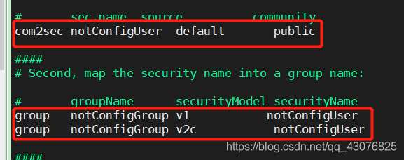
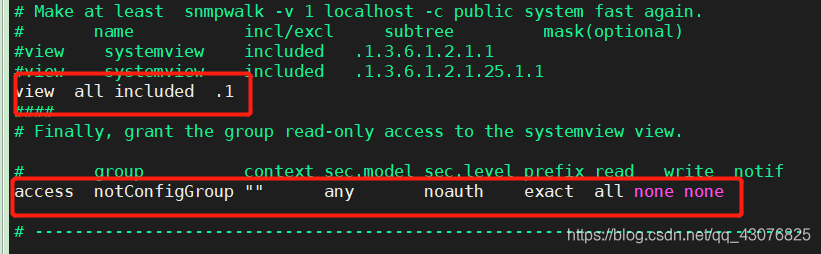
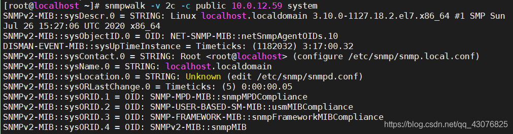
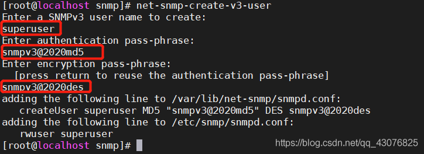
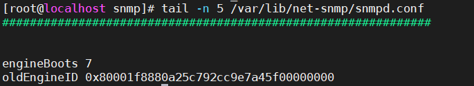
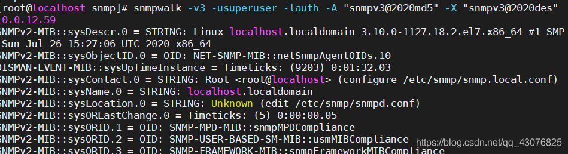
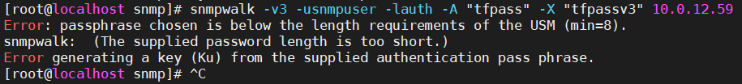

1、安装snmp

1、centos7 + yum安装

yum -y install net-snmp net-snmp-utils

2、更改配置文件 snmpd.conf

vim /etc/snmp/snmpd.conf

添加社区为public，名为notConfigUser

重启(每次修改完配置文件都需要重启)

systemctl restart snmpd

3、测试

1、查看tcp、udp端口开放

netstat -tulnp

查询主机信息

snmpwalk -v 2c -c public 10.0.12.59 system

出现如下内容代表成功

2、设置v3

1、停掉服务

systemctl stop snmpd

2、设置

net-snmp-create-v3-user

建议密码设置长一点，不然会设置失败

tail -n 5 /var/lib/net-snmp/snmpd.conf

3、验证

snmpwalk -v 3 -u superuser -l auth -A "snmpv3@2020md5" -X "snmpv3@2020des" 10.0.12.59

-A 设置身份验证协议密码短语

-X 设置隐私协议（DES|AES）

-l 设置安全级别 （noAuthNoPriv|authNoPriv|authPriv）

如出现如下报错，证明设置失败，原因可能是密码设置太短

需要重新设置密码

3、python实现snmp服务

https://blog.csdn.net/weixin_30550287/article/details/116887972?utm_medium=distribute.pc_relevant.none-task-blog-2~default~baidujs_baidulandingword~default-0-116887972-blog-115303007.pc_relevant_recovery_v2&spm=1001.2101.3001.4242.1&utm_relevant_index=3