# **Weblogic构建jms服务**

 

不仅Activemq提供的jms服务，Weblogic也提供了jms服务，很多项目是部署在Weblogic中，使用其提供的jms服务也是很多企业的选择，一直没亲手试过，今天试了下，遇到的小问题还挺多，看来眼过百变不如手过一遍，下面就记录下操作步骤。构建完成后还会实现个小例子来测试下，这里主要进行点对点模式构建。

Weblogic构建jms服务基本都是下面四个步骤（假设域已建好）：

\1. 新建jms服务器

\2. 新建jms模块

\3. 新建子部署

\4. 新建资源

首先要登录Weblogic控制台（版本为weblogic 10），http://localhost:9080/console/

 

一、**新建jms服务器**
左侧域结构->服务->消息传送->jms服务器

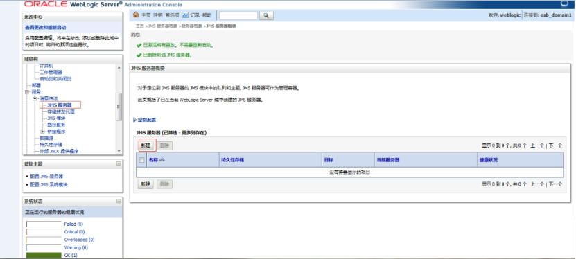 

点击【新建】，弹出下面页面，开始填写信息，这里给jms服务器起名为JMSServer-0（默认的）

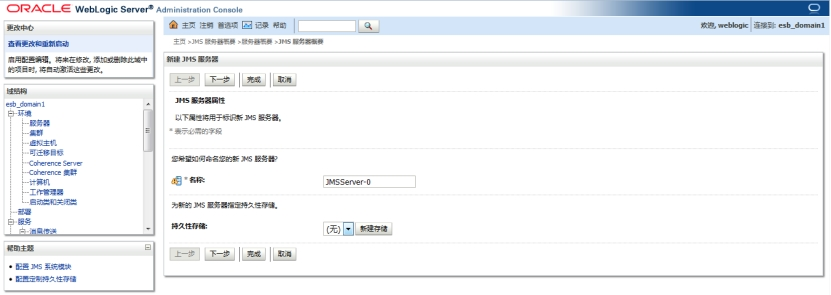 

点击【下一步】，目标那选择当前服务器（AdminServer）

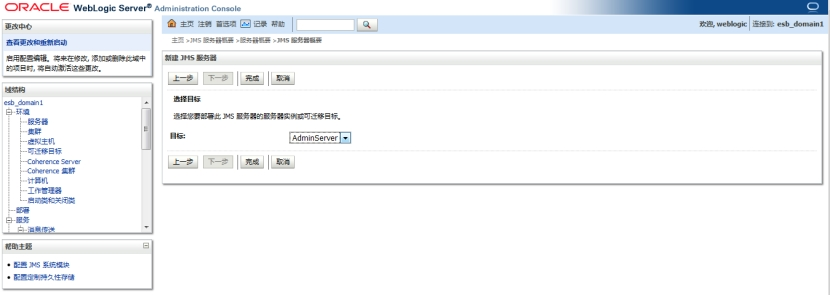 

点击完成
**二、新建jms模块**
早期weblogic可以不用构建jms模块直接新建jms连接工厂，队列等，新版本采用jms模块来组织jms连接工厂等。
左侧域结构->服务->消息传送->jms模块

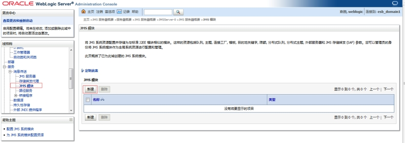 

点击【新建】按钮，填写名称，这里为SystemModule-0

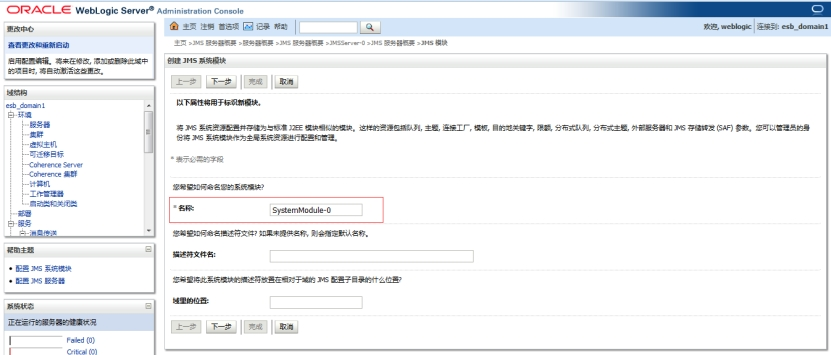 

点击【下一步】，勾选要部署的服务器AdminServer

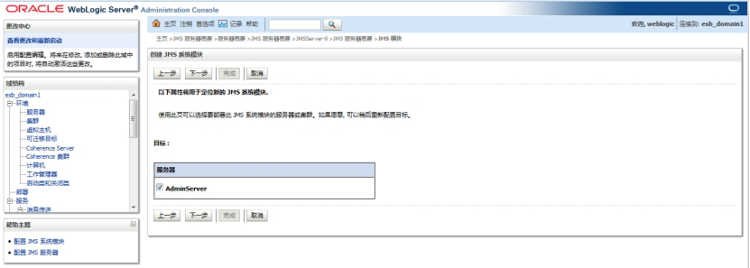 

点击【下一步】

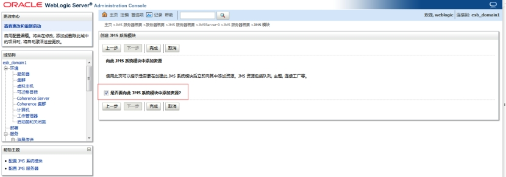 

这个页面中有一项“是否要向此jms模块中添加资源”，这个勾不勾选都可以，勾选的话在完成jms模块配置后可以立即配置资源（连接工厂，队列等），不勾选也可以稍后再配。勾选后进人下面界面：

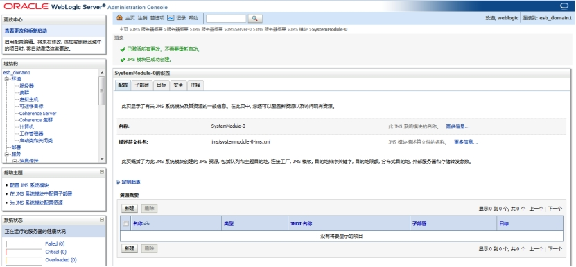 

三、新建子部署

子部署是一个很让我困惑的概念，感觉有很多实际的项目中并不需要建子部署，在网上也没有找到解释子部署这一概念的，在《经典java EE企业应用实战》这本书中找到了相关的说明。

jms模块采用子部署管理其内部资源定位，可看做是一种便捷的管理方式。我们常看到需要将某个组件、服务部署到某个服务器实例上，而此处的子部署就相当于多个服务器的集合，当把某个服务、组件部署到指定子部署时，这就意味着该服务、组件将被同时部署到所对应的全部服务器实例上。

 

点击新建的模块，进人后看到tab页上有子部署，点击进入

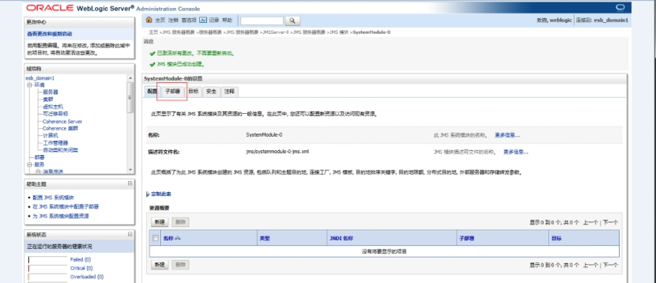 

点击【新建】按钮，弹出下面页面，新部署起名为testQueue

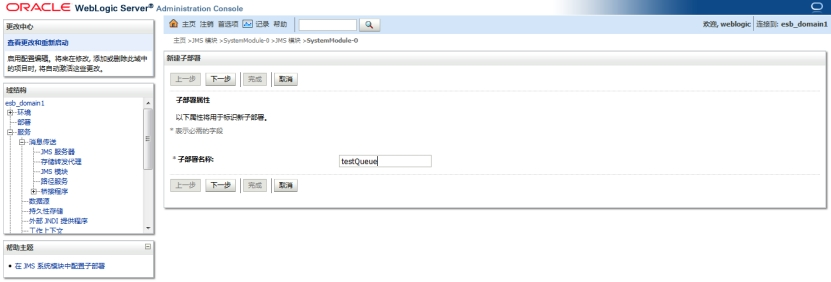 

点击下一步后，选择目标，勾选刚才新建的jms服务器，不要勾选AdminServer

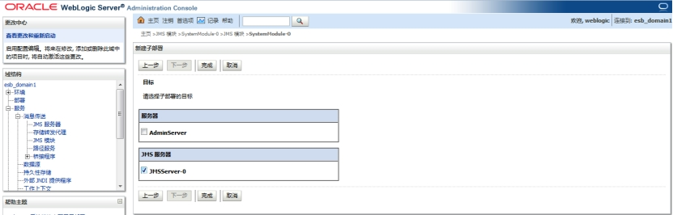 

点击完成，子部署配置结束。

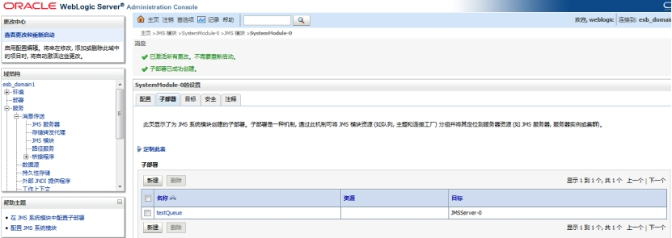 

四、**新建资源–队列**
点击模块进人后，下方有资源概要，如下图，

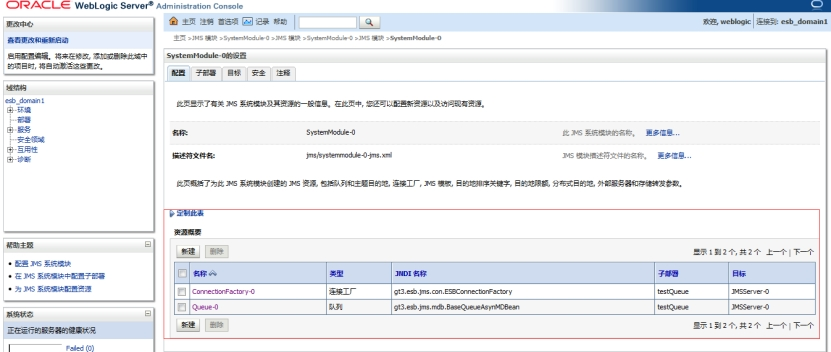 

点击【新建】，进人下面界面，可以建连接工厂和队列、主题等

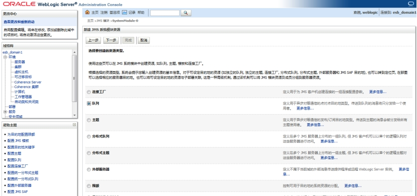 

勾选队列，点击下一步，填写名称和jndi名称，这样设置jndi名称为gt3.esb.jms.mdb.BaseQueueAsynMDBean

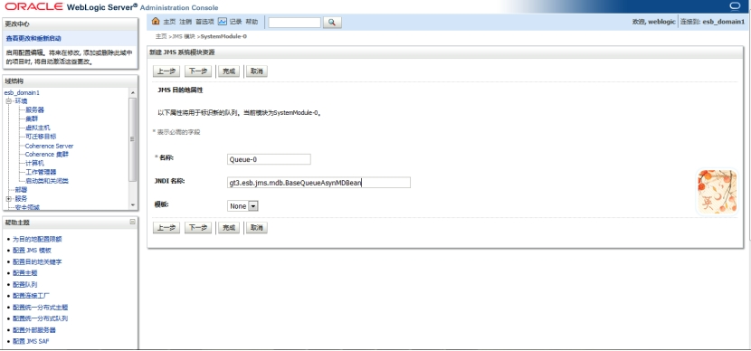 

点击下一步，选择刚才新建的子部署

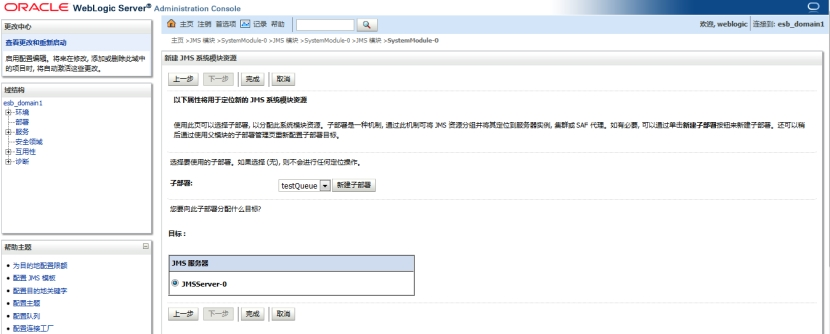 

点击完成

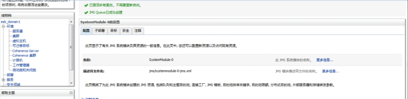 

五、**新建资源–连接工厂**
新建连接工厂和新建队列步骤相似

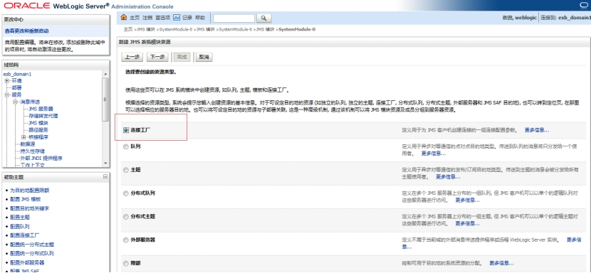 

点击下一步

填写名称和jndi名称，这里为gt3.esb.jms.con.ESBConnectionFactory

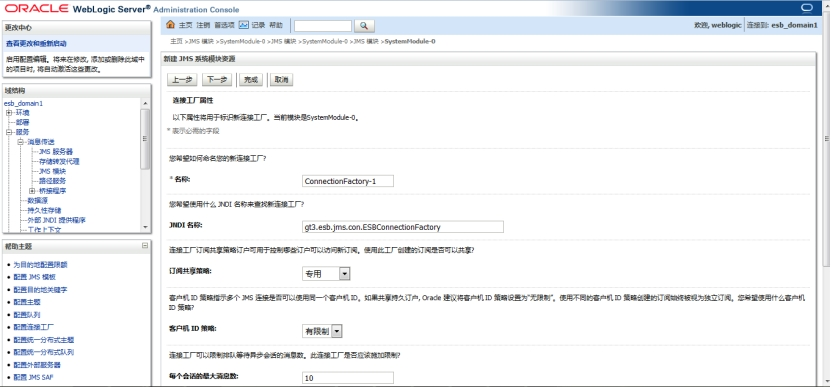 

点击下一步

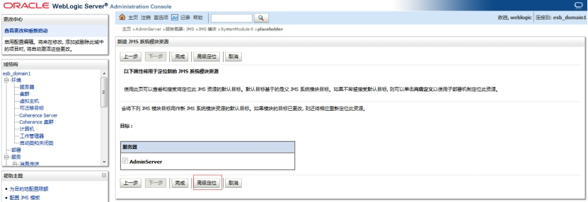 

点击【高级定位】

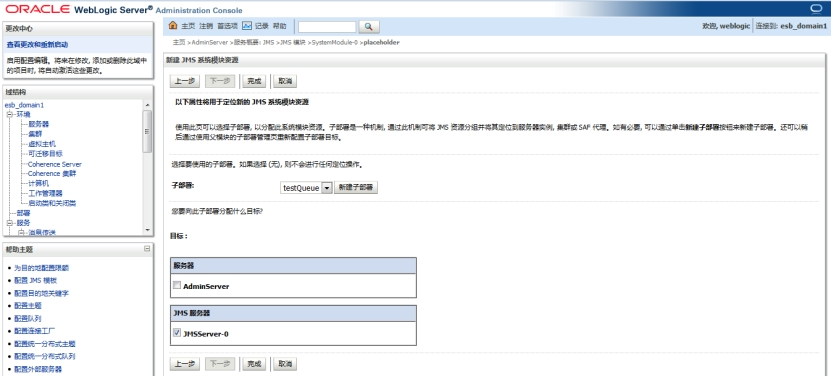 

进人界面选择子部署，**选择和队列一样的子部署**，点击完成。不知道原因是什么，如果选择默认定位不选子部署，程序中不能查找到队列。

 