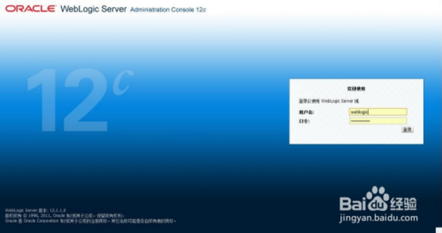
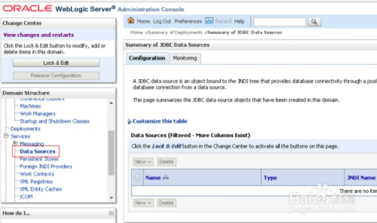
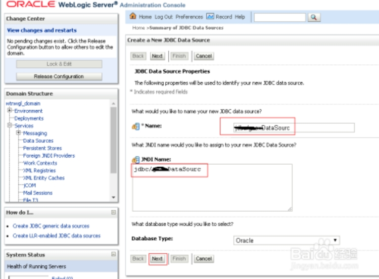
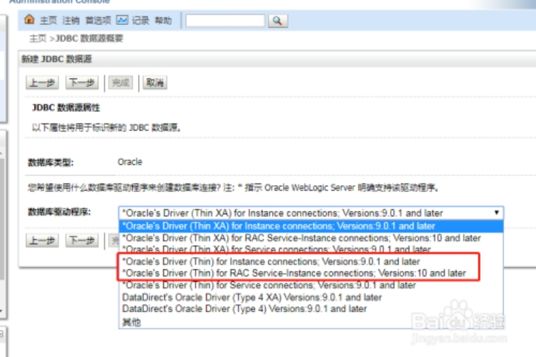
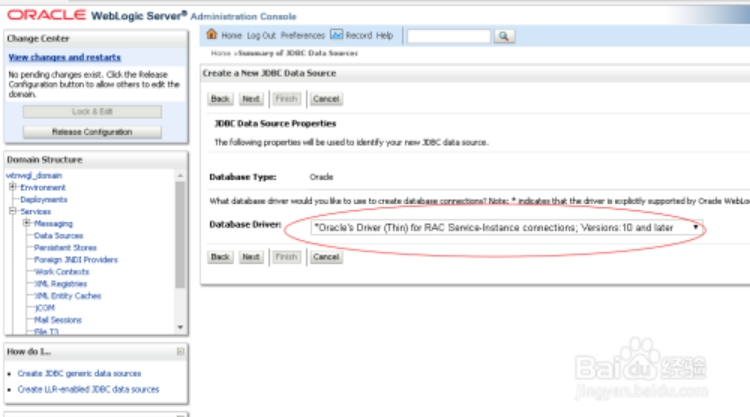
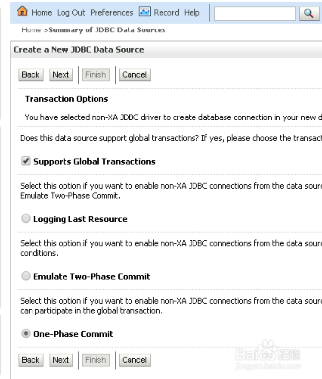
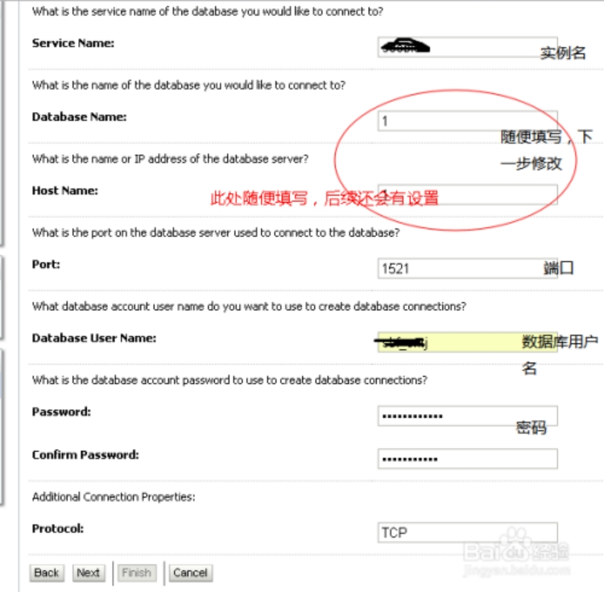
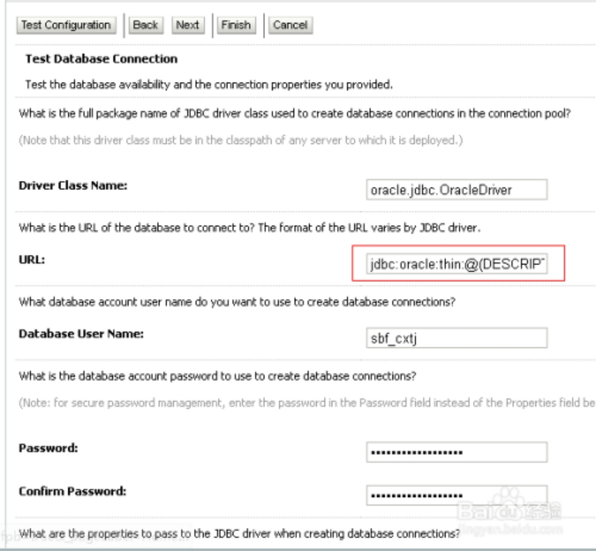
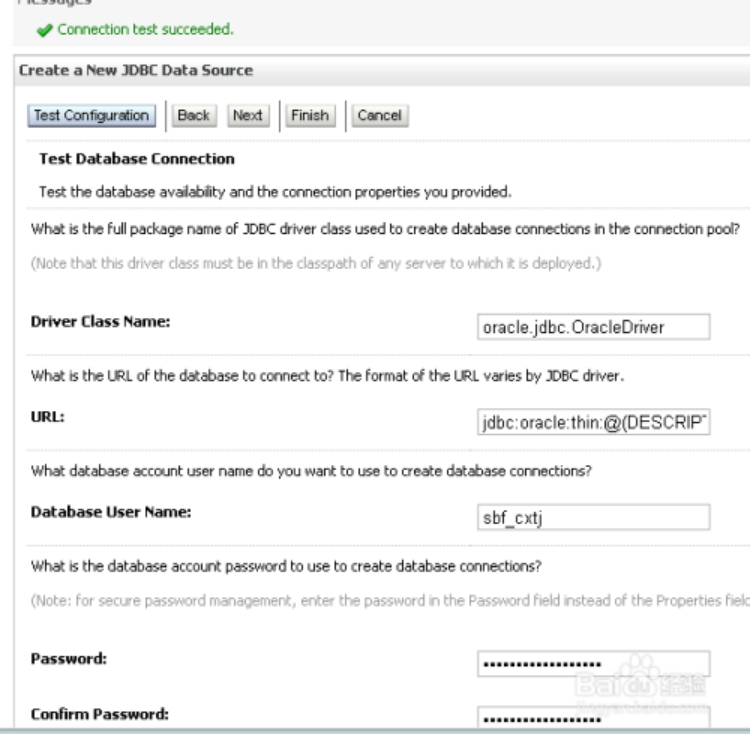
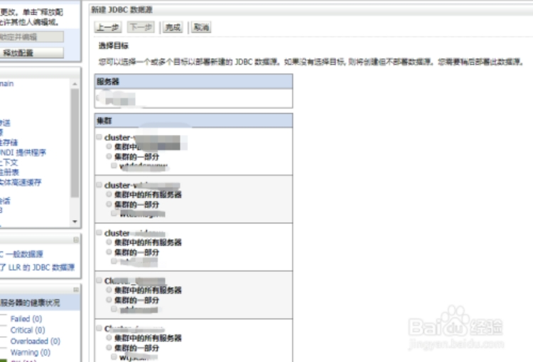

# **weblogic控制台添加oracle RAC数据源**

 

weblogic是oracle公司出品的一款基于JAVAEE的中间件，在使用weblogic发布web应用时，会遇到添加oracle数据源的情况，那么oracle rac集群的数据源怎么添加呢。

 

步骤一：weblogic管理节点创建后，使用管理节点地址的登录控制台。

 

步骤二：输入用户密码后进入控制台主菜单，点击services-data sources

 

步骤三：点击“Lock & Edit”解锁编辑，添加数据源名称，信息填好后“next”

 

步骤四：选择oracle数据库的驱动类型，如图两个上面一个是单实例，下一个为RAC，我们选择RAC集群，next

 

 

步骤五：此步为事务处理选项，保持默认

 

步骤六：此步骤填写数据源的关键信息，主要包括实例名，oracle主机ip，端口，用户名和密码，因为rac有两个ip地址，此步骤我们随便填写一个，在下个步骤中，可以修改jdbc串进行修改。

 

步骤七：如图会根据上面填写的信息生成信息，红框中的信息目前不正确，修改如下jdbc信息，然后复制替换红框中的信息（加粗信息需据实修改）

jdbc:oracle:thin:@(DESCRIPTION=(ADDRESS_LIST=(ADDRESS=(PROTOCOL=TCP)(HOST = **10.12.76.100**)(PORT = **1521**))(ADDRESS = (PROTOCOL = TCP)(HOST = **10.12.76.101**)(PORT = 1521))(LOAD_BALANCE = ON)(FAILOVER = ON))(CONNECT_DATA =(SERVICE_NAME = **scsbccx**)(FAILOVER_METHOD =(TYPE = SESSION)(METHOD = BASIC))))

 

步骤八：点击test configuration，如图测试成功，后续步骤和单实例数据源相同

 

步骤九：跟数据源选择目标，即我们之前创建的服务集群，最后点击完成并激活配置即可。

 

 