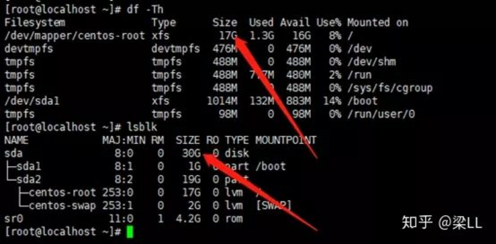
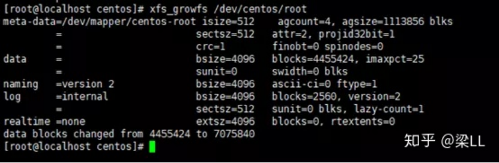

# **Linux 扩容 / 根分区(LVM+非LVM)**

目录：

1，概述

2，CentOS7，LVM根分区扩容步骤

3，CentOS7，非LVM根分区扩容步骤：

**一、背景，概述**

MBR（Master Boot Record）（主引导记录）和 GPT（GUID Partition Table）（GUID意为全局唯一标识符）是在磁盘上存储分区信息的两种不同方式

对于传统的MBR分区方式，有很多的限制：

1：最多4个主分区（3个主分区+1个扩展分区(扩展分区里面可以放多个逻辑分区)），无法创建大于2TB的分区，使用fdisk分区工具，而GPT分区方式不受这样的限制。

2：GPT分区方式将不会有这种限制，使用的工具是parted；


逻辑卷管理(LVM)，是 Logical Volume Manager（逻辑卷管理）的简写，lvm是卷的一种**管理方式**，并不是分区工具（也可不采用这种LVM管理方式）。

 

LVM管理导图1

 

LVM管理导图2


上图所示： 如果直接扩展/home逻辑卷目录，会提示逻辑卷组没有空间。

LVM扩容思维流程：创建一个物理分区-->将这个物理分区转换为物理卷-->把这个物理卷添加到要扩展的卷组中-->然后才能用extend命令扩展此卷组中的逻辑卷 。。。还是有些乱，根据上图理解。


问：如何查看本地机器是否使用LVM管理？

```shell
pvdisplay #查看物理卷

vgdisplay #查看卷组

lvdisplay #查看逻辑卷
```

答：执行上面命令，如果没有采用LVM管理的话，是查看不到上面卷组，物理卷，逻辑卷的（有可执行fdisk -l查看）。 逻辑卷即是挂载在目录上的卷。

非LVM

 

## **下面分别介绍LVM 和 非LVM 扩展根分区：**

## **二、CentOS7，LVM根分区扩容步骤：**

1.查看现有分区大小

```shell
# df -TH
```


LVM分区，磁盘总大小为20G,根分区总容量为17G


2.关机增加大小为30G(测试环境使用的Vmware Workstation)


扩展分区到30G


3.查看扩容后磁盘大小

```shell
# df -TH
# lsblk
```



磁盘总大小为30G,根分区为17G


4.创建分区

```shell
# fdisk /dev/sda
```

将sda剩余空间全部给sda3


5.刷新分区并创建物理卷

```shell
# partprobe /dev/sda
# pvcreate /dev/sda3
```

 


6.查看卷组名称，以及卷组使用情况

```shell
# vgdisplay
```


VG Name为centos


7.将物理卷扩展到卷组

```shell
# vgextend centos /dev/sda3
```


使用sda3扩展VG centos


8.查看当前逻辑卷的空间状态

```shell
# lvdisplay
```


需要扩展LV /dev/centos/root


9.将卷组中的空闲空间扩展到根分区逻辑卷

```shell
# lvextend -l +100%FREE /dev/centos/root
```

 


10.刷新根分区

```shell
# xfs_growfs /dev/centos/root
```

 


11.查看磁盘使用情况，扩展之前和之后是不一样的


根分区已经变成27G

## **三、CentOS7，非LVM根分区扩容步骤：**

1.查看现有的分区大小

 ```shell
 # df -Th
 ```


非LVM分区，目前磁盘大小为20G，根分区总容量为17G


2.关机增加磁盘大小为30G

 


3.查看磁盘扩容后状态

```shell
# lsblk
# dh -TH
```


现在磁盘总大小为30G,根分区为17G


4.进行分区扩展磁盘，**记住根分区起始位置和结束位置**

 


5.删除根分区，切记不要保存

 


6.创建分区，箭头位置为分区起始位置

 


7.保存退出并刷新分区

```shell
# partprobe /dev/sda
```

 


8.查看分区状态


这里不知道为啥变成19G了。


9.刷新根分区并查看状态

**xfs_growfs /dev/sda3** (这里先看自己的文件系统是xfs，还是ext4...)

使用 resize2fs 或 xfs_growfs 对挂载目录在线扩容 ：

- c 针对文件系统 ext2 ext3 ext4 （我在本地用ubuntu18是ext4，我用的是 **resize2fs /dev/sda3**）

- xfs_growfs 针对文件系统xfs


根分区大小已变为27G

