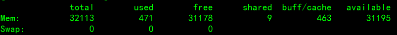

**centos关闭swap分区**

第一步 关闭swap分区:
swapoff -a

第二步修改配置文件 - /etc/fstab
删除swap相关行 /mnt/swap swap swap defaults 0 0 这一行或者注释掉这一行

第三步确认swap已经关闭
free -m

 若swap行都显示 0 则表示关闭成功

第四步调整 swappiness 参数
echo 0 > /proc/sys/vm/swappiness # 临时生效

vim /etc/sysctl.conf # 永久生效
\#修改 vm.swappiness 的修改为 0
vm.swappiness=0
sysctl -p # 使配置生效