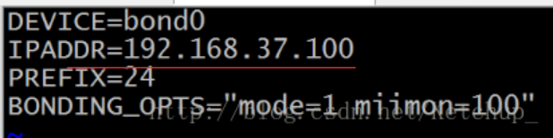
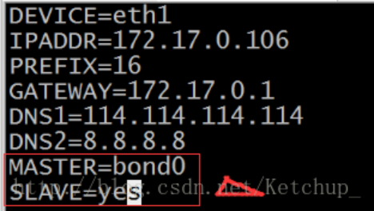
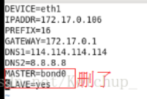
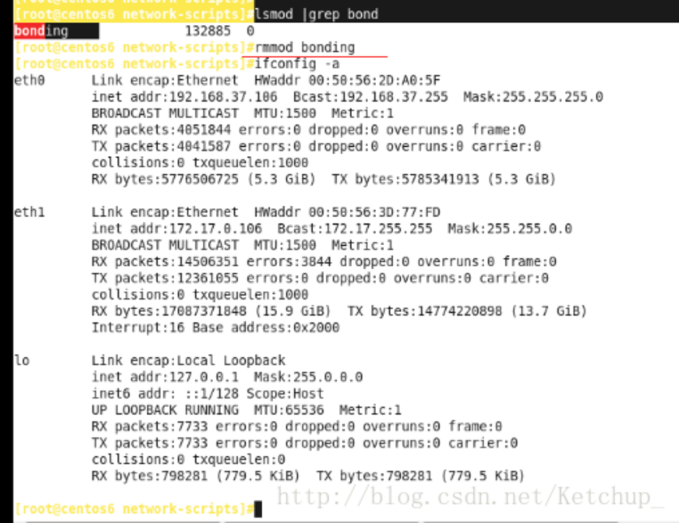
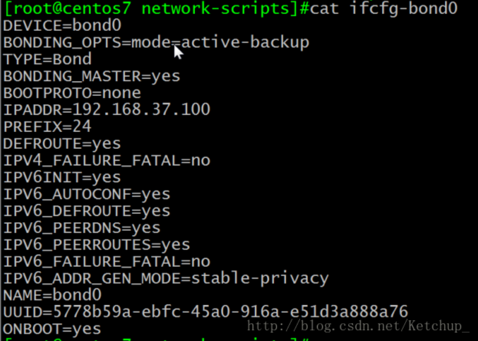
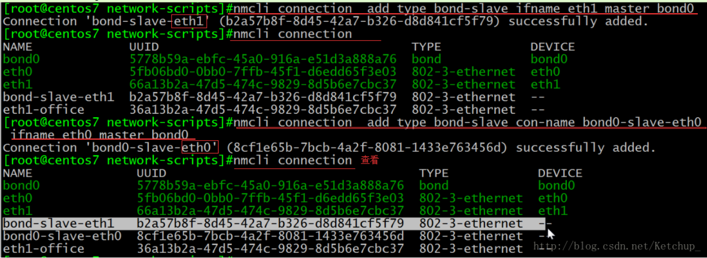
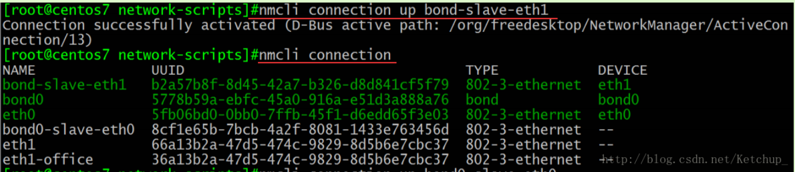

```shell
bonding（绑定与删除）
今天小编要讲的是bonding，有木有觉得很高大上呀，没错就是很厉害啦，咳咳咳，小编要很正经的说说它的优点啦：
1.bonding(绑定)是一种linux系统下的网卡绑定技术，可以把服务器上n个物理网卡在系统内部抽象(绑定)成一个逻辑上的网卡，能够提升网络吞吐量、实现网络冗余、负载等功能，有很多优势。
2.bonding技术是linux系统内核层面实现的，它是一个内核模块(驱动)。使用它需要系统有这个模块, 我们可以modinfo命令查看下这个模块的信息, 一般来说都支持.
应用方向：
1、网络负载均衡对于bonding的网络负载均衡是我们在文件服务器中常用到的，比如把三块网卡，当做一块来用，解决一个IP地址，流量过大，服务器网络压力过大的问题。对于文件服务器来说，比如NFS或SAMBA文件服务器，没有任何一个管理员会把内部网的文件服务器的IP地址弄很多个来解决网络负载的问题。如果在内网中，文件服务器为了管理和应用上的方便，大多是用同一个IP地址。对于一个百M的本地网络来说，文件服务器在多 个用户同时使用的情况下，网络压力是极大的，特别是SAMABA和NFS服务器。为了解决同一个IP地址，突破流量的限制，毕竟网线和网卡对数据的吞吐量是有限制的。如果在有限的资源的情况下，实现网络负载均衡，最好的办法就是 bonding。
2.网络冗余对于服务器来说，网络设备的稳定也是比较重要的，特别是网卡。在生产型的系统中，网卡的可靠性就更为重要了。
总之，多块网卡绑定到一个IP地址，当一块网卡发生物理性损坏的情况下，另一块网卡自动启用，并提供正常的服务，即：默认情况下只有一块网卡工作，其它网卡做备份。
说完bonding的好处与应用方向，下面来讲讲具体怎么做吧，敲黑板，小编要讲课了：

centos6：
首先俩网卡设置成都仅主机或都桥接,保证他们在同一个网段，我们以仅主机为例：
1.创建绑定接口的配置文件 ifcfg-bond0:
Vim /etc/sysconfig/network-scripts/ifcfg-bond0
```



```shell
2。关闭NetworkManager服务
命令：service NetworkManager stop
3.配置物理接口，设置master 与slave

Vim /etc/sysconfig/network-scripts/ifcfg-eth0
```



```shell
好了现在重启服务器吧，命令：Service network restart

 

删除bonding：
1.ifconfig bond0 down（这步只能临时禁用）
2.rm -f ifconfig-bond0

 

Vim ifcfg-eth1


```



```shell
3.service network restart
4.删除绑定模块
进入该目录下：cd /etc/sysconfig/network-scripts/
rmmod bonding
```



```shell
好了现在就完全删除banging了
======================================
centos7
说明：centos7中网卡的命名方式与centos6中不一样，为了方便小编已经修改成传统的命名方式了，如果不懂的话可以去翻翻小编写的有关文章。
首先要让他们在同一个网段中（都设置成仅主机模式）
用一个虚拟机ping下192.168.37.100
1.创建绑定接口的配置文件:
命令行：nmcli connection add type bond con-name bond0 ifname bond0 mode active-backup ipv4.method manual ipv4.address 192.168.17.100/24
查看一下：
```



```shell
让bond0生效：nmcli connection up bond0
2.配置物理网卡：
把eth0 和eth1绑定在bong0上
```



```shell

3.使配置文件生效，俩网卡操作大同小异，以eth1为例
```



```shell
4、nmcli con reload 重新读取配置文件
5、systemctl restart network 重启服务
6.查看：cat /proc/net/bonding/bond0
注意：需要启动一下，配置文件并没有生效 ，方法如下
```


```shell

不仅把bond0 down掉了，还把俩物理网卡down掉了需重启物理网卡
nmcli con up bond-slave-eth1
nmcli con up bond-slave-eth0
关闭NetworkManager服务:systemctl stop NetworkManager
nmcli connection reload
删除bonging
1.ifconfig bond0 down（这步只能临时禁用）
2.rm -f ifconfig-bond*
3.nmcli connection reload
centos7用的是它独特的命令，操作起来比较简单
好了bonding小编说完了，如果有问题可以在下面留言，如果有哪个章节想让小编介绍的也可以留言。好了，再见。

```

