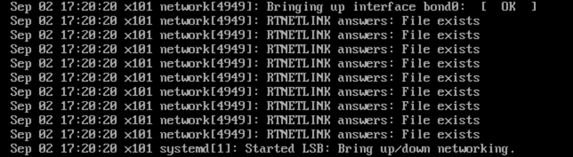

# **一、传统的bond模式网卡绑定**

 一定要在服务管理中关闭NetworkManager服务并禁用自动启动，因为centos中NetworkManager服务与network服务冲突，默认是由NetworkManager接管网络服务，所以传统方式重启会出现启动失败，错误日志一般如下所示，管理员就得回到机房接显示器配置网络连接。



**以绑定eth0和eth1为例**

1.通过vim设置eth0的IP地址和eth1的IP地址。

```shell
[root@x101 network-scripts]# vim ifcfg-eth0
DEVICE=eth0
ONBOOT=yes
BOOTPROTO=none
TYPE=Ethernet
MASTER=bond0　　 //将网卡指向bond0
SLAVE=yes
USERCTL=[yes|no]（非root用户是否可以控制该设备）
[root@x101 network-scripts]# vim ifcfg-eth1
DEVICE=eth1
ONBOOT=yes
NETBOOT=yes
BOOTPROTO=none
TYPE=Ethernet
MASTER=bond0　　 //将网卡指向bond0
SLAVE=yes
USERCTL=[yes|no]（非root用户是否可以控制该设备）
2.新建 /etc/sysconfig/network-scripts/ifcfg-bond0绑定配置文件
[root@x101 network-scripts]# cat ifcfg-bond0 
DEVICE=bond0
ONBOOT=yes
NETBOOT=yes
BOOTPROTO=none
TYPE=Ethernet
IPADDR=192.168.0.106
PREFIX=24
DNS=192.168.0.1
NM_CONTROLLED=no
[root@x101 network-scripts]# 
```

5.**创建网卡绑定的驱动文件/etc/modprobe.d/自定义.conf，使得绑定后的网卡bond0能够支持绑定技术（bonding）,同时定义网卡以mode6模式进行绑定，且出故障时自动切换时间为100毫秒ms,**

```shell
添加
alias bond0 bonding
options bond0 mode=6 miimon=100 max_bonds=2
```

miimon是指多久时间要检查网路一次，单位是ms(毫秒)。

bonding只能提供链路监测，即从主机到交换机的链路是否接通。如果只是交换机对外的链路down掉了，而交换机本身并没有故障，那么bonding会认为链路没有问题而继续使用 

max_bonds=2网卡绑定如果BOND在一个以上最好加上这参数限制BOND最大加载几个，如果没有加载这个参数，网络重启的时候会报类似于“找不到BOND1参数，BOND1加载失败的错误”

```shell
options bond0 mode=6 arp_interval=1000 arp_ip_target=10.0.1.100
```

 添加了arp路由表，里面写明判断eth0如果到不了以上写的网关，就判定eth0 down了，所以系统才会切换网卡。arp_interval是时间间隔为ms，arp_ip_target为一个具体的IP,一般为局域网核心IP，通过他来判断网卡是否完好。

```shell
[root@x101 ~]# cat /etc/modprobe.d/bond.conf 
alias bond0 bonding
options bond0 miimon=100 mode=6

6.重启生效.执行service network restart 
[root@x101 ~]# systemctl stop NetworkManager
[root@x101 ~]# systemctl restart network
```

7.验证生效。ifconfig 可看到eth0和eth1网卡地址相同(但是我用虚拟机测试结果eth0和eth1的mac地址不相同，绑定验证也是成功的，能够实现冗余和负载分担效果)，同时出现bond网卡。

**先重启网络服务，再查看网卡绑定信息。查看网卡绑定后的状态：****cat /proc/net/bonding/bond0**

```shell
[root@x101 network-scripts]# cat /proc/net/bonding/bond0 
Ethernet Channel Bonding Driver: v3.7.1 (April 27, 2011)　　#bond驱动版本信息
 
Bonding Mode: adaptive load balancing　　#bond模式，主备、负载等
Primary Slave: None　　 #是否有优先级高的slave
Currently Active Slave: eth0　　#当前活动的slave
MII Status: up
MII Polling Interval (ms): 100　　 # 链路轮询监测时间，100毫秒
Up Delay (ms): 0　　#启动延迟时间，0毫秒
Down Delay (ms): 0　　 #down延迟
 
Slave Interface: eth0
MII Status: up　　 #链路状态 [up/down]
Speed: 1000 Mbps
Duplex: full
Link Failure Count: 0
Permanent HW addr: 00:0c:29:bc:12:d3
Slave queue ID: 0
 
Slave Interface: eth1
MII Status: up
Speed: 1000 Mbps
Duplex: full
Link Failure Count: 0　　0 #链路状态出错次数
Permanent HW addr: 00:0c:29:bc:12:dd　　#MAC
Slave queue ID: 0
```

如果绑定的网卡有特殊应用要求，需在rc.local脚本文件里启动绑定的网卡启动和配置IP信息，那么在rc.local里添加以下信息：

```shell
ifenslave bond0 eth0 eth1
ifconfig bond0 192.168.0.2 netmask 255.255.255.0
route add default gw 192.168.0.1
修改bond0网卡IP信息
执行以下操作即可：
# vi /etc/sysconfig/network-scripts/ifcfg-bond0
修改其中IP信息，保存退出并使用以下命令重启网络：
# /etc/init.d/network restart
※ 注意：切勿在图形界面下来修改bond0的IP ！若已经打开网络属性查看网卡信息，请按退出。不要点确定，否则会修改eth0和eth1的配置信息，使bond0失效。
 
取消网卡绑定
卸载bond0设备,如需删除双网卡绑定系统，可执行以下操作：
#rm -f /etc/sysconfig/network-scripts/ifcfg-bond0
#vi /etc/modprobe.d/自定义.conf
然后删除以下两行后，保存退出
alias bond0 bonding
options bond0 miimon=100 mode=1
最后重新配置eth0和eth1的IP，并重启网络即可。

mode共有七种(0~6)
mode=0：平衡负载模式，有自动备援，但需要”Switch”支援及设定。
特点：传输数据包顺序是依次传输（即：第1个包走eth0，下一个包就走eth1….一直循环下去，直到最后一个传输完毕），此模式提供负载平衡和容错能力；但是我们知道如果一个连接或者会话的数据包从不同的接口发出的话，中途再经过不同的链路，在客户端很有可能会出现数据包无序到达的问题，而无序到达的数据包需要重新要求被发送，这样网络的吞吐量就会下降
mode=1：自动备援模式，其中一条线若断线，其他线路将会自动备援。
mod=2，即：(balance-xor) XOR policy（平衡策略）
特点：基于指定的传输HASH策略传输数据包。缺省的策略是：(源MAC地址 XOR 目标MAC地址) % slave数量。其他的传输策略可以通过xmit_hash_policy选项指定，此模式提供负载平衡和容错能力
mod=3，即：broadcast（广播策略）
特点：在每个slave接口上传输每个数据包，此模式提供了容错能力
mod=4，即：(802.3ad) IEEE 802.3ad Dynamic link aggregation（IEEE 802.3ad 动态链接聚合）
特点：创建一个聚合组，它们共享同样的速率和双工设定。根据802.3ad规范将多个slave工作在同一个激活的聚合体下。
外出流量的slave选举是基于传输hash策略，该策略可以通过xmit_hash_policy选项从缺省的XOR策略改变到其他策略。需要注意的是，并不是所有的传输策略都是802.3ad适应的，尤其考虑到在802.3ad标准43.2.4章节提及的包乱序问题。不同的实现可能会有不同的适应 性。
必要条件：
条件1：ethtool支持获取每个slave的速率和双工设定
条件2：switch(交换机)支持IEEE 802.3ad Dynamic link aggregation
条件3：大多数switch(交换机)需要经过特定配置才能支持802.3ad模式
mod=5，即：(balance-tlb) Adaptive transmit load balancing（适配器传输负载均衡）
特点：不需要任何特别的switch(交换机)支持的通道bonding。在每个slave上根据当前的负载（根据速度计算）分配外出流量。如果正在接受数据的slave出故障了，另一个slave接管失败的slave的MAC地址。
该模式的必要条件：ethtool支持获取每个slave的速率
mod=6，即：(balance-alb) Adaptive load balancing（适配器适应性负载均衡）
特点： 表示负载均衡方式，两块网卡都工作，不需要交换机作支持
其实mod=6与mod=0的区别：mod=6，先把eth0流量占满，再占eth1，….ethX；而mod=0的话，会发现2个口的流量都很稳定，基本一样的带宽。而mod=6，会发现第一个口流量很高，第2个口只占了小部分流量
 
网络配置的基础知识：
DEVICE=物理设备名 
BOOTPROTO=[none|static|bootp|dhcp]（引导时不使用协议|静态分配|BOOTP协议|DHCP动态） 
HWADDR = 你的MAC地址
IPADDR=IP地址 
NETMASK=掩码值 
NETWORK=网络地址 
BROADCAST=广播地址 
GATEWAY=网关地址
MASTER=bond0 //将网卡指向bond0
TYPE=Ethernet (网络类型)
ONBOOT=[yes|no]（引导时是否激活设备） 
USERCTL=[yes|no]（非root用户是否可以控制该设备）
PEERDNS=[yes|no] (如果通过DHCP获取IP，是否将DNS信息写入/etc/resolv.conf (覆盖))
DNS1＝主域名服务的IP
DNS2＝从域名服务的IP
 

二、使用NetworkManager管理工具nmcli设置网卡绑定

1、使用nmcli命令的bond模式，绑定网卡
1、备份网卡配置文件
[root@x101 network-scripts]# cp ifcfg-eth0 /home/
[root@x101 network-scripts]# cp ifcfg-eth1 /home/
 
2、使用nmcli配置bond
[root@x101 network-scripts]# nmcli connection add type bond ifname bond0 mode 6
[root@x101 network-scripts]# nmcli connection add type bond-slave ifname eth0 master bond0
[root@x101 network-scripts]# nmcli connection add type bond-slave ifname eth1 master bond0
 
3、修改ifcfg-bond-bond0配置文件
[root@x101 network-scripts]# vim ifcfg-bond-bond0 
DEVICE=bond0
BONDING_OPTS=mode=balance-alb
TYPE=Bond
BONDING_MASTER=yes
PROXY_METHOD=none
BROWSER_ONLY=no
BOOTPROTO=none
DEFROUTE=yes
IPV4_FAILURE_FATAL=no
IPV6INIT=yes
IPV6_AUTOCONF=yes
IPV6_DEFROUTE=yes
IPV6_FAILURE_FATAL=no
IPV6_ADDR_GEN_MODE=stable-privacy
NAME=bond-bond0
UUID=b74648c1-7064-4873-90cf-82889e662f15
ONBOOT=yes
IPADDR=192.168.0.108
PREFIX=24
GATEWAY=192.168.0.1

4、重启网络服务
[root@x101 network-scripts]# systemctl restart network
 
5、客户端重新连接测试
[C:\~]$ ssh root@192.168.0.108
 
 
Connecting to 192.168.0.108:22...
Connection established.
To escape to local shell, press 'Ctrl+Alt+]'.


2、使用nmcli命令的team模式，绑定网卡　
#建立虚拟接口
[root@x101 network-scripts]# nmcli connection add type team con-name team0 ifname team0 config '{"runner":{"name": "roundrobin"}}'
Connection 'team0' (1cd8e350-5e53-4886-bccf-3724373a4408) successfully added.
#设置虚拟接口ip
[root@x101 network-scripts]# nmcli connection modify team0 ipv4.addresses "192.168.0.122/24"
#设置寻接口网关
[root@x101 network-scripts]# nmcli connection modify team0 ipv4.gateway "192.168.0.1"
#设置寻接口dns
[root@x101 network-scripts]# nmcli connection modify team0 ipv4.dns "192.168.0.1"
#设置虚拟接口手动模式
[root@x101 network-scripts]# nmcli connection modify team0 ipv4.method manual
#向虚拟接口添加网卡
[root@x101 network-scripts]# nmcli connection add type team-slave con-name team-port1 ifname eth0 master team0
Connection 'team-port1' (100df0a8-615b-4b46-9623-d88a8ea83f90) successfully added.
[root@x101 network-scripts]# nmcli connection add type team-slave con-name team-port2 ifname eth1 master team0
Connection 'team-port2' (46dd969d-ff81-46c0-8517-74bafa409d85) successfully added.
#激活虚拟接口网卡
[root@x101 network-scripts]# nmcli connection up team-port1
Connection successfully activated (D-Bus active path: /org/freedesktop/NetworkManager/ActiveConnection/6)
[root@x101 network-scripts]# nmcli connection up team-port2
#查看虚拟接口状态
[root@x101 network-scripts]#teamdctl team0 state view
#查看虚拟接口参数
[root@x101 network-scripts]#teamnl team0 options
#查看虚拟接口
[root@x101 network-scripts]#teamnl team0 ports

创建team，名称为team0
按照下面的语法，用 nmcli 命令为网络组接口创建一个连接。
 nmcli con add type team con-name CNAME ifname INAME [config JSON]
CNAME 指代连接的名称，INAME 是接口名称，JSON (JavaScript Object Notation) 指定所使用的处理器(runner)。JSON语法格式如下：
 '{"runner":{"name":""METHOD}}'
METHOD 是以下的其中一个：broadcast、activebackup、roundrobin、loadbalance 或者 lacp。

```

