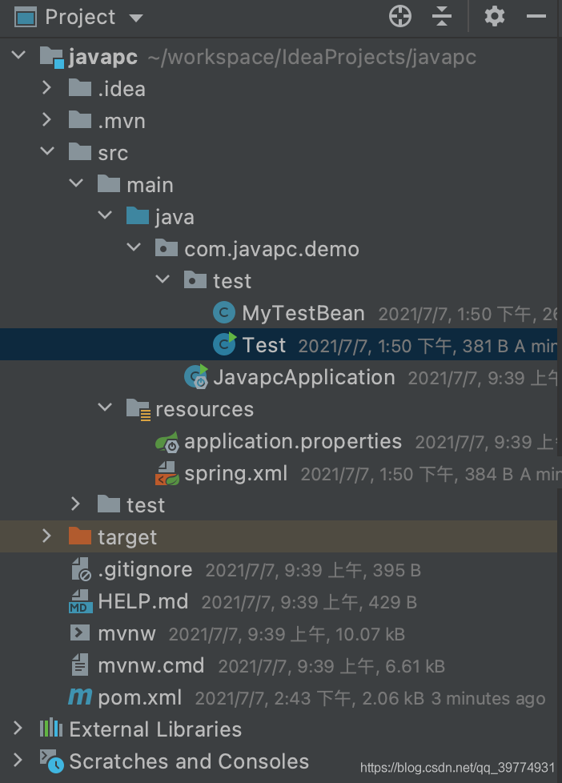
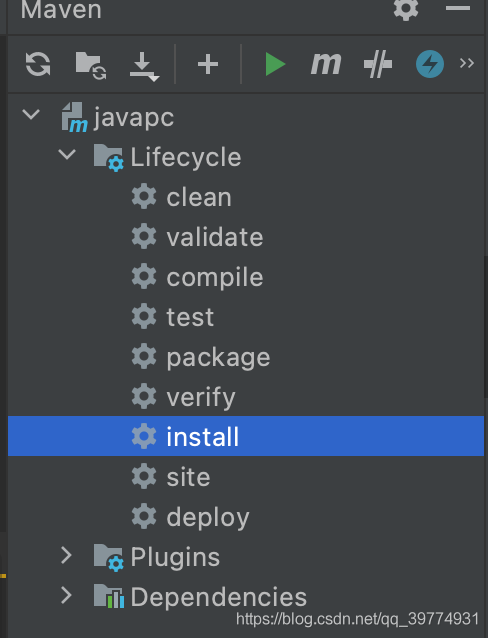
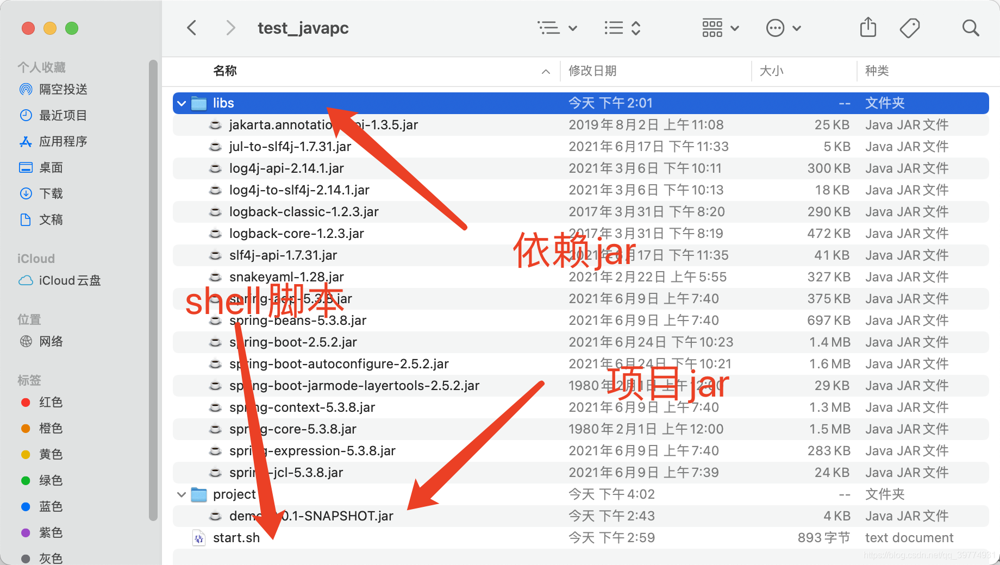
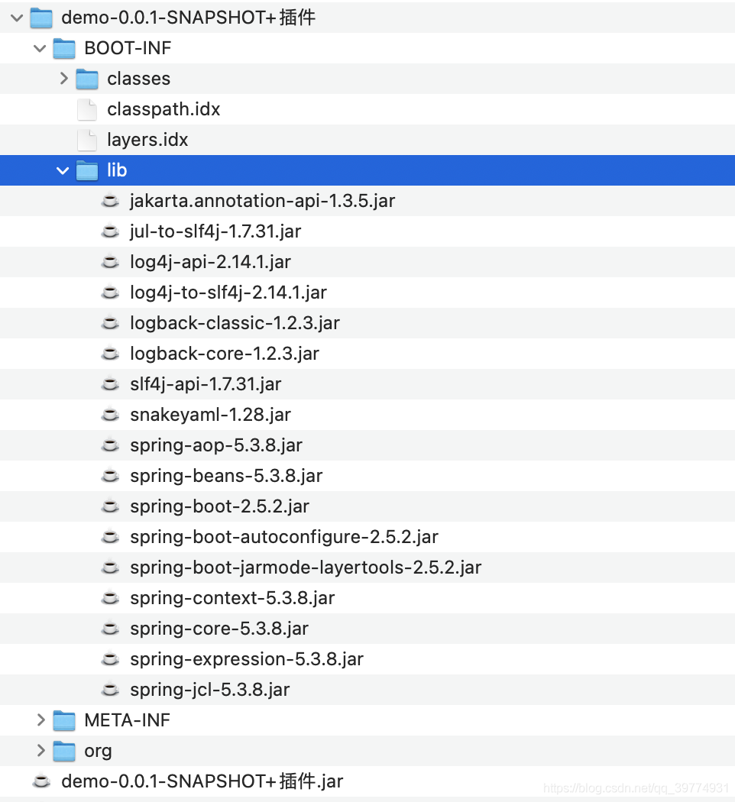

**java -cp 用法及脚本的案例**
	一、介绍
	二、使用
		1、创建springboot功能
		2、项目打包并运行

**一、介绍**

java -cp 命令中 cp 指的就是 classpath。使用该命令可以运行jar中的某个指定的测试类
使用方法

``````java
Java -cp 依赖jar或者是依赖jar库 测试类的全限定名
``````


其中需要注意的是“依赖jar或者是依赖库”一定要是绝对路径。如果依赖的是jar库，多个jar路径之间的分割符会因平台的不同存在差异，在window上用分号";“分割，在linux上用冒号”:"分割

**二、使用**

**1、创建springboot功能**

1. 创建一个springboot项目，名叫javapc

2. 新建MyTestBean类

``````java
package com.javapc.demo.test;

public class MyTestBean {

	private String name;

	public String getName() {
		return name;
	}

	public void setName(String name) {
		this.name = name;
	}

	public void outStr() {
		System.out.println("我是猪！！！");
	}
}
``````

3. 在resources下创建spring.xml

```xml
<?xml version="1.0" encoding="UTF-8"?>
<beans xmlns="http://www.springframework.org/schema/beans"
       xmlns:xsi="http://www.w3.org/2001/XMLSchema-instance"
       xsi:schemaLocation="http://www.springframework.org/schema/beans
       						http://www.springframework.org/schema/beans/spring-beans.xsd">

    <bean id="myTestBean" class="com.javapc.demo.test.MyTestBean"/>
</beans>
```

4. 创建测试类Test

```java
package com.javapc.demo.test;

import org.springframework.context.ApplicationContext;
import org.springframework.context.support.ClassPathXmlApplicationContext;

public class Test {
	public static void main(String[] args) {
		ApplicationContext ac = new ClassPathXmlApplicationContext("spring.xml");
		MyTestBean bean = (MyTestBean) ac.getBean("myTestBean");
		bean.outStr();
	}
}
```

5. 项目结构很简单，如下图所示

   

**2、项目打包并运行**

1. 打包项目

   

2. 打包完成后我们通过java -pc 运行一下

```java
# java -cp demo-0.0.1-SNAPSHOT.jar com.javapc.demo.test.Test
Error: A JNI error has occurred, please check your installation and try again
Exception in thread "main" java.lang.NoClassDefFoundError: org/springframework/context/ApplicationContext
	at java.lang.Class.getDeclaredMethods0(Native Method)
	at java.lang.Class.privateGetDeclaredMethods(Class.java:2701)
	at java.lang.Class.privateGetMethodRecursive(Class.java:3048)
	at java.lang.Class.getMethod0(Class.java:3018)
	at java.lang.Class.getMethod(Class.java:1784)
	at sun.launcher.LauncherHelper.validateMainClass(LauncherHelper.java:650)
	at sun.launcher.LauncherHelper.checkAndLoadMain(LauncherHelper.java:632)
Caused by: java.lang.ClassNotFoundException: org.springframework.context.ApplicationContext
	at java.net.URLClassLoader.findClass(URLClassLoader.java:382)
	at java.lang.ClassLoader.loadClass(ClassLoader.java:418)
	at sun.misc.Launcher$AppClassLoader.loadClass(Launcher.java:355)
	at java.lang.ClassLoader.loadClass(ClassLoader.java:351)
	... 7 more
```

我们会发现，起不来，会报java.lang.NoClassDefFoundError错误。其实我们一看就知道原因，是因为缺少spring的相关依赖。其实springboot项目打包需要借助一个plugin的，否则打出来的jar中是不会包含项目启动所需要的依赖的。但是我们要的就是不包含依赖jar的项目jar包

```java
<!-- springboot打包插件 -->
<plugin>
    <groupId>org.springframework.boot</groupId>
    <artifactId>spring-boot-maven-plugin</artifactId>
    <configuration>
        <mainClass>com.javapc.demo.JavapcApplication</mainClass>
        <!-- <skip>true</skip> -->
    </configuration>
    <executions>
        <execution>
            <goals>
                <goal>repackage</goal>
            </goals>
        </execution>
    </executions>
</plugin>
```

3. 其实此刻我们发现的这个问题，也是 java -cp 的一个优点。
   **举个例子：**
   假如我们这个程序的运行时需要依赖另一个叫 other.jar 的包。
   如果我们使用 java -jar 的话，就只能把 other.jar 放到 demo-0.0.1-SNAPSHOT.jar 中，因为 -jar 后面只能指定一个 jar 包启动。
   如果使用 -cp ，我们可以选择将 other.jar 放到 demo-0.0.1-SNAPSHOT.jar 中，也可以选择不放入 demo-0.0.1-SNAPSHOT.jar 中，使用以下命令来运行：

   ```java
   # 当前环境是linux，所以使用":"分割
   java -cp other.jar:demo-0.0.1-SNAPSHOT.jar com.javapc.demo.test.Test
   ```

   这样做的好处就是，假如修改了 demo-0.0.1-SNAPSHOT.jar 中的某个类，可以只上传修改后的 demo-0.0.1-SNAPSHOT.jar 到服务器，jar体积更小，上传也会节约很多时间。

4. 其实讲到这里大家就都已经清楚上面的报错应该怎么修改了，不就是jar中没有包含项目启动所需要的spring的相关jar嘛，我们把spring的jar拎出来放到单独的一个文件夹中，我们使用 java -cp 运行

```java
# java -cp 依赖jar:依赖jar:依赖jar:demo-0.0.1-SNAPSHOT.jar com.javapc.demo.test.Test
java -cp spring1.jar:spring2.jar:spring3.jar:demo-0.0.1-SNAPSHOT.jar com.javapc.demo.test.Test
```

是不是就是上面脚本这个意思，但是我们依赖的jar有很多，这样一个一个写进来岂不是要累死了，所以我们可以通过shell脚本来实现

5. 启动程序的shell脚本

```shell
export LANG=en_US.UTE-8
rootpath="/Users/zhishengjie/workspace/IdeaProjects/test_javapc"
appname="project"
apppath=${rootpath}/${appname}
cd ${apppath}
export CP_PATH=.
# 加载启动项目所需的依赖jar，这里就是指项目所依赖的spring相关jar
for i in `ls ${rootpath}/libs/`
do
 CP_PATH=$CP_PATH:${rootpath}/libs/$i
done
echo "打印加载的依赖……"
echo ${CP_PATH}
echo "打印依赖结束！"
# 加载项目jar，这里就是指demo-0.0.1-SNAPSHOT.jar
for i in `ls ${apppath}/`
do
 CP_PATH=$CP_PATH:${apppath}/$i
done
echo "打印部署jar的……"
echo ${CP_PATH}
echo "打印部署jar结束！"
# com.javapc.demo.test.Test 指的就是项目中启动的测试类的全限定类名
exec=`ps -ef |  grep com.javapc.demo.test.Test | grep java | grep -v grep | awk '{print $2}'`
if [ -n "$exec"];then
   echo "Processing testbat is  running. Don't call it again. "
fi
if [ -z "$exec"];then
  echo "Start the process testbat."
  java -cp ${CP_PATH}  -Dfile.encoding=utf-8 -Xmx512m  -Xmx12288m com.javapc.demo.test.Test $*
fi
```

下图为存放的目录结构



6. 运行脚本，这不就成功了嘛

```shell
# ./start.sh
打印加载的依赖……
.:/Users/zhishengjie/workspace/IdeaProjects/test_javapc/libs/jakarta.annotation-api-1.3.5.jar:/Users/zhishengjie/workspace/IdeaProjects/test_javapc/libs/jul-to-slf4j-1.7.31.jar:/Users/zhishengjie/workspace/IdeaProjects/test_javapc/libs/log4j-api-2.14.1.jar:/Users/zhishengjie/workspace/IdeaProjects/test_javapc/libs/log4j-to-slf4j-2.14.1.jar:/Users/zhishengjie/workspace/IdeaProjects/test_javapc/libs/logback-classic-1.2.3.jar:/Users/zhishengjie/workspace/IdeaProjects/test_javapc/libs/logback-core-1.2.3.jar:/Users/zhishengjie/workspace/IdeaProjects/test_javapc/libs/slf4j-api-1.7.31.jar:/Users/zhishengjie/workspace/IdeaProjects/test_javapc/libs/snakeyaml-1.28.jar:/Users/zhishengjie/workspace/IdeaProjects/test_javapc/libs/spring-aop-5.3.8.jar:/Users/zhishengjie/workspace/IdeaProjects/test_javapc/libs/spring-beans-5.3.8.jar:/Users/zhishengjie/workspace/IdeaProjects/test_javapc/libs/spring-boot-2.5.2.jar:/Users/zhishengjie/workspace/IdeaProjects/test_javapc/libs/spring-boot-autoconfigure-2.5.2.jar:/Users/zhishengjie/workspace/IdeaProjects/test_javapc/libs/spring-boot-jarmode-layertools-2.5.2.jar:/Users/zhishengjie/workspace/IdeaProjects/test_javapc/libs/spring-context-5.3.8.jar:/Users/zhishengjie/workspace/IdeaProjects/test_javapc/libs/spring-core-5.3.8.jar:/Users/zhishengjie/workspace/IdeaProjects/test_javapc/libs/spring-expression-5.3.8.jar:/Users/zhishengjie/workspace/IdeaProjects/test_javapc/libs/spring-jcl-5.3.8.jar
打印依赖结束！
打印部署jar的……
.:/Users/zhishengjie/workspace/IdeaProjects/test_javapc/libs/jakarta.annotation-api-1.3.5.jar:/Users/zhishengjie/workspace/IdeaProjects/test_javapc/libs/jul-to-slf4j-1.7.31.jar:/Users/zhishengjie/workspace/IdeaProjects/test_javapc/libs/log4j-api-2.14.1.jar:/Users/zhishengjie/workspace/IdeaProjects/test_javapc/libs/log4j-to-slf4j-2.14.1.jar:/Users/zhishengjie/workspace/IdeaProjects/test_javapc/libs/logback-classic-1.2.3.jar:/Users/zhishengjie/workspace/IdeaProjects/test_javapc/libs/logback-core-1.2.3.jar:/Users/zhishengjie/workspace/IdeaProjects/test_javapc/libs/slf4j-api-1.7.31.jar:/Users/zhishengjie/workspace/IdeaProjects/test_javapc/libs/snakeyaml-1.28.jar:/Users/zhishengjie/workspace/IdeaProjects/test_javapc/libs/spring-aop-5.3.8.jar:/Users/zhishengjie/workspace/IdeaProjects/test_javapc/libs/spring-beans-5.3.8.jar:/Users/zhishengjie/workspace/IdeaProjects/test_javapc/libs/spring-boot-2.5.2.jar:/Users/zhishengjie/workspace/IdeaProjects/test_javapc/libs/spring-boot-autoconfigure-2.5.2.jar:/Users/zhishengjie/workspace/IdeaProjects/test_javapc/libs/spring-boot-jarmode-layertools-2.5.2.jar:/Users/zhishengjie/workspace/IdeaProjects/test_javapc/libs/spring-context-5.3.8.jar:/Users/zhishengjie/workspace/IdeaProjects/test_javapc/libs/spring-core-5.3.8.jar:/Users/zhishengjie/workspace/IdeaProjects/test_javapc/libs/spring-expression-5.3.8.jar:/Users/zhishengjie/workspace/IdeaProjects/test_javapc/libs/spring-jcl-5.3.8.jar:/Users/zhishengjie/workspace/IdeaProjects/test_javapc/project/demo.jar
打印部署jar结束！
Processing ecifbat is  running. Don't call it again. 
Start the process ecifat.
14:59:37.405 [main] DEBUG org.springframework.context.support.ClassPathXmlApplicationContext - Refreshing org.springframework.context.support.ClassPathXmlApplicationContext@5fcfe4b2
14:59:37.548 [main] DEBUG org.springframework.beans.factory.xml.XmlBeanDefinitionReader - Loaded 1 bean definitions from class path resource [spring.xml]
14:59:37.577 [main] DEBUG org.springframework.beans.factory.support.DefaultListableBeanFactory - Creating shared instance of singleton bean 'myTestBean'
我是猪！！！
#
```

其实本文到此就应该结束了，但是有的小伙伴可能会有些疑问，你怎么知道项目依赖的spring的jar都有哪些的？这……
其实我是使用springboot的插件打了个jar，把这个jar包中的BOOT-INF下的lib目录给拿过来了……是不是很呆……哈……哈……哈……



