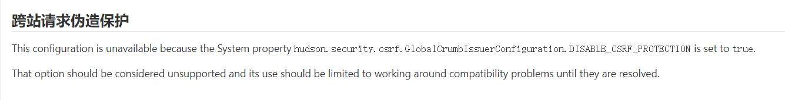
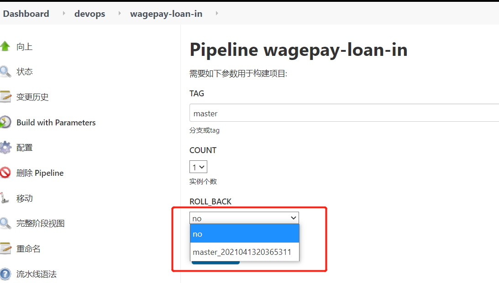
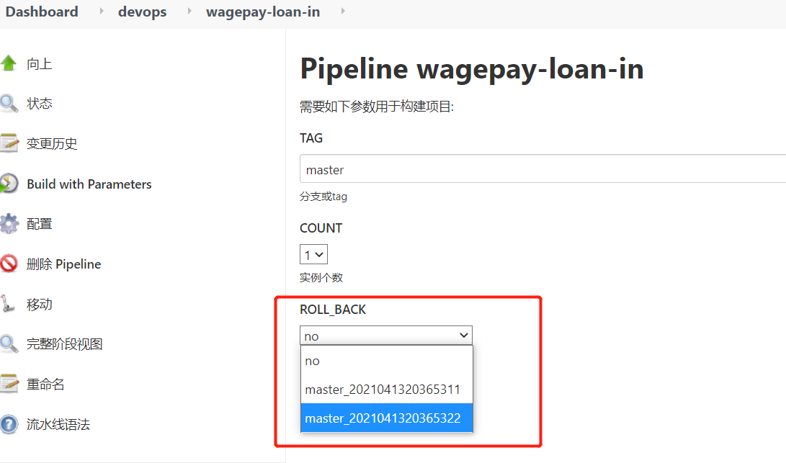
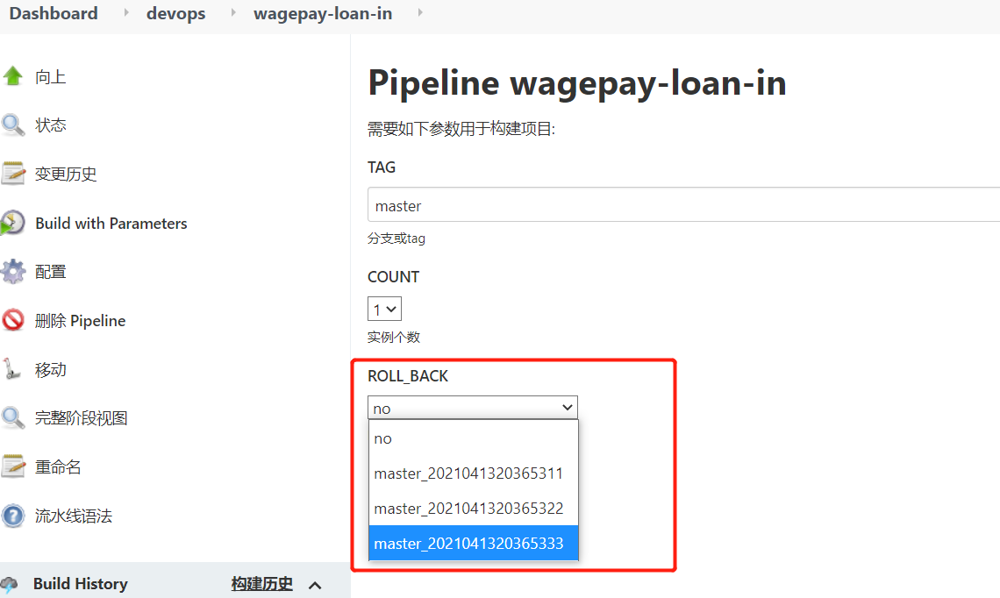
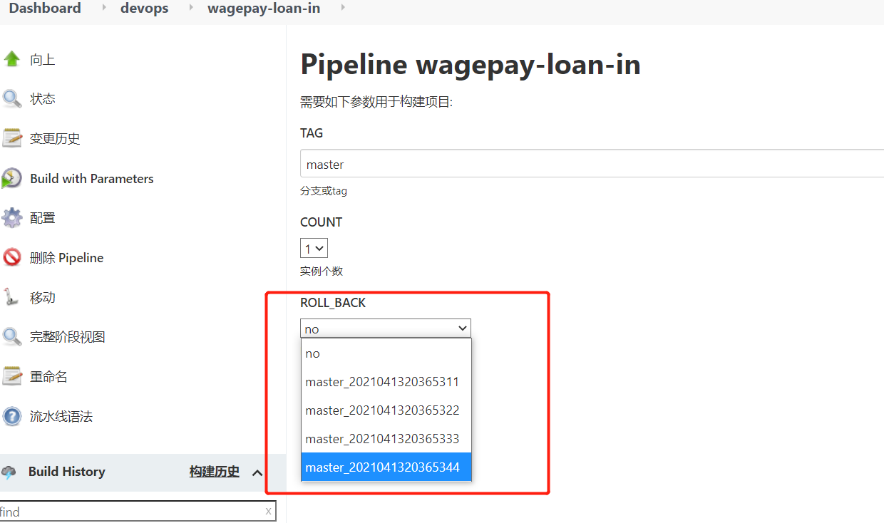

# Jenkins动态加载job配置文件的方法

## 问题描述

在有些时候，Jenkins构建任务是带参数的，而参数内容会经常有变化，就需要手动去修改参数。

比如：在对k8s容器环境进行发布部署的时候，我们希望开发人员能够自己通过点击jenkins构建任务中的版本号进行回滚，而每次有新的版本部署上线后又会把当前最新的版本加入到可回滚的列表中。如果都是我们手动去界面进行配置，会很麻烦。原则上我们是不需要参与整个过程的，除非自动化过程中遇到问题，才会人工介入。

## 问题分析

jenkins job的配置都被保存在工作目录下的jobs/$job/config.xml文件中，只要修改config.xml文件就可以了。

## 问题难点

当修改完job的config.xml文件后，去jenkins页面查看发现修改的config.xml配置并没有生效，通常需要重启jenkins服务才能生效，在job任务非常多的情况下每次加入配置都得重启服务，这显然并不实用。

## 解决方法

Jenkins是有动态加载配置的功能的，以下是我经过测试后可以使用的几个方法：

### 1、通过Jenkins的API加载job

通过api加载job配置，有个前提条件：需要在**“系统管理”** –> **“全局安全配置”** -> 取消**“跨站请求伪造保护”**功能。jenkins在`2.2xx`以后版本无法在控制台页面关闭这个功能。

#### 1.1 关闭 跨站请求伪造保护

2.2xx以后的版本，需要在jenkins启动时添加参数来关闭，我这里是docker启动的jenkins，修改以下配置：

复制

```
# vim /usr/local/bin/jenkins.sh
  exec java -Duser.home="$JENKINS_HOME" -Dhudson.security.csrf.GlobalCrumbIssuerConfiguration.DISABLE_CSRF_PROTECTION=true "${java_opts_array[@]}" -jar ${JENKINS_WAR} "${jenkins_opts_array[@]}" "$@"
  #exec java -Duser.home="$JENKINS_HOME" "${java_opts_array[@]}" -jar ${JENKINS_WAR} "${jenkins_opts_array[@]}" "$@"
```

> 其它方式部署的jenkins类似，只需要在启动参数中添加 `-Dhudson.security.csrf.GlobalCrumbIssuerConfiguration.DISABLE_CSRF_PROTECTION=true`

然后重启jenkins容器

复制

```
# docker restart jenkins
```

重启完jenkins后，前往**“系统管理”** –> **“全局安全配置”** 查看**“跨站请求伪造保护”**已经关闭了



#### 1.2 使用 API 加载 job 配置

加载job配置前，先看看jenkins当前的配置



可以看到，在`ROLL_BACK`目前这里只有一个版本

接下来通过修改job的config.xml文件为选项增加一个版本

复制

```
# grep -n 0365 /var/jenkins_home/jobs/devops/jobs/wagepay-loan-in/config.xml
48:              <string>master_2021041320365311</string>
# sed -i "49i \\              <string>master_2021041320365322</string>" /var/jenkins_home/jobs/devops/jobs/wagepay-loan-in/config.xml
```

下面就可以通过API加载job配置

复制

```
# curl -u admin:admin -X POST http://10.0.19.177:9090/job/devops/job/wagepay-loan-in/reload
```

加载完job配置后，再看看jenkins当前的配置



可以看到，刚才添加的配置已经加载生效了

### 2、通过jenkins-cli.jar加载job

这种方式更简单，只需要下载Jenkins命令行工具jenkins-cli.jar

加载配置前我们先为job的选项添加一个版本

复制

```
# grep -n 0365 /var/jenkins_home/jobs/devops/jobs/wagepay-loan-in/config.xml
48:              <string>master_2021041320365311</string>
49:              <string>master_2021041320365322</string>
# sed -i "50i \\              <string>master_2021041320365333</string>" /var/jenkins_home/jobs/devops/jobs/wagepay-loan-in/config.xml
```

通过以下命令加载job，若要同时加载多个job只需要写在reload-job后面即可

复制

```
# java -jar jenkins-cli.jar -s http://10.0.19.177:9090/ -auth admin:admin reload-job devops/wagepay-loan-in
```

加载完job配置后，再看看jenkins当前的配置



可以看到，刚才添加的配置已经加载生效了

### 3、通过groovy脚本加载job

groovy实际上也是通过Jenkins命令行工具jenkins-cli.jar，来实现的

#### 3.1 加载单个job

将下面代码保存为文件，`job_path`变量可以改为你需要加载的job名称

复制

```
import jenkins.model.Jenkins;

def job_path = 'devops/wagepay-loan-in'
Jenkins j = Jenkins.get()
def job = j.getItemByFullName(job_path)

if (job) {
  job.doReload()
  println("Successful Config reloaded: " + job.fullName);
} else {
  println("Error")
}
```

同样，加载配置前我们先为job的选项添加一个版本

复制

```
# grep -n 0365 /var/jenkins_home/jobs/devops/jobs/wagepay-loan-in/config.xml
48:              <string>master_2021041320365311</string>
49:              <string>master_2021041320365322</string>
50:              <string>master_2021041320365333</string>
# sed -i "51i \\              <string>master_2021041320365344</string>" /var/jenkins_home/jobs/devops/jobs/wagepay-loan-in/config.xml
```

执行以下命令加载job

复制

```
# java -jar jenkins-cli.jar -s http://10.0.19.177:9090 -auth admin:admin groovy = < reload-job.groovy
Successful Config reloaded: devops/wagepay-loan-in
```

加载完job配置后，我们再看看jenkins当前的配置



可以看到，刚才添加的配置已经加载生效了

#### 3.2 加载所有job

也可以使用以下代码，加载所有job

复制

```
import jenkins.model.Jenkins;
import hudson.model.AbstractItem;
import java.io.InputStream;
import java.io.FileInputStream
import java.io.File;
import javax.xml.transform.stream.StreamSource;

Jenkins.instance.getAllItems(AbstractItem.class).each{job ->
  def configXMLFile = job.getConfigFile();
  def file = configXMLFile.getFile();

  if (file.exists()) {

    InputStream is = new FileInputStream(file);

    job.updateByXml(new StreamSource(is));
    job.save();

    println("Config reloaded: " + job.fullName);
  }
}
```

执行以下命令加载所有job配置

复制

```
# java -jar jenkins-cli.jar -s http://10.0.19.177:9090 -auth admin:admin groovy = < reload-all-job.groovy
Config reloaded: aaa
Config reloaded: bbb
Config reloaded: devops
Config reloaded: devops/wagepay-loan-in
```