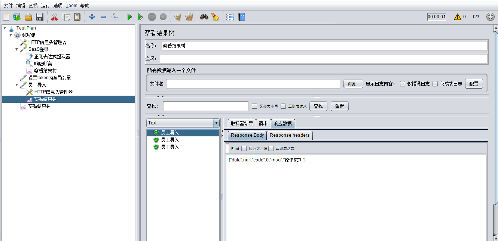

Jmeter上传文件并参数化
业务场景：用户登录系统并导入员工。

    因为导入员工文件时，系统会对模板中的员工身份证和手机号校重，所以要对上传的员工模板进行参数化。

步骤：1.添加线程组，添加HTTP信息头


   2.添加HTTP请求，编写登录脚本


  3.因为导入员工接口需要获取token，所以提取登录用户token，并设置token为全局变量


  4.添加HTTP请求，编写导入员工脚本，并对上传文件进行参数化

    4.1 先准备好员工导入文件和txt文件，可以先在txt文件里准备好数据，文件中写好文件路径；


```
4.2 使用函数助手${__CSVRead(,)}，输入txt文件所在的路径:D:\tools\apache-jmeter-5.1.1\bin\script\import\import.txt，输入参数所在的列（注意：此处列数是从0开始数的），生成被调用的函数：${__CSVRead(D:\tools\apache-jmeter-5.1.1\bin\script\import\import.txt,0)}
```


```
4.3 编写导入员工脚本，文件上传的文件名称处填入${__CSVRead(D:\tools\apache-jmeter-5.1.1\bin\script\import\import.txt,0)} ，参数名称填入Excelfile，MIME类型填入multipart/form-data；
```


  注意：HTTP请求高级选项中实现选择Java

 

  5. 添加查看结果树，导入成功

