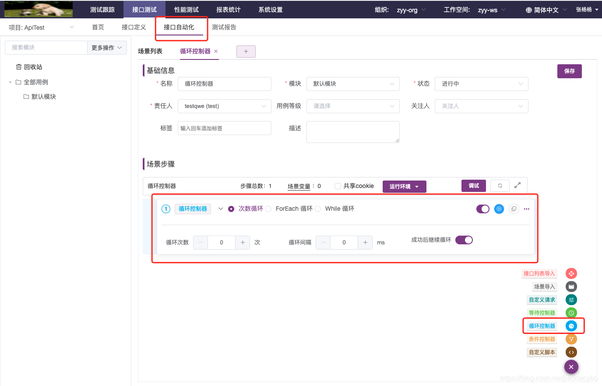
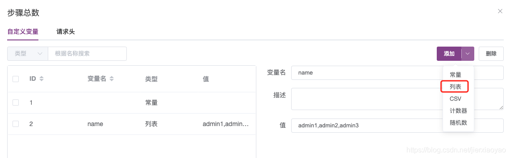
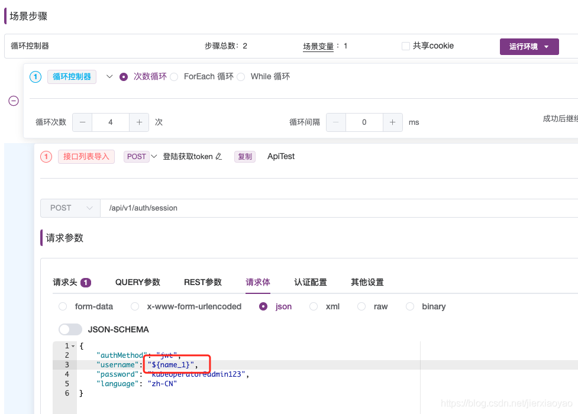
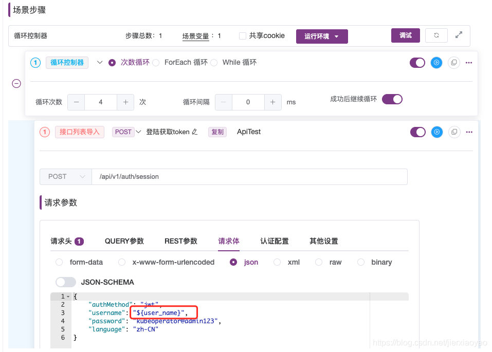
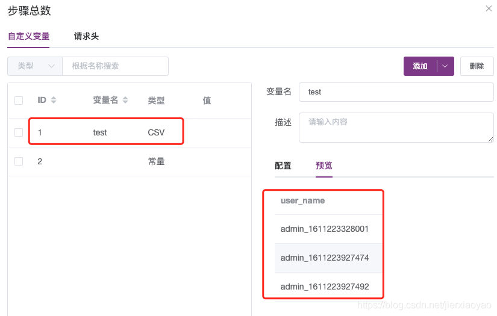
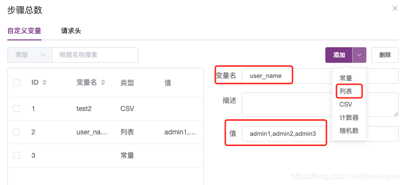
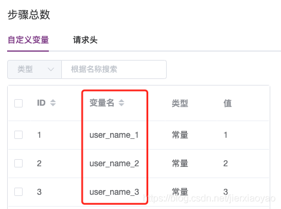
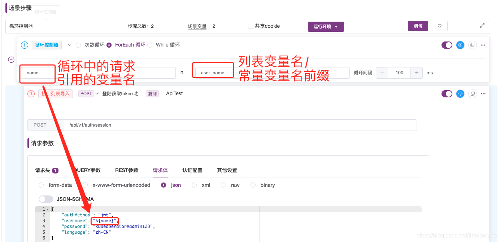
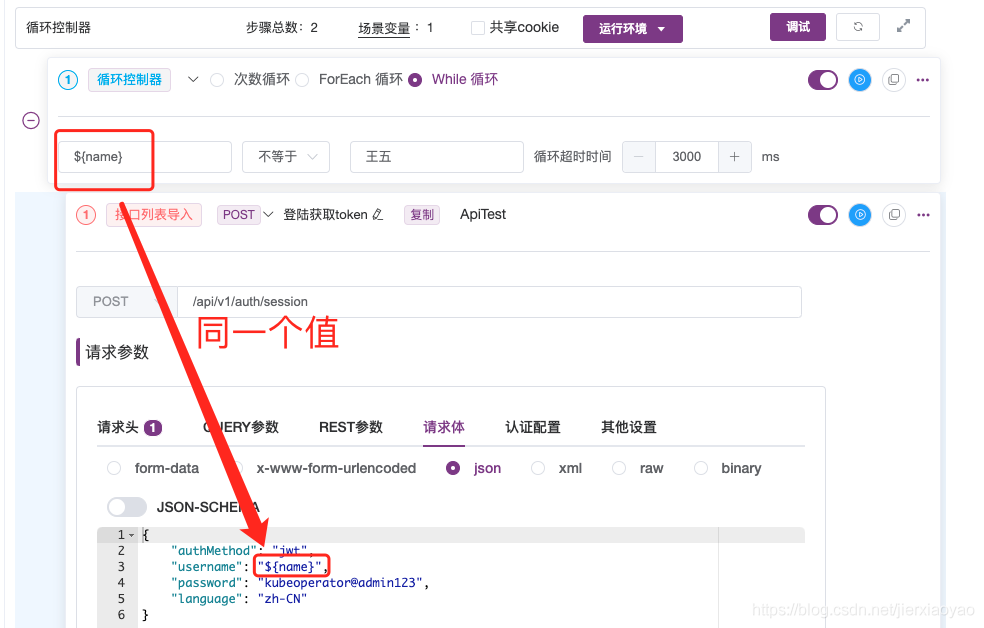
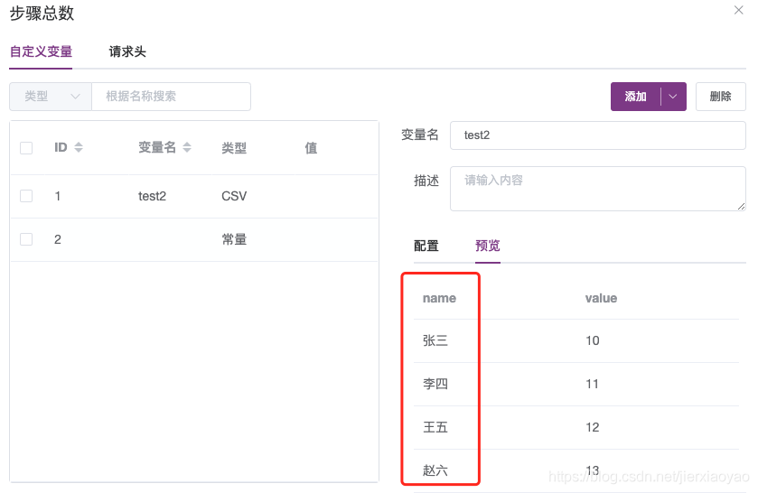

目录

〇、循环中使用各种类型的变量

一、次数循环

二、ForEach循环

三、While循环

在接口测试-接口自动化中，创建场景，可添加循环控制器，循环执行请求或脚本。循环控制器有3种模式：次数循环、ForEach循环、While循环。可结合场景变量csv类型的变量使用。

〇、循环中使用各种类型的变量
1、列表变量：除ForEach循环外，其他循环里面的请求可填写【列表变量名_下标】，执行循环可从列表变量中取值，但是不会自动循环取值，只能根据下标取值。

2、计数器：计数器可直接使用变量名引用，在所有循环控制器里都不会循环取值，只会取值一次，如设置计数器从1开始到10结束，循环控制器设置为次数循环，则每次循环都会取为1，不会依次取为1，2，3……

3、随机数：随机数可直接使用变量名引用，在所有循环控制器里的值都会随循环次数更新。

4、csv文件：ForEach循环暂时不支持读取CSV文件中的变量，在while和次数循环中可直接使用变量名引用，会随每次循环自动取下一个值。

 

一、次数循环
次数循环是最简单的循环方式，设置循环次数x次，循环间隔时间x ms后，即可执行循环。

【成功后继续循环】选项，默认开启，意思是执行接口或脚本成功后继续下一次循环，当前循环下只有一个请求时可开启或关闭，有多个请求时只能开启。关闭后请求执行成功则停止循环。
若有设置列表变量，循环里面的请求可填写【列表变量名_下标】，执行循环可从列表变量中取值，但是不会自动循环取值，只能根据下标取值。

- 若有设置csv场景变量，循环里面的请求可填写csv变量名，执行循环会从csv变量中取值，取完所有值后会循环取值。

二、ForEach循环
ForEach循环需配合常量变量或列表变量使用。

注意：目前ForEach循环暂时不支持读取CSV文件中的变量

列表变量可正常设置（系统引用时会自动增加后缀），常量变量设置在设置变量名时需增加后缀（设置方式如下图）。
变量有几个就循环几次，所有变量取值完后停止循环。
如下图设置的意思为，请求中的name变量从列表变量/常量变量中进行遍历取值。

# 三、While循环

While循环可配合常量变量或csv变量使用。根据循环条件设置和超时时间设置进行循环，条件为true时进行循环，条件为false停止循环。循环条件设置里的变量可从场景变量中取值，也可从csv文件中取值。

