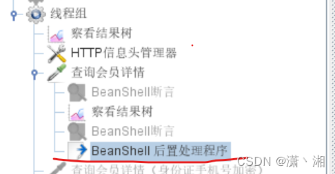

将jmeter 中request body 参数保存到txt文件

前言
这是我自己在做接口测试中遇到的问题，就是我们通常需要将响应数据的参数保存到txt文件中很简单，使用正则表达式提取器或者json提取器和BeanShell 后置处理程序结合即可。但在实际应用中还有一种可能，需要将接口请求中的参数也保存在TXT文件中，此时正则提取器，json提取器无法做到；我们使用BeanShell 后置处理程序来做。

1.需要提取得参数：body中的memberid


2.添加BeanShell 后置处理程序



3.脚本


```java
import java.net.URLDecoder;
import org.json.*;

//response1= prev.getSamplerData();      //取request body数据
//log.info(response1);
String samplerData = prev.queryString;  // 只取post data 数据
log.info(samplerData);
JSONObject aa=new JSONObject(samplerData);
String subData = aa.get("memberId").toString(); // 获取memberid 的value值
log.info(subData);
String r = URLDecoder.decode(subData,"utf-8");   //转码，用于汉字
log.info("参数为："+r);
FileWriter fstream = new FileWriter("D:\\221411.txt",true);  //写入TXT文件，路径下无文件时自动创建
BufferedWriter out = new BufferedWriter(fstream);
out.write(r+"\n");    //写入的数据

out.close();
fstream.close();

```

4.运行


5.日志


6.将取得的值用于下个接口的入参

```java
import java.net.URLDecoder;
import org.json.*;

//response1= prev.getSamplerData();      //取request body数据
//log.info(response1);
String samplerData = prev.queryString;  // 只取post data 数据
log.info(samplerData);
JSONObject aa=new JSONObject(samplerData);
String subData = aa.get("memberId").toString(); // 获取memberid 的value值
vars.put("memberId",memberId);
//log.info(subData);
//String r = URLDecoder.decode(subData,"utf-8");   //转码，用于汉字

```

下个接口直接使用[参数化](https://so.csdn.net/so/search?q=参数化&spm=1001.2101.3001.7020)即可${memberId}

最后，可能会报错，查看lib文件中是否有对应的jar包，名称：org.json .jar

