***\*从零开始的\*******\*Docker Desktop使用,Docker快速上手 （￣︶￣）↗ Docker介绍和基础使用\****

 

文章目录

Docker简介和安装和基础配置

Docker简介

安装Docker Desktop

换源

Docker基础使用

对Docker操作

对镜像的基础操作

获取当时所有镜像(docker images)

拉去镜像(docker pull)

删除镜像(docker rmi)

加载镜像(docker run)

使用交互式容器

查看容器(docker ps)

启动和关闭容器

操作后台容器

删除容器(docker rm)

容器制作成镜像

Docker Dashboard(Docker 仪表板)

 

***\*Docker简介和安装和基础配置\****

Docker简介

Docker 就像一个盒子，里面可以装很多物件，如果需要某些物件，可以直接将该盒子拿走，而不需要从该盒子中一件一件的取。

 

Docker中文社区、Docker中文文档

 

Docker 包括三个基本概念:

 

镜像（Image）

 

Docker的镜像概念类似于虚拟机里的镜像(比如.IOS文件)，是一个只读的模板，一个独立的文件系统，包括运行容器所需的数据，可以用来创建新的容器。

例如：一个镜像可以包含一个完整的 ubuntu 操作系统环境，里面仅安装了MySQL或用户需要的其它应用程序。

这里的镜像就如下方虚拟机创建时候使用的镜像类似。这个镜像便于移动,并且这个镜像我们可以交给任何人使用,其他人使用的时候也很方便,只需要将其实例化即可。

 

容器（Container）

 

Docker容器是由Docker镜像创建的运行实例，类似VM虚拟机，支持启动，停止，删除等。

每个容器间是相互隔离的，容器中会运行特定的应用，包含特定应用的代码及所需的依赖文件。

容器就类似与虚拟机中我们创建好的虚拟机系统,之后我们所有的操作都是在容器中进行的,我们的程序也是运行在容器中。

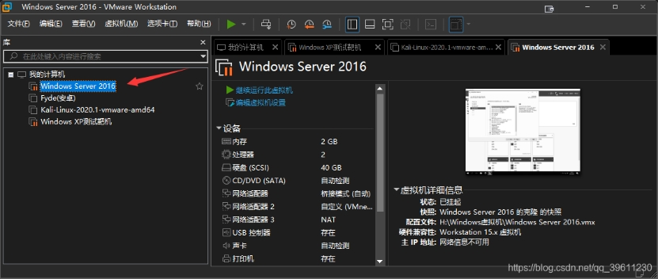 

仓库（Repository）

 

镜像便于传播,而仓库就是专门用来传播这些镜像的地方,他有点类似与Github,或者你可以把他看成一个存放各种镜像的镜像商店

Docker官方的仓库: 他的服务器处于国外,所以下载速度较慢,不过我们可以通过换源解决。

daocloud国内仓库: 国内也有一些优秀的商店，他和Docker官方的仓库的区别类似与Github和Gitee的区别。

网易云镜像中心

本博客主要解决在Windows环境下,快速上手使用Docker的问题,主要会介绍在Windows系统下Docker Desktop的安装,Docker 基础命令,比如说下载镜像、实例化镜像、使用容器、关闭容器、删除容器\镜像、使用仓库、创建镜像等模块的使用。其他系统应该除了安装外其他操作都可以通用。

 

***\*安装\*******\*Docker Desktop\****

我们先去官网下载安装包

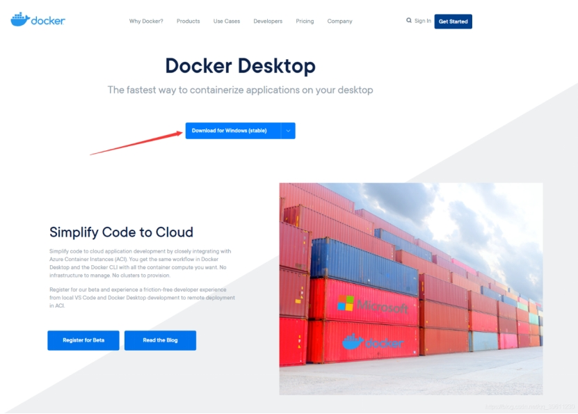 

 

打开安装包加载一会后一般会弹出两个选项,在较旧的Windows10或之前的系统会出现如下所示的相关提示。我们把第一个选上,第二个根据需求选择即可。

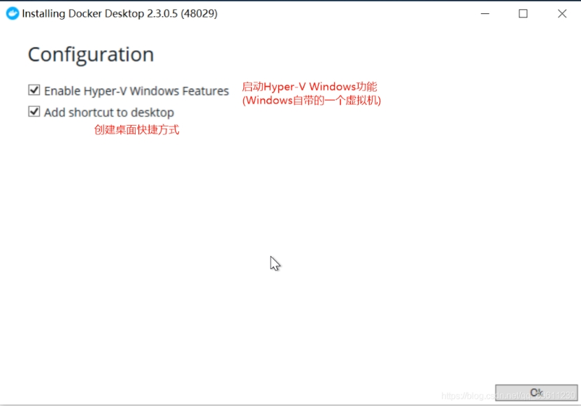 

而较新的Windows则会出现一个使用wsl2的提示(最少是1903以上,推荐为2004或更高版本),如果使用wsl2则docker的性能会发挥更好。如下图,这里推荐使用WSL2,如果之后安装完成后发生报错可能是WSL2版本比较老,需要更新导致的。(可以看我的另一篇博客来尝试解决)

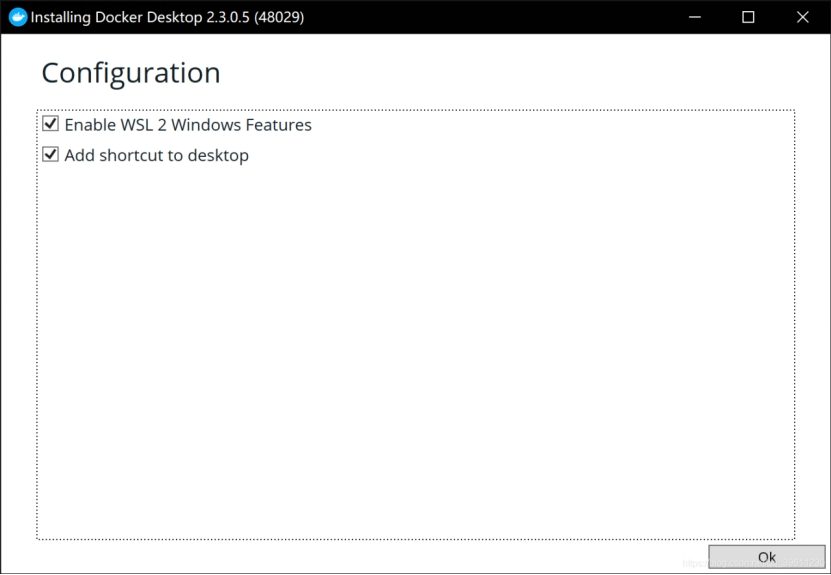 

 

换源

首先,我们打开Docker的设置

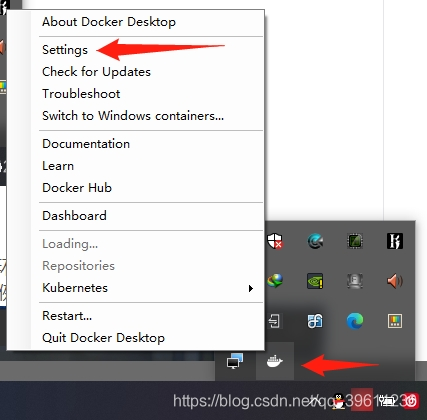 

选择Docker Engine,在其中输入(这里使用的是163的源,如果想要使用其他源可以自行设置,github上有个项目:docker_mirror可以自动检测在你的网络环境下那个源是最快的)

{

 "registry-mirrors": [

  "http://hub-mirror.c.163.com",

  "https://docker.mirrors.ustc.edu.cn"

 ],

 "insecure-registries": [],

 "debug": true,

 "experimental": false

}

 

 

***\*Docker基础使用\****

首先我们输入docker run hello-world是否会出现下图所示的提示,如果出现报错,这环境配置可能出现了问题。

ps:这行命令会让docker从官方仓库中拉去hello-world的镜像到本地,并且自动将其实例化成容器。

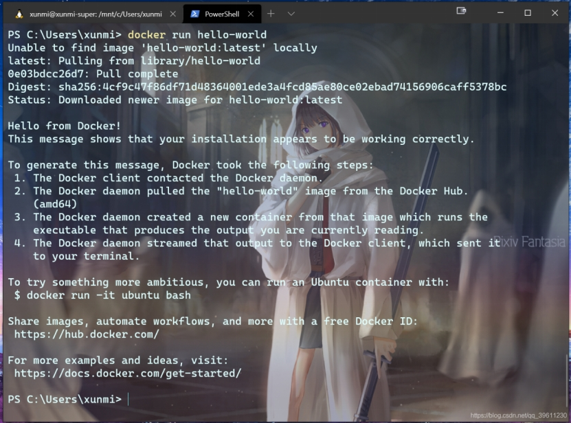 

 

***\*对\*******\*Docker操作\****

安装完成Docker后,默认每次开机的时候都会自动启动,但我们也可以手动启动,关闭或者重启Docker

 

\# 启动docker

sudo service docker start

\# 重启docker

sudo service docker restart

\# 停止docker

sudo service docker stop

 

***\*对镜像的基础操作\****

获取当时所有镜像(docker images)

docker image ls

\# 或者

docker images

 

标签	  含义

REPOSITORY	镜像所在的仓库名称

TAG   镜像标签

IMAGEID	镜像ID

CREATED	镜像的创建日期(不是获取该镜像的日期)

SIZE   	镜像大小

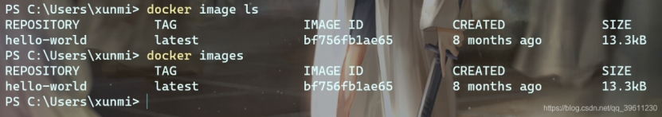 

 

***\*拉去镜像\*******\*(docker pull)\****

除了使用官方的镜像外,我们还可以在仓库中申请一个自己的账号,保存自己制作的进行,或者拉去使用他人的镜像。

 

\# 官方镜像

docker image pull 镜像名称 

\# 或简写为 

docker pull 镜像名称

\# 比如

docker pull ubuntu

docker pull ubuntu:16.04

 

\# 个人镜像

docker pull 仓库名称/镜像名称

docker pull xunmi/django

 

\# 第三方仓库拉去

docker pull 第三方仓库地址/仓库名称/镜像名称

docker pull hub.c.163.com/library/mysql:latest

(默认仓库名为library,所有从官方获取镜像相当于`sudo docker image pull library/镜像名称`)

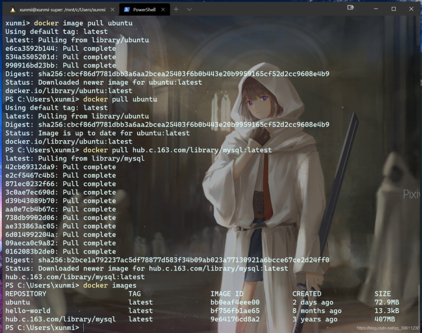 

 

***\*删除镜像\*******\*(docker rmi)\****

docker image rm 镜像名或镜像ID 或 docker rmi 镜像名或镜像ID

docker image rm hello-world

docker rmi 9e64176cd8a2

 

删除镜像的前提是没有使用这个镜像的容器,如果有需要先删除容器(报错:Error response from daemon: conflict: unable to delete 镜像ID (must be forced) - image is being used by stopped container 容器ID则代表有容器使用了此镜像。)可以尝试先执行docker rm 容器ID删除容器,如果还报错,可以看我下方删除容器的具体方法。

几条删除命令的区别

 

docker rm: 删除一个或多个 容器

docker rmi: 删除一个或多个 镜像

docker prune: 用来删除不再使用的 docker 对象

具体区别可以看下此博客

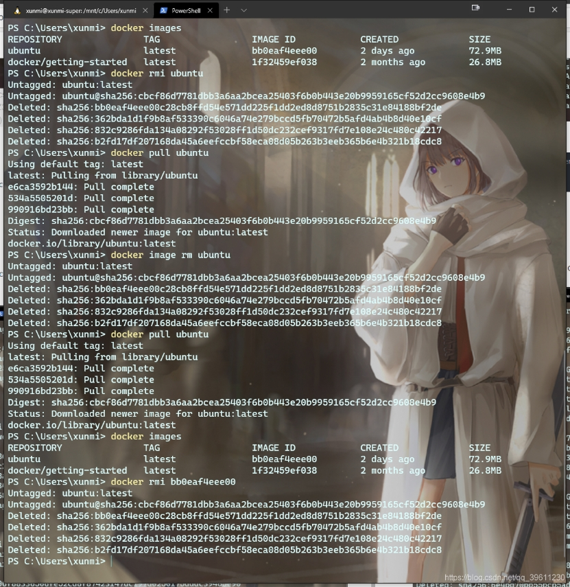 

 

加载镜像(docker run)

上面我们说过,镜像只是一个只读类型的文件,而我们的环境不可能只是一个这样的文件,所以我们需要把这个镜像加载成我们的环境,也就是让他变成容器。

 

docker run [可选参数] 镜像名 [向启动容器中传入的命令]

 

常用可选参数	作用

-i	表示以《交互模式》运行容器。

-d	会创建一个守护式容器在后台运行(这样创建容器后不会自动登录容器)。

-t	表示容器启动后会进入其命令行。加入这两个参数后，容器创建就能登录进去。即分配一个伪终端。

–name	为创建的容器命名。(默认会随机给名字,不支持中文字符!!!)

-v	表示目录映射关系，即宿主机目录:容器中目录。注意:最好做目录映射，在宿主机上做修改，然后共享到容器上。

-p	表示端口映射，即宿主机端口:容器中端口。 比如:-p 8080:80 就是将容器中的80端口,映射到主机中的8080端口

–network=host	表示将主机的网络环境映射到容器中，使容器的网络与主机相同。每个 Docker 容器都有自己的网络连接空间连接到虚拟 LAN。使用此命令则会让容器和主机共享一个网络空间。

 

可以启动一个系统docker run -i -d -t --name=kali-test kalilinux/kali-rolling(这里我使用linux的一个发行版kali作为介绍)

或可以简写为docker run -idt --name=kali-test kalilinux/kali-rolling

PS: 如果加载一个我们没有的镜像,docker会自动从官方仓库中进行拉去。

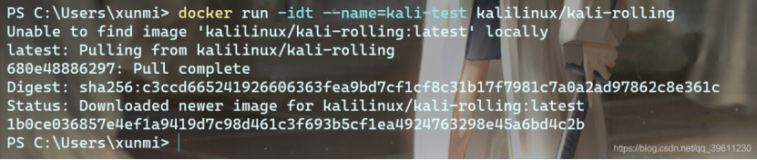 

或者我们可以启动一个网站docker run -dp 8080:80 --name docker-test docker/getting-started

 

如果你没有下载docker/getting-started的进行,这里会自动帮你下载

成功启动后,可以在浏览器中输入http://localhost:8080/即可看到如下页面

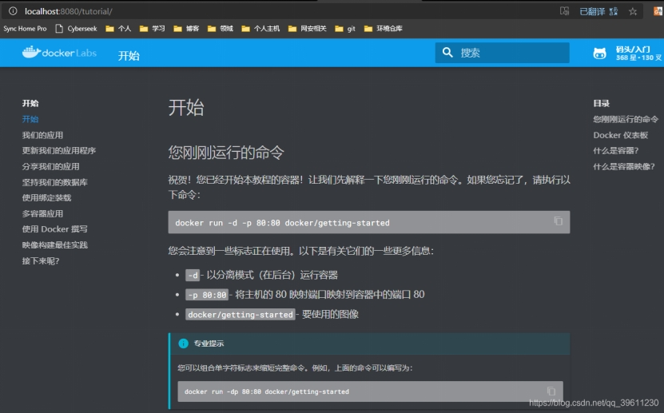 

 

***\*使用交互式容器\****

上面我们成功将镜像变成了容器,但上述的命令中我们都加入了-d,让容器在后台运行了。下面我们就来讲如何和正在运行的容器进行交互。

 

查看容器(docker ps)

查看容器主要会用到ps命令

 

\# 查看当前所有正在运行的容器

docker ps

\# 查看当前所有的容器

docker ps -a

\# 使用过滤器(除了name外,常用的还可以指定id:id= 、所有停止的容器:status=exited,正在运行的容器:status=running 等)

docker ps -f name=指定的名字

\# 显示2个上次创建的容器(2可以改变)

docker ps -n 2

\# 显示最新创建的容器（包括所有状态）

docker ps -l

\# 仅显示ip

docker ps -q

 \# 显示容器大小

docker ps -s

 

标签	    含义

CONTAINER ID	镜像ID

IMAGE			创建容器的镜像名称

COMMAND		默认启动命令(启动时会自动执行)

CREATED		创建容器的日期

STATUS			当前的状态(启动了多久,多久之前退出等)

PORTS			映射的端口

NAMES			容器的名称

SIZE				容器大小(使用-s命令参数时才能看到)

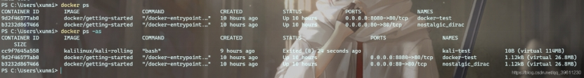 

 

启动和关闭容器

\# 停止容器

docker container stop 容器名或容器id

\# 或可简写为

docker stop 容器名或容器id

 

\# 强制关闭容器

docker container kill 容器名或容器id

\# 或可简写为

docker kill 容器名或容器id

 

\# 启动容器

docker container start 容器名或容器id

\# 或可简写为

docker start 容器名或容器id

 

如果我们成功启动或者关闭一个容器的话,会返回容器名或者容器id

stop和kill的区别: stop是比较优雅的关掉一个容器,类似我们正常退出一个软件,而kill是当一个进程出现意外无法正常关闭的时候,我们强行进行关闭,有点像我们使用任务管理器进行结束进程操作

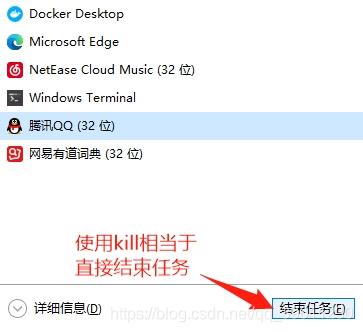 

 

***\*操作后台容器\****

之前我们下过一个kali并且放在了后台运行,如果没有下载可以执行下列命令(docker run -i -d -t --name=kali-test kalilinux/kali-rolling),下面我们就用下面的命令开启kali(如果你下的是其他系统,比如ubuntu也可以举一反三一下)

首先我们确保我们要进入的容器是开启状态的,使用docker ps -a查看其中的STATUS属性是否是Up开头,如果不是先照着上面启动容器的方法开启容器

我们开启容器后,如果需要在容器内执行命令,可以将后台切换到前台,也可能使用docker命令将我们需要执行的命令传入。

操作方法有很多种,这里我们介绍一些比较常用的方法

 

\# 如果我只需要执行简单的一两条命令可以使用docker exec

\# 执行单条命令 (-i: 启动并且保留交互式命令行; -t:作用是分配一个虚拟的终端; docker run )

docker exec -it 容器名或容器id 执行的命令

\# 比如

docker exec -it kali-test whoami

\# 用这种方法,我们还可以启动命令行,根据Linux的特性,系统程序会在/bin中,linux中常用的Shell有多个,其中大部分用的Linux默认的为bash

\# 所以我们启动命令可以自行如下命令(除了/bin/bash外,linux一般还会带/bin/sh、/bin/rbash、/bin/dash等,具体区别可以自行百度)

docker exec -it 容器名或容器id /bin/bash

\# 比如

docker exec -it kali-test /bin/bash

\# 除了exec外还有attach可以使用,但它有个弊端,多终端启动attach后,都会会同步显示。如果有一个窗口阻塞了，那么其他窗口也无法再进行操作。

docker attach 容器名或容器id

\# 比如

docker attach kali-test

 

exec可选参数	作用

-d			会创建一个守护式容器在后台运行(这样创建容器后不会自动登录容器)。

-e			设置环境变量

-i			表示以《交互模式》运行容器。

-t			表示容器启动后会进入其命令行。加入这两个参数后，容器创建就能登录进去。即分配一个伪终端。

-u			设置用户名和UID。

-w			设置容器内的工作目录。

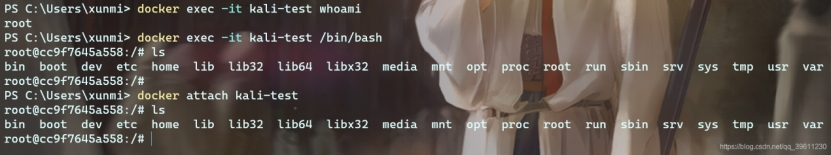 

除了上述方法外,在进入容器后,我们还可以尝试安装SSH或者nsenter尝试登陆，不过这两种方法都先进入容器安装后才能使用

但并不建议在 Docker 容器中运行 sshd

 

\# nsenter安装步骤

wget https://www.kernel.org/pub/linux/utils/util-linux/v2.24/util-linux-2.24.tar.gz  

tar -xzvf util-linux-2.24.tar.gz  

cd util-linux-2.24/  

./configure --without-ncurses  

make nsenter  

sudo cp nsenter /usr/local/bin  

 

***\*删除容器\*******\*(docker rm)\****

如我我们需要删除一个容器,首先需要确保这个容器已经停止了,因为正在运行的容器是无法直接删除。

我们可以运行一下docker ps -a,如果发现没有停止,可以使用docker stop停止(STATUS下已Exited开头则是停止的)

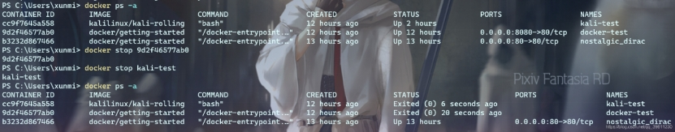 

 

\# 使用rm删除容器

docker rm 容器名或容器id

\# 列如

docker rm docker-test

 

如果报错Error response from daemon: You cannot remove a running container 容器ID. Stop the container before attempting removal or force remove则代表这个容器已经启动,需要执行 docker stop 容器id,停止此容器。

 

***\*容器制作成镜像\****

我们为什么要把容器制作成镜像?

 

镜像可以看作为是一种备份,如果我们后期环境出现了问题,可以还原到早期镜像。

镜像便于传播,可以让自己的其他设备或他人的重复利用变得更加简单容易。

 

\# 将容器制作成镜像

docker commit 容器名 镜像名

\# 镜像打包备份(打包备份的文件会自动存放在当前命令行的路径下,如果想让保存的文件可以打开,可以加.tar后缀)

docker save -o 保存的文件名 镜像名

\# 镜像解压

docker load -i 文件路径/备份文件

 

我们将打包备份的镜像可以通过网络发送到其他设备上,使用docker镜像解压即可直接使用你的环境。

 

***\*Docker Dashboard(Docker 仪表板)\****

Docker 仪表板的主要作用为:快速访问容器日志，启动容器的 shell，并轻松管理容器生命周期（停止、删除等）。

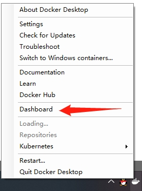 

点击小鲸鱼图标后,选择Dashboard

 

直接点击一个容器,我们可以进入容器的交互界面,其中能看到容器的log,参数,使用状况等

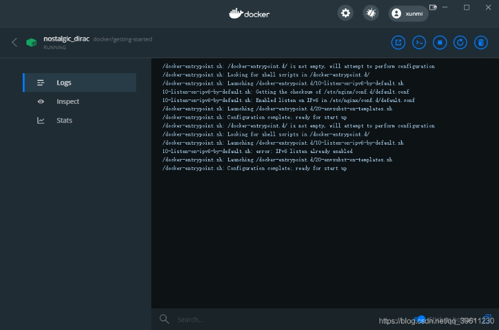 

————————————————

版权声明：本文为CSDN博主「寻_觅」的原创文章，遵循CC 4.0 BY-SA版权协议，转载请附上原文出处链接及本声明。

原文链接：https://blog.csdn.net/qq_39611230/article/details/108641842

