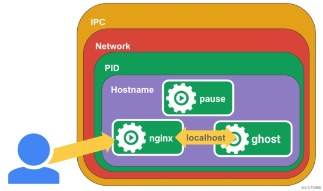

```shell
K8s集群中pause容器是干嘛的
当我们在检查k8s集群状态的时候会发现有很多 pause 容器运行于服务器上面，然后每次启动一个容器，都会伴随一个pause容器的启动。那它究竟是干啥子的？
Pause (暂停)容器，又叫Infra (在下/下文)容器，下面通过实验来理解它。我们知道在搭建k8s集群的时候，kubelet的配置中有这样一个参数：
--pod-infra-container-image=registry.cn-hangzhou.aliyuncs.com/google_containers/pause-amd64:3.1

Pause容器，是可以自己来定义，官方使用的gcr.io/google_containers/pause-amd64:3.0容器的代码见Github，使用C语言编写。

Pause容器的作用：
我们检查nod节点的时候会发现每个node上都运行了很多的pause容器，例如如下。
[root@linux-node1 cfg]# docker ps
······
······
CONTAINER ID        IMAGE                                    COMMAND                  CREATED             STATUS              PORTS               NAMES
a007c18b8dc0        568c4670fa80                             "nginx -g 'daemon of…"   42 hours ago        Up 42 hours                             k8s_nginx_nginx-pod-7d9f9876cc-75sf7_default_a688bb46-f872-11e8-ae6b-000c29c6d12b_1
9866c08d1f4b        568c4670fa80                             "nginx -g 'daemon of…"   42 hours ago        Up 42 hours                             k8s_nginx_nginx-pod-7d9f9876cc-wpv4h_default_a6a899c0-f872-11e8-ae6b-000c29c6d12b_1
aafef6727026        mirrorgooglecontainers/pause-amd64:3.0   "/pause"                 42 hours ago        Up 42 hours                             k8s_POD_flask-app-6f5b6cc447-kbxks_flask-app-extions-stage_374b8aa0-f873-11e8-ae6b-000c29c6d12b_1
c4f48f90b27f        mirrorgooglecontainers/pause-amd64:3.0   "/pause"                 42 hours ago        Up 42 hours                             k8s_POD_flask-app-6f5b6cc447-f9wjn_flask-app-extions-stage_373be9db-f873-11e8-ae6b-000c29c6d12b_1
9f452e6961f6        mirrorgooglecontainers/pause-amd64:3.0   "/pause"                 42 hours ago        Up 42 hours                             k8s_POD_nginx-pod-7d9f9876cc-ccx94_default_a6a8c440-f872-11e8-ae6b-000c29c6d12b_1
7e68043469d1        mirrorgooglecontainers/pause-amd64:3.0   "/pause"                 42 hours ago        Up 42 hours                             k8s_POD_nginx-pod-7d9f9876cc-sskpk_default_a6ac43bd-f872-11e8-ae6b-000c29c6d12b_1
······
······

每个Pod都有一个特殊的被称为“根容器”的Pause 容器。 Pause容器对应的镜像属于Kubernetes平台的一部分，除了Pause容器，每个Pod还包含一个或者多个紧密相关的用户业务容器。
```


```shell
Kubernetes设计这样的Pod概念和特殊组成结构有什么用意
o原因一：在多个Container作为一个Pod的情况下，难以对整体的容器简单地进行判断及有效地进行行动。比如，一个容器死亡了，此时是算整体挂了么？那么引入与业务无关的Pause容器作为Pod的根容器，以它的状态代表着整个容器组的状态，这样就可以解决该问题。
o原因二：Pod里的多个业务容器共享Pause容器的IP，共享Pause容器挂载的Volume，这样简化了业务容器之间的通信问题，也解决了容器之间的文件共享问题。
kubernetes中的pause容器主要为每个业务容器提供以下功能：
o在pod里担任与其他容器namespace共享的基础；
o启用pid命名空间，开启init进程，负责处理僵尸进程。
（注意：这里虽然开启了PID名称空间共享，但是在Kubelet中--docker-disable-shared-pid=true (shared 共享)关闭了PID共享，所以Pod中的每个容器都将具有自己的PID 1，并且每个容器将需要自己处理僵尸进程）
1.我们首先在节点上运行一个pause容器。
[root@k8s-node1 ~]# docker run -d --name pause -p 8880:80 registry.cn-hangzhou.aliyuncs.com/google_containers/pause-amd64:3.1
38d2aa8366d5aa6fe4c57aa0d879de4b5259c67c83d17428dd4d9f8937205c02

[root@k8s-node1 ~]# docker ps | grep pause
38d2aa8366d5        registry.cn-hangzhou.aliyuncs.com/google_containers/pause-amd64:3.1   "/pause"                 14 seconds ago      Up 13 seconds       0.0.0.0:8880->80/tcp   pause
2.然后再运行一个nginx容器，nginx将为localhost:2368创建一个代理。
[root@k8s-node1 ~]# cat <<EOF >> nginx.conf
error_log stderr;
events { worker_connections  1024; }
http {
    access_log /dev/stdout combined;
    server {
        listen 80 default_server;
        server_name example.com www.example.com;
        location / {
            proxy_pass http://127.0.0.1:2368;
        }
    }
}
EOF

[root@k8s-node1 ~]# docker run -d --name nginx -v `pwd`/nginx.conf:/etc/nginx/nginx.conf --net=container:pause --ipc=container:pause --pid=container:pause nginx
fa078473c01e040db795004ad16db525dea8a113893d3052cc6ab1c5e117ba10
3.然后再为ghost创建一个应用容器，这是一款博客软件。
[root@linux-node2 ~]# docker run -d --name ghost --net=container:pause --ipc=container:pause --pid=container:pause ghost


# 查看结果：
[root@k8s-node1 ~]# docker ps | grep -E "pause|nginx|ghost"
9b796efd95a5        ghost                                                                 "docker-entrypoint..."   47 seconds ago       Up 46 seconds                              ghost
fa078473c01e        nginx                                                                 "nginx -g 'daemon ..."   About a minute ago   Up About a minute                          nginx
38d2aa8366d5        registry.cn-hangzhou.aliyuncs.com/google_containers/pause-amd64:3.1   		  "/pause"            3 minutes ago        Up 3 minutes        0.0.0.0:8880->80/tcp       pause
[root@k8s-node1 ~]#


# 现在访问http://119.3.198.128:8880/就可以看到ghost博客的界面了
# 这里我直接curl 然后浏览器访问也是正常的
[root@k8s-node1 ~]# curl -I http://119.3.198.128:8880/
HTTP/1.1 200 OK
Server: nginx/1.15.5
Date: Fri, 07 Dec 2018 08:35:49 GMT
Content-Type: text/html; charset=utf-8
Content-Length: 17381
Connection: keep-alive
X-Powered-By: Express
Cache-Control: public, max-age=0
ETag: W/"43e5-ELHSnbaoapp3YOyz+PU502oJo5E"
Vary: Accept-Encoding

[root@k8s-node1 ~]#

```



```shell
解析:
pause 容器将内部的80端口映射到了宿主机的8880端口;
pause容器在宿主机上设置好了网络namespace后，nginx容器加入到该网络namespace中;
nginx容器启动的时候指定了--net=container:pause;
ghost容器启动的时候同样加入到了该网络namespace中;
这样三个容器就共享了网络，互相之间就可以使用localhost直接通信，
--ipc=contianer:pause --pid=container:pause就是三个容器的ipc和pid处于同一个namespace中，init进程为pause;

我们到ghost容器中查看一下:
[root@k8s-node1 ~]# docker exec -it ghost /bin/bash
root@38d2aa8366d5:/var/lib/ghost# ps aux
USER       PID %CPU %MEM    VSZ   RSS TTY      STAT START   TIME COMMAND
root         1  0.0  0.0   1012     4 ?        Ss   08:27   0:00 /pause
root         5  0.0  0.0  32472  3168 ?        Ss   08:29   0:00 nginx: master process nginx -g daemon off;
systemd+     9  0.0  0.0  32932  1812 ?        S    08:29   0:00 nginx: worker process
node        10  0.5  2.1 1262748 84688 ?       Ssl  08:30   0:03 node current/index.js
root        83  0.2  0.0  20240  1912 pts/0    Ss   08:41   0:00 /bin/bash
root        87  0.0  0.0  17496  1148 pts/0    R+   08:41   0:00 ps aux
root@38d2aa8366d5:/var/lib/ghost#

在ghost容器中同时可以看到pause和nginx容器的进程，并且pause容器的PID是1。而在kubernetes中容器的PID=1的进程即为容器本身的业务进程。
Pod中共享的名称空间：
oPID命名空间：Pod中的不同应用程序可以看到其他应用程序的进程ID；
o网络命名空间：Pod中的多个容器能够访问同一个IP和端口范围；
oIPC命名空间：Pod中的多个容器能够使用SystemV IPC或POSIX消息队列进行通信；
oUTS命名空间：Pod中的多个容器共享一个主机名；Volumes（共享存储卷）：
oPod中的各个容器可以访问在Pod级别定义的Volumes；

```

