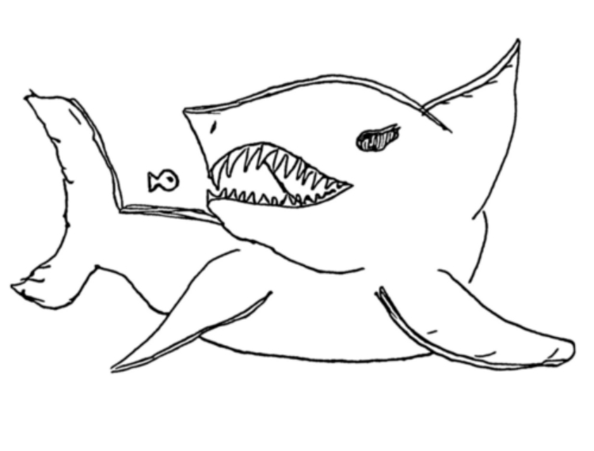

# **Kubernetes 如果是个水族馆**

 

 

Kubernetes 有很多东西，各种各样的名词，就像洋葱一样，一层一层包裹在一起。

 

许多 Kubernetes 的介绍图都是这样的，解释了涵盖的所有名词。

 

从技术上讲，它是准确的，但是对一些人而言不是很有帮助，本文将其类比于鱼类和水族馆，可能会有助于部分人将这些解析记录在脑海中。

 

这是一个应用程序。

它本身是一个完整的功能单元，但不能单独生存，因为它需要正确配置的环境。这个特殊的“鱼”程序需要水才能生存。

 

我们可以将它与所有其他应用程序一起扔到海洋中，但它必须竞争资源并应对海洋中的其他一切，因为它没有自己的专属空间和资源。

 

这就是我们进行容器化的原因。

使用类似 Docker 的工具，我们可以为应用程序提供容器，将他们分开，给予他们各自的空间。

 

这是一个 Pod，它是 Kubernetes 的基本构建单元。这是我们放置容器化应用程序的一个盒子。我们给它一个标签，以便 Kubernetes 知道它是什么以及如何使用它。

现在鱼程序已经在 Pod 中安全地进行了调配，现在可以通过 Kubernetes 水族馆进行管理。

 

 

有时候，应用程序需要资源，例如内存和 CPU。在这里，我们的鱼缸容器则是需要 60W 功率才能使用滤水器。

 

水族馆里有不同的房间可以放鱼缸。

这里的第一个房间没有更多可用资源，仅有的两个电源插座已在使用中。

 

 

第二个房间有可用的插座，但是这个房间的插座仅提供 40W 功率，而我们的鱼缸需要 60W。

这些房间是 Kubernetes 集群中的节点，也就是运行 Pod 的工作人员。

 

Kubernetes 是水族馆馆长。

他知道拥有哪些房间，有哪些资源，并可以根据这些信息来决定将新鱼缸放在哪里。在没有任何其他限制的情况下，他默认将鱼缸均匀地放置在所有房间中。

 

我们通常不会在单个鱼缸中处理单条鱼。馆长经常将鱼缸放在一起，作为一个鱼缸集合展品。

在这里，深海集合展品由一些鮟鱇鱼缸、水母缸和鱿鱼缸组成。在将它们归到集合展品中时，我们要确定需要创建多少个容器。

 

设计展品时，我们提供了有关在展品中每个项目的说明。

这里详细介绍了我们想要的每个鱼缸数量，以及在需要修复时，如何创建新鱼缸。我们列出了要填充的水量、所需的水温、需要的食物量。

 

将这些说明提供给 Kubernetes 水族馆馆长后，他可以将维护每个应用程序鱼缸的工作委托给“水族馆实习生”。

实习生的工作是确保水族馆中始终有正确数量的鱼缸。用 Kubernetes 讲，这个与 Deployment 一起创建的实习生称为副本集（Replica Set）。

 

水族馆的游客不在乎他们在看水母 A 还是水母 B，他们只是想看看水母。实习生会在水母 A 疲倦需要休息时，通过说明将水母 A 换成全新的水母 B。

在 Kubernetes 中，副本集可确保当 Pod 挂掉时，会替换一个新的 Pod，以保持有正确数量的 Pod 可用。

 

设计展品时，还有一个重要的考虑因素。目前为止，我们一直在展示这样的 Pod，一个放置容器化应用的盒子。

 

实际上，我们可以更准确地描述 Pod。从外面看，它只是带有某些标签的 Pod。至于内部，我们虽然可以通过 Kubernetes 水族馆馆长得知更多内部信息，但这对展示并没有帮助，我们的用户（水族馆访问者）要能看到该应用程序，并与之交互。

 

我们需要一种方法，允许水族馆游客观察到 Pod。我们需要打开窗口，以便他们可以观察其中的鱼。

 

在 Kubernetes 水族馆中，解决答案是 Service。Service 具有几个不同的作用，但主要作用是公开容器中的端口，以便从外部访问。

在 Pod 中通过 Service 可以让水族馆访客观察内部的鱼。

 

Service 还起到了允许 Pod 和容器相互访问的作用。如果我们希望两个水箱中的鱼能够来回交换水和食物，可以设置 Service 来实现这种交互。

 

网络策略（Network Policy）是我们可以应用的另一种方式。

在这里，它是一个单向阀，能使该鱼缸的水向外流动，但不能向内流动。

 

Config Map 是 Pod 进行操作所需的一组变量或值。鱼儿需要食物才能生活，我们将设备安装在容器上。

我们还会看到透明和不透明的 Config Map，它们分别代表了普通信息和机密信息。Kubernetes 还有很多其他内容，以上这些是构成水族馆，以及描述馆长工作的基本构件。

 

原文链接：https://medium.com/@AnneLoVerso/the-kubernetes-aquarium-6a3d1d7a2afd