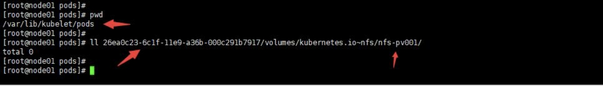

```shell
PV、PVC、StorageClass讲解

PV、PVC、StorageClass讲解 - 昀溪 - 博客园 (cnblogs.com)
为了方便开发人员更加容易的使用存储才出现的概念。通常我们在一个POD中定义使用存储是这样的方式，我们以hostpath类型来说：
apiVersion: v1
kind: Pod
metadata:
  name: mypod
spec:
  containers:
  - image: nginx
    name: mynginx
    volumeMounts:
    - mountPath: /usr/share/nginx/html
      name: html
  volumes:
  - name: html # 名称
    hostPath: # 存储类型
      path: /data # 物理节点上的真实路径
      type: Directory # 如果该路径不存在讲如何处理，Directory是要求目录必须存在
其实通过上面可以看出来，无论你使用什么类型的存储你都需要手动定义，指明存储类型以及相关配置。这里的hostpath类型还是比较简单的，如果是其他类型的比如分布式存储，那么这对开发人员来说将会是一种挑战，因为毕竟真正的存储是由存储管理员来设置的他们会更加了解，那么有没有一种方式让我们使用存储更加容易，对上层使用人员屏蔽底层细节呢？答案是肯定的，这就是PV、PVC的概念。不过需要注意的是我们在集群中通常不使用hostPath、emptyDir这种类型，除非你只是测试使用。
什么是PV
PV全称叫做Persistent Volume，持久化存储卷。它是用来描述或者说用来定义一个存储卷的，这个通常都是有运维或者数据存储工程师来定义。比如下面我们定义一个NFS类型的PV：
apiVersion: v1
kind: PersistentVolume
metadata:  # PV建立不要加名称空间，因为PV属于集群级别的
  name: nfs-pv001  # PV名称
  labels: # 这些labels可以不定义
    name: nfs-pv001
    storetype: nfs
spec:  # 这里的spec和volumes里面的一样
  storageClassName: normal
  accessModes:  # 设置访问模型
    - ReadWriteMany
    - ReadWriteOnce
    - ReadOnlyMany
  capacity: # 设置存储空间大小
    storage: 500Mi
  persistentVolumeReclaimPolicy: Retain # 回收策略
  nfs:
    path: /work/volumes/v1
    server: stroagesrv01.contoso.com
accessModes：支持三种类型
ReadWriteMany 多路读写，卷能被集群多个节点挂载并读写
ReadWriteOnce 单路读写，卷只能被单一集群节点挂载读写
ReadOnlyMany 多路只读，卷能被多个集群节点挂载且只能读
这里的访问模型总共有三种，但是不同的存储类型支持的访问模型不同，具体支持什么需要查询官网。比如我们这里使用nfs，它支持全部三种。但是ISCI就不支持ReadWriteMany；HostPath就不支持ReadOnlyMany和ReadWriteMany。
persistentVolumeReclaimPolicy：也有三种策略，这个策略是当与之关联的PVC被删除以后，这个PV中的数据如何被处理
Retain 当删除与之绑定的PVC时候，这个PV被标记为released（PVC与PV解绑但还没有执行回收策略）且之前的数据依然保存在该PV上，但是该PV不可用，需要手动来处理这些数据并删除该PV。
Delete 当删除与之绑定的PVC时候
Recycle 这个在1.14版本中以及被废弃，取而代之的是推荐使用动态存储供给策略，它的功能是当删除与该PV关联的PVC时，自动删除该PV中的所有数据
注意：PV必须先于POD创建，而且只能是网络存储不能属于任何Node，虽然它支持HostPath类型但由于你不知道POD会被调度到哪个Node上，所以你要定义HostPath类型的PV就要保证所有节点都要有HostPath中指定的路径。
PVC
PVC是用来描述希望使用什么样的或者说是满足什么条件的存储，它的全称是Persistent Volume Claim，也就是持久化存储声明。开发人员使用这个来描述该容器需要一个什么存储。比如下面使用NFS的PVC：
apiVersion: v1
kind: PersistentVolumeClaim
metadata:
  name: nfs-pvc001
  namespace: default
  labels: # 这些labels可以不定义
    name: nfs-pvc001
    storetype: nfs
    capacity: 500Mi
spec:
  storageClassName: normal
  accessModes:  # PVC也需要定义访问模式，不过它的模式一定是和现有PV相同或者是它的子集，否则匹配不到PV
  - ReadWriteMany
  resources: # 定义资源要求PV满足这个PVC的要求才会被匹配到
    requests:
      storage: 500Mi  # 定义要求有多大空间
这个PVC就会和上面的PV进行绑定，为什么呢？它有一些原则：
1.PV和PVC中的spec关键字段要匹配，比如存储（storage）大小。
2.PV和PVC中的storageClassName字段必须一致，这个后面再说。
上面的labels中的标签只是增加一些描述，对于PVC和PV的绑定没有关系
```


```shell
应用了上面的PV和PVC，可以看到自动绑定了。
在POD中如何使用PVC呢
apiVersion: apps/v1
kind: Deployment
metadata:
  name: tomcat-deploy
spec:
  replicas: 1
  selector:
    matchLabels:
      appname: myapp
  template:
    metadata:
      name: myapp
      labels:
        appname: myapp
    spec:
      containers:
      - name: myapp
        image: tomcat:8.5.38-jre8
        ports:
        - name: http
          containerPort: 8080
          protocol: TCP
        volumeMounts:
          - name: tomcatedata
            mountPath : "/data"
      volumes:
        - name: tomcatedata
          persistentVolumeClaim:
            claimName: nfs-pvc001
这里通过volumes来声明使用哪个PVC，可以看到和自己定义持久化卷类似，但是这里更加简单了，直接使用PVC的名字即可。在容器中使用/data目录就会把数据写入到NFS服务器上的目录中。
当我们删除那个PVC的时候，该PV变成Released状态，由于我们的策略是Retain，所以如果想让这个PV变为可用我们就需要手动清理数据并删除这个PV。这里你可能会觉得矛盾，你让这个PV变为可用，为什么还要删除这个PV呢？其实所谓可用就是删除这个PV然后建立一个同名的。
```


```shell
可以看出来PVC就相当于是容器和PV之间的一个接口，使用人员只需要和PVC打交道即可。另外你可能也会想到如果当前环境中没有合适的PV和我的PVC绑定，那么我创建的POD不就失败了么？的确是这样的，不过如果发现这个问题，那么就赶快创建一个合适的PV，那么这时候持久化存储循环控制器会不断的检查PVC和PV，当发现有合适的可以绑定之后它会自动给你绑定上然后被挂起的POD就会自动启动，而不需要你重建POD。
什么是持久化存储
我们知道所谓容器挂载卷就是将宿主机的目录挂载到容器中的某个目录。而持久化则意味着这个目录里面的内容不会因为容器被删除而清除，也不会和当前宿主机有什么直接关系，而是一个外部的。这样当POD重建以后或者在其他主机节点上启动后依然可以访问这些内容。不过之前说过hostPath和emptyDir不推荐使用，因为前者和当前宿主机有必然联系而后者就是一个随POD删除而被删除的临时目录。
宿主机是如何挂载远程目录的
挂载过程会有不同，这取决于远程存储的类型，它是块设备存储还是文件设备存储。但是不管怎么样POD有这样一个目录
/var/lib/kubelet/pods/<Pod 的 ID>/volumes/kubernetes.io~<Volume 类型 >/<Volume 名字 > 这个目录是POD被调度到该节点之后，由kubelet为POD创建的。因为它一定会被创建，因为系统中的默认secret就会被挂载到这里。之后就要根据存储设备类型的不同做不同处理。
文件存储设备
以nfs这种文件设备存储来说。我们依然启动之前的容器继续使用之前的PVC。
```


```shell
由于这个POD运行在node01节点，我们登陆node01节点，查看这个目录 /var/lib/kubelet/pods/<Pod 的 ID>/volumes/kubernetes.io~<Volume 类型 >/<Volume 名字 > 当你创建POD的时候它由于它被调度到node01节点，所以会创建这个目录，而且根据YAML中的定义就也会在这个目录中创建你在volumesMount中定义的目录，如下图：
```



通过命令查看在本地宿主机的挂载情况


```shell
由于创建了必要的目录，那么kubelet就直接使用mount命令把nfs目录挂载到这个目录上 volumes/kubernetes.io~<type>/<Volume 名字> , 注意这时候仅仅是把这个远程存储挂载到宿主机目录上，要想让容器使用还需要做调用相关接口来把这个宿主机上的目录挂载到容器上。所以当准备好之后启动容器的时候就是利用CRI里的mounts参数把这个宿主机的目录挂载到容器中指定的目录上，就相当于执行 docker run -v
不过需要注意的是由于nfs文件存储不是一个块设备，所以宿主机系统需要扮演的就是nfs客户端角色，kubelet就是调用这个客户端工具来完成挂载的。

块存储设备
块存储设备你可以理解为一个磁盘。这个的处理要稍微复杂一点，就好像你为Linux服务器添加一块磁盘一样，你得先安装然后分区格式化之后挂载到某个目录使用。 /var/lib/kubelet/pods/<Pod 的 ID>/volumes/kubernetes.io~<Volume 类型 >/<Volume 名字 > 这个目录依然会创建。当POD被调度到该节点上会做如下操作
1.首先要安装一个块设备存储到宿主机（不是物理安装，而是通过API来安装），如何安装取决于不同块存储设备的API，很多云厂商有这种块存储设备比如Google的GCE。/dev/vdb
2.格式化磁盘， mkfs.ext4 /dev/vdb
3.把格式化好的磁盘设备挂载到宿主机上的目录 mount /dev/vdb /var/lib/kubelet/pods/<Pod 的 ID>/volumes/kubernetes.io~<Volume 类型 >/<Volume 名字 > 
4.启动容器挂载宿主机上的目录到容器中 docker run -v
相对于文件设备存储来说块设备要稍微复杂一点，不过上面这些过程都是自动的有kubelet来完成。
小结
负责把PVC绑定到PV的是一个持久化存储卷控制循环，这个控制器也是kube-manager-controller的一部分运行在master上。而真正把目录挂载到容器上的操作是在POD所在主机上发生的，所以通过kubelet来完成。而且创建PV以及PVC的绑定是在POD被调度到某一节点之后进行的，完成这些操作，POD就可以运行了。下面梳理一下挂载一个PV的过程：
1.用户提交一个包含PVC的POD
2.调度器把根据各种调度算法把该POD分配到某个节点，比如node01
3.Node01上的kubelet等待Volume Manager准备存储设备
4.PV控制器调用存储插件创建PV并与PVC进行绑定
5.Attach/Detach Controller或Volume Manager通过存储插件实现设备的attach。（这一步是针对块设备存储）
6.Volume Manager等待存储设备变为可用后，挂载该设备到 /var/lib/kubelet/pods/<Pod 的 ID>/volumes/kubernetes.io~<Volume 类型 >/<Volume 名字 > 目录上
7.Kubelet被告知卷已经准备好，开始启动POD，通过映射方式挂载到容器中
StorageClass
PV是运维人员来创建的，开发操作PVC，可是大规模集群中可能会有很多PV，如果这些PV都需要运维手动来处理这也是一件很繁琐的事情，所以就有了动态供给概念，也就是Dynamic Provisioning。而我们上面的创建的PV都是静态供给方式，也就是Static Provisioning。而动态供给的关键就是StorageClass，它的作用就是创建PV模板。
创建StorageClass里面需要定义PV属性比如存储类型、大小等；另外创建这种PV需要用到存储插件。最终效果是，用户提交PVC，里面指定存储类型，如果符合我们定义的StorageClass，则会为其自动创建PV并进行绑定。
我们这里演示一下NFS的动态PV创建
kubernetes本身支持的动态PV创建不包括nfs，所以需要使用额外插件实现。nfs-client
我这里就按照网站的例子来创建，里面的内容毫无修改，当然你需要自己准备NFS服务器。由于用于提供动态创建PV的程序是运行在POD中，所以你需要保证你的Kubernetes节点到NFS的网络通畅，我这里就在我的Kubernetes集群的某个节点上建立的NFS服务。下面是PVC文件
apiVersion: v1
kind: PersistentVolumeClaim
metadata:
  name: mytomcat-pvc
spec:
  storageClassName:  managed-nfs-storage
  accessModes:
    - ReadWriteMany
  resources: 
    requests:
      storage: 500Mi
当你应用这个PVC的时候，由于例子中的storageClassName也是managed-nfs-storage（当然这个名字你可以修改）就会去自动创建PV。
```


下图是在Node02这个节点上看到的


下图是在Node02这个节点上看到的 (搭建的NFS服务端)


```shell
基于这种形式，我们只需要根据我们有的存储系统来定义StorageClass，通过名称来标识不同种类的存储，比如SSD、block-device这种名称，而不需要定义具体大小。那么使用人员就可以根据需要通过StorageClass的名字来使用，从而实现动态创建PV的过程。
这里有个要求就是你的存储系统需要提供某种接口来让controller可以调用并传递进去PVC的参数去创建PV，很多云存储都支持。可是也有不支持的，比如NFS就不支持所以我们需要一个单独的插件来完成这个工作。也就是例子中使用的 quay.io/external_storage/nfs-client-provisioner 镜像，但是创建PV也需要相关权限，也就是例子中rabc.yaml部分。在定义StorageClass中有一个叫做 provisioner: fuseim.pri/ifs 这个就是插件的名称，这个名称其实也就是官方例子中deployment中设置的名字，这个名字你可以修改。
当然我们说过有些本身就支持，比如下面的kubernetes官网中的一个AWS的例子：
kind: StorageClass
apiVersion: storage.k8s.io/v1
metadata:
  name: slow
provisioner: kubernetes.io/aws-ebs
parameters:
  type: io1
  iopsPerGB: "10"
  fsType: ext4
kubernetes.io/aws-ebs 就是kubernetes内置的存储插件名称，如果你使用aws就用这个名称就好。因为kubernetes就会去调用AWS的API来创建存储然后在创建PV。
这里你可能会有个疑问，为什么开篇的例子里面也用了 storageClassName: normal，可是我们并没有定义任何StorageClass。其实虽然我们使用了，但是系统上并没有一个叫做normal的存储类，这时候还是静态绑定，只是绑定的时候它会考虑你的PV和PVC中的存储类名称是否一致。当然如果是静态绑定你可以不写 storageClassName，因为如果开起一个的叫做DefaultStorageClassplugin插件就会默认有这样一个存储类，它会自动添加到你的任何没有明确声明storageClassName的PV和PVC中。
本地持久化存储
本地持久化存储（Local Persistent Volume）就是把数据存储在POD运行的宿主机上，我们知道宿主机有hostPath和emptyDir，由于这两种的特定不适用于本地持久化存储。那么本地持久化存储必须能保证POD被调度到具有本地持久化存储的节点上。
为什么需要这种类型的存储呢？有时候你的应用对磁盘IO有很高的要求，网络存储性能肯定不如本地的高，尤其是本地使用了SSD这种磁盘。
但这里有个问题，通常我们先创建PV，然后创建PVC，这时候如果两者匹配那么系统会自动进行绑定，哪怕是动态PV创建，也是先调度POD到任意一个节点，然后根据PVC来进行创建PV然后进行绑定最后挂载到POD中，可是本地持久化存储有一个问题就是这种PV必须要先准备好，而且不一定集群所有节点都有这种PV，如果POD随意调度肯定不行，如何保证POD一定会被调度到有PV的节点上呢？这时候就需要在PV中声明节点亲和，且POD被调度的时候还要考虑卷的分布情况。
定义PV
apiVersion: v1
kind: PersistentVolume
metadata:
  name: example-pv
spec:
  capacity:
    storage: 5Gi
  volumeMode: Filesystem
  accessModes:
  - ReadWriteOnce
  persistentVolumeReclaimPolicy: Delete
  storageClassName: local-storage
  local: # local类型
    path: /data/vol1  # 节点上的具体路径
  nodeAffinity: # 这里就设置了节点亲和
    required:
      nodeSelectorTerms:
      - matchExpressions:
        - key: kubernetes.io/hostname
          operator: In
          values:
          - node01 # 这里我们使用node01节点，该节点有/data/vol1路径
如果你在node02上也有/data/vol1这个目录，上面这个PV也一定不会在node02上，因为下面的nodeAffinity设置了主机名就等于node01。
另外这种本地PV通常推荐使用的是宿主机上单独的硬盘设备，而不是和操作系统共有一块硬盘，虽然可以这样用。
定义存储类

kind: StorageClass
apiVersion: storage.k8s.io/v1
metadata:
  name: local-storage
provisioner: kubernetes.io/no-provisioner
volumeBindingMode: WaitForFirstConsumer
这里的volumeBindingMode: WaitForFirstConsumer很关键，意思就是延迟绑定，当有符合PVC要求的PV不立即绑定。因为POD使用PVC，而绑定之后，POD被调度到其他节点，显然其他节点很有可能没有那个PV所以POD就挂起了，另外就算该节点有合适的PV，而POD被设置成不能运行在该节点，这时候就没法了，延迟绑定的好处是，POD的调度要参考卷的分布。当开始调度POD的时候看看它要求的LPV在哪里，然后就调度到该节点，然后进行PVC的绑定，最后在挂载到POD中，这样就保证了POD所在的节点就一定是LPV所在的节点。所以让PVC延迟绑定，就是等到使用这个PVC的POD出现在调度器上之后（真正被调度之前），然后根据综合评估再来绑定这个PVC。
定义PVC

kind: PersistentVolumeClaim
apiVersion: v1
metadata:
  name: local-claim
spec:
  accessModes:
  - ReadWriteOnce
  resources:
    requests:
      storage: 5Gi
  storageClassName: local-storage

```


```shell
可以看到这个PVC是pending状态，这也就是延迟绑定，因为此时还没有POD。
定义POD

apiVersion: apps/v1
kind: Deployment
metadata:
  name: tomcat-deploy
spec:
  replicas: 1
  selector:
    matchLabels:
      appname: myapp
  template:
    metadata:
      name: myapp
      labels:
        appname: myapp
    spec:
      containers:
      - name: myapp
        image: tomcat:8.5.38-jre8
        ports:
        - name: http
          containerPort: 8080
          protocol: TCP
        volumeMounts:
          - name: tomcatedata
            mountPath : "/data"
      volumes:
        - name: tomcatedata
          persistentVolumeClaim:
            claimName: local-claim

```


```shell
这个POD被调度到node01上，因为我们的PV就在node01上，这时候你删除这个POD，然后在重建该POD，那么依然会被调度到node01上。
总结：本地卷也就是LPV不支持动态供给的方式，延迟绑定，就是为了综合考虑所有因素再进行POD调度。其根本原因是动态供给是先调度POD到节点，然后动态创建PV以及绑定PVC最后运行POD；而LPV是先创建与某一节点关联的PV，然后在调度的时候综合考虑各种因素而且要包括PV在哪个节点，然后再进行调度，到达该节点后在进行PVC的绑定。也就说动态供给不考虑节点，LPV必须考虑节点。所以这两种机制有冲突导致无法在动态供给策略下使用LPV。换句话说动态供给是PV跟着POD走，而LPV是POD跟着PV走。

```

