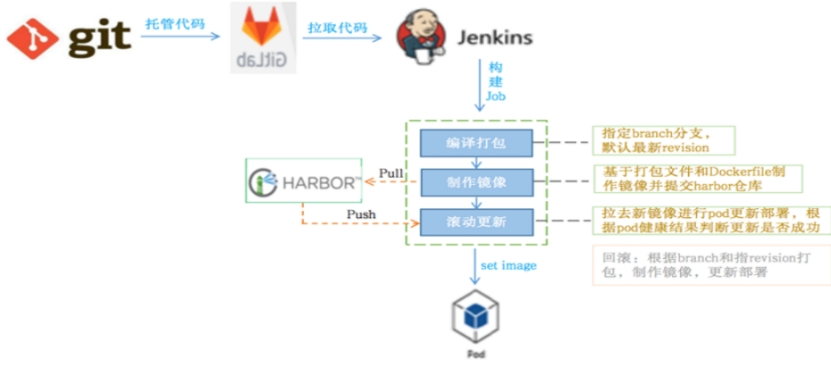

[Pod容器应用"优雅发布" - 运维笔记 - 云+社区 - 腾讯云 (tencent.com)](https://cloud.tencent.com/developer/article/1751884?from=15425)

 

Pod容器应用"优雅发布" - 运维笔记

K8S自身带有优雅终止Pod容器的机制，发送SIGTERM终止信号，在规定的terminationGracePeriodSeconds优雅时间内完成Pod优雅终止动作。

terminationGracePeriodSeconds默认是30秒，该时间是从Pod的Termination状态开始计算的，包括了Prestop钩子处理时间、SIGTERM信号发送即程序优雅处理时间。

***\*Pod容器终止流程：\**** 1）新Pod启动，通过Readiness就绪性探测，加入service的endpoint服务列表。

2）老pod进入Termination状态，从service的endpoint服务列表摘除，此时不会有新请求打到即将终止的老pod上。

3）如果设置了Prestop钩子，则优先执行Prestop里的优雅动作。如果在规定的terminationGracePeriodSeconds优雅时间内（默认30s）完成不了，则kubelet会发送SIGTERM终止信号，并等待2秒，如果2秒后还未终止pod容器，则发送SIGKILL信号强制终止。

4）如果没有设置Prestop钩子，则发送SIGTERM终止信号优雅关闭容器进程，如果在规定的terminationGracePeriodSeconds优雅时间内（默认30s）未能终止pod容器，则发送SIGKILL信号强制终止。

***\*需要注意：\****

1）SIGTERM终止信号只能被那些pid为1的父进程捕捉到，并优雅关闭容器进程。对于那些pid不为1的子进程是捕捉不到SIGTERM终止信号的。

所以对于单个容器只有一个pid为1的进程来说，使用K8S默认的优雅机制就可以，只需要拉长terminationGracePeriodSeconds优雅时间，确保在规定时间内完成容器优雅终止。

2）对于那些单个容器里有多个进程，即除了pid为1的进程外，还有子进程。这种情况下就需要设置Prestop钩子函数，在prestop里提前优雅处理掉那些子进程，然后再通过SIGTERM正常终止掉pod容器。

注意设置好terminationGracePeriodSeconds优雅时间。

***\*线上基于nacos注册中心的优雅上线\****

对于请求通过k8s的service层到达pod容器的情况，可以通过k8s优雅机制来确保pod容器在上线滚动更新期间，做到业务"无感知"。但是目前线上pod[容器服务](https://cloud.tencent.com/product/tke?from=10680)主动注册到nacos配置中心，业务方通过nacos网关调用pod容器服务，即调用请求绕过了k8s的service层。

这就出现了一个问题：pod容器更新期间，老pod已经优雅终止掉了，但是其ip和端口还在nacos的网关缓存里，调用请求会在nacos网关缓存未完全更新之前打到已经终止掉的pod地址，这就会出现连接超时，调用失败错误，从而造成业务流量损失。

***\*正确的做法：\****

1）拉长terminationGracePeriodSeconds的优雅时间。

2）设置Prestop钩子，在Pod容器终止之前，在Prestop里通过nacos提供的API接口，主动摘除nacos注册。接着sleep 30秒时间，用于刷新nacos网关缓存，摘除下线的pod地址。

3）最后再执行pod容器的优雅终止。

```shell
[root@k8s-storage01 ~]# ls /home/k8s_deploy/fin/online/deploy/customer-services/
Dockerfile  service_offline_nacos.sh customer-services.jar

[root@k8s-storage01 ~]# cat /home/k8s_deploy/fin/online/deploy/customer-services/service_offline_nacos.sh
#!/bin/bash
 
serviceName="customer-services"
groupName="kevin-app"
metadata="preserved.register.source=SPRING_CLOUD"
namespaceId="online"
port="9810"
Token=$(curl -s --location --request POST 'http://nacos:8848/nacos/v1/auth/users/login' --form 'username=nacos' --form 'password=nacos'|awk -F"accessToken" '{print $2}'|awk -F":" '{print $2}'|awk -F'"' '{print $2}')
 
# 从nacos注册中心下线
curl --location --request PUT "http://nacos:8848/nacos/v1/ns/instance?&accessToken=${Token}" \
--form "serviceName=${serviceName}" \
--form "clusterName=DEFAULT" \
--form "groupName=${groupName}" \
--form "metadata=${metadata}" \
--form "namespaceId=${namespaceId}" \
--form "ip=${podip}" \
--form "port=${port}" \
--form "ephemeral=true" \
--form "weight=1" \
--form "enabled=false"
 
# 等待30s，刷新nacos网关缓存
sleep 30

```

***\*容器优雅发布的配置记录：\**** 这里以customer-services应用模块的pod容器优雅配置为例：

***\*1）将nacos主动下线的脚本在镜像制作阶段推送到容器内部\**** 编写customer-services主动下线nacos的脚本：

制作finhub-customer-services服务的容器镜像

```shell
[root@k8s-storage01 ~]# cat /home/k8s_deploy/fin/online/deploy/customer-services/Dockerfile
FROM 172.16.60.196/kevin/jdk1.8.0_192
RUN rm -f /etc/localtime \
&& ln -sv /usr/share/zoneinfo/Asia/Shanghai /etc/localtime \
&& echo "Asia/Shanghai" > /etc/timezone
 
ENV LANG en_US.UTF-8

COPY customer-services.jar /usr/local/src
COPY service_offline_nacos.sh /opt/
WORKDIR /usr/local/src
EXPOSE 9810
CMD ["nohup","java","-jar","customer-services.jar","&"]

```

制作和推送镜像

```shell
[root@k8s-storage01 ~]# docker build -t 172.16.60.196/kevin/customer-services_v1 . 
[root@k8s-storage01 ~]# docker push 172.16.60.196/kevin/customer-services_v1

```

***\*2）配置pod的yml部署文件，添加env变量动态获取pod ip地址、拉长terminationGracePeriodSeconds优雅时间、设置prestop钩子\****

```shell
[root@k8s-master01 customer-services]# pwd
/opt/k8s/k8s-project/kevin/customer-services
 
[root@k8s-master01 customer-services]# cat customer-services.yml
apiVersion: v1
kind: Service
metadata:
  name: customer-services
  namespace: kevin
  labels:
    app: customer-services
spec:
  type: NodePort
  selector:
    app: customer-services
  ports:
  - name: http
    port: 9810
    targetPort: 9810
    nodePort: 39810
---
apiVersion: apps/v1
kind: Deployment
metadata:
  name: customer-services
  namespace: kevin
spec:
  replicas: 2
  minReadySeconds: 10
  strategy:
    rollingUpdate:
      maxSurge: 1
      maxUnavailable: 0
    type: RollingUpdate
  selector:
    matchLabels:
      app: customer-services
  template:
    metadata:
      labels:
        app: customer-services
    spec:
      affinity:
        podAntiAffinity:
          requiredDuringSchedulingIgnoredDuringExecution:
            - labelSelector:
                matchExpressions:
                  - key: "app"
                    operator: In
                    values:
                      - customer-services
              topologyKey: "kubernetes.io/hostname"
      terminationGracePeriodSeconds: 60
      containers:
      - name: customer-services
        image: 172.16.60.196/kevin/customer-services_v1
        imagePullPolicy: Always
        ports:
        - name: customer-port
          containerPort: 9810
        env:
        - name: podip
          valueFrom:
            fieldRef:
              fieldPath: status.podIP
        resources:
          requests:
            cpu: 950m
            memory: 2048Mi
          limits:
            cpu: 1500m
            memory: 4096Mi
        lifecycle:
          postStart:
            exec:
              command: ["/bin/sh","-c","touch /tmp/health"]
          preStop:
            exec:
              command: ["/bin/sh","-c","sh /opt/service_offline_nacos.sh"]
        livenessProbe:
          exec:
            command: ["test","-e","/tmp/health"]
          initialDelaySeconds: 5
          timeoutSeconds: 5
          periodSeconds: 10
        readinessProbe:
          tcpSocket:
            port: customer-port
          initialDelaySeconds: 15
          timeoutSeconds: 5
          periodSeconds: 20
        volumeMounts:
        - name: customerlog
          mountPath: /var/log/customer-services
          readOnly: false
      volumes:
      - name: customerlog
        hostPath:
          path: /var/log/k8s_log/customer-services

```

***\*容器发布流程：\****

 

生产环境通过Jenkins配置的Pod容器部署流程：即从Gitlab拉取代码、打包、制作镜像、上传镜像到Harbor仓库、更新pod等发布流程。完成如上配置，后续通过Jenkins进行"容器应用的优雅"发版了。