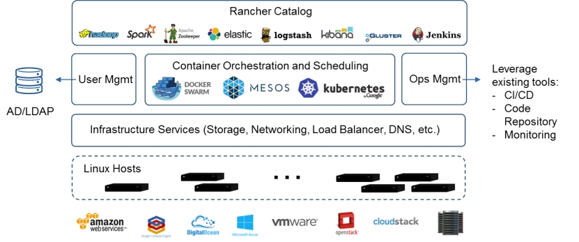
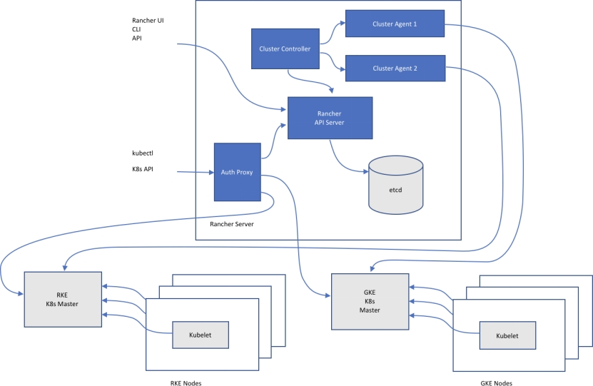
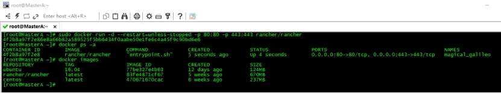
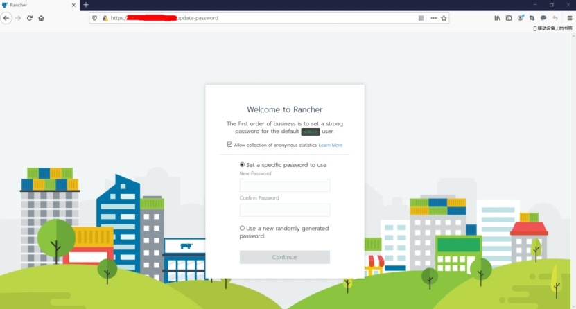
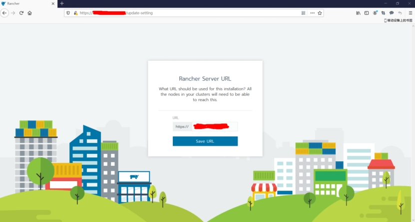
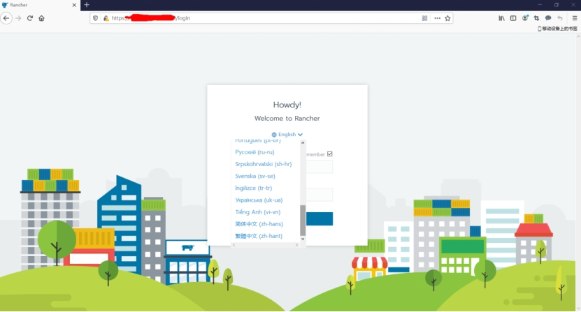
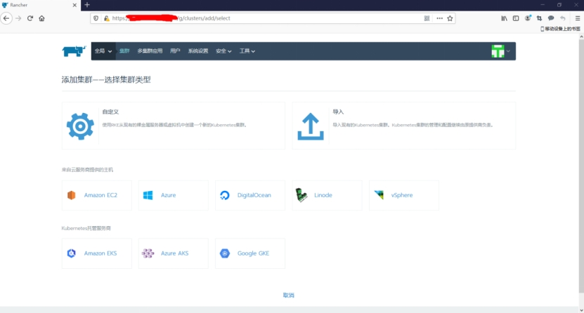

***\*文章目录\**** 

· [1、什么是Rancher？](#1Rancher)

· [2、Rancher v1和v2的区别](#2Rancher_v1v2)

· [3、Rancher基础架构](#3Rancher)

· [4、Rancher API服务器](#4Rancher_API)

· [5、集群控制和Agent](#5Agent)

· [6、认证代理](#6)

· [7、Rancher安装](#7Rancher)

***\*1、什么是Rancher？\****

Rancher官网地址：https://docs.rancher.cn/

Github地址：https://github.com/rancher/

Rancher是一套容器管理平台，它可以帮助组织在生产环境中轻松快捷的部署和管理容器。 Rancher可以轻松地管理各种环境的Kubernetes，满足IT需求并为DevOps团队提供支持。Kubernetes不仅已经成为的容器编排标准，它也正在迅速成为各类云和虚拟化厂商提供的标准基础架构。Rancher用户可以选择使用Rancher Kubernetes Engine(RKE)创建Kubernetes集群，也可以使用GKE，AKS和EKS等云Kubernetes服务。 Rancher用户还可以导入和管理现有的Kubernetes集群。

Rancher支持各类集中式身份验证系统来管理Kubernetes集群。例如，大型企业的员工可以使用其公司Active Directory凭证访问GKE中的Kubernetes集群。IT管理员可以在用户，组，项目，集群和云中设置访问控制和安全策略。 IT管理员可以在单个页面对所有Kubernetes集群的健康状况和容量进行监控。

Rancher为DevOps工程师提供了一个直观的用户界面来管理他们的服务容器，用户不需要深入了解Kubernetes概念就可以开始使用Rancher。 Rancher包含应用商店，支持一键式部署Helm和Compose模板。Rancher通过各种云、本地生态系统产品认证，其中包括安全工具，监控系统，容器仓库以及存储和网络驱动程序。下图说明了Rancher在IT和DevOps组织中扮演的角色。每个团队都会在他们选择的公共云或私有云上部署应用程序。

 

***\*2、Rancher v1和v2的区别\****

Rancher目前分为v1和v2版本，v1版本主要有四个部分组成：基础设施编排、容器编排与调度、应用商店、企业级权限管理。特别是Rancher 1.6提供的编排工具Cattle得到了许多用户的青睐。在Cattle中，你有一个环境，它是管理和计算的边界，即你可以指定权限的最低层级；重要的是，该环境中所有的主机都是专用于此环境。然后，为了组织你的容器，你需要有一个堆栈（Stack），它是一个服务集合的逻辑分组，以及一个作为特定运行镜像的服务。都是提供容器调度与编排，不同之处在于在k8s盛行之前有许多人都搞过容器编排，所以rancher v1上会有几种不同的编排模式，例如cattle ,swarm,kubernetes。从这里可以看出Rahcner v1时代，它给自己的定位是各种编排工具的上层，也就是k8s的上层，然后你再通过它去管理k8s。

因为k8s后来发展得势不可挡，所以Rancher v2应运而生，移除了其他类型的编排工具，只剩下k8s。而到了2.0版本以后、首先是保留了v1.6版本的友好功能如UI和应用商店。同时也增加了很多新的功能、例如：内置CI/CD、告警和日志手机、多集群管理、Rancher Kubernetes Engine（RKE）、与云Kubernetes服务（如GKE、EKS和AKS）集成。

***\*3、Rancher基础架构\****

大多数Rancher2.0软件运行在Rancher Server节点上,Rancher Server包括用于管理整个Rancher部署的所有组件。下图说明了Rancher2.0的运行架构。该图描绘了管理两个Kubernetes集群的Rancher Server安装:一个由RKE创建，另一个由GKE创建。

 

***\*4、Rancher API服务器\****

Rancher API server建立在嵌入式Kubernetes API服务器和etcd数据库之上。它实现了以下功能:

**·** ***\*Rancher API服务器\****

Rancher API server管理与外部身份验证提供程序(如Active Directory或GitHub)对应的用户身份

**·** ***\*认证授权\****

Rancher API server管理访问控制和安全策略

**·** ***\*项目\****

项目是集群中的一组多个命名空间和访问控制策略的集合

**·** ***\*节点\****

Rancher API server跟踪所有集群中所有节点的标识。

***\*5、集群控制和Agent\****

集群控制器和集群代理实现管理Kubernetes集群所需的业务逻辑、主要通过两个方面来实现：

集群控制器实现Rancher安装所需的全局逻辑。它执行以下操作：

· 为集群和项目配置访问控制策略

· 通过调用以下方式配置集群：所需的Docker machine驱动程序；像RKE和GKE这样的Kubernetes引擎。

单独的集群代理实例实现相应集群所需的逻辑。它执行以下活动:

· 工作负载管理，例如每个集群中的pod创建和部署

· 绑定并应用每个集群全局策略中定义的角色

· 集群与Rancher Server之间的通信:事件，统计信息，节点信息和运行状况

***\*6、认证代理\****

该认证代理转发所有Kubernetes API调用。它集成了身份验证服务，如本地身份验证，Active Directory和GitHub。在每个Kubernetes API调用中，身份验证代理会对调用方进行身份验证，并在将调用转发给Kubernetes主服务器之前设置正确的Kubernetes模拟标头。Rancher使用服务帐户与Kubernetes集群通信。

***\*7、Rancher安装\****

这里我们可以通过如下命令快速安装Rancher2.4：

```shell
sudo docker run -d --restart=unless-stopped -p 80:80 -p 443:443 rancher/rancher

```


命令执行完成之后我们可以通过 docker ps -a 或者 docker ps 命令查看rancher状态：

 

然后我们可以通过docker宿主机的IP地址+80端口访问Rancher提供的WEB管理界面，进入之后我们首先需要初始化Rancher密码：

 

然后系统会提示我们配置URL地址（这里可以配置成IP地址或者配置成域名）：

 

保存之后会自动进入Rancher主界面（默认的主界面是英文界面、如果需要中文界面、我们需要点击右上角的退出、在重新登录界面选择系统语言为：简体中文），然后输入管理员账号admin和刚才配置的密码即可：

 

现在我们就已经成功进入Rancher啦、就是这么简单。点击首页的添加集群、我们可以看到、Rancher支持快速自定义Kubernetes集群、导入现有Kubernetes集群环境；同时还支持来自云服务商提供的主机、Kubernetes托管服务商等多种类型、现在就可以随意使用Rancher服务啦。

 

更多系统配置请参考官方文档：https://docs.rancher.cn/

 