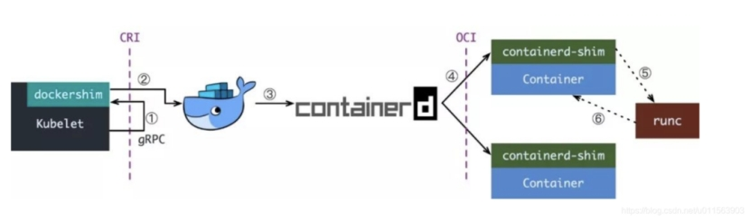
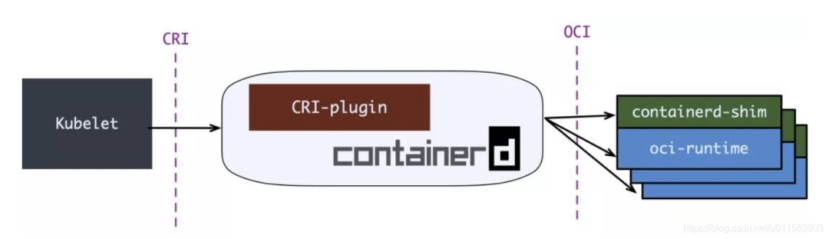
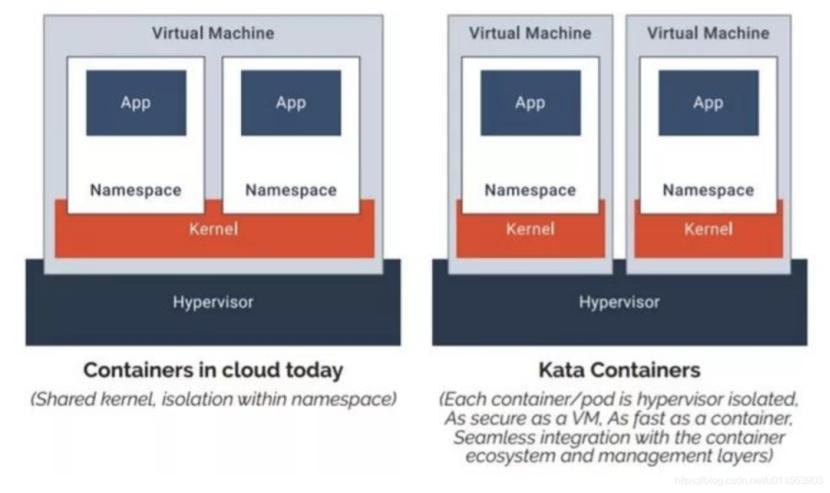

## **浅析 k8s 容器运行时演进**

 

在docker/k8s时代，经常听到CRI, OCI，containerd和各种shim等名词，看完本篇博文，您会有个彻底的理解。

 

## **典型的K8S Runtime架构**

 

从最常见的Docker说起，kubelet和Docker的集成方案图如下：

 

当kubelet要创建一个容器时，需要以下几步：

 

\1. Kubelet 通过 CRI 接口（gRPC）调用 dockershim，请求创建一个容器。CRI 即容器运行时接口（Container Runtime Interface），这一步中，Kubelet 可以视作一个简单的 CRI Client，而 dockershim 就是接收请求的 Server。目前 dockershim 的代码其实是内嵌在 Kubelet 中的，所以接收调用的凑巧就是 Kubelet 进程；

\2. dockershim 收到请求后，转化成 Docker Daemon 能听懂的请求，发到 Docker Daemon 上请求创建一个容器。

\3. Docker Daemon 早在 1.12 版本中就已经将针对容器的操作移到另一个守护进程——containerd 中了，因此 Docker Daemon 仍然不能帮我们创建容器，而是要请求 containerd 创建一个容器；

\4. containerd 收到请求后，并不会自己直接去操作容器，而是创建一个叫做 containerd-shim 的进程，让 containerd-shim 去操作容器。这是因为容器进程需要一个父进程来做诸如收集状态，维持 stdin 等 fd 打开等工作。而假如这个父进程就是 containerd，那每次 containerd 挂掉或升级，整个宿主机上所有的容器都得退出了。而引入了 containerd-shim 就规避了这个问题（containerd 和 shim 并不是父子进程关系）；

\5. 已经有了公开的规范了，那就是 OCI（Open Container Initiative，开放容器标准）。它的一个参考实现叫做 runC。于是，containerd-shim 在这一步需要调用 runC 这个命令行工具，来启动容器；

\6. runC 启动完容器后本身会直接退出，containerd-shim 则会成为容器进程的父进程，负责收集容器进程的状态，上报给 containerd，并在容器中 pid 为 1 的进程退出后接管容器中的子进程进行清理，确保不会出现僵尸进程。

 

这个过程乍一看像是在搞我们：Docker Daemon 和 dockershim 看上去就是两个不干活躺在中间划水的啊，Kubelet 为啥不直接调用 containerd 呢？

当然可以，先看下现在的架构为什么如此繁杂。

 

## **容器历史小叙**

 

早期的k8s runtime架构，远没这么复杂，kubelet创建容器，直接调用docker daemon，docker daemon自己调用libcontainer就把容器运行起来。

 

但往往，事情不会如此简单，一系列政治斗争开始了，先是大佬们认为运行时标准不能被 Docker 一家公司控制，于是就撺掇着搞了开放容器标准 OCI。Docker 则把 libcontainer 封装了一下，变成 runC 捐献出来作为 OCI 的参考实现。

 

再接下来就是 rkt(coreos推出的，类似docker) 想从 Docker 那边分一杯羹，希望 Kubernetes 原生支持 rkt 作为运行时，而且 PR 还真的合进去了。维护过一块业务同时接两个需求方的读者老爷应该都知道类似的事情有多坑，Kubernetes 中负责维护 kubelet 的小组 sig-node 也是被狠狠坑了一把。

 

大家一看这么搞可不行，今天能有 rkt，明天就能有更多幺蛾子出来，这么搞下去我们小组也不用干活了，整天搞兼容性的 bug 就够呛。于是乎，Kubernetes 1.5 推出了 CRI 机制，即容器运行时接口（Container Runtime Interface），Kubernetes 告诉大家，你们想做 Runtime 可以啊，我们也资瓷欢迎，实现这个接口就成，成功反客为主。

 

不过 CRI 本身只是 Kubernetes 推的一个标准，当时的 Kubernetes 尚未达到如今这般武林盟主的地位，容器运行时当然不能说我跟 Kubernetes 绑死了只提供 CRI 接口，于是就有了 shim（垫片）这个说法，一个 shim 的职责就是作为 Adapter 将各种容器运行时本身的接口适配到 Kubernetes 的 CRI 接口上。

 

接下来就是 Docker 要搞 Swarm 进军 PaaS 市场，于是做了个架构切分，把容器操作都移动到一个单独的 Daemon 进程 containerd 中去，让 Docker Daemon 专门负责上层的封装编排。可惜 Swarm 在 Kubernetes 面前实在是不够打，惨败之后 Docker 公司就把 containerd 项目捐给 CNCF 缩回去安心搞 Docker 企业版了。

 

最后就是我们在上一张图里看到的这一坨东西了，尽管现在已经有 CRI-O，containerd-plugin 这样更精简轻量的 Runtime 架构，dockershim 这一套作为经受了最多生产环境考验的方案，迄今为止仍是 Kubernetes 默认的 Runtime 实现。

 

## **OCI, CRI**

 

OCI（开放容器标准），规定了2点：

\1. 容器镜像要长啥样，即 ImageSpec。里面的大致规定就是你这个东西需要是一个压缩了的文件夹，文件夹里以 xxx 结构放 xxx 文件；

\2. 容器要需要能接收哪些指令，这些指令的行为是什么，即 RuntimeSpec。这里面的大致内容就是“容器”要能够执行 “create”，“start”，“stop”，“delete” 这些命令，并且行为要规范。

runC 为啥叫参考实现呢，就是它能按照标准将符合标准的容器镜像运行起来，标准的好处就是方便搞创新，反正只要我符合标准，生态圈里的其它工具都能和我一起愉快地工作（……当然 OCI 这个标准本身制定得不怎么样，真正工程上还是要做一些 adapter 的），那我的镜像就可以用任意的工具去构建，我的“容器”就不一定非要用 namespace 和 cgroups 来做隔离。这就让各种虚拟化容器可以更好地参与到游戏当中，我们暂且不表。

 

而 CRI 更简单，单纯是一组 gRPC 接口，扫一眼 kubelet/apis/cri/services.go 就能归纳出几套核心接口：

一套针对容器操作的接口，包括创建，启停容器等等；

一套针对镜像操作的接口，包括拉取镜像删除镜像等；

一套针对 PodSandbox（容器沙箱环境）的操作接口，我们之后再说。

现在我们可以找到很多符合 OCI 标准或兼容了 CRI 接口的项目，而这些项目就大体构成了整个 Kuberentes 的 Runtime 生态：

OCI Compatible：runC，Kata（以及它的前身 runV 和 Clear Containers），gVisor。其它比较偏门的还有 Rust 写的 railcar

CRI Compatible：Docker（借助 dockershim），containerd（借助 CRI-containerd），CRI-O，Frakti，etc

 

OCI, CRI 确实不是一个好名字，在这篇文章的语境中更准确的说法：cri-runtime 和 oci-runtime。通过这个粗略的分类，我们其实可以总结出整个 Runtime 架构万变不离其宗的三层抽象：

 

Orchestration API  -> Container API（cri-runtime）  -> Kernel API(oci-runtime)

 

根据这个思路，我们就很容易理解下面这两种东西：

各种更为精简的 cri-runtime（反正就是要干掉 Docker）

各种“强隔离”容器方案

 

## **Containerd和CRI-O**

 

上一节看到现在的 Runtime 实在是有点复杂了，而复杂是万恶之源（其实本质上就是想干掉 Docker），于是就有了直接拿 containerd 做 oci-runtime 的方案。当然，除了 Kubernetes 之外，containerd 还要接诸如 Swarm 等调度系统，因此它不会去直接实现 CRI，这个适配工作当然就要交给一个 shim 了。

 

containerd 1.0 中，对 CRI 的适配通过一个单独的进程 CRI-containerd 来完成：

 

containerd 1.1 中做的又更漂亮一点，砍掉了 CRI-containerd 这个进程，直接把适配逻辑作为插件放进了 containerd 主进程中：

 

但在 containerd 做这些事情前，社区就已经有了一个更为专注的 cri-runtime：CRI-O，它非常纯粹，就是兼容 CRI 和 OCI，做一个 Kubernetes 专用的运行时：

 

 

其中 conmon 就对应 containerd-shim，大体意图是一样的。

CRI-O 和（直接调用）containerd 的方案比起默认的 dockershim 确实简洁很多，但没啥生产环境的验证案例，我所知道的仅仅是 containerd 在 GKE 上是 beta 状态。因此假如你对 Docker 没有特殊的政治恨意，大可不必把 dockershim 这套换掉。

 

## **强隔离容器：Kata，gVisor，Firecracker**

 

一直以来，K8S都难以实现真正的多租户。

理想来说，平台的各个租户（tenant）之间应该无法感受到彼此的存在，表现得就像每个租户独占这整个平台一样。具体来说，我不能看到其它租户的资源，我的资源跑满了不能影响其它租户的资源使用，我也无法从网络或内核上攻击其它租户。
Kubernetes 当然做不到，其中最大的两个原因是：

kube-apiserver 是整个集群中的单例，并且没有多租户概念

默认的 oci-runtime 是 runC，而 runC 启动的容器是共享内核的

 

对于第二个问题，一个典型的解决方案就是提供一个新的 OCI 实现，用 VM 来跑容器，实现内核上的硬隔离。runV 和 Clear Containers 都是这个思路。因为这两个项目做得事情是很类似，后来就合并成了一个项目 Kata Container。Kata 的一张图很好地解释了基于虚拟机的容器与基于 namespaces 和 cgroups 的容器间的区别：

 

当然，没有系统是完全安全的，假如 hypervisor 存在漏洞，那么用户仍有可能攻破隔离。但所有的事情都要对比而言，在共享内核的情况下，暴露的攻击面是非常大的，做安全隔离的难度就像在美利坚和墨西哥之间修 The Great Wall，而当内核隔离之后，只要守住 hypervisor 这道关子就后顾无虞了。

 

嗯，一个 VM 里跑一个容器，听上去隔离性很不错，但不是说虚拟机又笨重又不好管理才切换到容器的吗，怎么又要走回去了？

 

Kata 告诉你，虚拟机没那么邪恶，只是以前没玩好：

 

\1. 不好管理是因为没有遵循“不可变基础设施”，大家都去虚拟机上这摸摸那碰碰，这台装 Java 8 那台装 Java 6，Admin 是要 angry 的。Kata 则支持 OCI 镜像，完全可以用上 Dockerfile + 镜像，让不好管理成为了过去时；

\2. 笨重是因为之前要虚拟化整个系统，现在我们只着眼于虚拟化应用，那就可以裁剪掉很多功能，把 VM 做得很轻量，因此即便用虚拟机来做容器，Kata 还是可以将容器启动时间压缩得非常短，启动后在内存上和 IO 上的 overhead 也尽可能去优化。

 

不过话说回来，Kubernetes 上的调度单位是 Pod，是容器组啊，Kata 这样一个虚拟机里一个容器，同一个 Pod 间的容器还怎么做 namespace 的共享？

 

这就要说回我们前面讲到的 CRI 中针对 PodSandbox（容器沙箱环境）的操作接口了。第一节中，我们刻意简化了场景，只考虑创建一个容器，而没有讨论创建一个 Pod。大家都知道，真正启动 Pod 里定义的容器之前，kubelet 会先启动一个 infra 容器，并执行 /pause 让 infra 容器的主进程永远挂起。这个容器存在的目的就是维持住整个 Pod 的各种 namespace，真正的业务容器只要加入 infra 容器的 network 等 namespace 就能实现对应 namespace 的共享。而 infra 容器创造的这个共享环境则被抽象为 PodSandbox。每次 kubelet 在创建 Pod 时，就会先调用 CRI 的 RunPodSandbox 接口启动一个沙箱环境，再调用 CreateContainer 在沙箱中创建容器。

 

这里就已经说出答案了，对于 Kata Container 而言，只要在 RunPodSandbox 调用中创建一个 VM，之后再往 VM 中添加容器就可以了。最后运行 Pod 的样子就是这样的：

 

说完了 Kata，其实 gVisor 和 Firecracker 都不言自明了，大体上都是类似的，只是：

gVisor 并不会去创建一个完整的 VM，而是实现了一个叫 “Sentry” 的用户态进程来处理容器的 syscall，而拦截 syscall 并重定向到 Sentry 的过程则由 KVM 或 ptrace 实现。

Firecracker 称自己为 microVM，即轻量级虚拟机，它本身还是基于 KVM 的，不过 KVM 通常使用 QEMU 来虚拟化除 CPU 和内存外的资源，比如 IO 设备，网络设备。Firecracker 则使用 rust 实现了最精简的设备虚拟化，为的就是压榨虚拟化的开销，越轻量越好。

 