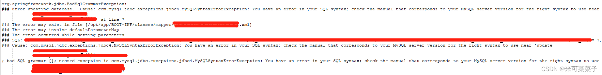
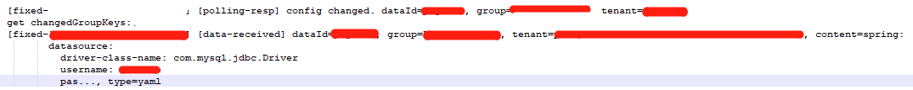

Nacos数据库配置更新需要重启服务

线上环境报错，看报错信息可定位到是SQL语句有误。
但这段SQL在测试环境是没有问题的。
对比后发现是数据库配置 spring:dataSource:url: 的数据库链接后面要加 &allowMultiQueries=true
否则，会影响数据库的批量更新。

测试
在线上环境nacos的 配置管理-配置列表 中，找到对应的微服务，在数据库配置中，数据库的url后面加上了 &allowMultiQueries=true

初步猜想：
nacos配置中心的配置，是即时生效的，此时线上环境的批量更新SQL是否就可以正常运行了。
再去尝试同样操作，依然报和上面一样的错
排查问题：
1.首先确定，nacos配置是否做了更改

由日志可以看出，nacos是做了配置更改的
2.再检测线上数据库的nacos库中的 config_info表，查到对应数据，发现线上数据库的nacos里存的配置已经更改了

这时，再进行之前的批量更新动作，发现依然报错！！

3.用自己的本地代码启动连接本地nacos，模拟同样情景，
发现：nacos数据库配置确实变了，但并未生效！有且仅有改过nacos数据库配置之后重启本地服务才生效。。

结论-解决
当nacos的数据库配置发生改变时，需重启服务配置才可生效！