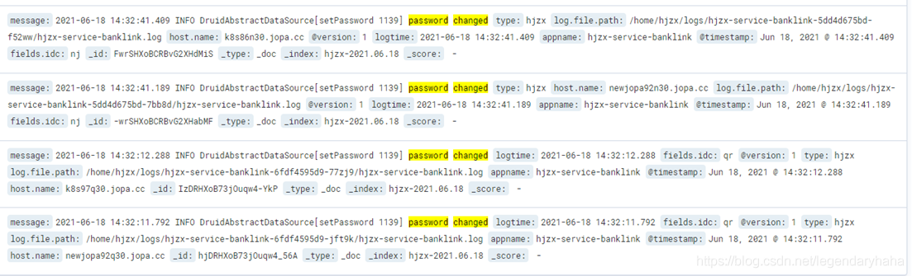

修改了Nacos配置后，Druid抛出大量数据库连接异常日志

某个周末，运营同事反馈账单数据不对且客户需要开始执行交易了。起初，还以为只是简单的数据问题，核对一下就好了。但在生产日志排查的过程种，发现日志大量抛出了大量的数据库连接异常：

```
ERROR DruidDataSource[run 2755] create connection SQLException
```

异常信息下还有如下提示：

```
 Access denied for user 'root'@'X.XX.XX.XXX' (using password: YES)
```

分析
一开始还是很懵逼的，也不知道如何下手，更奇怪的是，项目的部署在两个独立机房上，另一个机房是完全没问题的，也就是说连接配置是OK的。正一筹莫展之际，同事A说之前修改过nacos的配置，并通过强大的“搜索引擎”发现有网友有过类似的经历。

开始时，还是很疑惑，这个nacos有啥关系？？但根据文章关键词提示，还是试着在ELK种搜索有关日志提示。这一搜还真发现了：

在修改Nacos配置后，大概有这样一段日志，应该是重新刷新配置：



```
Loading nacos data, dataId: 'XX.properties', group: 'DEFAULT_GROUP', data: spring.datasource.druid.url=jdbc:mysql://XXXX
spring.datasource.druid.username=root
```

接着，是Druid相关的日志：

```
 DruidAbstractDataSource[setPassword 1139] password changed
```

刷新配置，密码就改变了？？？wdf…再次审查一遍数据库连接配置，密码是通过加密的方式去连接的，以前用明文连接时从未遇过这样的问题，难道这里通过加密连接还有什么幺蛾子吗？

再次依赖强大的“搜索引擎”，搜索“druid 加密连接数据库”，这一搜，发现已经有很多前人踩过坑了。

先看看提示的Druid相关源码：DruidAbstractDataSource#setPassword

    public void setPassword(String password) {
            if (!StringUtils.equals(this.password, password)) {
                if (this.inited) {
                    LOG.info("password changed");
                }
    
                this.password = password;
            }
        }


这里会判断前后密码是否相等，不相等则会判断是否初始化过了，如果初始化过了，此时会输出：“password changed”。
接着，把新的密码赋值给成员变量"password"。
而再看看，Druid初始化时设置相关配置的代码：com.alibaba.druid. filter. config.ConfigFilter#decrypt方法：

    public void decrypt(DruidDataSource dataSource, Properties info) {
            try {
                String encryptedPassword = null;
                if (info != null) {
                    encryptedPassword = info.getProperty("password");
                }
    
                if (encryptedPassword == null || encryptedPassword.length() == 0) {
                    encryptedPassword = dataSource.getConnectProperties().getProperty("password");
                }
    
                if (encryptedPassword == null || encryptedPassword.length() == 0) {
                    encryptedPassword = dataSource.getPassword();
                }
    
                PublicKey publicKey = this.getPublicKey(dataSource.getConnectProperties(), info);
                String passwordPlainText = ConfigTools.decrypt(publicKey, encryptedPassword);
                if (info != null) {
                    info.setProperty("password", passwordPlainText);
                } else {
                    dataSource.setPassword(passwordPlainText);
                }
    
            } catch (Exception var6) {
                throw new IllegalArgumentException("Failed to decrypt.", var6);
            }
        }


初始时，会将加了密的密码解密，然后赋值。到这里，可以大概推出原因了，初始后时，会对密码进行解密，然后赋值给password，而再nacos配置刷新后，由于已经初始化过了，不会去解密，直接将密文赋值password。

由于数据库连接池的作用，连接是可以复用的，如果连接数够用，一直复用已有连接是不会有问题的，而再需要创建新连接的场景下，则产生问题了，密码错误，导致数据库连接不上。

那么问题又来了？ 两个机房A、B，为啥只有机房B出现这个状况呢？同事又说了，之前压测，把量切到目前出事这个机房B上，在另一个机房A上压测。然后恰巧有配置更新需求，就修改了配置。压测完毕，A机房重启，拉了最新配置，B没有，然后就出事情了。。

复现
测试线上，将密码改为明文，调小Druid保持的核心连接数（直接设置为1），设置最大连接数100，然后随便增加一个配置，促发Nacos刷新配置。

用Postman间断的执行请求和并发的发起100个请求，可以发现，间断的执行请求时，没有问题，并发的发起100个请求，也没有问题。

再将密码改为加密方式，再用Postman间断的执行请求和并发的发起100个请求，可以发现Postman间断的执行请求的情况下，也是OK的，Druid复用了连接，但当并发的发起100个请求时，就出现问题了，数据库连接异常，密码错误。

解决
感觉都用nacos了，密码就没必要用密文了，直接改成明文吧
以后修改有数据库连接信息得配置文件，一定得重启服务。
继承DruidPasswordCallback 类，覆盖设置密码规则。
每个数据库连接配置改成如下方式：

```java
spring.datasource.druid.password=密文
spring.datasource.druid.filters=config
spring.datasource.druid.connection-properties=config.decrypt=true;config.decrypt.key=${spring.datasource.druid.decrypt.publickey}
```

关于第三种方案，本人还没有做亲自实践，这里只做了一个记录。原来，Duid可以配置一个叫做passwordCallBack的参数，使得在回调的时候我们可以解密设置密码。