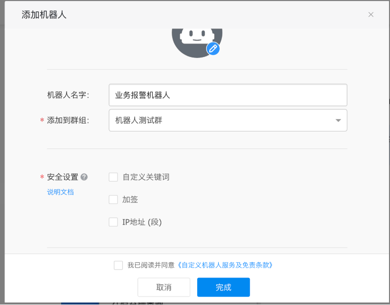
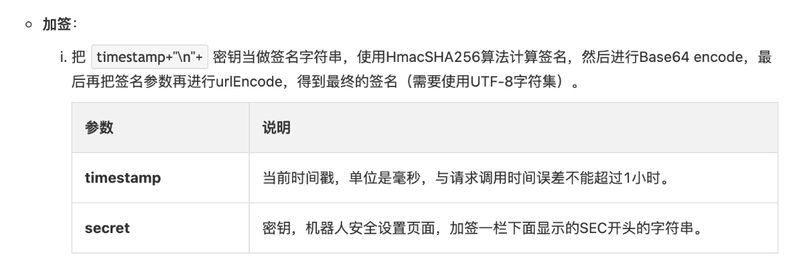
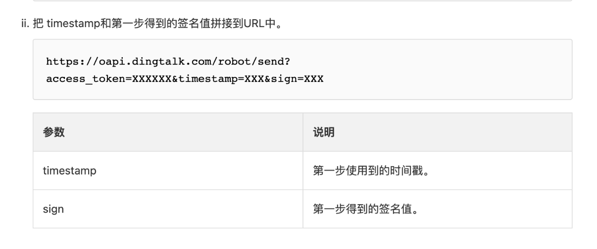

1. 添加钉钉机器人

2. 添加成功后复制出机器人的Webhook地址

    url: https://oapi.dingtalk.com/robot/send?access_token=5fc87906caf5986a7320194c53b6bbd13762c37a329ba28150e2e5833eea22b2

    secret: SEC66222263bc8d900bcdb4f83448699618f9cd38b3ea44486867e7f8ad5776fbb5

3. 到此调用Api接口就可以。但是为什么会报"errcode":310000,"errmsg":"sign not match这个错误了？

   原因是我选择了自定义机器人。但是没有阅读自定义机器的文档，所以报签名不匹配的错误

```shell
// 签名不匹配
{
  "errcode":310000,
  "errmsg":"sign not match"
}
```

回过头来在看下自定义机器人的文档



我新建机器人的时候选择的 加签



也提供了加签算法

```java
import javax.crypto.Mac;
import javax.crypto.spec.SecretKeySpec;
import org.apache.commons.codec.binary.Base64;
import java.net.URLEncoder;
 
public class Test {
    public static void main(String[] args) throws Exception {
        Long timestamp = System.currentTimeMillis();
        String secret = "this is secret";
 
        String stringToSign = timestamp + "\n" + secret;
        Mac mac = Mac.getInstance("HmacSHA256");
        mac.init(new SecretKeySpec(secret.getBytes("UTF-8"), "HmacSHA256"));
        byte[] signData = mac.doFinal(stringToSign.getBytes("UTF-8"));
        String sign = URLEncoder.encode(new String(Base64.encodeBase64(signData)),"UTF-8");
        System.out.println(sign);
    }
 
}
```



最后拼接到url中就好了


向钉钉机器人发送测试信息

```shell
curl -l \
-H "Content-type: application/json" \
-X POST \
-d '{"msgtype": "markdown", 
	"markdown": {
		"title":"Prometheus告警信息",
		"text": "#### 监控指标\n> 监控描述信息\n\n> ###### 告警时间 \n"},
		"at": {"isAtAll": false}
	}' \
https://oapi.dingtalk.com/robot/send?access_token=5fc87906caf5986a7320194c53b6bbd13762c37a329ba28150e2e5833eea22b2&sign=SEC66222263bc8d900bcdb4f83448699618f9cd38b3ea44486867e7f8ad5776fbb5"

```

