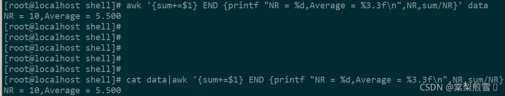
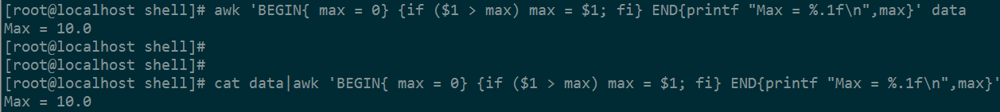
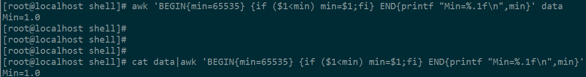
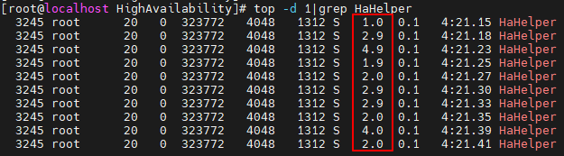
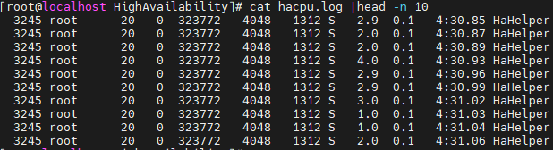
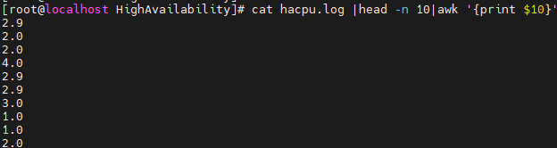
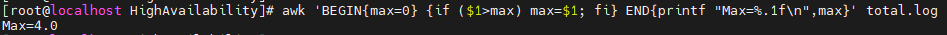
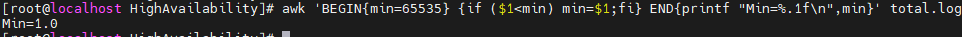
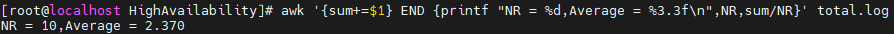

**shell脚本之awk命令——按列求平均值、最大值、最小值**

文章目录

1. 写在前面
2. awk求平均值
3. awk求最大值
4. awk求最小值
5. awk求极值、均值的实际应用

**写在前面**
awk命令求极值和均值需要熟悉该命令的基本用法，如果你不熟悉该命令，请先阅读shell脚本之awk命令——分隔符介绍一文。本篇博文带你熟悉求平均值、最大值、最小值的方法，并以实际的应用带你进一步掌握awk的高级用法。

```
以下为求平均值、最大值、最小值用到的文件data,使用cat data查看内容为
1.0
2.0
3.0
4.0
5.0
6.0
7.0
8.0
9.0
10.0
```

**awk求平均值**

```shell
awk '{sum += $1} END {printf "NR = %d,Average = %3.3f\n",NR,sum/NR}' data

或者使用cat命令组合使用

cat data|awk '{sum += $1} END {printf "NR = %d,Average = %3.3f\n",NR,sum/NR}'
```

printf和C语言中的用法类似，你可以使用 %f 输出小数，%d 输出整数, %s 输出字符串等等。awk中的NR表示有多少行内容。
计算结果：



**awk求最大值**

```shell
awk 'BEGIN{ max = 0} {if ($1 > max) max = $1; fi} END{printf "Max = %.1f\n",max}' data

或者

cat data|awk 'BEGIN{ max = 0} {if ($1 > max) max = $1; fi} END{printf "Max = %.1f\n",max}'
```

计算结果：



**awk求最小值**

求最小值的时候需要注意，min的初始值需要设置为一个大数，最好大于所有数的最大值。如果min被设为初始值0，那下面的结果将是错误的。

```shell
awk 'BEGIN{min = 65535} {if ($1 < min) min = $1;fi} END{printf "Min = %.1f\n",min}' data

或者

cat data|awk 'BEGIN{min = 65535} {if ($1 < min) min = $1;fi} END{printf "Min = %.1f\n",min}'
```

计算结果：



**awk求极值、均值的实际应用**

求某个进程在某段时间内的CPU占用峰值、平均值
假设现在有一个进程HaHelper，要统计该进程的CPU占用，使用top命令查看它的cpu使用：

```shell
一秒刷新一次CPU使用情况。
top -d 1|grep HaHelper
```



红框所在的列即为CPU占用，现在把这个结果输出到文件中，方便后续统计。
使用重定向符号>把执行结果输出到文件

```shell
top -d 1|grep HaHelper > hacpu.log
```

此处为了简化问题，只取了前10条记录：此处可以根据需要，取24h的数据24*60*60行记录...

```shell
cat hacpu.log | head -n 10
```



如何拿到CPU占用那一列的值呢？awk命令很容易就能帮你做到这个。

```shell
cat hacpu.log |head -n 10|awk '{print $10}'
```

也可能是$9，第九列的内容，取决于系统是否把空列作为一列来处理。



输出上面的数据到文件中：

```shell
cat hacpu.log |head -n 10|awk '{print $10}' > total.log
```

求峰值(最大值)

```shell
awk 'BEGIN{max=0} {if ($1>max) max=$1; fi} END{printf "Max=%.1f\n",max}' total.log
```



最小值

```shell
awk 'BEGIN{min=65535} {if ($1<min) min=$1;fi} END{printf "Min=%.1f\n",min}' total.log
```



平均值

```shell
awk '{sum+=$1} END {printf "NR = %d,Average = %3.3f\n",NR,sum/NR}' total.log
```



awk命令非常强大，与其他命令结合使用可以很好帮我们解决一些问题，随着深入了解，相信你会越来越熟练。