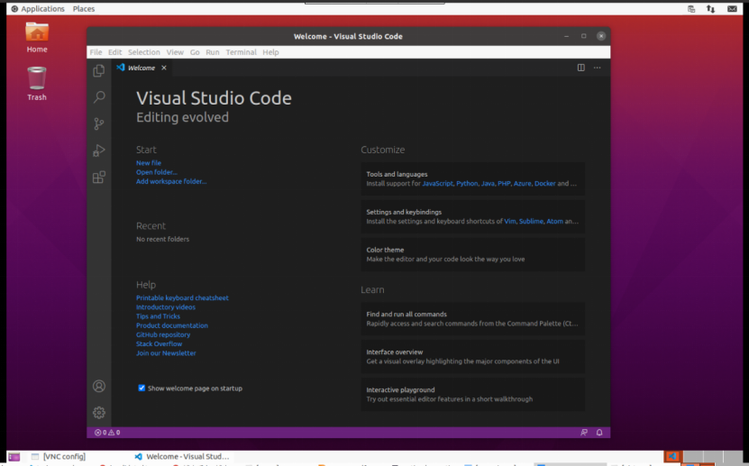

**Ubuntu 20.04 安装gnome桌面VNC**

**排坑：**

　　**1、启动VNC： vncserver :1 -localhost no   ##:1是用了5901端口，-localhost no是为了让其他计算机可以访问**

　　**2、执行“1、启动VNC： vncserver :1 -localhost no”，注意一定要退出Conda虚拟环境，使用系统环境，否则会出现无panel、toolbar以及灰屏、黑屏等各种问题 。**

​    3、不要登陆默认桌面，否则VNC桌面窗口无边框，无法移动窗口


**1. 安装桌面**

综上所述，我们要再安装一个桌面管理器环境，能够在配合VNC正常运行，实现用户UI远程访问服务器。

1) xface4: 轻量级桌面环境，适合远程桌面(中文输入、界面体验等方面的考虑，实验室其他平台正常使用(14.04~18.04)，这里没有使用)；

2) gnome-session-flashback: Gnome经典桌面环境(基于Ubuntu默认自带的Gonme 3.36.4，20.04上成功配置并使用。以下将以此为例，)；

3) ubuntu-gnome-desktop: 当前最新版本的Ubuntu Gnome桌面环境(系统安装时默认自带，17年时候，Ubuntu弃Unity，默认搭载Gnome，20.04安装上配置失败，即便多次尝试，无法连接、灰屏、仅有文件浏览器等各种问题，每次相同安装配置还出现过问题不同的情况，遂放弃)。

安装gnome-session-flashback：

```shell
# sudo apt-get install gnome-session-flashback
```

注：我的系统本来就是有桌面的。若安装的是server版本，可能还要安装：gnome-terminal、nautilus和gnome-settings-daemon等。另外，根据提示，可能还需要安装gdm3。

**2. 关闭防火墙或者开放端口(20.04不关也行，只要ssh远程remote端口可访问即可)**

```shell
##由于实验室服务器属于多人多账号使用，每个端口都分别设置防火墙端口开放就很麻烦

server:~$ sudo ufw disable   #关闭防火墙
server:~$ sudo ufw status  #查看防火墙状态
systemctl disable ufw
systemctl stop ufw
```

**3. 安装VNC Server**

```shell
# sudo apt-get install tigervnc-standalone-server tigervnc-xorg-extension
```

**4. 设置VNC密码**

其他终端用VNC Viewer连接VNC Server时，需要密码(密码长度最大为6位)。跟系统用户密码无关。

```shell
server:~$ vncpasswd #每次终端输入该指令都会重置密码(不需要验证旧密码)，忘记直接重置即可
  Password: #密码 
  Verify: # 再次输入密码 
  Would you like to enter a view-only password (y/n)? n #这里设置no就行了 
server:~$ ls ~/.vnc #目录在/home/username/.vnc ，有passwd文件则说明设置成功
```

**5. 为VNC设置桌面环境**

```shell
vim ~/.vnc/xstartup

内容如下： 
#!/bin/sh
unset SESSION_MANAGER
#unset DBUS_SESSION_BUS_ADDRESS #测试中发现如果去掉该行注释 桌面不会出现
export XKL_XMODMAP_DISABLE=1
export XDG_CURRENT_DESKTOP="GNOME-Flashback:GNOME"
export XDG_MENU_PREFIX="gnome-flashback-"
[ -x /etc/vnc/xstartup ] && exec /etc/vnc/xstartup
[ -r $HOME/.Xresources ] && xrdb $HOME/.Xresources
xsetroot -solid grey    #设置背景色
vncconfig -iconic &
gnome-terminal &        #连接后会直接打开一个terminal窗口
nautilus &              #连接后会直接打开一个文件窗口
gnome-session --session=gnome-flashback-metacity --disable-acceleration-check &
```

增加xstartup文件执行权限：

```shell
# sudo chmod +x  ~/.vnc/xstartup
```

**6. 启动VNC**

```shell
vncserver :2 -localhost no  #2为端口号，no表示非局域网内账户也可访问 
vncserver -kill :2    #关闭
```

**7. 测试**

