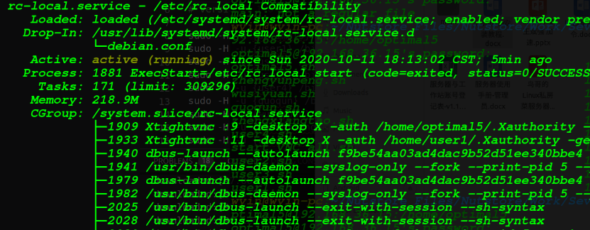

**Ubuntu 20.04 开机执行自定义脚本**

1. 切换至root，建立rc-local.service文件

```shell
vim  /etc/systemd/system/rc-local.service
```

2. 在里面写入如下内容

```shell
[Unit] 
Description=/etc/rc.local Compatibility 
After=network.target auditd.service
ConditionPathExists=/etc/rc.local 

[Service] 
Type=forking 
ExecStart=/etc/rc.local start 
TimeoutSec=0 
StandardOutput=tty 
RemainAfterExit=yes 
SysVStartPriority=99 

[Install]
WantedBy=multi-user.target 
```

3. 然后创建文件：rc.local

```shell
vim  /etc/rc.local
```

4. 里面写入下面内容（就是开机所要执行的脚本） 

```shell
#!/bin/bash
# rc.local

# 这个脚本在每个多用户运行级别的末尾执行.
# 确保脚本在成功时退出0，或者在出错时退出任何其他值.
# 为了启用或禁用这个脚本，只需改变执行位.
# 默认情况下，这个脚本不执行任何操作.

# start script
  sudo -H -u root /bin/bash -c "/usr/bin/vncserver :1 -localhost no -geometry 1440x900 &> /dev/null "
  #su root -c /bin/bash -c "/usr/bin/vncserver :2 -localhost no -geometry 1440x900 &> /dev/null "
# end script

echo "added sucessfully!" > /tmp/added_script.log

exit 0
```

5. 加上权限

  ```shell
  chmod +x /etc/rc.local
  ```

6. 启动服务

  ```shell
  systemctl enable rc-local
  ```

7. 开启服务

  ```shell
  systemctl start rc-local.service
  ```

8. 查看状态

  ```shell
  systemctl status rc-local.service
  ```

  部分内容如下：（注意active (running)）



9. 重启并检查test.log文件

  ```shell
  vim  /tmp/added_script.log 
  ```

  如果里面有内容（added sucessfully!），则自启动脚本安装成功。

