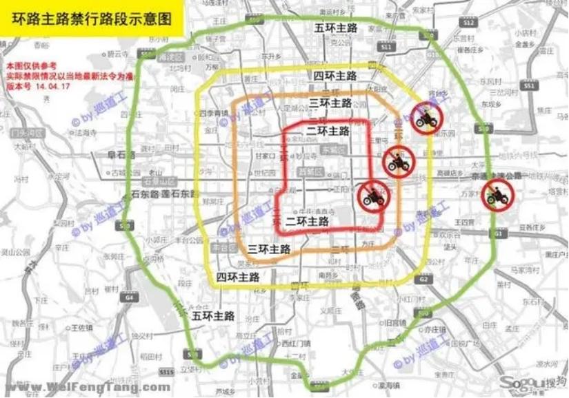
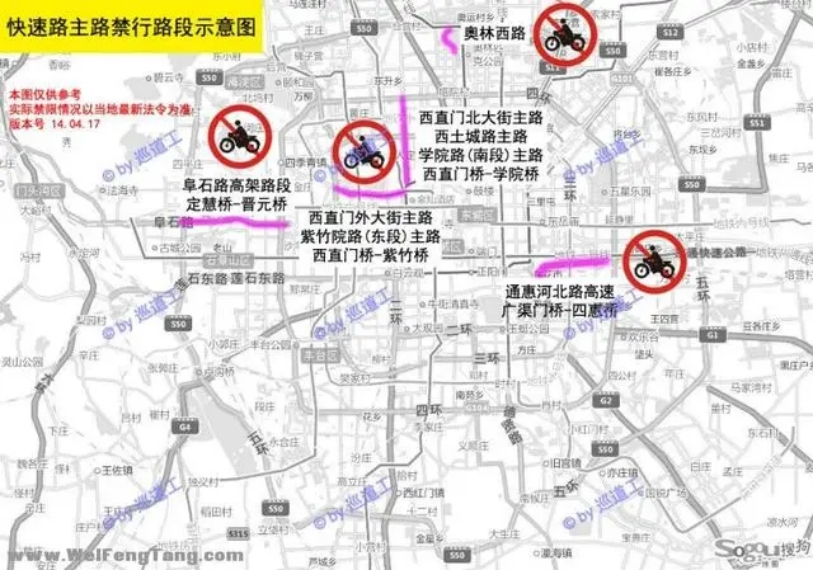
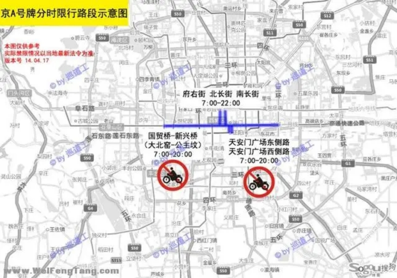
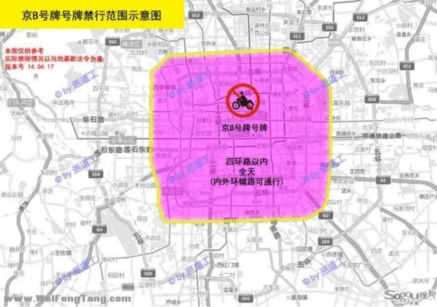
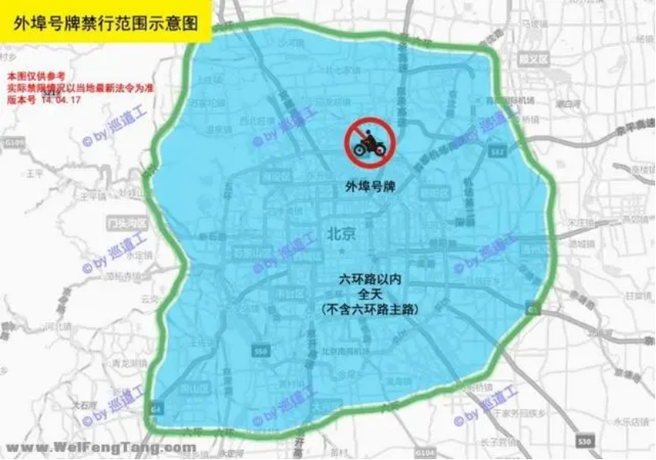
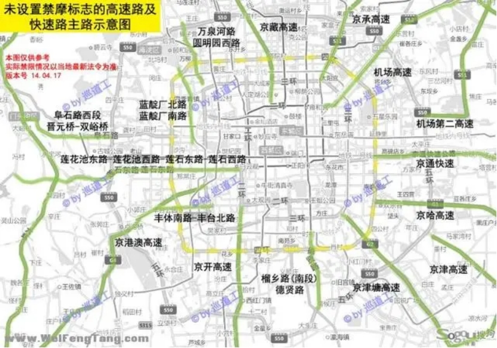

***\*“北京摩托车限行禁行大百科地图”，遍地是雷，请各位摩友小心！\****

北京不是禁摩，只是限摩，限制摩托车部分路段通行。关于摩托车限行和禁行的范围、路段，仅凭文字理解，还不够直观。下面图例展示北京禁限摩区域。

 

禁行范围：

 

. 京B号牌的摩托车，全天禁止在四环路以内行驶。但四环路辅路(内外环双方向)不在禁行范围内，也就是说可以在四环辅路上行驶。

 

 外埠号牌的摩托车，全天禁止在六环路以内行驶。但六环路主路(内外环双方向)不在禁行范围内，也就是说可以在六环路主路上行驶。这是2014年4月11日北京市新实施的规定。外省牌照的摩托车，从2014年4月11日起，规定不准进入六环路以内行驶（六环路主路不含）。从目前的状况看，JC们都在严查违规进六环的外埠牌照汽车。如果确实是长途摩旅而误闯城区的摩友，不巧被JC拦下，说明情况后，北京的JC几乎不会进行刻意刁难，基本都会在指出最近的出城道路后放行。

 

  六环路主路全程为收费路段，摩托车收费标准与9座以下小客车相同。外省摩友过境可选择在六环主路行驶，请遵守国家和地方的相关法律法规，另外六环主路大货车较多，车道较窄，务必注意安全。

 

关于罚款与扣分：

 

  根据目前的实际情形，京B号牌进入四环以内禁行区域的，外埠号牌进入六环以内禁行区域的，按规定应罚款100元，并可再扣3分（期待京B斗士开庭最终结果）。另所有摩托车，包括京A、京B、外埠号牌，禁入二三四五环主路、其他明令禁止摩托车行驶的主路、长安街(京A可通行时段除外)的，除罚款100元外，并可再扣3分，请大家注意。

 

禁行路段：

 

二、三、四、五环的主路，全天禁止摩托车行驶。

 

部分城市封闭快速路的主路，全天禁止摩托车行驶。具体包括：

 

阜石路高架路段(东段)，定慧桥-晋元桥

 

西直门外大街-紫竹院路(东段)主路，西直门桥-紫竹桥

 

西直门北大街-西土城路-学院路(南段)主路，西直门桥-学院桥

 

奥林西路全段

 

通惠河北路主路，广渠门桥-四惠桥 

 

限行路段：

 

京A号牌的摩托车，以下路段按时段限行：

 

国贸桥-新兴桥，也就是常说的“长安街”，7:00-20:00禁止行驶

 

天安门广场东侧路，天安门广场西侧路，7:00-20:00禁止行驶

 

府右街全段，7:00-22:00禁止行驶

 

北长街、南长街全段，7:00-22:00禁止行驶 

 

禁行范围：

 

京B号牌的摩托车，全天禁止在四环路以内行驶。但四环路辅路(内外环双方向)不在禁行范围内，也就是说可以在四环辅路上行驶。 

 

禁行范围：

 

外埠号牌的摩托车，全天禁止在六环路以内行驶。但六环路主路(内外环双方向)不在禁行范围内，也就是说可以在六环路主路上行驶。这是2014年4月11日北京市新实施的规定。

 

外省牌照的摩托车，从2014年4月11日起，规定不准进入六环路以内行驶（六环路主路不含）。从目前的状况看，JC们都在严查违规进六环的外埠牌照汽车。如果确实是长途摩旅而误闯城区的摩友，不巧被JC拦下，说明情况后，北京的JC几乎不会进行刻意刁难，手续齐全的，绝对不存在动不动就扣车的野蛮行为，基本都会在指出最近的出城道路后放行。

 

六环路主路全程为收费路段，摩托车收费标准与9座以下小客车相同。外省摩友过境可选择在六环主路行驶，请遵守国家和地方的相关法律法规，另外六环主路大货车较多，车道较窄，务必注意安全。 

 

\6. 关于未设置禁摩标志的高速公路主路及城市快速路主路

 

北京全境允许摩托车进入高速公路主路行驶(包括六环路主路全线)，收费标准与9座以下小客车相同。

 

6.1 摩托车在高速公路主路上行驶，请大家严格遵守相关法律法规，包括但不限于：

 

摩托车的设计时速必须大于70km/h；

 

行驶速度不得超过80km/h；

 

不准承载乘客。

 

进入高速公路，请及时领卡；驶出高速公路，请照章缴费。

 

北京市区内部分城市快速路主路未设置禁摩标志，进入此类快速路主路行驶，请务必控制车速，遵守法规，保证安全。 

 

补充：目前大兴、通州、密云等地也是有部分道路禁行摩托车，下期整理一下郊区县的摩托车禁限行道路。

 

 

 

希望大家尽可能地搞清楚摩托车限行禁行的路段，不要因为碰大运，而引起不必要的损失。 作者：京A聊闲片儿 https://www.bilibili.com/read/cv6761121 出处：bilibili