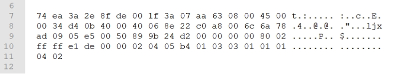
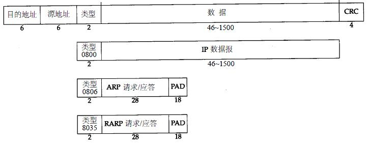
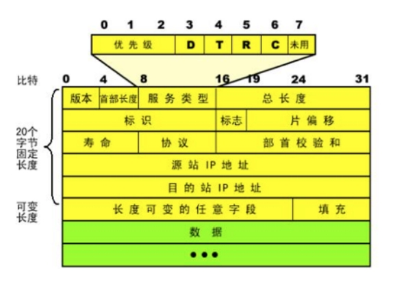
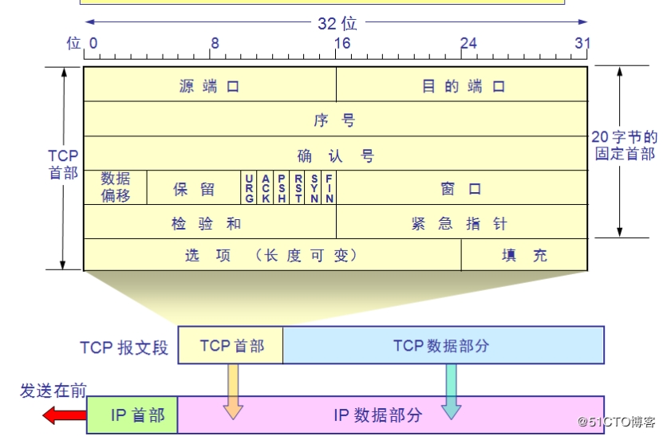

# **wireshark抓包如何找到ip地址？**

74 ea 3a 2e 8f de 00 1f 3a 07 aa 63 08 00 45 00 t.:..... :..c..E.

00 34 d4 0b 40 00 40 06 8e 22 c0 a8 00 6c 6a 78 .4..@.@. ."...ljx

ad 09-05 e5 00 50 89 9b 24 d2 00 00 00 00 80 02 .....P.. $.......

ff ff e1 de 00 00 02 04 05 b4 01 03 03 01 01 01 ........ ........

04 02

 

如上是使用wireshark抓到的以太网数据包

 

首先你要知道，IP信息是包含在网络层，你抓到的包是从以太网，也就是2层开始的，而2层的头部包括目的地址、原地址、类型（6 6 2） 共计14个字节。要想分析出IP，直接从你获得的数据包的第15个字节开始分析就行了。即第一行的45 00开始。

 

对照上面的IP包结构，可以知道，前4位对应IP版本，通常为4或者6.你这里的情况是4.
之后是首部长度，单位是4字节，你这里是5，说明是20字节，符合IP包头长度。
然后是服务类型，没QoS的话通常都是00.很少用到。
之后是两个字节的总长度，00 34 ，也就是52字节。你可以查查，从45 开始，到最后是不是52个字节？
懒得写了，直接越过中间的8个字节，看IP吧。
c0 a8 00 6c
6a 78 ad 09
分别是源和目的。换成十进制后：
192.168.0.108
106.120.173.9

插几句，第十字节 06 ： tcp
src port:1509
dst port:80
flag ： 000010

也就是说这是一个打开106.120.173.9上http的一个syn包。

 

====================================================

# **以太网包头介绍**

以太网MAC帧有两种标准，一种是IEEE的802.3标准，另外一种是以太网V2标准（注：来自《计算机网络》）。后者用得比较多。

下面这张图片就是从《TCP/IP详解》中截图出来的。图片中的数字表示字节。一个IP数据包范围是46字节~1500字节，这是有根据的。

可以看到，IP包与ARP包是独立的，或者说它们下面的就是以太帧了。传输层（或以上）的各种数据包（报文）就是填充到上面那个图中的第2个框图的“IP数据报”的。

 

# [**IP包头结构详解**](https://www.cnblogs.com/yyxianren/p/10790730.html)

 

**版本号（Version）：**长度4比特。标识目前采用的IP协议的版本号。一般的值为0100（IPv4），0110（IPv6）

**IP包头长度（Header Length）：**长度4比特。这个字段的作用是为了描述IP包头的长度，因为在IP包头中有变长的可选部分。该部分占4个bit位，单位为32bit（4个字节），即本区域值= IP头部长度（单位为bit）/(8*4)，因此，一个IP包头的长度最长为“1111”，即15*4＝60个字节。IP包头最小长度为20字节。

**服务类型（Type of Service）：**长度8比特。8位 按位被如下定义 PPP DTRC0

PPP：定义包的优先级，取值越大数据越重要

  000 普通 (Routine)

  001 优先的 (Priority)

  010 立即的发送 (Immediate)

  011 闪电式的 (Flash)

  100 比闪电还闪电式的 (Flash Override)

  101 CRI/TIC/ECP(找不到这个词的翻译)

  110 网间控制 (Internetwork Control)

  111 网络控制 (Network Control)

D 时延: 0:普通 1:延迟尽量小

T 吞吐量: 0:普通 1:流量尽量大

R 可靠性: 0:普通 1:可靠性尽量大

M 传输成本: 0:普通 1:成本尽量小

0 最后一位被保留，恒定为0

**IP包总长（Total Length）：**长度16比特。 以字节为单位计算的IP包的长度 (包括头部和数据)，所以IP包最大长度65535字节。

**标识符（Identifier）:**长度16比特。该字段和Flags和Fragment Offest字段联合使用，对较大的上层数据包进行分段（fragment）操作。路由器将一个包拆分后，所有拆分开的小包被标记相同的值，以便目的端设备能够区分哪个包属于被拆分开的包的一部分。

**标记（Flags）：**长度3比特。该字段第一位不使用。第二位是DF（Don't Fragment）位，DF位设为1时表明路由器不能对该上层数据包分段。如果一个上层数据包无法在不分段的情况下进行转发，则路由器会丢弃该上层数据包并返回一个错误信息。第三位是MF（More Fragments）位，当路由器对一个上层数据包分段，则路由器会在除了最后一个分段的IP包的包头中将MF位设为1。

**片偏移（Fragment Offset）：**长度13比特。表示该IP包在该组分片包中位置，接收端靠此来组装还原IP包。

**生存时间（TTL）：**长度8比特。当IP包进行传送时，先会对该字段赋予某个特定的值。当IP包经过每一个沿途的路由器的时候，每个沿途的路由器会将IP包的TTL值减少1。如果TTL减少为0，则该IP包会被丢弃。这个字段可以防止由于路由环路而导致IP包在网络中不停被转发。 

**协议（Protocol）：**长度8比特。标识了上层所使用的协议。

以下是比较常用的协议号：

  1  ICMP

  2  IGMP

  6  TCP

  17  UDP

  88  IGRP

  89  OSPF

**头部校验（Header Checksum）：**长度16位。用来做IP头部的正确性检测，但不包含数据部分。 因为每个路由器要改变TTL的值,所以路由器会为每个通过的数据包重新计算这个值。

**起源和目标地址（Source and Destination Addresses）：**这两个地段都是32比特。标识了这个IP包的起源和目标地址。要注意除非使用NAT，否则整个传输的过程中，这两个地址不会改变。

至此，IP包头基本的20字节已介绍完毕，此后部分属于可选项，不是必须的部分。

**可选项（Options）：**这是一个可变长的字段。该字段属于可选项，主要用于测试，由起源设备根据需要改写。可选项目包含以下内容：

  松散源路由（Loose source routing）：给出一连串路由器接口的IP地址。IP包必须沿着这些IP地址传送，但是允许在相继的两个IP地址之间跳过多个路由器。

  严格源路由（Strict source routing）：给出一连串路由器接口的IP地址。IP包必须沿着这些IP地址传送，如果下一跳不在IP地址表中则表示发生错误。

  路由记录（Record route）：当IP包离开每个路由器的时候记录路由器的出站接口的IP地址。

  时间戳（Timestamps）：当IP包离开每个路由器的时候记录时间。

**填充（Padding）：**因为IP包头长度（Header Length）部分的单位为32bit，所以IP包头的长度必须为32bit的整数倍。因此，在可选项后面，IP协议会填充若干个0，以达到32bit的整数倍。

# **TCP 包头详解**

TCP（Transmission Control Protocol 传输控制协议）是一种面向连接的、可靠的、基于字节流的传输层通信协议。当应用层向TCP层发送用于网间传输的、用8位字节表示的数据流，TCP则把数据流分割成适当长度的报文段，最大传输段大小（MSS）通常受该计算机连接的网络的数据链路层的最大传送单元（MTU）限制。之后TCP把数据包传给IP层，由它来通过网络将包传送给接收端实体的TCP层。

 

**src port**：源端口，2个字节，是一个大于1023的16位数字，由基于TCP应用程序的用户进程随机选择

**dst port**：目的端口，2个字节，指明接收者所用的端口号，一般由应用程序来指定

**Sequence number**：顺序号，4个字节，用来标识从 TCP 源端向 TCP 目的端发送的数据字节流，它表示在这个报文段中的**第一个数据字节**的顺序号。如果将字节流看作在两个应用程序间的单向流动，则 TCP 用顺序号对每个字节进行计数。序号是 32bit 的无符号数，**序号到达 (2^32) － 1 后又从 0 开始。**当建立一个新的连接时， SYN 标志变 1 ，顺序号字段包含由这个主机选择的该连接的初始顺序号 ISN （ Initial Sequence Number ）

**Acknowledgement number**：确认号，4个字节，包含发送确认的一端**所期望收到**的下一个顺序号。因此，确认序号应当是上次已成功收到数据字节顺序号加 1 。只有 ACK 标志为 1 时确认序号字段才有效

**Offset**：报头长度，4位，给出报头中 32bit 字的数目。需要这个值是因为任选字段的长度是可变的。这个字段占 4bit ， 即TCP 最多有 60（15*4） 字节的首部

**Resrvd**：保留区域，6位，保留给将来使用，目前必须置为 0

**Control Flags**（6位）控制位包括

登录后复制

***\*URG\****：为 1 表示紧急指针有效，为 0 则忽略紧急指针值

***\*ACK\****：为 1 表示确认号有效，为 0 表示报文中不包含确认信息，忽略确认号字段

***\*PSH\****：为 1 表示是带有 PUSH 标志的数据，指示接收方应该尽快将这个报文段交给应用层而不用等待缓冲区装满

***\*RST\****：用于复位由于主机崩溃或其他原因而出现错误的连接。它还可以用于拒绝非法的报文段和拒绝连接请求。一般情况下，如果收到一个 RST 为 1 的报文，那么一定发生了某些问题

***\*SYN\****：同步序号，为 1 表示连接请求，用于建立连接和使顺序号同步（ synchronize ）

***\*FIN\****：用于释放连接，为 1 表示发送方已经没有数据发送了，即关闭本方数据流

**Window Size**：窗口大小，2个字节，表示**从确认号开始**，本报文的源方可以接收的字节数，即源方接收窗口大小。窗口大小是一个 16bit 字段，因而窗口大小最大为 65535（2^16 - 1）

**Checksum**：校验和，2个字节，对整个的 TCP 报文段**（包括 TCP 头部和 TCP 数据）**，以 16 位字进行计算所得。这是一个强制性的字段，要求由发送端计算和存储，并由接收端进行验证

**Urgent Pointer**：紧急指针，2个字节，是一个正的偏移量，和顺序号字段中的值相加表示紧急数据最后一个字节的序号。 TCP 的紧急方式是发送端向另一端发送紧急数据的一种方式。 只有当URG 标志置 1 时紧急指针才有效

**Option and Pad**：选项和填充，n*4字节，常见的可选字段是最长报文大小 MSS(Maximum Segment Size) 。每个连接方通常都在通信的第一个报文段（为建立连接而设置 SYN 标志的那个段）中指明这个选项，它指明本端所能接收的最大长度的报文段。选项长度不一定是 32 位字的整数倍，所以要加填充位，使得报头长度成为整字数

**Data**：数据，不定长度，为上层协议封装好的数据

### **最大报文段长度MSS（Maximum Segment Size）**

指明自己期望对方发送TCP报文段时那个数据字段的长度。比如：1460字节。数据字段的长度加上TCP首部的长度才等于整个TCP报文段的长度。MSS不宜设的太大也不宜设的太小。若选择太小，极端情况下，TCP报文段只含有1字节数据，在IP层传输的数据报的开销至少有40字节（包括TCP报文段的首部和IP数据报的首部）。这样，网络的利用率就不会超过1/41。若TCP报文段非常长，那么在IP层传输时就有可能要分解成多个短数据报片。在终点要把收到的各个短数据报片装配成原来的TCP报文段。当传输出错时还要进行重传，这些也都会使开销增大。因此MSS应尽可能大，只要在IP层传输时不需要再分片就行。在连接建立过程中，双方都把自己能够支持的MSS写入这一字段。MSS只出现在SYN报文中。即：MSS出现在SYN=1的报文段中
**MTU和MSS值的关系：MTU=MSS+IP Header+TCPHeader****
****通信双方最终的MSS值=较小MTU-IP Header-TCP Header**

 