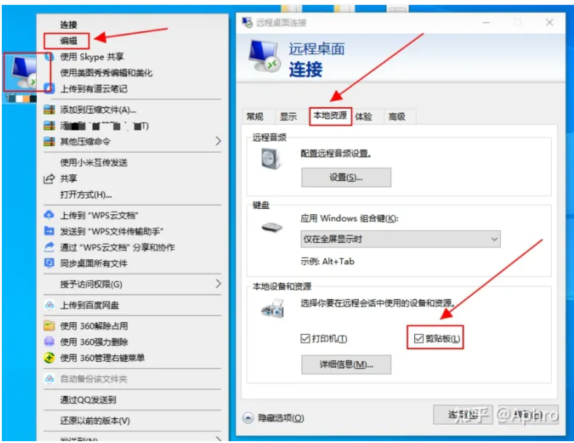
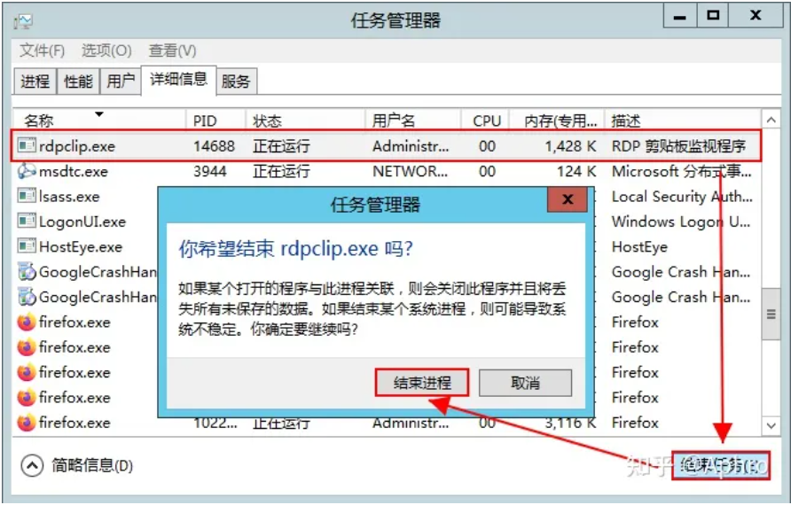
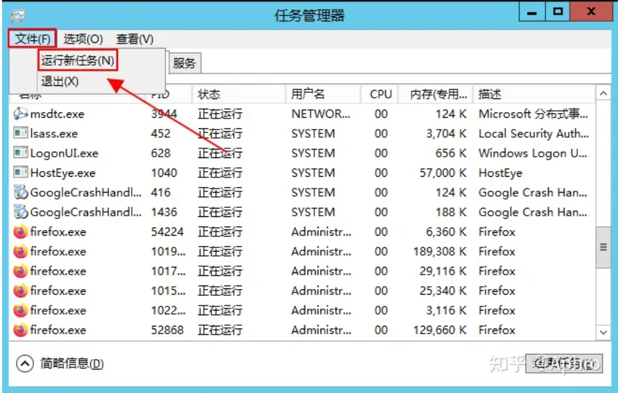
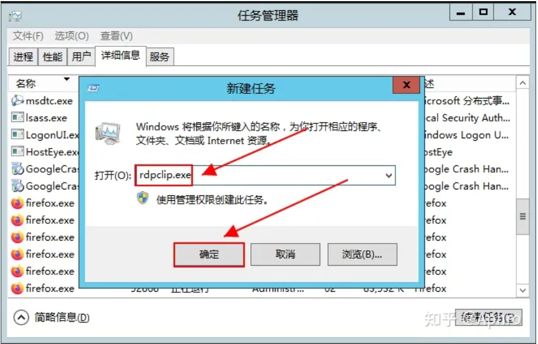

Windows服务器远程桌面，突然发现一直工作得好好的远程与本地电脑之间直接复制和粘贴功能突然失效了，重起 RDP 或本地计算机都不行。那么要如何解决呢看具体步骤如下。

### 一，确保确保 Windows 远程桌面连接的剪切板是勾选过的。

路径：右键远程桌面连接 –> 编辑 –> 本地资源 –> 剪贴板 –> 勾选剪切板。

### 二，连接到远程电脑。

### 三，重启远程电脑任务管理器进程列表里的rdpclip.exe

**3.1 先关闭rdpclip.exe**

路径：在RDP里打开任务管理器 –> 详细信息 –> 找到rdpclip.exe –> 结束任务 –> 结束进程

**3.2 再运行rdpclip.exe**

路径：文件 –> 运行新任务 –> 输入rdpclip.exe –> 确定

如果上述操作后还不能使用远程复制粘贴到本地，或反之，重起一下 RDP 应该就好了。