实验环境：一台Linux虚拟机：CentOS 7.6，Apache 2.4.6，IP地址为192.168.80.100；一台客户端：Windows XP，IP地址为192.168.80.200。

虚拟主机：即可以在一台web服务器上运行多个网站。

实现方法有3种：

1、基于IP地址的虚拟主机，一台web服务器配置多个IP地址，一个IP地址对应一个网站。

2、基于端口的虚拟主机，一台web服务器只用一个IP地址提供web服务，开放多个端口，客户端访问web服务器时，需要在网址的后边加上相应的端口号。

3、基于域名的虚拟主机，每一个网站对应一个域名，输入不同的域名，访问不同的网站。

前提准备工作：安装Apache 2.4.6，这里就不演示了。由于是测试环境，最好关闭防火墙，CentOS 7系统默认装的是firewalld，禁用即可。还要关闭selinux，这一点很重要，很多情况下客户端访问不了web服务器，就是因为web服务器的selinux没有关闭造成的，这个禁用即可。

一、采用第一种方法配置虚拟主机（基于IP地址）

1.为系统配置多个IP地址，这里采用在一块网卡上配置多个IP地址。

   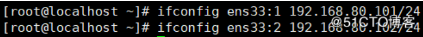

2.查看IP配置。

​    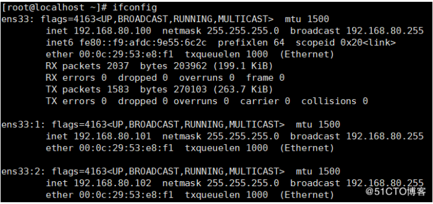

3.编辑Apache主配置文件，/etc/httpd/conf/httpd.conf，确保第56行的“Include conf.modules.d/*.conf”的设置项和最后一行的“IncludeOptional conf.d/*.conf”设置项前边没有#，默认没有#，还需要将第95行的#去掉，不然执行httpd -t命令检查配置文件是否存在语法错误的时候，会有提示信息。

   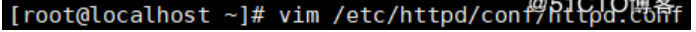

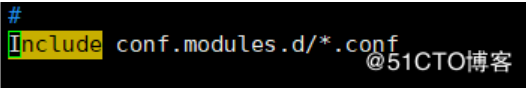

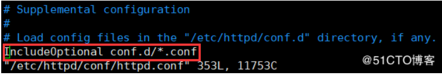

4.创建虚拟主机配置文件，创建3个虚拟主机，IP地址分别指向192.168.80.100,192.168.80.101,192.168.80.102。

​    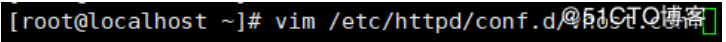

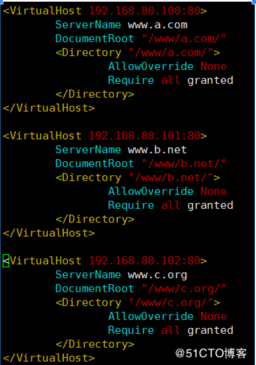

这里需要注意的是每一个虚拟主机必须要加...控制语句，Apache2.2可以不加，但是Apache2.4.6一定要加，否则虚拟主机的web站点无法访问（这一点很关键）。

5.为每个虚拟主机创建访问页面，首先要创建/www/a.com，/www/b.net，/www/c.org三个目录，然后再创建每个虚拟主机的访问页面。

​    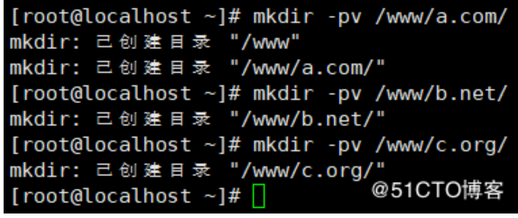

6.创建完每个虚拟主机的访问页面后，还需要将每个虚拟主机访问页面的文件名添加到web服务的主配置文件DirectoryIndex设置项中，如果不进行修改，则访问的是Apache的默认网页。因为我创建虚拟主机的访问页文件名都为index.html，这个文件名在主配置文件中DirectoryIndex设置项里默认存在，因此此处无需更改主配置文件。

​    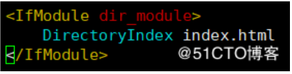

7.执行httpd -t命令检查httpd服务配置文件是否存在语法错误。

​    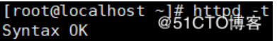

出现Syntax OK，即配置文件无语法错误。

重启httpd服务。

8.打开客户端进行测试。

访问192.168.80.100

​    

访问192.168.80.101

​    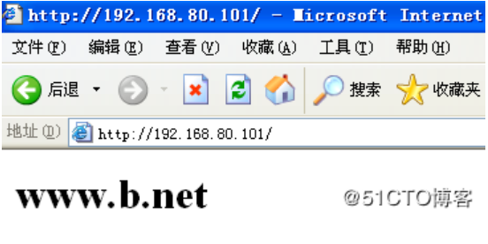

访问192.168.80.102

​    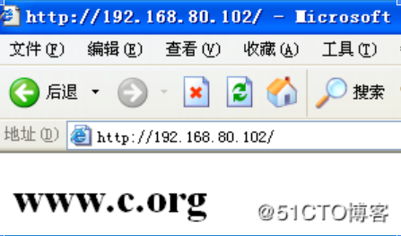

二、采用第二种方法配置虚拟主机（基于端口）

1.首先要填加httpd服务的监听端口，默认只监听80端口，这里再添加两个监听端口，808和8080，分别对应到第2个和第3个网站，这两个监听端口加到主配置文件中或虚拟主机配置文件中都行，这里我就添加在主配置文件中。

​    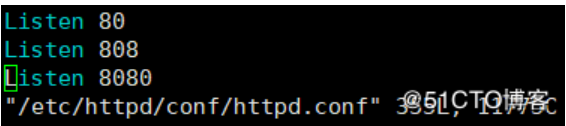

2.修改完主配置文件之后，还需要修改虚拟主机配置文件，修改内容如下：

​    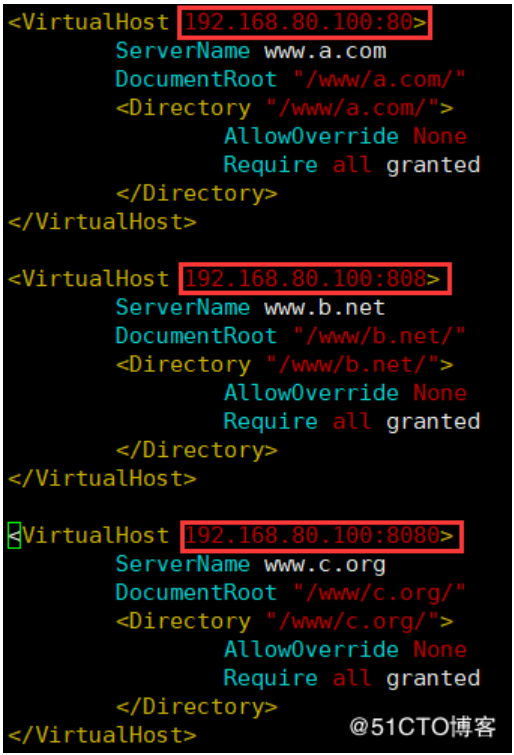

3.修改完虚拟主机配置文件后，执行httpd -t命令，检查httpd服务配置文件是否存在语法错误。

​    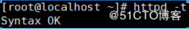

无语法错误，重启httpd服务。

4.打开客户端进行测试。

访问第一个网站，192.168.80.100:80，默认的端口号可以不加。

​    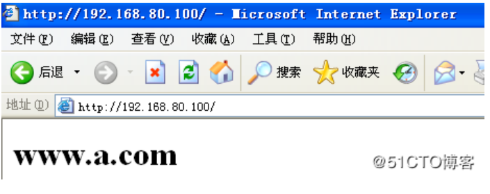

访问第二个网站，192.168.80.100:808，不是默认的端口号，就必须要在IP地址后边加上端口号。

​    

访问第三个网站，192.168.80.100:8080。

​    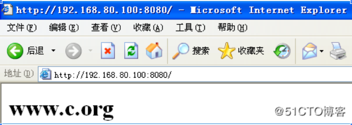

三、采用第三种方法配置虚拟主机（基于域名）

1.为三个网站准备三个域名，分别是www.a.com,www.b.net,www.c.org

2.修改虚拟主机配置文件。

​    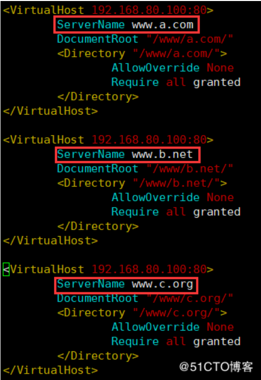

3.重启服务。

4.客户端测试。

如果存在DNS服务器的话，可在DNS服务器上添加三条主机A记录。这里就直接修改客户端上的hosts文件

​    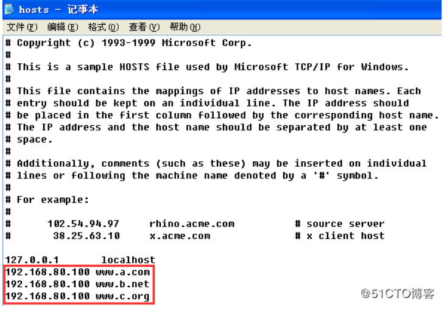

通过域名访问网站

​    

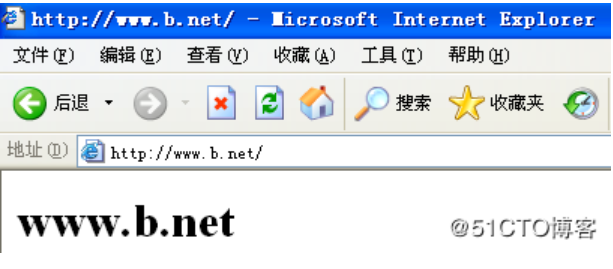

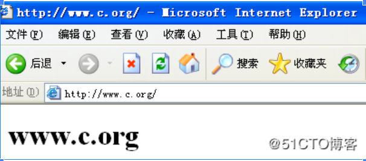

需要注意的是：

1、若配置了虚拟主机，则不能访问原中心主机的网站。

2、若是基于域名创建的虚拟主机，用IP地址去访问网站，则默认会去访问第一个虚拟主机，此时可创建一个默认的虚拟主机，放在虚拟主机配置文件的首部。