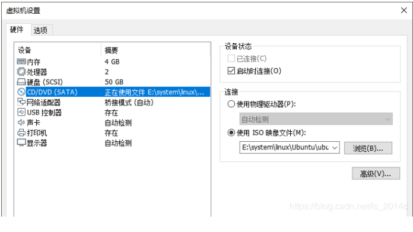
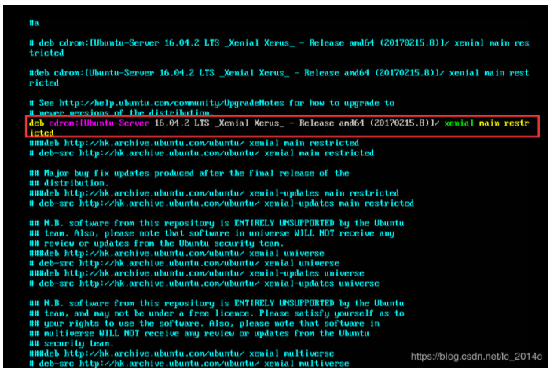
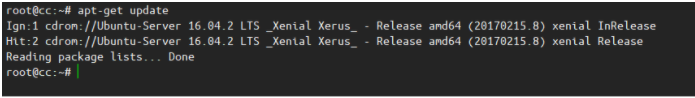
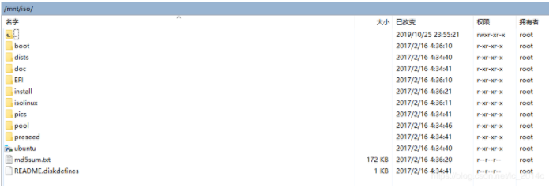
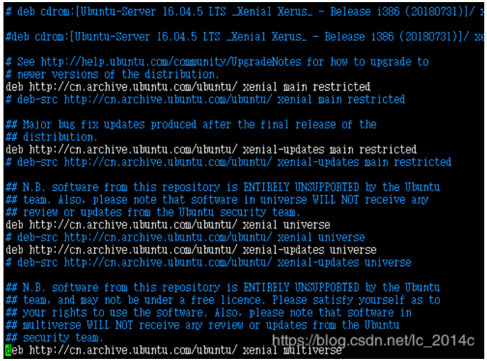
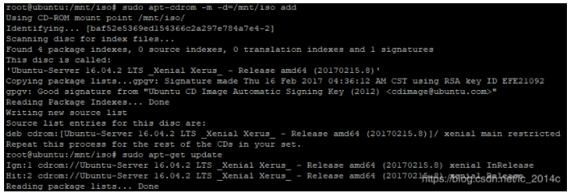
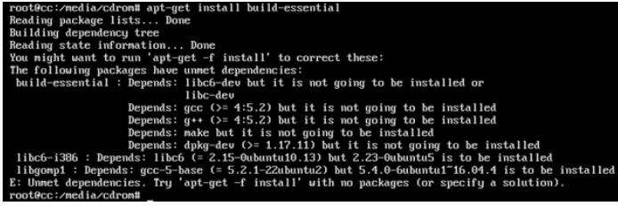
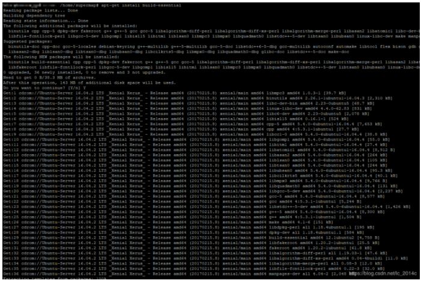
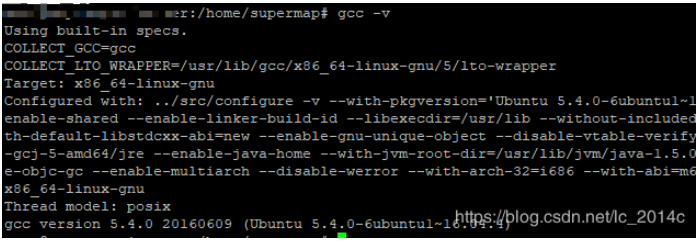

版本说明：Ubuntu Server 16.04 LTS

解决问题：解决在无任何互联网的环境下，安装软件时缺少依赖包的问题

**方法一：通过虚拟机挂载**

1. 将镜像挂载到虚拟机

以VMware Workstation为例，打开“虚拟机设置”，点击“CD/DVD”选项，将 “设备状态”中的“已连接”勾选上。然后选择下方“使用ISO镜像文件”，点击浏览，选择与虚拟机操作系统相同的系统镜像文件即可。

1. 进行iso挂载

*# 执行下面三条命令进行iso挂载## 如果这一步有报错找不到CD-romm，可以将上一步的CD/DVD删掉重新添加一次，重启系统再执行下面命令*mkdir /media/cdrom*#mount 挂载镜像到本地目录*mount -t iso9660 -o loop /dev/sr0 /media/cdrom (或者：mount -t auto /dev/cdrom /media/cdrom)*#备注：#/dev/cdrom 与 /dev/sr0都是系统文件名，两个在光盘挂载时是一样的，所以用哪个都行。/media/cdrom是挂载点，是自定义的。#如果用完想退出光盘镜像文件的话，必须先解除挂载。umount命令加系统文件名或挂载点，如umount /dev/sr0#添加本地目录到软件源*sudo apt-cdrom -m -d=/media/cdrom add

1. 查看apt源地址

cat /etc/apt/sources.list

- 1

文件中包含下图部分说明本地软件已经配置好；如果不用在线的软件源，则将其他的注释掉只保留本地源即可。

\4. 测试是否成功

*#进行本地库依赖更新* apt-get update*#升级软件包*apt-get upgrade

**方法二：通过本地iso文件**

1. 创建目录

mkdir /mnt/iso/chmod -R 777 /mnt/iso

- 1
- 2
- 3

将镜像文件ubuntu-16.04.2-server-amd64.iso上传到目录/mnt下

1. 挂载iso镜像到目录下

*#挂载命令*sudo mount-t iso9660 -o loop /mnt/ubuntu-16.04.2-server-amd64.iso  /mnt/iso

- 1
- 2

操作之后，即可将iso文件挂载到/mnt/iso目录下，我们可以查看下/mnt/iso目录已经有ubuntu-16.04.2-server-amd64.iso 的文件了。

\3. 配置软件源

将在线源修改本地的apt源地址，这里修改的是/etc/apt/下的sources.list文件，修改之前记得先备份一份（执行命令 ： sudo cp /etc/apt/sources.list /etc/apt/sources.list.back），将文件中的deb在线apt源注释掉（白色的这些），修改完成后保存文件。

\4. 添加本地软件源

sudo apt-cdrom -m -d=/mnt/iso add

- 1

1. 测试本地软件是否已经设置成功

sudo apt-get update sudo apt-get upgrade

- 1
- 2
- 3

显示如下则说明已经成功了安装本地源。

**常用依赖安装**

1. 安装build-essential （必安装）

build-essential聚合了一些常用的依赖，如make、gcc等。Nginx、redis等安装需要这些依赖包。对于一个离线的系统安装很多软件都是必要的。

apt-getinstall build-essential

- 1

apt本地源中也存在很多找不到的包，出现找不到的包也只有到网上找到相关deb包然后手动进行安装。

出现下列依赖问题问题可能导致build-essential安装不成功：

主要是由于源的版本与系统版本不匹配；说明系统已经安装的依赖版本大于需要依赖的版本。这时候需要将高版本的依赖进行卸载，然后再次执行安装命令。

对于下图的libc6-i386来说，需要依次执行下面两个命令将原来版本移除后，再次进行进行安装。

dpkg -l | grep libc6-i386dpkg -r libc6-i386dpkg -l | grep libgodpkg -r libgomp1

- 1
- 2
- 3
- 4

执行完成后，再进行libc6-i386的安装

apt-get install libc6-i386

- 1

安装成功后再安装build-essential

apt-get install build-essential

- 1

成功如下图：

查看gcc版本：成功后执行，说明一些必须的依赖都已经安装完成。

gcc -v

1. Oracle客户端的依赖

再前面build-essential已经成功安装之后，从[ubuntu的包管理网站](https://packages.ubuntu.com/)上下载相关的包进行离线安装

dpkg -i libaio1_0.3.110-2_amd64.debdpkg -i libaio-dev_0.3.110-2_amd64.deb