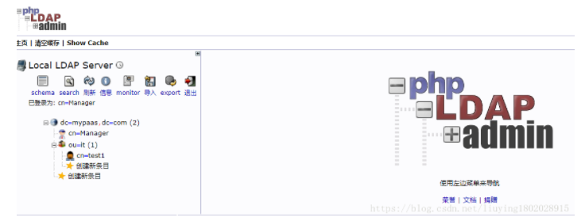

```shell
这段时间需要做一个openLdap的需求,前期简单学习了一下Ldap以及openLdap,下面是安装openLdap的过程
首先我是按照前辈留下的博文进行安装的,参考如下:
https://www.cnblogs.com/linuxws/p/9084455.html
https://blog.csdn.net/computer1024/article/details/78172785
感谢这两位前辈,但是在安装过程中也遇到了一些坑,这里做一个记录.
前期踩过的坑:
刚开始我是使用centos 7.5 64位进行安装的,前面安装都没有问题,但是最后安装完phpldapadmin服务后,访问不了,经过多次尝试,都没有成功,后来索性换了系统,我才用了 centos 6.5 64位
一.环境准备
1. 腾讯云环境 centos6.5 64位
2. 关闭防火墙
博文中用的是这个命令:
systemctl stop firewalld.service 
systemctl disable firewalld.service
但是如果是centos 7以下的系统 systemctl 命令不好使了,所以使用下面的命令
servcie iptables stop                    --临时关闭防火墙
chkconfig iptables off--永久关闭防火墙
二.OPENLDAP服务搭建
1、安装LDAP服务器和客户端，migrationtools工具包
yum install -y openldap-servers openldap-clients migrationtools
2、设置openldap管理员密码
slappasswd
  然后根据提示输入密码： 
New password: 123456
  Re-enter new password: 123456
  会返回加密的密码字符串，保存好这个字符串 
  {SSHA}f13zZnx/b4LQ/ErM+Rf9VSVEJqIE7yHM
---------------------
本文来自 Justin_Chia 的CSDN 博客 ，全文地址请点击：https://blog.csdn.net/computer1024/article/details/78172785?utm_source=copy 
3、更改openldap配置
查看安装了哪些文件（如果熟悉目录结构可以略过）
rpm -ql openldap 
rpm -ql openldap-servers
修改配置
博文中是这句:
vim /etc/openldap/slapd.d/cn\=config\/olcDatabase\={2}hdb.ldif
但是我执行的时候发现这个一个空的文件,说明路径应该有问题, vim 命令找不到该文件就会自动创建该文件(这是踩得第一个坑)
然后我是一级目录一级目录的进入的
[root@VM_60_154_centos /]# cd /etc/openldap/slapd.d/
[root@VM_60_154_centos slapd.d]# ll
total 8
drwxr-x--- 3 ldap ldap 4096 Sep 2810:46 cn=config
-rw-r----- 1 ldap ldap 1281 Sep 2810:41 cn=config.ldif
[root@VM_60_154_centos slapd.d]# cd cn\=config
[root@VM_60_154_centos cn=config]# ll
total 84
drwxr-x--- 2 ldap ldap  4096 Sep 2810:49 cn=schema
-rw-r----- 1 ldap ldap 59398 Sep 2810:41 cn=schema.ldif
-rw-r----- 1 ldap ldap   663 Sep 2810:41 olcDatabase={0}config.ldif
-rw-r----- 1 ldap ldap   596 Sep 2810:41 olcDatabase={-1}frontend.ldif
-rw-r----- 1 ldap ldap   692 Sep 2810:46 olcDatabase={1}monitor.ldif
-rw-r----- 1 ldap ldap  1338 Sep 2810:45 olcDatabase={2}bdb.ldif
[root@VM_60_154_centos cn=config]# vim olcDatabase={2}bdb.ldif
这样就能避免是空文件的问题,接下来
找到olcSuffix，修改为你的dc，如: 
  dc=mypaas,dc=com
  下一行olcRootDN, 修改为你的用户名，如: 
  cn=Manager,dc=mypaas,dc=com
  在文件末尾添加一行，设置刚才的密码： 
  olcRootPW: {SSHA}f13zZnx/b4LQ/ErM+Rf9VSVEJqIE7yHM
---------------------
本文来自 Justin_Chia 的CSDN 博客 ，全文地址请点击：https://blog.csdn.net/computer1024/article/details/78172785?utm_source=copy 
4、更改监控认证配置
vim  /etc/openldap/slapd.d/cn\=config\/olcDatabase\={1}monitor.ldif
  修改 olcAccess 中的dn.base=”cn=xxxxxxx”这行为刚才设置的用户名，如： 
    dn.base=”cn=Manager,dc=mypaas,dc=com”
---------------------
本文来自 Justin_Chia 的CSDN 博客 ，全文地址请点击：https://blog.csdn.net/computer1024/article/details/78172785?utm_source=copy 
这一条按照博文中的直接修改就可以了
5、设置DB Cache
cp /usr/share/openldap-servers/DB_CONFIG.example /var/lib/ldap/DB_CONFIG 
chown -R ldap:ldap /var/lib/ldap/
6、测试配置文件
slaptest -u 
末尾出现configfile testing successed 说明成功了
这里也没有出现问题,出现 configfile testing successed 说明成功了
7、启动OpenLDAP和开机启动
博文中是这样的命令:
systemctlstartslapd.service
systemctlenableslapd.service
因为是centos6.5 系统 systemctl 命令用不了 修改为如下:
service slapd status    查看slapd 的状态
service slapd start     开启slapd 服务
service slapd enable    设置 slapd 服务开机自启动 这条命令应该有问题,但是对于我的安装没有多大影响,所以没有再查,感兴趣的可以自己查查
8、导入模板
ls /etc/openldap/schema/*.ldif | xargs -I {} sudo ldapadd -Y EXTERNAL -H ldapi:/// -f {}
这里导入模板也没有问题,执行完这句命令后,执行结果为:
导入模板:
[root@VM_60_154_centos cn=config]# ls /etc/openldap/schema/*.ldif | xargs -I {} sudo ldapadd -Y EXTERNAL -H ldapi:/// -f {}
SASL/EXTERNAL authentication started
SASL username: gidNumber=0+uidNumber=0,cn=peercred,cn=external,cn=auth
SASL SSF: 0
adding new entry "cn=collective,cn=schema,cn=config"
SASL/EXTERNAL authentication started
SASL username: gidNumber=0+uidNumber=0,cn=peercred,cn=external,cn=auth
SASL SSF: 0
adding new entry "cn=corba,cn=schema,cn=config"
SASL/EXTERNAL authentication started
SASL username: gidNumber=0+uidNumber=0,cn=peercred,cn=external,cn=auth
SASL SSF: 0
adding new entry "cn=core,cn=schema,cn=config"
ldap_add: Other (e.g., implementation specific) error (80)
	additional info: olcAttributeTypes: Duplicate attributeType: "2.5.4.2"
SASL/EXTERNAL authentication started
SASL username: gidNumber=0+uidNumber=0,cn=peercred,cn=external,cn=auth
SASL SSF: 0
adding new entry "cn=cosine,cn=schema,cn=config"
SASL/EXTERNAL authentication started
SASL username: gidNumber=0+uidNumber=0,cn=peercred,cn=external,cn=auth
SASL SSF: 0
adding new entry "cn=duaconf,cn=schema,cn=config"
SASL/EXTERNAL authentication started
SASL username: gidNumber=0+uidNumber=0,cn=peercred,cn=external,cn=auth
SASL SSF: 0
adding new entry "cn=dyngroup,cn=schema,cn=config"
SASL/EXTERNAL authentication started
SASL username: gidNumber=0+uidNumber=0,cn=peercred,cn=external,cn=auth
SASL SSF: 0
adding new entry "cn=inetorgperson,cn=schema,cn=config"
SASL/EXTERNAL authentication started
SASL username: gidNumber=0+uidNumber=0,cn=peercred,cn=external,cn=auth
SASL SSF: 0
adding new entry "cn=java,cn=schema,cn=config"
SASL/EXTERNAL authentication started
SASL username: gidNumber=0+uidNumber=0,cn=peercred,cn=external,cn=auth
SASL SSF: 0
adding new entry "cn=misc,cn=schema,cn=config"
SASL/EXTERNAL authentication started
SASL username: gidNumber=0+uidNumber=0,cn=peercred,cn=external,cn=auth
SASL SSF: 0
adding new entry "cn=nis,cn=schema,cn=config"
SASL/EXTERNAL authentication started
SASL username: gidNumber=0+uidNumber=0,cn=peercred,cn=external,cn=auth
SASL SSF: 0
adding new entry "cn=openldap,cn=schema,cn=config"
SASL/EXTERNAL authentication started
SASL username: gidNumber=0+uidNumber=0,cn=peercred,cn=external,cn=auth
SASL SSF: 0
adding new entry "cn=pmi,cn=schema,cn=config"
SASL/EXTERNAL authentication started
SASL username: gidNumber=0+uidNumber=0,cn=peercred,cn=external,cn=auth
SASL SSF: 0
adding new entry "cn=ppolicy,cn=schema,cn=config"
这里面的内容我还没有研究过,感兴趣的人可以自己看看
三、安装Web管理服务
1、 安装httpd服务器
yum install httpd -y
按照以上命令进行 Yum安装,没有遇到问题 看到complete 即成功
2、修改配置文件httpd.conf
博文中是这样:
vim /etc/httpd/conf/httpd.conf 
找到AllowOverride一行，修改none为all 
如果想修改端口号，修改Listen80一行
我的文件具体如下:
<Directory />
    Options FollowSymLinks
    AllowOverride none
Directory>
将以上 none 改为 all
<Directory />
    Options FollowSymLinks
    AllowOverride all
Directory>
修改端口,按照上面博文中的即可
3、启动服务，测试页面
博文中的命令如下:
systemctl start httpd.service 
systemctl enable httpd.service
curl http://127.0.0.1/
同样,因为是centos 6.5 要换成如下命令
service httpd status  查看状态
service httpd start   开启服务
service httpd enable  设置开机自启动,这句命令可能有问题,因为对我没有影响,我就没管
curl http://127.0.0.1/  看一下通不通
4、安装phpldapadmin
博文中如下:
yum install phpldapadmin
（如果找不到软件包，重新设置一下yum源） 
yum localinstall http://rpms.famillecollet.com/enterprise/remi-release-7.rpm
我直接执行 yum install phpldapadmin 需要询问的时候 y 即可
5、修改配置文件
按照博文中的进行修改没有毛病
先找到该文件
vim /etc/phpldapadmin/config.php
找到如下语句并取消下面几行的注释：(要仔细哦)
$servers->setValue(‘server’,’host’,’127.0.0.1’);
$servers->setValue(‘server’,’port’,389);
$servers->setValue(‘server’,’base’,array(‘dc=mypaas,dc=com’));   # array里加上openldap配置文件中设置的olcSuffix
$servers->setValue(‘login’,’auth_type’,’session’);
$servers->setValue(‘login’,’attr’,’dn’); 
把这一行注释掉
#$servers->setValue(‘login’,’attr’,’uid’);
6、修改访问配置文件，允许任意ip访问
这里我直接贴我的吧
找到该配置文件:
vim /etc/httpd/conf.d/phpldapadmin.conf 
我的文件如下:
  
# Apache 2.4
    Require local
    Require ip 192.168.5
  
  
# Apache 2.2
Order Deny,Allow
# Deny from all
# Allow from 127.0.0.1
     Allow from all
    Allow from ::1
  
192.168.5 是我的ip网段
7、创建基础目录 
在/etc/openldap目录下添加base.ldif文件
cd /etc/openldap/ 
vim base.ldif
dn: dc=mypaas,dc=com
o: ldap
objectclass: dcObject
objectclass: organization
dc: mypaas
1.    创建1个管理员账号
先到根目录下:
cd /
vimtest.ldif
dn: dc=mypaas,dc=com
objectclass: dcObject
objectclass: organization
o: SYS.Inc
dc: mypaas
dn: cn=Manager,dc=mypaas,dc=com
objectclass: organizationalRole
cn: Manager
增加:
ldapadd -x -D "cn=Manager,dc=mypaas,dc=com" -W -f test.ldif
验证
ldapsearch -x -b 'dc=mypaas,dc=com''(objectClass=*)'
2.    创建1个具有部门属性的员工
vimtest2.ldif
dn: ou=it,dc=mypaas,dc=com
ou: it
objectClass: organizationalUnit
dn: cn=test1,ou=it,dc=mypaas,dc=com
ou: it
cn: test1
sn: t1
objectClass: inetOrgPerson
objectClass: organizationalPerson
这里其实是先创建1个部门”it”，再在”it”部门创建了1个员工，实际上是两条命令。
插入数据库
ldapadd -x -D "cn=Manager,dc=mypaas,dc=com" -W -f test2.ldif
验证
ldapsearch -x -b 'dc=mypaas,dc=com''(objectClass=*)'
8、重启httpd服务
service httpd restart
9、访问web管理端
访问 http://ip/phpldapadmin
我的ip是 139.199.30.176 端口也没改过 还是80
所以是:http://139.199.30.176/phpldapadmin
登陆用户名：cn=Manager,dc=mypaas,dc=com
之前用centos 7.5 64位安装的时候 访问 http://139.199.30.176/phpldapadmin 有问题 说我没有权限,那个截图我忘截了,换成centos6.4 可以了 勉强先这样吧
访问 http://139.199.30.176/phpldapadmin 后
用户名:cn=Manager,dc=mypaas,dc=com
密码:123456  (之前第二步中的第二小步设置的)
登陆成功后:

记录先做到这里,方便自己,也方便他人,如果有什么问题,可以多多交流
不积跬步,无以至千里
不积小流,无以成江海
```

