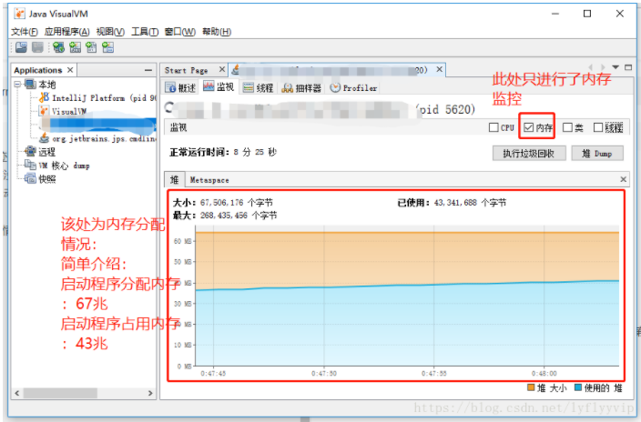

喧哗的夜满地银光。望向窗外， 星的眨眼频率格外的高，低眼看泛着油光的键盘，心中的寂寞。。。

滴滴，靠着每天【ctrl+alt+w】几千+的惯性，打开最【嘿嘿嘿】的聊天软件，心中不免惆怅，已过午时三刻，还tm不下班。

惆 惆啥？油光的脸瞬间露出一缕微笑，惺忪的眼也充满了血丝,活来啦！！！我看见bug在向我招手，大爷来玩呀，来吧来吧。。。刻不容缓。

​    

**那么：问题来了， 一点自己写的代码的信息没有，怎么找？相信这是大多数兄弟遇到内存问题的第一反应**

错误信息是我朋友发给我的截图，我并没有他的代码，也不清楚项目的业务，更不知道为什么会OutOfMemory，懵逼中

**开始搞事情**

首先：理清思路

**1. 发现问题**

**2. 分析问题**

**3. 解决问题**

**首先梳理一下思路：**

- OutOfMemory，内存溢出， 是的，溢出了，什么问题导致的呢，是不是程序的内存给的不够引起的呢。

随即，我问了我的朋友程序启动指定内存没有？如果没有的话制定以下内存会不会解决问题呢

-Xms512m-Xmx2048m

- - 1

回复：启动成功后，朋友测试了一下还真的好了( •̀ ω •́ )y，真开心

- 你以为到这就结束了吗？那未免也太积薄水了吧

(●’◡’●)： 不行呀，兄弟， 我访问没问题了，给我们老板访问就不行了，还是java.lang.OutOfMemoryError: Java heap space，是不是我们老板有毒呀，我是不是考虑要换一个公司呀。

/(ㄒoㄒ)/： 兄弟，我认真的思考了一下。不瞒你说,我感觉你们老板没有那么简单，最起码也得会个气功什么的，你以后要小心呀！！！（重要的事情三个感叹号）

(●’◡’●)：葵花宝典我已经看完前言了，我离成功就差那么零点零一毫米了，但是现在tmd内存溢出了我肿么办！

/(ㄒoㄒ)/：兄弟莫着急，你用OutOfMemoryError神器jvisualvm看一下内存情况

(●’◡’●)：那是什么玩意，玉女心经里的么？md我还没看到那呢

。。。。。。。。。。。。。。。。。。。

一番神讲解下终于打开jvisualvm查看了内存情况。。。

该工具位于jdk安装目录下bin目录下，是jdk自带分析工具，功能非常强大

打开该nb工具后的样子是这样的

​    

[没听过的的兄弟请点此处查阅后继续查看本文章](https://www.cnblogs.com/kongzhongqijing/articles/3625340.html)

**1. 发现问题**

兄弟一看，情况不对呀，尽管分配了内存，但是内存还是会溢出经过一下系列分析（分析详细过程）：

- 1
- 2

okokok 接下来，就是见证奇迹的时刻，lets go

\1. 这位兄弟告诉我，启动程序没问题，一访问就出问题，ok，（重点，要划线）

既然启动没问题，那你把启动的时候的内存分布情况与第一次访问的时候的内存情况发给我。

如下图片是第一次启动程序的情况

​    

其实很多信息都很明了了，启动程序的分配的堆内存大小、程序所占用的堆内存大小，暂时看起来是没什么毛病，内存的大小并没有什么异常的情况，而且此时并没有发声内存溢出的异常。

但是，没有问题怎么会出异常呢，表开心的太找，下面这张图片是没有为程序启动的时候分配内存，并且发起了一次请求后的内存情况。

​    

最大内存瞬间暴涨好几倍，而且程序同时抛出如下异常

​    

嗯，问题出来了

要解决的就是你，此时，问题bug已经重现，问题发现，第一关完美通关！！！

**2. 分析问题**

好的女王大人

前面说了这么多（扯。蛋。），但是，问题就是这么个问题，内存溢出，ok下面就是真正的展现技术的时刻了，你们给我坐正咯

内存出现溢出后，我让这位朋友分配了一下启动的最大内存与最小内存

​    

既然问题已经出来了，那就用jvisualvm分析一下内存把，第一次请求出现的问题是内存暴涨，既然是内存问题，那么我们就对症下药，分析内存。

​    

点击上图堆dump按钮进行堆内存分析，点击后如下所示

​    

点击类后查看对象的内存占比情况如下，点击大小按钮进行内存占比大小排序

​    

找到这个可恨的特务了，就是你，害的我兄弟被领导大问号脸，哼

**3. 解决问题**

继续跟踪这个对象，看丫的到底是个什么东西，有必要搞他一搞。

右击该对象，点击在实例视图中显示按钮，跳转如下页面

​    

跟踪对象发现，名字竟然是一个叫做headerbuffer的东西，看名字，可能是一个request请求的header的缓冲区，占了400多m，一个request的请求头，你占了400多m，脸呢？

问题找到了，一个request的请求头占了四百兆，后续根据这个结果发现，为这个程序分配了两个g的最大内存之后，每次请求都会生成400m的该byte数组，接下来就定位到了请求的身上。

问题找到了，接下来就该看代码了，代码是这位兄弟写的，我就不方便随便贴人家的代码了，我先让这位兄弟检查一下代码，这个接口上做没做什么特殊处理，拦截器、过滤器、所有跟request请求相关的配置，都检查一遍，最后在springboot的配置文件中发现了如下配置：

​    

这简直就是自己挖坑给自己跳呀，具体配置说明兄弟就不再解释了

满脑子黑人问号不再多bb了，咱们在这不多讨论该兄弟为什么这么写

jvisualvm、 jprofile真的是一个内存优化、排查问题的一个好工具，java们早晚会用到它，jprofile教程网上并不少，但是讲的好的并没有几个。重要的还是要自己去熟悉，去理解。

该篇文章仅作为内存溢出的一个解决思路

另提醒各位程序朋友们，可能做不到每一行代码都能刨根问底知道底层是怎么实现、什么原理，但是尽量知道你写或copy的每一行代码什么意思，影响有多大。