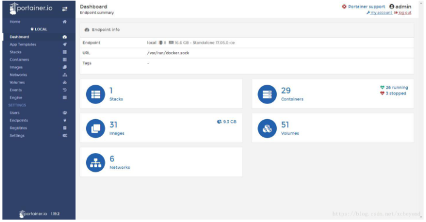
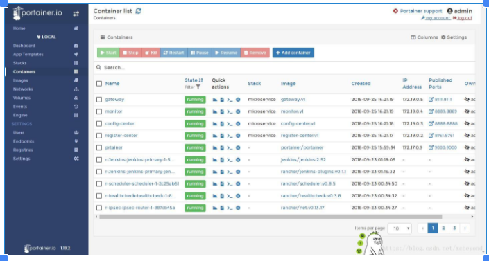
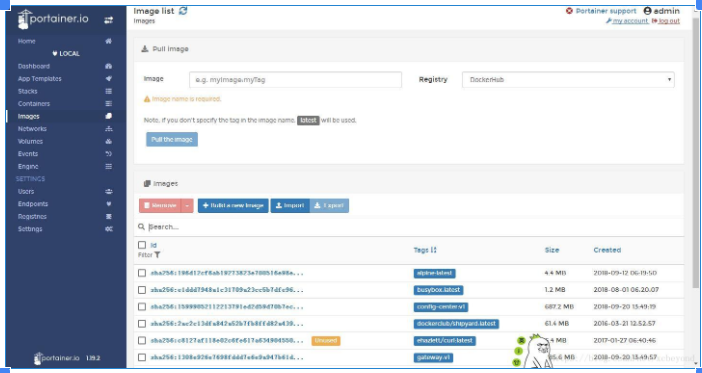
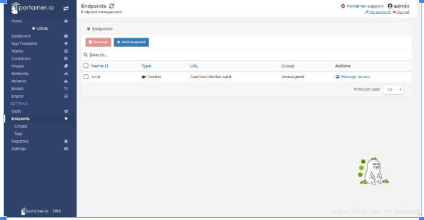

**1、portainer介绍**

​    Portainer是Docker的图形化管理工具，提供状态显示面板、应用模板快速部署、容器镜像网络数据卷的基本操作（包括上传下载镜像，创建容器等操作）、事件日志显示、容器控制台操作、Swarm集群和服务等集中管理和操作、登录用户管理和控制等功能。

 

**Portainer展示：**

 首页

​    包含docker-compose、容器、镜像、卷、网络总体概况。



容器

​    包含容器的启、停，新增，监控，日志查看，容器控制台等功能。



镜像

   包含镜像详细查看、删除、导入、导出等功能。



节点管理



**2、portainer安装**

采用docker方式安装。

**（1）镜像下载。**

```shell
1
[docker@docker microservice]$ docker search portainer
2
NAME DESCRIPTION STARS OFFICIAL AUTOMATED
3
portainer/portainer A simple to use management user interface ... 751
4
hypriot/rpi-portainer A web interface for the Docker engine. Dea... 36
5
portainer/templates App Templates for Portainer http://portain... 12
6
portainer/agent An agent used to manage all the resources ... 8
7
portainer/golang-builder Utility to build Golang binaries. 2 [OK]
8
bmoorman/portainer Portainer [github.com/portainer/portainer]... 1 [OK]
9
arpanpal010/portainer 1
10
usgsastro/portainer custom portainer install into centos7 1 [OK]
11
softonic/portainer-endpoint Allows auto register all the swarm nodes i... 1 [OK]
12
dockerframework/portainer Portainer (Simple Management UI for Docker... 1 [OK]
13
rancher/portainer-agent 0
14
flochtililoch/armv7l-portainer 0
15
nenadilic84/portainer 0
16
voltha/voltha-portainer Portainer support for VOLTHA 0
17
portainer/base Multi-stage build image to create the Port... 0 [OK]
18
portainer/angular-builder Builder image for Portainer frontend. 0 [OK]
19
stefanscherer/portainer Portainer for Windows Insider 0
20
jiangxinshang/portainer 可在loongson的mips64el平台运行的portainer 0
21
helloysd/portainer 0
22
ollijanatuinen/portainer debug/development versions of portainer 0
23
11384eb/portainer 0
24
hassioaddons/portainer 0
25
j0nnylester/portainer portainer running on a Raspberry Pi 0
26
ekambaram/portainer Manage your Docker hosts and Docker Swarm ... 0
27
rodjers/portainer Swarm portainer 0
1
[docker@docker microservice]$ docker pull portainer/portainer
2
Using default tag: latest
3
latest: Pulling from portainer/portainer
4
d1e017099d17: Pull complete
5
d4e5419541f5: Pull complete
6
Digest: sha256:07c0e19e28e18414dd02c313c36b293758acf197d5af45077e3dd69c630e25cc
7
Status: Downloaded newer image for portainer/portainer:latest
```

**（2）容器运行**

```shell
1
[docker@docker microservice]$ docker run -p 9000:9000 --name prtainer --restart=always -v /var/run/docker.sock:/var/run/docker.sock -d portainer/portainer
2
abbc9cbcf1a1866c1cb488d1da97fd49ec8069369c7a96114f41f336631ac478
```

至此，安装完毕，访问http://192.168.1.200:9000/ 体验吧。