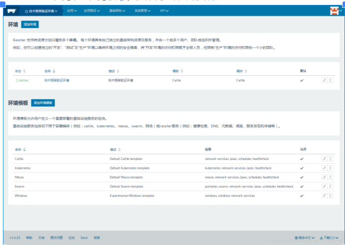

**1、Rancher介绍**

   Rancher是一个开源的企业级容器管理平台。通过Rancher，企业再也不必自己使用一系列的开源软件去从头搭建容器服务平台。Rancher提供了在生产环境中使用的管理Docker和Kubernetes的全栈化容器部署与管理平台。

Rancher由以下四部分组成：

**基础设施编排**

   Rancher可以使用任何公有云或者私有云的Linux主机资源。Linux主机可以是虚拟机，也可以是物理机。Rancher仅需要主机有CPU，内存，本地磁盘和网络资源。从Rancher的角度来说，一台云厂商提供的云主机和一台自己的物理机是一样的。

   Rancher为运行容器化的应用实现了一层灵活的基础设施服务。Rancher的基础设施服务包括网络，存储，负载均衡，DNS和安全模块。Rancher的基础设施服务也是通过容器部署的，所以同样Rancher的基础设施服务可以运行在任何Linux主机上。

**容器编排与调度**

   很多用户都会选择使用容器编排调度框架来运行容器化应用。Rancher包含了当前全部主流的编排调度引擎，例如Docker Swarm， Kubernetes和Mesos。同一个用户可以创建Swarm或者Kubernetes集群。并且可以使用原生的Swarm或者Kubernetes工具管理应用。

   除了Swarm，Kubernetes和Mesos之外，Rancher还支持自己的Cattle容器编排调度引擎。Cattle被广泛用于编排Rancher自己的基础设施服务以及用于Swarm集群，Kubernetes集群和Mesos集群的配置，管理与升级。

**应用商店**

​    Rancher的用户可以在应用商店里一键部署由多个容器组成的应用。用户可以管理这个部署的应用，并且可以在这个应用有新的可用版本时进行自动化的升级。Rancher提供了一个由Rancher社区维护的应用商店，其中包括了一系列的流行应用。Rancher的用户也可以创建自己的私有应用商店。

**企业级权限管理**

​    Rancher支持灵活的插件式的用户认证。支持Active Directory，LDAP， Github等 认证方式。 Rancher支持在环境级别的基于角色的访问控制 (RBAC)，可以通过角色来配置某个用户或者用户组对开发环境或者生产环境的访问权限。

 

**Rancher展示**

Web管理界面-简单易用


环境管理

   环境和环境模板-支持多种调度器。



主机管理


应用商店


负载均衡


部署NFS连接外部存储


**2、Rancher安装**

采用docker方式安装。

**（1）镜像下载。**

```shell
1
[docker@docker ~]$ docker search rancher
2
NAME DESCRIPTION STARS OFFICIAL AUTOMATED
3
rancher/server Rancher 1.x Server Container 520
4
rancher/agent 90
5
rancher/rancher A container management platform built for ... 62
6
rancher/os Rancher OS installation container 39
7
cdrx/rancher-gitlab-deploy Painless deployment of projects built with... 20 [OK]
8
rancher/k8s Rancher Kubernetes Images 17
9
janeczku/rancher-letsencrypt Rancher service that obtains and manages S... 14 [OK]
10
adi90x/rancher-active-proxy All in one active reverse proxy for Rancher ! 11 [OK]
11
infinityworks/prometheus-rancher-exporter Exposes Service/Stack/Host status from the... 7 [OK]
12
rawmind/rancher-traefik This image is the traefik dinamic conf for... 4 [OK]
13
identt/rancher-compose Alpine images with rancher-compose included 2 [OK]
14
rancher/healthcheck 2
15
rancher/rancher-agent 2
16
rawmind/rancher-zk zookeeper service to run in rancher 1 [OK]
17
rancher/dns 1
18
rancher/net 1
19
rancher/scheduler 1
20
rancher/metadata 0
21
hivesolutions/rancher_bot Simple bot for Rancher automation. 0 [OK]
22
camptocamp/prometheus-rancher-metadata-conf rancher-metadata confd prometheus template 0 [OK]
23
camptocamp/fetch-rancher-certificate Fetch rancher certificate from cattle API 0 [OK]
24
markharrison17/dapi-pipeline-rancher Repo for the DSS API Pipeline rancher cont... 0
25
janeczku/datadog-rancher-init Sidekick image for deploying DataDog Agent... 0 [OK]
26
arwineap/concourse-rancher-compose-resource concourse rancher compose resource 0 [OK]
27
markharrison17/dapi-rancher DSS API Rancher control 0
1
[docker@docker ~]$ docker pull rancher/server
2
Using default tag: latest
3
latest: Pulling from rancher/server
4
bae382666908: Pull complete
5
29ede3c02ff2: Pull complete
6
da4e69f33106: Pull complete
7
8d43e5f5d27f: Pull complete
8
b0de1abb17d6: Pull complete
9
422f47db4517: Pull complete
10
79d37de643ce: Pull complete
11
69d13e08a4fe: Pull complete
12
2ddfd3c6a2b7: Pull complete
13
bc433fed3823: Pull complete
14
b82e188df556: Pull complete
15
dae2802428a4: Pull complete
16
c9b17cca6fc4: Pull complete
17
41cc2c1ffe8c: Pull complete
18
ae49123ce3ae: Pull complete
19
2fe8cae58437: Pull complete
20
ab963aad4fc2: Pull complete
21
2dd932ceaa80: Pull complete
22
71ff5e84e401: Pull complete
23
0be35ae80349: Pull complete
24
ae4f98e342e9: Pull complete
25
Digest: sha256:cbe7d290460dfa83981d02506ff2588fdb3d5d988641c630c6f10bb7211fbfc6
26
Status: Downloaded newer image for rancher/server:latest
27
[docker@docker ~]$ docker image ls
28
REPOSITORY TAG IMAGE ID CREATED SIZE
29
rancher/server latest a0b9e05b2a03 42 hours ago 1.08GB
30
……
```

**(2)容器运行**

```shell
1
[docker@docker ~]$ docker run --name rancher-server -p 8000:8080 -v /etc/localtime:/etc/localtime:ro -d rancher/server
2
a4a32619551c9c1ffd4c11f7c1da5d0297fa5bdf6eea103f045bbc837ea88f65
```

至此，安装完成，访问[http://192.168.1.200:8000](http://192.168.1.200:8000/) ，体验吧。