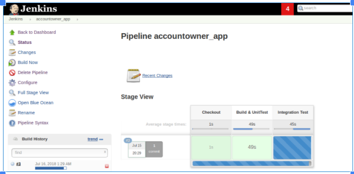
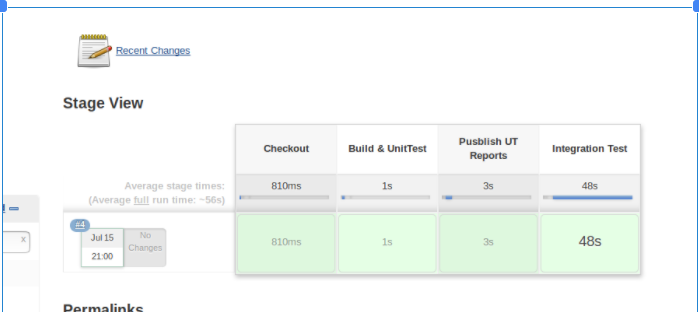

我们已经讨论了为什么持续集成很重要，什么才是好的CI工具，并且我们已经学习了如何使用[TeamCity来构建，测试和部署“ dockerized” .NET Core应用程序](https://code-maze.com/ci-aspnetcoreapp-docker/)。

由于[Jenkins是市场上最受欢迎的CI工具之一，](https://code-maze.com/top-8-continuous-integration-tools/)具有超过一千个插件，因此在本文中，我们将为同一.NET Core应用程序建立CI管道。

**本文是该系列的一部分**

因此，在我们进行深入研究之前，这里不介绍即将发生的事情。

我们将使用[Pipeline作为代码](https://jenkins.io/solutions/pipeline/)插件来创建Jenkins作业。牛逼，他冷静的一部分使用这个插件是我们整个詹金斯作业配置可以创建，更新，并与我们的源代码，其余版本控制一起。除此之外，我们将利用docker和docker-compose的神奇力量，凭空建立整个CI基础架构！

令人兴奋，对不对？

我们建议您跟随我们，让它变得更加有趣吧！

继续并派生[docker-series repo](https://github.com/CodeMazeBlog/docker-series)并切换到[docker-series-continuous-integration-jenkins-end](https://github.com/CodeMazeBlog/docker-series/tree/docker-series-continuous-integration-jenkins-end)  分支。

这是我们这次要学习的内容：

- 使用Jenkins的CI管道高级流程图
- 使用Docker设置CI基础架构即代码

- - 为我们的Jenkins Master设置自定义Docker映像
  - 配置“ Dockerized”构建代理以编译我们的代码

- - - 编写Docker文件并使其自我连接
    - 在代理中构建映像并公开Docker守护程序

- 在詹金斯中创建流水线代码作业

- - 编写詹金斯文件
  - 动态版本
  - 构建应用程序
  - 在詹金斯中运行测试和发布报告

- 结论

**注意：与本系列其他部分不同，该部分使用.NET Core 2.0 SDK。确保根据需要更改基本图像。**

让我们深入其中。

**使用Jenkins的CI管道高级流程图**

让我们看看詹金斯所使用的持续集成（CI）管道的“非常”高层视图是什么样的：


使用Jenkins的高级CI流程

流程图很容易理解，但是没有什么要注意的，

- 您可能想知道代码编译和单元测试步骤在哪里？好了，**泊坞窗运行**步骤同时执行**代码编译**和**应用程序发布**！
- 在此示例中，虚线标记了我们的CI工具Jenkins的边界
- 成功运行“集成测试”后让docker push可以确保仅将经过测试的应用程序升级到下一个区域，这是持续集成（CI）另一个非常重要的规则

**使用Docker设置CI基础架构即代码**

现在让我们进入有趣的东西。建立我们的Jenkins基础架构！

尽管[Jenkins泊坞镜映像](https://hub.docker.com/r/jenkins/jenkins/)有很多值得关注的地方，但还是有一些..…让我们说“有点不便”吗？

让我们看看那个小东西是什么。

当我们运行以下docker命令时：

The Docker run command for Jenkins container

```shell
docker run -d -p 8080:8080 -p 50000:50000 jenkins/jenkins
```


初始安装向导

詹金斯欢迎我们的“**设置向导屏幕”**这就要求我们输入 **“InitialAdminPassword”** 位于下Jenkins_Home目录默认为/var/jenkins_home/secrets/initialAdminPassword。密码也显示在启动日志中：


初始管理员密码

[**强烈建议按照以下步骤保护Jenkins服务器**](https://wiki.jenkins.io/display/JENKINS/Features+controlled+by+system+properties)**，但是，在此示例中，我们将通过禁用它并在运行时创建新用户来跳过此步骤。**

让我们开始吧，对吧？

**为我们的Jenkins Master设置自定义Docker映像**

让我们看下面的Dockerfile：

jenkins-docker/master/Dockerfile

```shell
# Starting off with the Jenkins base Image
FROM jenkins/jenkins:latest
 
# Installing the plugins we need using the in-built install-plugins.sh script
RUN /usr/local/bin/install-plugins.sh git matrix-auth workflow-aggregator docker-workflow blueocean credentials-binding
 
# Setting up environment variables for Jenkins admin user
ENV JENKINS_USER admin
ENV JENKINS_PASS admin
 
# Skip the initial setup wizard
ENV JAVA_OPTS -Djenkins.install.runSetupWizard=false
 
# Start-up scripts to set number of executors and creating the admin user
COPY executors.groovy /usr/share/jenkins/ref/init.groovy.d/
COPY default-user.groovy /usr/share/jenkins/ref/init.groovy.d/
 
VOLUME /var/jenkins_home
```

我们从Jenkins / Jenkins基本映像开始，然后安装所需的插件。

**第12行**是需要传递的运行时JVM参数，以禁用**“安装向导”**

**第15和16**行将为容器提供初始启动脚本，以设置Jenkins执行程序并创建Jenkins管理员用户。

让我们构建此映像并准备就绪。建立代理后，我们将立即恢复！

Docker Build and Docker Run for the Jenkins Container

```shell
docker build -t jenkins-master .
```

**配置“ Dockerized”构建代理以编译我们的代码**

对于Jenkins构建代理，我们将使用JLNP将其“自动附加”到Jenkins主文件。

代理的Dockerfile如下所示：

jenkins-docker/slave/Dockerfile

```shell
FROM ubuntu:16.04
 
# Install Docker CLI in the agent
RUN apt-get update && apt-get install -y apt-transport-https ca-certificates
RUN apt-key adv --keyserver hkp://p80.pool.sks-keyservers.net:80 --recv-keys 58118E89F3A912897C070ADBF76221572C52609D
RUN echo "deb [arch=amd64] https://download.docker.com/linux/ubuntu xenial stable" > /etc/apt/sources.list.d/docker.list
RUN apt-get update && apt-get install -y docker-ce --allow-unauthenticated
 
RUN apt-get update && apt-get install -y openjdk-8-jre curl python python-pip git
RUN easy_install jenkins-webapi
 
# Get docker-compose in the agent container
RUN curl -L https://github.com/docker/compose/releases/download/1.21.2/docker-compose-`uname -s`-`uname -m` > /usr/local/bin/docker-compose && chmod +x /usr/local/bin/docker-compose
RUN mkdir -p /home/jenkins
RUN mkdir -p /var/lib/jenkins
 
# Start-up script to attach the slave to the master
ADD slave.py /var/lib/jenkins/slave.py
 
WORKDIR /home/jenkins
 
ENV JENKINS_URL "http://jenkins"
ENV JENKINS_SLAVE_ADDRESS ""
ENV JENKINS_USER "admin"
ENV JENKINS_PASS "admin"
ENV SLAVE_NAME ""
ENV SLAVE_SECRET ""
ENV SLAVE_EXECUTORS "1"
ENV SLAVE_LABELS "docker"
ENV SLAVE_WORING_DIR ""
ENV CLEAN_WORKING_DIR "true"
 
CMD [ "python", "-u", "/var/lib/jenkins/slave.py" ]
```

让我们看一下上面文件中的一些重要步骤，

**13号线**负责在我们的构建代理中下载并安装**“ docker-compose”**

**18号线**负责添加神奇的启动python脚本，该脚本负责作为构建代理附加到我们的主机上！

现在，谁喜欢遍历90行的python脚本？不是我 ？！为了使事情变得容易，让我们看一下这个简单的流程图来理解这一点！


从站启动脚本

当我们将主服务器和从服务器包装到docker-compose文件中时，“ **等待主服务器** ”逻辑将非常方便。depends_on: docker-compose中的标签不能很好地发挥作用，因为jenkins master需要花费更多时间才能完全启动并运行，而不是docker-compose估计的时间更长。因此，它为我们的奴隶增加了智慧。

让我们构建这个容器并将我们的Jenkins基础结构扭曲到docker-compose文件中！

**构建映像并将Docker守护进程暴露给代理**

```shell
Docker Build for the Jenkins Slave Container
docker build -t jenkins-slave .
docker-series/docker-compose.ci.yml
version: '3.1'
services:
    jenkins:
        container_name: jenkins
        ports:
            - '8080:8080'
            - '50000:50000'
        image: localhost:5000/jenkins
    jenkins-slave:
        container_name: jenkins-slave
        restart: always
        environment:
            - 'JENKINS_URL=http://jenkins:8080'
        image: localhost:5000/jenkins-slave
        volumes:
            - /var/run/docker.sock:/var/run/docker.sock  # Expose the docker daemon in the container
            - /home/jenkins:/home/jenkins # Avoid mysql volume mount issue
        depends_on:
            - jenkins
```

Line＃17在这里很重要，因为已安装的卷将帮助修复docker卷中的docker问题。它在我们以前的文章中介绍到它[这里](https://code-maze.com/ci-aspnetcoreapp-docker/#fixingvolumes)

大！

现在该使用docker-compose up命令启动我们的Jenkins基础架构了

docker-compose -f .\docker-compose.ci.yml up

这是容器启动的docker-compose日志：


docker-compose启动日志

标签1表示Jenkins容器已启动，但是尚未完全启动并运行。因此，我们的等待逻辑派上了用场。


代理已连接

最后，我们的代理已成功连接到我们的詹金斯大师。我们应该能够在本地主机的8080端口访问Jenkins Web UI！

而且你猜怎么着，没有初始启动向导呢！


詹金斯·洛金（Jenkins Logon）

在这里，我们使用初始管理员用户凭据admin / admin登录。之后，Jenkins将我们带到仪表板，在这里我们可以看到我们的Docker构建代理已准备好承担一些构建任务！


詹金斯仪表板

**在詹金斯中创建流水线代码作业**

让我们首先创建一个“ New Item”，并将其保存为管道作业，如下所示：

下一步是使用作业描述，SCM URL和分支更新作业配置，如下所示：


配置项目

**编写詹金斯文件**

Jenkins文件是一个基于groovy的脚本，列出了Jenkins构建的不同阶段和步骤。这种方法的使用上一个好处**自由泳工作** 牯主要围绕灵活性，并能够版本控制的能力。

让我们讨论一下这两个要点，

**灵活性：**

通常，将创建一个自由式作业来完成CI管道中的特定任务，这可能是编译我们的代码，运行集成测试或部署我们的应用程序。

但是，真正的CI包括所有这三个步骤，并以顺序或并行的方式将它们链接在一起。这就是我们所说的“管道”。

可以通过使用自由式作业来实现链接，但归根结底，对于单个应用程序来说，这不是很方便。管道将 包含大量以上游-下游方式连接的自由式作业。在这些工作之间进行沟通，例如：共享变量，自定义状态可能是一场噩梦。

所有这些问题都可以通过管道作业解决！

版本控制您的作业配置：

如前所述，Jenkinsfile只是一个普通的脚本，因此，它可以与其他应用程序代码一起存储，编辑和版本控制！

在开始编写我们的Jenkinsfile之前，让我们直观地了解构建和发布此应用程序所需的步骤：


建立步骤

Jenkins管道语法生成器可以帮助我们逐行构建Jenkinsfile。以下是一些示例：


管道语法生成器

这是我们的Jenkinsfile的样子：

Jenkinsfile

```shell
node('docker') {
 
    stage 'Checkout'
        checkout scm
    stage 'Build & UnitTest'
        sh "docker build -t accountownerapp:B${BUILD_NUMBER} -f Dockerfile ."
        sh "docker build -t accountownerapp:test-B${BUILD_NUMBER} -f Dockerfile.Integration ."
  
    stage 'Integration Test'
        sh "docker-compose -f docker-compose.integration.yml up --force-recreate --abort-on-container-exit"
        sh "docker-compose -f docker-compose.integration.yml down -v"
}
```

让我们打破它在这里分解：

**1号线：**该node 关键字用来选择生成代理

**4号线，5，9：** 该stage 关键字用于在我们的构建定义阶段

**动态版本**

我们快速迈进的一件事是使用Jenkins内部版本号“标记”图像版本。Jenkins暴露BUILD_NUMBER 为环境变量��

每个新版本都会自动增加版本。为了支持这一点，docker-compose.integration.yml文件也以相同的方式被“标记化”。

```shell
docker-compose.integration.yml
version: '3.1'
 
services:
  db:
    image: mysql:5.7
    environment:
      MYSQL_RANDOM_ROOT_PASSWORD: 1
      MYSQL_DATABASE: accountowner
      MYSQL_USER: dbuser
      MYSQL_PASSWORD: dbuserpassword
      DEBUG: 1
    volumes:
      - dbdata:/var/lib/mysql
      - ./_MySQL_Init_Script:/docker-entrypoint-initdb.d
    restart: always
  accountownerapp:
    depends_on:
      - db
    image: "accountownerapp:B${BUILD_NUMBER}"
    build:
      context: .
  integration:
    depends_on:
      - accountownerapp
    image: "accountownerapp:test-B${BUILD_NUMBER}"
    build:
      context: .
      dockerfile: Dockerfile.Integration
    environment:
      - TEAMCITY_PROJECT_NAME
volumes:
    dbdata:
```

以下链接显示了所有Jenkins环境变量： http:///env-vars.html/

其余步骤仅是shell脚本。

让我们来建立我们的詹金斯工作吧！

**构建应用程序**

“立即构建”链接会触发新的构建：



建设进度

在这里，我们有了第一份成功的工作！ 以下两个快照显示了成功的工作以及**Build＆UnitTest阶段**的日志**：**


成功构建！

+

阶段日志

**在詹金斯中运行测试和发布报告**

我们已经在先前的版本中成功执行了测试。使用Jenkins的好处之一是构建后报告发布功能，该功能可帮助我们整理测试结果并将其发布为HTML报告！

我们将使用[**MS Test插件**](https://wiki.jenkins.io/display/JENKINS/MSTest+Plugin)发布报告，但是在此之前，这是我们需要解决的两个问题。

**问题1：**容器在其内部存储执行的测试结果。

**问题2：**即使我们发布了报告，我们如何在应用程序容器之外提供该报告，并供Jenkins MS测试插件读取？

让我们一一解决

**解决方案1：让我们更新Dockerfile以发布结果并将其存储在容器内的文件夹中**

```shell
Dockerfile
FROM microsoft/aspnetcore-build as build-image
 
WORKDIR /home/app
 
COPY ./*.sln ./
COPY ./*/*.csproj ./
RUN for file in $(ls *.csproj); do mkdir -p ./${file%.*}/ && mv $file ./${file%.*}/; done
 
RUN dotnet restore
 
COPY . .
 
RUN dotnet test --verbosity=normal --results-directory /TestResults/ --logger "trx;LogFileName=test_results.xml" ./Tests/Tests.csproj
 
RUN dotnet publish ./AccountOwnerServer/AccountOwnerServer.csproj -o /publish/
 
FROM microsoft/aspnetcore
 
WORKDIR /publish
 
COPY --from=build-image /publish .
 
COPY --from=build-image /TestResults /TestResults
 
ENV TEAMCITY_PROJECT_NAME = ${TEAMCITY_PROJECT_NAME}
 
ENTRYPOINT ["dotnet", "AccountOwnerServer.dll"]
```

第13行：添加了其他命令行参数以发布日志并将其存储在/TestResults文件夹中。

**请注意，测试结果文件夹仍位于容器中**

**解决方案2**：在这里，我们将使用一些docker magic将结果复制到容器外

我们可以有效地使用docker cp 命令从容器中复制内容，但是，不需要运行容器。没什么大不了的，我们可以使用一些shell脚本来解决这个问题。

这是他更新的Jenkinsfile的专用阶段，用于发布测试结果：

```shell
Jenkinsfile
node('docker') {
 
    stage 'Checkout'
        checkout scm
    stage 'Build & UnitTest'
    sh "docker build -t accountownerapp:B${BUILD_NUMBER} -f Dockerfile ."
    sh "docker build -t accountownerapp:test-B${BUILD_NUMBER} -f Dockerfile.Integration ."
    
    stage 'Pusblish UT Reports'
        containerID = sh (
            script: "docker run -d accountownerapp:B${BUILD_NUMBER}", 
        returnStdout: true
        ).trim()
        echo "Container ID is ==> ${containerID}"
        sh "docker cp ${containerID}:/TestResults/test_results.xml test_results.xml"
        sh "docker stop ${containerID}"
        sh "docker rm ${containerID}"
        step([$class: 'MSTestPublisher', failOnError: false, testResultsFile: 'test_results.xml'])    
      
    stage 'Integration Test'
        sh "docker-compose -f docker-compose.integration.yml up --force-recreate --abort-on-container-exit"
        sh "docker-compose -f docker-compose.integration.yml down -v"
}
```

新阶段包括运行容器，将测试结果复制回构建代理并发布报告的Shell步骤。让我们继续执行！



建立状态

Jenkins构建页面显示了已发布的测试结果，


检测结果

**结论**

哇！

这是本文的结论。整合詹金斯几乎是无缝的与任何现有的项目生命周期中，由于插件的丰富的图书馆和免费documentat 离子所有O版本的实习医生吨。我们在这里看到的只是Jenkins作为CI工具提供的一小部分。

在本文中，我们主要关注 Jenkins作为CI工具， 除了 docker文件更新以适应测试结果外，我们没有对应用程序代码进行太多更改。 [与TeamCity和Docker的持续集成](https://code-maze.com/ci-aspnetcoreapp-docker)文章更详细地介绍了集成测试。请仔细阅读以获取完整图片。

整个项目正在可 [泊坞窗系列](https://github.com/CodeMazeBlog/docker-series)  日在GitHub的仓库è [泊坞窗系列-持续集成-詹金斯的高端分支](https://github.com/CodeMazeBlog/docker-series/tree/docker-series-continuous-integration-jenkins-end)。随意查看它，并在评论部分寻求任何帮助。