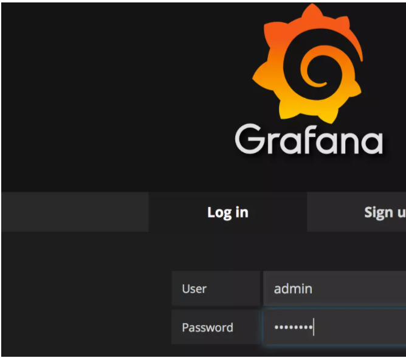

端口分配说明:

node-exporter 9100

alertmanager 9093

prometheus 9090

Grafana 3000

1.首先安装docker:

安装教程如下:

https://www.jianshu.com/p/e73ccf24c04d

安装完成后, 使用 docker 分别拉取 node-exporter,prometheus,grafana最新版镜像

```shell
sudo docker pull prom/node-exporter
sudo docker pull prom/prometheus
sudo docker pull grafana/grafana
sudo docker pull prom/alertmanager
```

2.运行 node-exporter

指定端口为9100 , --net=host，这样该容器就会使用主机的网卡,而不会生成自己的虚拟网卡, Prometheus Server 可以直接与 Node Exporter 通信

```shell
sudo docker run -d -p 9100:9100 \
-v "/proc:/host/proc" \
-v "/sys:/host/sys" \
-v "/:/rootfs" \
--net=host \
prom/node-exporter \
--path.procfs /host/proc \
--path.sysfs /host/sys \
--collector.filesystem.ignored-mount-points "^/(sys|proc|dev|host|etc)($|/)"
```

输入 docker ps 查看 node-exporter 已经载运行了


打开浏览器 http://localhost:9100/metrics 查看到 metrics 输出


3.运行 Prometheus Server

在 home 目录下新建文件夹来存放配置文件

```shell
cd /home/你的个人文件夹 (非root权限的)
mkdir prometheus
cd prometheus
```

新建 prometheus.yml 配置文件 :

```yaml
# Prometheus全局配置项
global:
  scrape_interval:     15s # 设定抓取数据的周期，默认为1min
  evaluation_interval: 15s # 设定更新rules文件的周期，默认为1min
  scrape_timeout: 15s # 设定抓取数据的超时时间，默认为10s
  external_labels: # 额外的属性，会添加到拉取得数据并存到数据库中
   monitor: 'codelab_monitor'


# Alertmanager配置
alerting:
 alertmanagers:
 - static_configs:
   - targets: ["localhost:9093"] # 设定alertmanager和prometheus交互的接口，即alertmanager监听的ip地址和端口
     
# rule配置，首次读取默认加载，之后根据evaluation_interval设定的周期加载
rule_files:
 - "alertmanager_rules.yml"
 - "prometheus_rules.yml"

# scape配置
scrape_configs:
- job_name: 'prometheus' # job_name默认写入timeseries的labels中，可以用于查询使用
  scrape_interval: 15s # 抓取周期，默认采用global配置
  static_configs: # 静态配置
  - targets: ['localhost:9100'] # prometheus所要抓取数据的地址，即instance实例项

- job_name: 'example-random' #个人测试用接口
  static_configs:
  - targets: ['localhost:8080']
```

新建报警规则文件 alertmanager_rules.yml和 prometheus_rules.yml

alertmanager_rules.yml

```shell
groups:
 - name: test-rules
   rules:
   - alert: InstanceDown # 告警名称
     expr: up == 0 # 告警的判定条件，参考Prometheus高级查询来设定
     for: 2m # 满足告警条件持续时间多久后，才会发送告警
     labels: #标签项
      team: node
     annotations: # 解析项，详细解释告警信息
      summary: "{{$labels.instance}}: has been down"
      description: "{{$labels.instance}}: job {{$labels.job}} has been down "
      value: {{$value}}
```

prometheus_rules.yml

```shell
groups:
- name: example   #报警规则的名字
  rules:

  # Alert for any instance that is unreachable for >5 minutes.
  - alert: InstanceDown     #检测job的状态，持续1分钟metrices不能访问会发给altermanager进行报警
    expr: up == 0
    for: 1m    #持续时间
    labels:
      serverity: page
    annotations:
      summary: "Instance {{ $labels.instance }} down"
      description: "{{ $labels.instance }} of job {{ $labels.job }} has been down for more than 5 minutes."


  - alert: "it's has problem"  #报警的名字
    expr: "test_tomcat{exported_instance="uat",exported_job="uat-app-status",host="test",instance="uat",job="uat-apps-status"} -  test_tomcat{exported_instance="uat",exported_job="uat-app-status",host="test",instance="uat",job="uat-apps-status"} offset 1w > 5"   # 这个意思是监控该表达式查询出来的值与一周前的值进行比较，大于5且持续10m钟就发送给altermanager进行报警
    for: 1m  #持续时间
    labels:
      serverity: warning
    annotations:
      summary: "{{ $labels.type }}趋势增高"
      description: "机器:{{ $labels.host }} tomcat_id:{{ $labels.id }} 类型:{{ $labels.type }} 与一周前的差值大于5,当前的差值为:{{ $value }}"    #自定义的报警内容

```

运行普罗米休斯:

```shell
sudo docker run -d -p 9090:9090--name prometheus --net=host -v /home/你的文件夹/prometheus/prometheus.yml:/etc/prometheus/prometheus.yml prom/prometheus
```

打开 http://localhost:9090/graph


运行成功!

3.运行 Alertmanager :

安装golang:

```shell
sudo apt-get install golang-go
```


关于Alertmanager 查看: https://www.jianshu.com/p/239b145e2acc

在当前目录下新建 alertmanager 存放Alertmanager的配置文件:

```shell
mkdir alertmanagercd alertmanager
```


新建 alertmanager.yml 配置文件:

邮箱配置改为自己的.

```yaml
# 全局配置项
global: 
  resolve_timeout: 5m #处理超时时间，默认为5min
  smtp_smarthost: 'smtp.sina.com:25' # 邮箱smtp服务器代理
  smtp_from: '******@sina.com' # 发送邮箱名称
  smtp_auth_username: '******@sina.com' # 邮箱名称
  smtp_auth_password: '******' # 邮箱密码或授权码
  wechat_api_url: 'https://qyapi.weixin.qq.com/cgi-bin/' # 企业微信地址


# 定义模板信心
templates:
  - 'template/*.tmpl'

# 定义路由树信息
route:
  group_by: ['alertname'] # 报警分组依据
  group_wait: 10s # 最初即第一次等待多久时间发送一组警报的通知
  group_interval: 10s # 在发送新警报前的等待时间
  repeat_interval: 1m # 发送重复警报的周期 对于email配置中，此项不可以设置过低，否则将会由于邮件发送太多频繁，被smtp服务器拒绝
  receiver: 'email' # 发送警报的接收者的名称，以下receivers name的名称

# 定义警报接收者信息
receivers:
  - name: 'email' # 警报
    email_configs: # 邮箱配置
    - to: '******@163.com'  # 接收警报的email配置
      html: '{{ template "test.html" . }}' # 设定邮箱的内容模板
      headers: { Subject: "[WARN] 报警邮件"} # 接收邮件的标题
    # 第三方开发配置
     #webhook_configs: # webhook配置
    #- url: 'http://127.0.0.1:5001'
    #send_resolved: true
    #wechat_configs: # 企业微信报警配置
    #- send_resolved: true
     #to_party: '1' # 接收组的id
      #agent_id: '1000002' # (企业微信-->自定应用-->AgentId)
      #corp_id: '******' # 企业信息(我的企业-->CorpId[在底部])
      #api_secret: '******' # 企业微信(企业微信-->自定应用-->Secret)
      #message: '{{ template "test_wechat.html" . }}' # 发送消息模板的设定
# 一个inhibition规则是在与另一组匹配器匹配的警报存在的条件下，使匹配一组匹配器的警报失效的规则。两个警报必须具有一组相同的标签。 
inhibit_rules: 
  - source_match: 
     severity: 'critical' 
    target_match: 
     severity: 'warning' 
    equal: ['alertname', 'dev', 'instance']
```

注：

1）repeat_interval配置项，对于email来说，此项不可以设置过低，否则将会由于邮件发送太多频繁，被smtp服务器拒绝

.tmpl模板的配置:

新建template文件夹存放模板:

mkdir templatecd template

新建发送邮件模板 test.tmpl:

```yaml
{{ define "test.html" }}
<table border="1">
        <tr>
                <td>报警项</td>
                <td>实例</td>
                <td>报警阀值</td>
                <td>开始时间</td>
        </tr>
        {{ range $i, $alert := .Alerts }}
                <tr>
                        <td>{{ index $alert.Labels "alertname" }}</td>
                        <td>{{ index $alert.Labels "instance" }}</td>
                        <td>{{ index $alert.Annotations "value" }}</td>
                        <td>{{ $alert.StartsAt }}</td>
                </tr>
        {{ end }}
</table>
{{ end }}
```

注:

上述Labels项，表示prometheus里面的可选label项。annotation项表示报警规则中定义的annotation项的内容。

告警信息生命周期的3中状态

1）inactive：表示当前报警信息即不是firing状态也不是pending状态

2）pending：表示在设置的阈值时间范围内被激活的

3）firing：表示超过设置的阈值时间被激活的

运行 alertmanager:

```shell
sudo docker run -d -p 9093:9093--net=host -v /home/你的文件夹/prometheus/alertmanager/alertmanager.yml:/etc/alertmanager/config.yml --name alertmanager prom/alertmanager
```

打开 http://localhost:9093/#/alerts


运行成功!

4.运行 Grafana

```shell
sudo docker run -d -i -p 3000:3000 \-e "GF_SERVER_ROOT_URL=http://grafana.server.name" \-e "GF_SECURITY_ADMIN_PASSWORD=admin" \--net=host \grafana/grafana
```

-e "GF_SECURITY_ADMIN_PASSWORD=secret 指定了 Grafana admin用户密码 admin。

打开 http://localhost:3000

输入用户名 admin 密码 admin



登录后，Grafana 将引导我们配置 Data Source。


添加一个数据源，将Grafana和Prometheus关联起来


回到首页,接下来需要添加一个 dashboard


