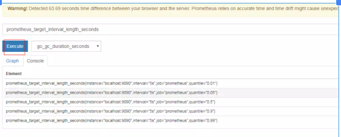

Prometheus的安装和配置

Linux环境下下载二进制分发包，解压后就安装完了。

\1. 启动

解压后，在解压后的路径内执行命令./premetheus 即可以使用默认配置启动Prometheus应用。

默认使用的是同目录下的prometheus.yml文件

可以通过浏览器访问http://宿主机ip:9090 测试启动情况。

\2. 配置

执行 prometheus 命令的时候可以通过参数 --config.file 来指定配置文件路径。Prometheus 服务运行过程中如果配置文件有改动，可以给服务进程发送 SIGHUP 信号来通知服务进程重新从磁盘加载配置。这样无需重启，避免了服务中断。

prometheus.yml 中的配置详解

- ： 布尔值，true 或 false
- ： 持续时间，格式符合正则表达式 [0-9]+(ms|[smhdwy])
- ： 标签名，格式符合正则表达式 [a-zA-Z_][a-zA-Z0-9_]*
- ： 标签值，可以包含任意 unicode 字符
- ： 文件名，任意有效的文件路径
- ： 主机，可以是主机名或 IP，后面可跟端口号
- ： URL 路径
- ： 协议，http 或 https
- ： 字符串
- ： 密钥，比如密码
- ： 模板字符串，里面包含需要展开的变量

一个典型的配置

```shell
global:
  # 抓取间隔，默认为 1m
  [ scrape_interval: <duration> | default = 1m ]

  # 抓取超时时间，默认为 10s
  [ scrape_timeout: <duration> | default = 10s ]

  # 规则评估间隔，默认为 1m
  [ evaluation_interval: <duration> | default = 1m ]

# 抓取配置
scrape_configs:
  [ - <scrape_config> ... ]

# 规则配置
rule_files:
  [ - <filepath_glob> ... ]

# 告警配置
alerting:
  alert_relabel_configs:
    [ - <relabel_config> ... ]
  alertmanagers:
    [ - <alertmanager_config> ... ]
```

- global 全局配置节点下的配置对所有其它节点都有效，同时也是其它节点的默认值。
- rule_files 规则配置包含记录规则配置和告警规则配置，节点下只是列出文件，具体配置在各个文件中。记录规则配置接下来会讲，告警规则配置在后面的告警实验中会讲解。
- alerting 告警配置用于 Alertmanager

抓取配置

抓取配置可以有多个，一般来说每个任务（Job）对应一个配置。单个抓取配置的格式如下：

```shell
# 任务名
job_name: <job_name>

# 抓取间隔，默认为对应全局配置
[ scrape_interval: <duration> | default = <global_config.scrape_interval> ]

# 抓取超时时间，默认为对应全局配置
[ scrape_timeout: <duration> | default = <global_config.scrape_timeout> ]

# 协议，默认为 http，可选 https
[ scheme: <scheme> | default = http ]

# 抓取地址的路径，默认为 /metrics
[ metrics_path: <path> | default = /metrics ]

# 抓取地址的参数
params:
  [ <string>: [<string>, ...] ]

# 是否尊重抓取回来的标签，默认为 false
[ honor_labels: <boolean> | default = false ]

# 静态目标配置
static_configs:
  [ - <static_config> ... ]

# 单次抓取的采样值个数限制，默认为 0，表示没有限制
[ sample_limit: <int> | default = 0 ]
```

honor_labels 表示是否尊重抓取回来的标签。当抓取回来的采样值的标签值跟服务端配置的不一致时，如果该配置为 true，则以抓取回来的为准。否则以服务端的为准，抓取回来的值会保存到一个新标签下，该新标签名在原来的前面加上了“exported_”，比如 exported_job。

*要抓取的实例目标*

static_configs 下配置了该任务要抓取的所有实例，按组配置，包含相同标签的实例可以分为一组，以简化配置。单个组的配置格式如下：

```shell
# 目标地址列表，地址由主机+端口组成
targets:
  [ - '<host>' ]

# 标签列表
labels:
  [ <labelname>: <labelvalue> ... ]
```

抓取目标可以是动态也可是静态的，此处讲的是静态抓取。

记录规则配置

记录规则允许我们把一些经常需要使用并且查询时计算量很大的查询表达式，预先计算并保存到一个新的时序。查询这个新的时序比从原始一个或多个时序实时计算快得多，并且还能够避免不必要的计算。在一些特殊场景下这甚至是必须的，比如仪表盘里展示的各类定时刷新的数据，数据种类多且需要计算非常快。

记录规则配置文件的格式如下：

```shell
groups:
  [ - <rule_group> ]
```

记录规则配置按组来组织，一个组下的所有规则按顺序定时执行。单个组的格式如下：

```shell
# 组名，在文件内唯一
name: <string>

# 规则评估间隔，默认为对应的全局配置
[ interval: <duration> | default = global.evaluation_interval ]

rules:
  [ - <rule> ... ]
```

\3. 使用

学会安装和配置之后，接下来我们通过使用 Prometheus 监控其自身来学习 它的基本用法。

配置 Prometheus 监控其自身

Prometheus 服务本身也通过路径 /metrics 暴露了其内部的各项度量指标，只需要把它加入到监控目标里就可以。

```shell
# 规则名称，也就是该规则产生的时序数据的度量指标名
record: <string>

# PromQL 查询表达式，表示如何得到采样值
expr: <string>

# 关联标签
labels:
  [ <labelname>: <labelvalue> ]
```

配置完成后启动服务：

$ ./prometheus

可打开地址 http://主机名:9090/metrics 来确认是否有抓取到数据。



抓取prometheus自身的监控指标

prometheus_target_interval_length_seconds 这个度量指标的含义是实际抓取目标时的间隔秒数。可以使用表达式 prometheus_target_interval_length_seconds{quantile="0.99"} 来查询 0.99 分位线的采样值，也就是小于这个采样值的数量低于总数的99%。使用表达式 count(prometheus_target_interval_length_seconds) 可以查询到该度量指标包含的时序个数。关于查询表达式的更多语法后续实验会讲到。

